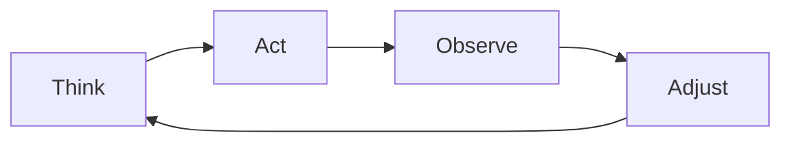
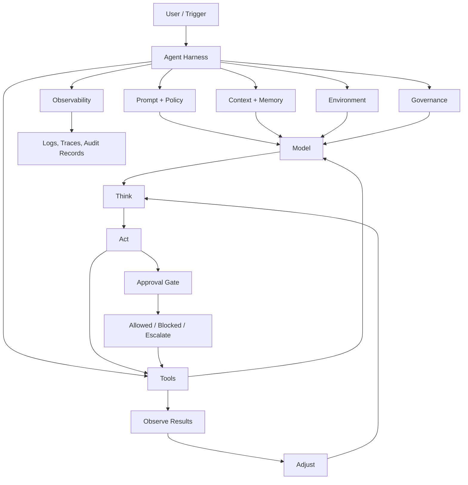

# Agent Harness: The Operating System for AI Agents

A model can generate text, but a real agent needs a system around it to act, remember, verify, and stay within boundaries. That system is the agent harness.

If the model is the brain, the harness is the body, the environment, the memory, and the rules that let the brain do useful work in the real world.

---

## 1. What is an Agent Harness?

An agent harness is the runtime layer that wraps an LLM and gives it a way to operate reliably.

It includes:
- the execution loop
- the model configuration
- system prompts and task instructions
- memory and context history
- tool access
- environment access
- safety and governance rules
- logging, tracing, and observability
- approval and escalation paths

Without a harness, a model is just a smart text generator. With a harness, it becomes an actor that can read inputs, decide, call tools, inspect results, adjust behavior, and produce outcomes.

A simple way to think about it:

```text
Model = intelligence
Harness = operating environment
Agent = model + harness + task + tools + constraints
```

---

## 2. Why the Model Is the Brain, and the Harness Is the Body

The model is the reasoning engine. It decides what to do next based on context, instruction, retrieved facts, and prior observations.

But reasoning alone is not enough.

An agent must also:
- access files and APIs
- read system state
- query the correct data source
- schedule work
- ask for approval before high-risk actions
- recover from errors and retry intelligently
- remember what happened earlier
- report what it did and why

That is where the harness comes in. The harness is the body that turns thought into action. It is the executor, the memory manager, the tool router, the gatekeeper, and the observability layer.

The model can imagine the next move. The harness carries out the move and ensures it is safe, traceable, and valuable.

---

## 3. What a Harness Is For

A harness is built for one purpose: to let an agent do real work repeatedly and safely.

It helps answer questions like:
- What context should the model see?
- Which tools are allowed?
- When should the agent ask for confirmation?
- How does the system persist memory across steps?
- What happens when a tool fails?
- What should be logged for debugging and audit?
- What should be blocked, escalated, or denied?

A good harness turns a model from a single-turn chatbot into a dependable workflow engine.

---

## 4. Core Parts of an Agent Harness

### A. Tools
Tools give the agent its hands.

Examples:
- search and retrieval
- database queries
- API calls
- file reads and writes
- code execution
- browser automation
- deployment commands
- email or messaging integration

A harness defines:
- which tools exist
- how they are invoked
- what arguments are allowed
- which tools are safe by default
- which tools require approval

A model without tools is limited to speech. A harness with tools enables execution.

### B. Prompt and Instruction Layer
This is the agent's behavioral contract.

It may include:
- system prompt
- role definition
- task framing
- output format requirements
- style rules
- fallback behaviors
- escalation instructions

This layer shapes how the model reasons, what it prioritizes, and how it responds to uncertainty.

### C. Context and State
The model needs the right inputs at the right time.

Context can include:
- current request
- user profile or permissions
- business rules
- project metadata
- recent tool results
- retrieved documents
- current execution state

A poor context design causes confusion. A good harness keeps state structured, relevant, and compact.

### D. Memory
Memory lets the agent carry knowledge across turns or runs.

Types of memory:
- short-term memory: current conversation or active task
- working memory: intermediate reasoning state
- episodic memory: what happened recently
- semantic memory: learned facts or domain knowledge
- long-term memory: stored summaries, preferences, or patterns

A strong harness knows when to use memory, when to refresh context, and when to discard stale information.

### E. Environment
The environment is the world the agent operates in.

This can include:
- local filesystem
- virtual machine or container
- cloud runtime
- internal services
- network access
- credentials and secret vaults
- dependency versions and deployment environment

The harness controls what the agent can see and change.

### F. Safety Rules and Governance
This is the guardrail layer.

It answers:
- what actions are allowed
- what needs human approval
- what is blocked outright
- what must be logged for audit
- what requires explicit confirmation before side effects

Examples:
- read-only access allowed
- database writes require approval
- production deployment requires manual signoff
- secret reads restricted to secure workflows
- destructive actions blocked by default

Governance separates experimental autonomy from production trust.

### G. Orchestration Logic
This is the control plane. It determines the operating loop.

Common orchestration patterns:
- simple single-step direct response
- tool call + observation + response
- planner -> tool selection -> execution -> validation
- supervisor agent with specialist agents
- chained workflow with retries and fallback

The harness decides how the agent moves from goal to result.

### H. Observability
Observability tells us what happened.

A harness should capture:
- prompts sent to the model
- model version and configuration
- tool calls and arguments
- results returned by tools
- errors and retries
- latency and cost
- final outputs and decisions

Without observability, agents become opaque and hard to trust.

---

## 5. The Core Agent Loop: Think, Act, Observe, Adjust

The most important idea in agent design is not that the model is a thinker. It is that the agent is in a loop.



### Think
The model interprets the task, current context, and available information.

### Act
It chooses a next action: call a tool, query a database, read a file, or ask a question.

### Observe
The harness collects the result and updates context with fresh evidence.

### Adjust
The model updates its plan based on the observation. It either continues, retries, escalates, or finishes.

This loop creates agency. The agent is not just generating one answer. It is iterating toward a goal.

This is the difference between a prompt and a system.

---

## 6. Governance: Allowed, Approval, Blocked

A harness is not just about autonomy. It is about safe autonomy.

### Allowed
These actions are normal and permitted.
- read local documents
- search indexed memory
- format a report
- generate code in a sandbox

### Approval Required
These actions may have side effects or material risk.
- sending emails to users
- writing to production databases
- making external API calls to billing systems
- creating infrastructure resources
- deploying code to production

Approval should be contextual and human-readable: who approved, what action, and why.

### Blocked
These actions should be denied by default.
- secrets exfiltration
- destructive commands on critical infrastructure
- unauthorized access to restricted data
- privilege escalation
- manipulative behavior or policy violations

Bad governance makes agents powerful but unsafe. Good governance makes them useful and accountable.

---

## 7. Observability: Logs, Traces, and "What It Actually Did"

If you cannot explain what the agent did, you cannot trust the agent.

A solid harness records:
- objective and task
- model identity and version
- prompt and system instructions
- tool calls and arguments
- intermediate reasoning or summaries
- outputs received from tools
- final response and decisions
- approvals granted or denied
- latency, token usage, and cost

This creates a trace. A trace is the story of the run.

A good trace answers:
- What did the agent decide?
- Which tool did it use?
- What evidence did it see?
- What changed because of it?
- Did it ask for approval?
- Was the action safe and expected?

This is essential for debugging, auditability, and production trust.

---

## 8. Why Ask "Which Harness?" Instead of "Which Model?"

The common mistake is to optimize only for the model.

But the model alone does not determine real system quality.

A weak harness can ruin a strong model. A strong harness can make a smaller model reliable enough for production.

The real questions are:
- What tools does this agent have?
- What memory does it keep?
- What is the approval policy?
- How is state managed?
- What is the error handling strategy?
- What logs and traces exist?
- How is safety enforced?
- How does the agent recover from failure?

This is why the better question is often:

> Which harness is this agent running in?

Because the harness decides how the model behaves in the wild.

---

## 9. Example: A Real-World Agent Harness

Imagine a support agent that resolves customer issues.

```text
User request
   |
   v
[Agent Harness]
   |
   +--> Prompt + Role + Task Rules
   +--> Memory: prior tickets, product context
   +--> Tools: search docs, query CRM, fetch logs, send email
   +--> Governance: approvals for refunds, data export, internal actions
   +--> Observability: traces, logs, audit records
   |
   v
Decision loop:
Think -> Act -> Observe -> Adjust -> Finish
```

Example behavior:
1. User asks for refund and account access.
2. Agent reads account context and policy rules.
3. Agent checks recent activity and support docs.
4. It sees refund above policy threshold.
5. Harness triggers approval requirement.
6. Human approves.
7. Tool executes refund and sends confirmation.
8. Harness logs the request, approval, and action result.

The model did the reasoning. The harness enforced the controls.

---

## 10. Architecture Diagram



---

## 11. The Strategic View

An agent is not just a model plus code. It is a controlled operating system for decisions.

The model tells the agent what might be possible. The harness decides what is permitted, what is observable, and what is safe. The tools allow action. Memory makes continuity possible. Governance prevents chaos. Observation makes trust possible.

The best AI systems are designed as whole execution environments, not just clever prompts.

---

## 12. Interview-Style Impact Questions

### 1. What is an agent harness in one sentence?
An agent harness is the runtime layer that gives an LLM access to context, tools, memory, controls, and observability so it can act safely and repeatedly.

### 2. Why is the model described as the brain and the harness as the body?
The model decides. The harness executes, coordinates, protects, and observes. One reasons; the other operationalizes.

### 3. What are the main parts of a harness?
Tools, prompts, context, memory, environment, safety rules, orchestration, approval logic, and observability.

### 4. Why is the think-act-observe-adjust loop important?
Because real agents learn through feedback. They are not single-shot answer machines; they refine decisions over time.

### 5. How does governance affect agent behavior?
Governance determines allowed actions, approval thresholds, and blocked operations. It turns autonomy into controlled execution.

### 6. What is the value of observability?
Observability creates accountability. Without logs and traces, you cannot debug failures, validate outcomes, or prove what the agent really did.

### 7. Why ask which harness instead of which model?
Because a weak harness can negate a strong model, while a strong harness can make a smaller model far more useful in production.

### 8. What is the biggest mistake teams make with AI agents?
They focus on choosing the best model while ignoring the runtime environment around it. The harness is often the difference between prototype and production.

### 9. When should an agent require human approval?
When the action changes state, costs money, touches user data, affects production systems, or creates irreversible consequences.

### 10. What is the real goal of an agent harness?
To turn raw intelligence into reliable, auditable, and safe execution.

---

## Closing Thought

A model can talk. A harness can operate. The strongest AI systems are not built from a single clever prompt. They are built from a disciplined runtime that combines reasoning, tools, memory, controls, and evidence.

The question is not only "Which model should we use?" The deeper question is:

> What harness will make that intelligence trustworthy, safe, and effective?
