# LangChain: Building AI Applications with Reusable Components

LangChain is an open-source agent framework for building applications powered by large language models (LLMs). It provides reusable abstractions and integrations for connecting models to prompts, conversation history, private documents, databases, APIs, and external tools.

The main value is not making one model call shorter. The value is coordinating many application steps in a consistent, testable way as an AI product grows.

## LangChain at a Glance

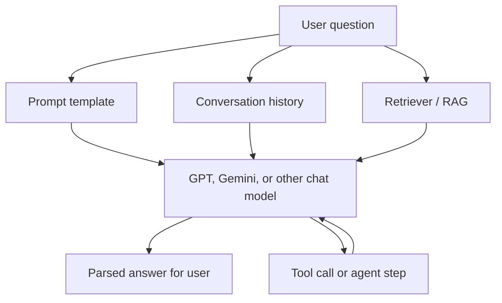

Think of LangChain as glue between application inputs, model providers, private data, and external actions. It does not replace the model or business logic.

---

## 1. Why Was LangChain Created?

A first AI feature may need only one API call:

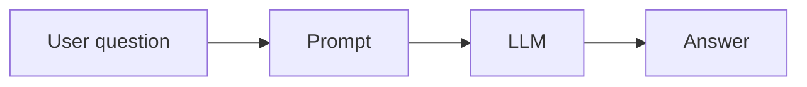

Production applications usually need more:

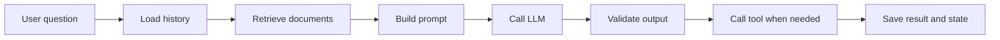

Developers can write every integration manually, but repeated custom code creates maintenance problems:

* Every provider exposes a different SDK and message format.
* Prompt construction becomes scattered across application code.
* Retrieval, tool calling, retries, streaming, and output parsing need repeated plumbing.
* Switching from one model provider to another becomes expensive.
* Complex workflows become difficult to inspect and test.

LangChain was created to provide common interfaces and composable building blocks for these tasks. It helps developers connect model providers and application data without writing every integration from scratch. Its current high-level API is `create_agent`; deterministic pipelines still use LangChain's `Runnable` abstractions.

LangChain does not remove the need for application design. It is an orchestration layer, not a replacement for good prompts, retrieval design, observability, security, or domain logic.

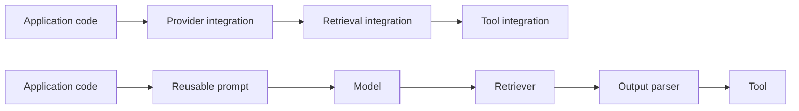

---

## 2. What LangChain Provides

LangChain components commonly cover:

* **Chat models:** OpenAI, Google Gemini, Anthropic, and other providers.
* **Prompt templates:** Reusable prompts with runtime variables.
* **Messages:** System, human, and model messages.
* **Output parsers:** Convert model output into strings, objects, or validated schemas.
* **Chains and runnables:** Compose deterministic processing steps into a workflow.
* **Retrievers:** Search vector stores, databases, files, or APIs.
* **Document loaders and splitters:** Prepare external content for retrieval.
* **Message history:** Preserve conversation context.
* **Tools and agents:** Let a model select and call functions through an agent loop.
* **Callbacks and tracing:** Inspect latency, tokens, errors, and intermediate steps.

Modern LangChain code uses `Runnable` composition and, for deterministic pipelines, the LangChain Expression Language (LCEL). LCEL supports composition, parallel branches, streaming, batching, retries, and fallbacks. Use `create_agent` for dynamic tool loops.

---

## 3. Prompt Templates

Hard-coded prompts work for prototypes:

```python
prompt = f"Summarize this document for a {audience}: {document}"
```

Real applications contain dynamic values, such as user questions, user roles, language, retrieved context, and conversation history. Prompt templates keep prompt structure separate from runtime data:

```python
from langchain_core.prompts import ChatPromptTemplate

prompt = ChatPromptTemplate.from_messages([
    (
        "system",
        "You are a helpful support assistant. Answer in {language}.",
    ),
    (
        "human",
        "Relevant context:\n{context}\n\nQuestion: {question}",
    ),
])

messages = prompt.invoke({
    "language": "English",
    "context": "Refunds are available within 30 days.",
    "question": "Can I request a refund?",
})
```

Benefits:

* One prompt definition can serve many requests.
* Variables are explicit and easier to test.
* Prompt changes do not require duplicating application logic.
* Different model providers can use the same prompt structure.

Templates do not guarantee good output. Developers still need clear instructions, appropriate context, output constraints, and injection defenses.

---

## 4. Chains: Compose Steps into Workflows

A chain is a sequence of operations. Instead of manually wiring every step, developers compose reusable blocks:

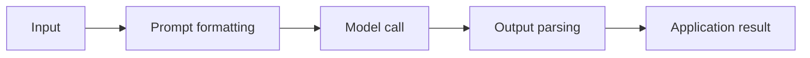

Example:

```python
from langchain_core.output_parsers import StrOutputParser
from langchain_core.prompts import ChatPromptTemplate
from langchain_openai import ChatOpenAI

prompt = ChatPromptTemplate.from_template(
    "Explain this topic in three concise bullet points:\n\n{topic}"
)
model = ChatOpenAI(model="gpt-5.5")

chain = prompt | model | StrOutputParser()

answer = chain.invoke({"topic": "database connection pooling"})
```

Each component has a focused responsibility. This makes workflows easier to replace, test, stream, and reuse.

Chains are best for predictable workflows. If every request follows a known sequence, a chain is usually clearer than an agent.

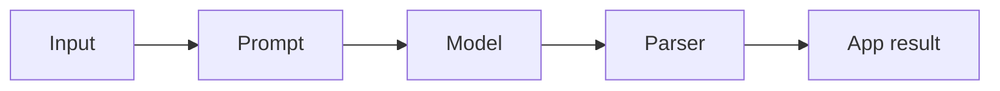

---

## 5. Build an AI Chatbot with GPT and Gemini

LangChain standardizes the chat-model interface, so an application can use GPT or Gemini with nearly the same prompt and chain code.

Install provider integrations:

```bash
pip install langchain langchain-openai langchain-google-genai
```

Set credentials in the environment:

```bash
export OPENAI_API_KEY="..."
export GOOGLE_API_KEY="..."
```

Create provider-specific models. Model IDs change; verify them against provider documentation before deployment:

```python
from langchain_google_genai import ChatGoogleGenerativeAI
from langchain_openai import ChatOpenAI

gpt = ChatOpenAI(model="gpt-5.5")
gemini = ChatGoogleGenerativeAI(model="gemini-2.5-flash-lite")
```

LangChain also provides a unified initializer:

```python
from langchain.chat_models import init_chat_model

gpt = init_chat_model("openai:gpt-5.5")
gemini = init_chat_model("google_genai:gemini-2.5-flash-lite")
```

Use one shared chatbot chain:

```python
from langchain_core.output_parsers import StrOutputParser
from langchain_core.prompts import ChatPromptTemplate, MessagesPlaceholder

chat_prompt = ChatPromptTemplate.from_messages([
    (
        "system",
        "You are a concise assistant. Use conversation history when useful.",
    ),
    MessagesPlaceholder(variable_name="history"),
    ("human", "{question}"),
])

def create_chatbot(model):
    return chat_prompt | model | StrOutputParser()

gpt_chatbot = create_chatbot(gpt)
gemini_chatbot = create_chatbot(gemini)

history = []
question = "Explain what an embedding is."

gpt_answer = gpt_chatbot.invoke({
    "history": history,
    "question": question,
})
gemini_answer = gemini_chatbot.invoke({
    "history": history,
    "question": question,
})
```

This pattern supports:

* Provider selection by configuration.
* Fallback to another model when one provider is unavailable.
* Comparing quality, latency, and cost.
* Routing simple questions to a cheaper model and difficult questions to a stronger model.

Provider differences still matter. Models can differ in token limits, tool-calling behavior, structured-output support, safety filters, pricing, and response quality. Sampling parameters are not fully portable, so configure them per provider and model. LangChain gives a common interface; it does not make providers identical.

---

## 6. Memory: Keep Conversation Context

An LLM does not remember previous requests by itself. Every request must include the relevant conversation history.

Without memory:

```text
User: My name is Linh.
Assistant: Nice to meet you.
User: What is my name?
Assistant: I do not know.
```

With message history, the application sends prior messages with the new question:

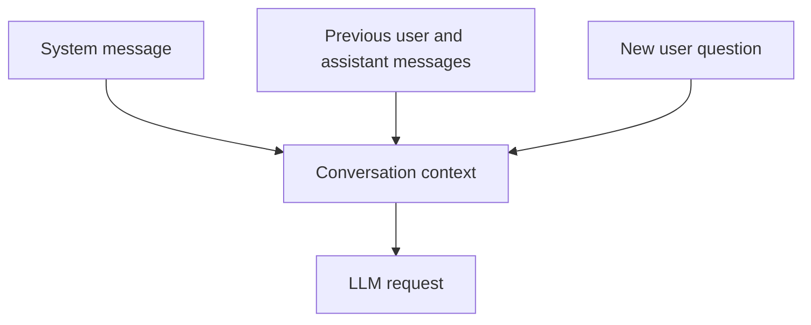

Current LangChain agents manage short-term memory as thread-scoped state. Add a checkpointer when creating an agent; `thread_id` identifies the conversation. `InMemorySaver` is suitable for development and testing. Production applications use a persistent checkpointer such as a database-backed implementation.

Long-term memory is different: it stores user or application data across threads and sessions, usually through a LangGraph store. Do not treat every conversation message as durable user memory.

History must also be controlled. Sending an unlimited transcript increases cost and can exceed the context window. Common strategies include:

* Keep only the latest messages.
* Summarize older messages.
* Store durable user facts separately from raw chat history.
* Retrieve only history relevant to the current question.

---

## 7. RAG: Answer Questions from Internal Documents

An LLM's training data does not automatically include private company documents. A typical RAG flow searches internal data first, then sends relevant content to the model:

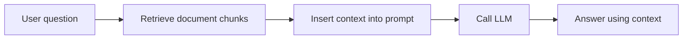

LangChain provides components for the main RAG stages:

1. Load documents from files, websites, cloud storage, or databases.
2. Split long documents into searchable chunks.
3. Create embeddings for each chunk.
4. Store embeddings in a vector database.
5. Retrieve relevant chunks for each question.
6. Pass retrieved context into a prompt.
7. Generate an answer and optionally cite sources.

Minimal retrieval chain shape:

```python
from langchain_core.prompts import ChatPromptTemplate
from langchain_core.runnables import RunnablePassthrough

rag_prompt = ChatPromptTemplate.from_template(
    """Answer using only the context below.

Context:
{context}

Question:
{question}
"""
)

def format_docs(docs):
    return "\n\n".join(doc.page_content for doc in docs)

rag_chain = (
    {
        "context": retriever | format_docs,
        "question": RunnablePassthrough(),
    }
    | rag_prompt
    | model
    | StrOutputParser()
)

answer = rag_chain.invoke("What is our refund policy?")
```

Retrieval quality remains an application responsibility. Poor chunking, weak embeddings, missing metadata filters, or irrelevant results can produce confident but incorrect answers. LangChain does not automatically provide citations, access-control filtering, reranking, or evaluation.

Common RAG architectures:

* **2-Step RAG:** Always retrieve, then generate. Predictable latency; good for FAQs and documentation bots.
* **Agentic RAG:** Agent decides when and how to retrieve. More flexible; latency and behavior vary.
* **Hybrid RAG:** Combines deterministic retrieval with agent decisions or validation steps.

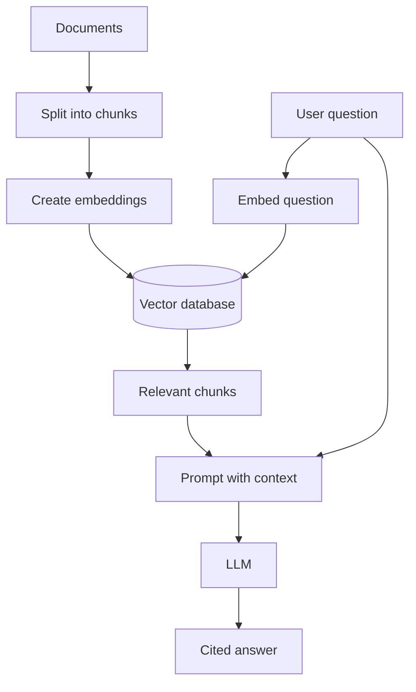

---

## 8. Tools and Agents

A **tool** is a function the model can request, such as:

* Search an internal knowledge base.
* Query an order database.
* Check the weather.
* Create a support ticket.
* Call a payment or calendar API.

An **agent** is a model plus a harness: prompt, tools, and middleware. It chooses which tool to use and in what order, then continues the loop until it produces a final response. This differs from a fixed chain:

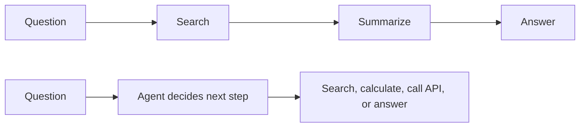

Agents are useful when the next step cannot be known in advance. They also introduce risk:

* Tool calls can be incorrect or unnecessary.
* Loops can increase latency and cost.
* External actions may be dangerous without authorization.
* Debugging becomes harder than with a deterministic chain.

Use explicit tool permissions, input validation, timeouts, maximum iterations, audit logs, and human approval for high-impact actions. Prefer a fixed chain when workflow steps are predictable.

Current LangChain agent example:

```python
from langchain.agents import create_agent

def get_weather(city: str) -> str:
    """Get weather for a given city."""
    return f"It's always sunny in {city}!"

agent = create_agent(
    model="openai:gpt-5.5",
    tools=[get_weather],
    system_prompt="You are a helpful assistant.",
)

result = agent.invoke({
    "messages": [
        {"role": "user", "content": "What's the weather in San Francisco?"}
    ]
})
```

Tool type hints define the model-visible input schema. Tool docstrings describe tool purpose.

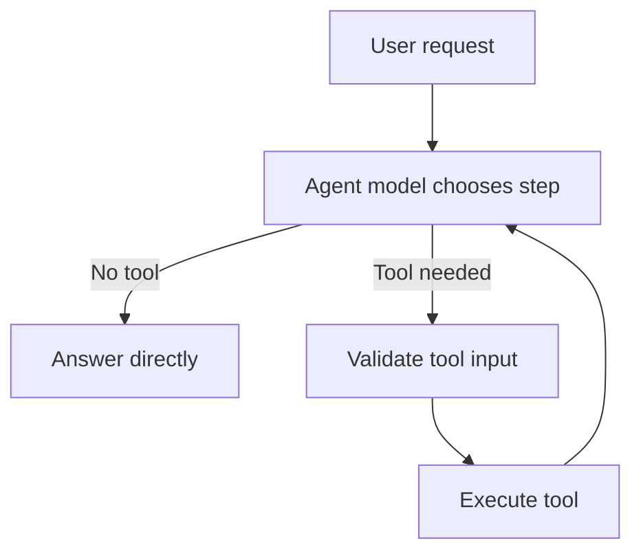

---

## 9. Structured Output

Applications often need model responses that downstream code can trust, such as extracted fields, classifications, or API arguments. LangChain supports structured output with schema libraries such as Pydantic:

```python
from pydantic import BaseModel
from langchain.agents import create_agent

class Answer(BaseModel):
    summary: str
    confidence: float

agent = create_agent(
    model="openai:gpt-5.5",
    tools=[],
    response_format=Answer,
)

result = agent.invoke({
    "messages": [
        {"role": "user", "content": "Summarize this text."}
    ]
})

structured = result["structured_response"]
```

When supported, LangChain uses provider-native structured output. Otherwise, it can use a tool-calling strategy. Validate business rules after parsing; schema-valid output is not automatically factually correct.

---

## 10. Why Use LangChain?

LangChain fits applications that need several AI capabilities working together:

* Reusable prompt templates with dynamic variables.
* Internal document retrieval and RAG.
* Conversation history.
* Multiple model providers.
* Tool calling and external APIs.
* Structured output parsing.
* Multi-step or branching workflows.
* Shared integrations across a team.
* Tracing and inspection of model workflows.

It can reduce integration code and make common patterns easier to assemble. It also gives teams conventions for composing and replacing model components.

---

## 11. When Not to Use LangChain

Do not add LangChain automatically. A direct provider SDK may be better when:

* The application makes one or two simple model calls.
* You need maximum control over provider-specific features.
* The team does not need retrieval, tools, memory, or workflow composition.
* Framework abstractions would hide a small, easy-to-debug operation.
* Dependency size and upgrade surface must stay minimal.

A useful rule:

```text
Simple prompt + one model call -> native SDK
Reusable prompts + RAG + memory + tools + workflow -> LangChain or LangGraph
```

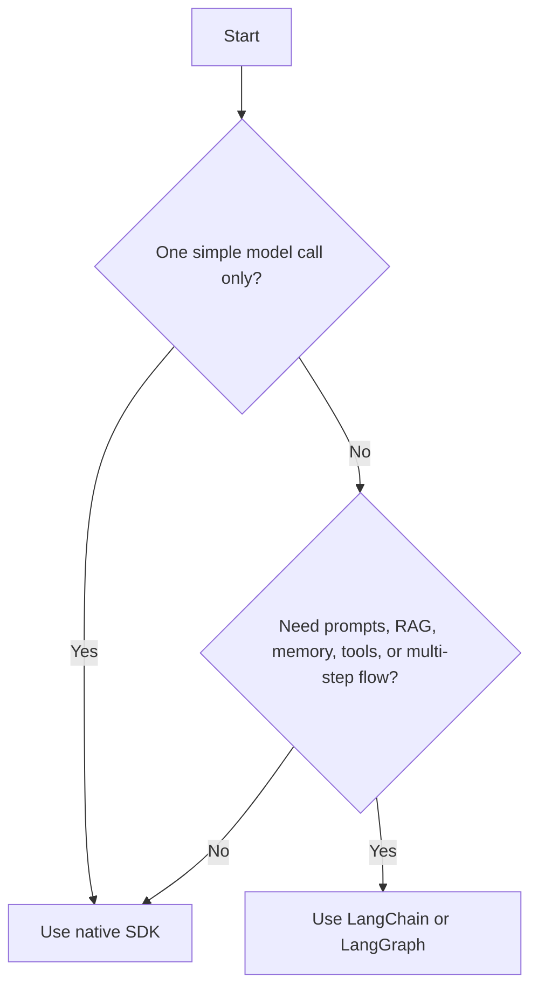

Choose based on application complexity, team familiarity, observability needs, and provider requirements. Framework adoption should solve a real maintenance problem, not follow a trend.

---

## 12. LangChain Trade-offs

### Advantages

* Reusable integrations and common interfaces.
* Faster prototyping for multi-component AI applications.
* Composable prompts, models, retrievers, parsers, and tools.
* Easier provider switching for shared capabilities.
* Built-in patterns for RAG, history, and agents.

### Limitations

* Abstractions can make simple behavior harder to trace.
* Provider-specific features may be exposed later or differently.
* Dependency upgrades can introduce breaking changes.
* Agents can hide expensive or unsafe execution paths.
* Poorly designed chains still produce poor AI behavior.

Use LangChain where its composition and integration benefits exceed its abstraction cost. LangChain is a higher-level framework for standard agent applications. LangGraph is a lower-level runtime for durable, stateful workflows that combine deterministic and agentic steps. LangChain agents run on LangGraph, but LangGraph can also be used directly.

---

## 13. High-Impact Interview Questions

### Q1: What problem does LangChain solve?

**Answer:** LangChain provides reusable abstractions and integrations for connecting LLMs with prompts, document retrieval, conversation history, structured output, databases, and external tools. Its main purpose is orchestration and composition, not improving the underlying model's intelligence.

### Q2: Why use a prompt template instead of string concatenation?

**Answer:** A prompt template separates stable instructions from runtime variables. It makes prompts reusable, testable, easier to review, and safer to maintain when values such as language, user role, retrieved context, and question change per request.

### Q3: What is the difference between a chain and an agent?

**Answer:** A chain follows a predefined sequence of steps. An agent uses model reasoning to select tools and decide next steps dynamically. Chains are more predictable and easier to test; agents are more flexible but add cost, latency, and execution risk.

### Q4: How does LangChain support both GPT and Gemini?

**Answer:** Provider integrations implement a common chat-model interface. The application can construct an OpenAI or Google Gemini model, then reuse shared prompts and chains. Provider-specific limits and capabilities still need separate testing.

### Q5: How would you build a chatbot that answers from internal documents?

**Answer:** Build a RAG pipeline: load and split documents, create embeddings, store chunks in a vector database, retrieve relevant chunks for each question, inject them into a prompt, and call the LLM. Add access-control filtering, citations, evaluation, and monitoring for production quality.

### Q6: Does LangChain memory make an LLM remember permanently?

**Answer:** No. Memory manages application-side history and includes selected prior messages in later requests. Durable memory requires an external store, and history must be summarized or trimmed to control token usage and context size.

### Q7: When should you avoid LangChain?

**Answer:** Avoid it for simple applications with one or two direct model calls when its abstractions add more complexity than value. Use the provider's native SDK when direct control, minimal dependencies, or immediate access to provider-specific features matters more.

### Q8: What production risks exist with LangChain agents?

**Answer:** Agents may choose wrong tools, execute expensive loops, leak data, or trigger unsafe external actions. Mitigate with strict tool schemas, authorization, validation, timeouts, iteration limits, audit logs, sandboxing, and human approval for consequential operations.

---

## 14. Sources and Version Notes

LangChain APIs and provider model IDs change quickly. This guide was checked against official documentation on 2026-09-03:

* [LangChain overview](https://docs.langchain.com/oss/python/langchain/overview)
* [LangChain models](https://docs.langchain.com/oss/python/langchain/models)
* [LangChain agents](https://docs.langchain.com/oss/python/langchain/agents)
* [Short-term memory](https://docs.langchain.com/oss/python/langchain/short-term-memory)
* [LangChain retrieval and RAG architectures](https://docs.langchain.com/oss/python/langchain/retrieval)
* [LangChain, LangGraph, and Deep Agents](https://docs.langchain.com/oss/python/concepts/products)

Examples are educational. Pin model snapshots and dependency versions when reproducibility matters. Recheck provider model availability, supported parameters, and integration package names before running examples in production.

---

## Related Guides

* [AI Orchestration Frameworks & Runtime Design](./orchestration-frameworks.md): Compare LangChain, LlamaIndex, Vercel AI SDK, specialized agent frameworks, and native SDKs.
* [Retrieval-Augmented Generation (RAG) Architecture](./rag-architecture.md): Study chunking, embeddings, vector indexes, hybrid search, and reranking.
* [Agentic Workflows & Prompting](./agentic-workflows-prompting.md): Explore agent workflow design and prompt strategies.
