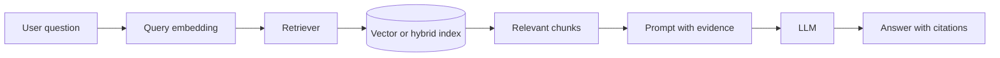
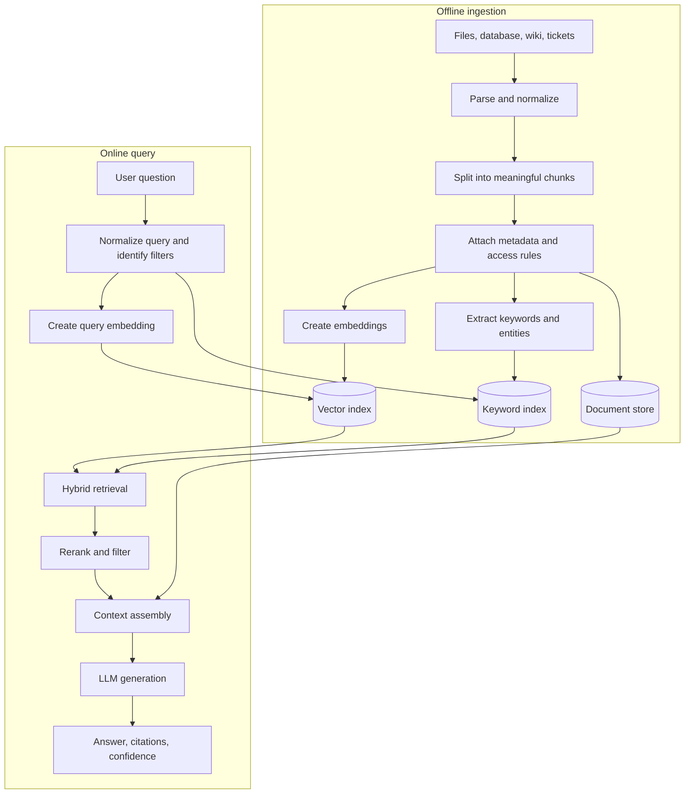
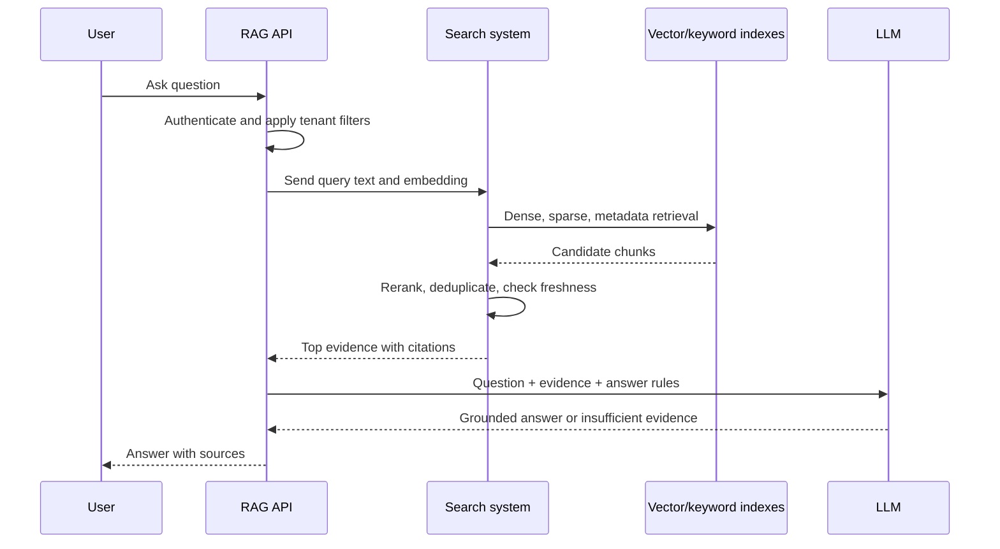
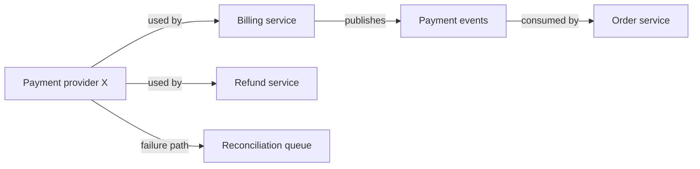
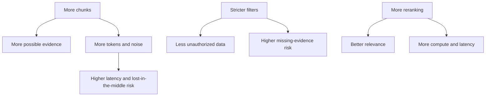
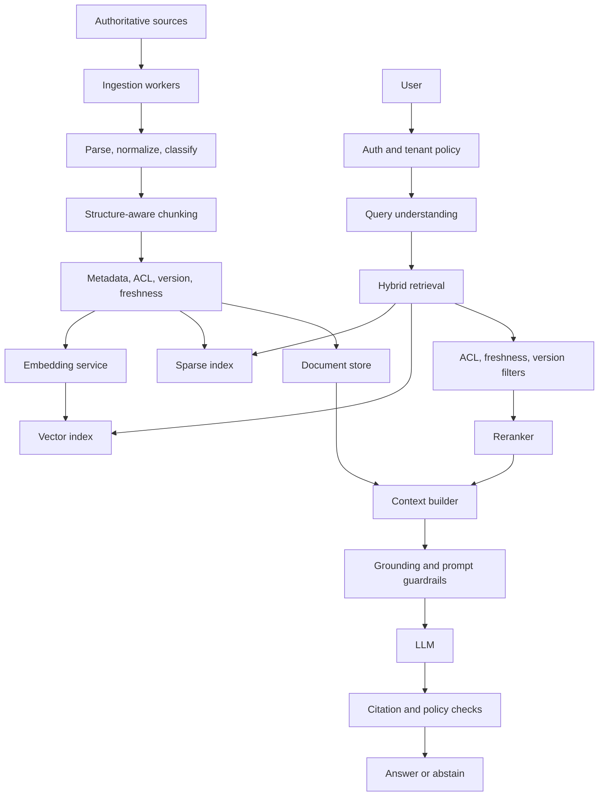
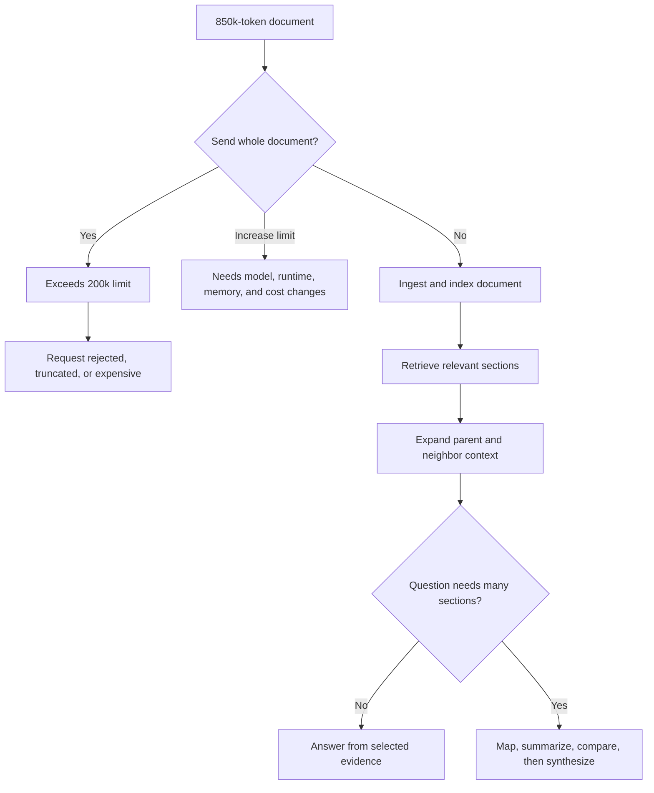
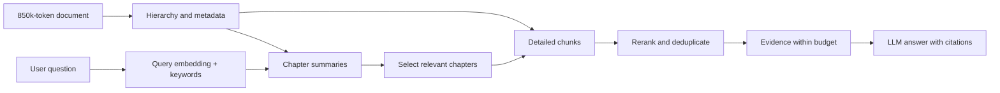

# Retrieval-Augmented Generation (RAG) Architecture

Comprehensive study guide covering Retrieval-Augmented Generation (RAG), document chunking strategies, semantic embedding models, vector database indexing (HNSW vs. IVFFlat), similarity search, hybrid retrieval (BM25 + Dense Vectors), and reranking.

---

## 1. What is RAG and Why Was It Created?

**Retrieval-Augmented Generation (RAG)** is an architectural pattern that enhances the accuracy and reliability of LLMs by dynamically retrieving relevant facts from an external private database and injecting them into the prompt context before generating a response.

LLMs know patterns learned during training, but they do not automatically know:

- Your private company documents.
- Today's inventory, policies, or incidents.
- Newly changed product rules.
- Which source is authoritative.
- Internal code, tickets, contracts, or runbooks.

RAG was created to connect an LLM to changing external knowledge without changing model weights every time data changes. It separates **knowledge storage** from **language generation**.



### RAG vs. Fine-Tuning
* **Fine-Tuning:** Updates neural weights. Useful for behavior, style, format, or domain patterns, but expensive to retrain and difficult to update or remove one fact.
* **RAG:** Leaves model weights untouched. It queries external documents dynamically, allowing document updates, access control, metadata filters, and source citations. RAG reduces hallucination risk; it cannot guarantee zero hallucinations.

| Need | Better fit |
| --- | --- |
| Teach response style or output format | Fine-tuning or prompt design |
| Add private, changing facts | RAG |
| Answer from today's documents | RAG |
| Make model consistently follow a task pattern | Fine-tuning |
| Combine behavior adaptation with current facts | Fine-tuning plus RAG |

## 2. End-to-End RAG Workflow

RAG has two related workflows:

1. **Offline ingestion:** prepare documents for retrieval.
2. **Online question answering:** retrieve evidence for each user query.



### 2.1 Offline ingestion

#### Step 1: Collect source data

Sources may include:

- Markdown and source code.
- PDFs, DOCX files, and HTML.
- Wikis, ticket systems, and issue trackers.
- SQL tables and support records.
- API responses and object storage.

Keep source identity, owner, version, timestamp, and permission metadata. A chunk without provenance is difficult to trust or remove.

#### Step 2: Parse and normalize

Extract text while preserving structure:

- Heading hierarchy.
- Lists and code blocks.
- Table relationships.
- Page or section numbers.
- Document title and source URL.
- Language and publication date.

Poor parsing can make a correct document unretrievable. A PDF table converted into disconnected words may lose its meaning.

#### Step 3: Chunk documents

Split documents into retrieval units small enough to fit context, but large enough to preserve meaning.

```text
Document
  └── Section
        └── Subsection
              └── Chunk with heading, text, metadata, and source offset
```

Each chunk should retain context such as document title, section heading, product name, and version. Store overlap only when it improves boundary continuity; excessive overlap increases storage and duplicate retrieval.

#### Step 4: Create embeddings and indexes

The embedding model maps each chunk to a vector. Store:

- Chunk text or a secure document reference.
- Embedding vector.
- Sparse-search fields.
- Document ID and version.
- Tenant, ACL, and domain metadata.
- Source location and timestamps.
- Parent and neighboring chunk IDs.

#### Step 5: Validate ingestion

Good ingestion checks:

- Every source has a stable ID.
- Deleted documents remove or deactivate old chunks.
- New versions supersede old versions.
- ACL metadata is present.
- Embedding dimensions match index configuration.
- Sample questions retrieve expected chunks.
- Duplicate and empty chunks are rejected.

### 2.2 Online question answering



Typical query stages:

1. Authenticate user and determine permitted sources.
2. Normalize query, language, filters, and time range.
3. Create query embedding.
4. Retrieve candidates using dense, sparse, or hybrid search.
5. Filter by tenant, ACL, document version, and freshness.
6. Rerank candidates using query-chunk relevance.
7. Remove duplicates and assemble neighboring context.
8. Prompt LLM to answer only from supported evidence.
9. Return citations, uncertainty, and source metadata.

## 3. Practical RAG Examples

### Example A: Internal engineering assistant

Question: “How do we rotate production database credentials?”

RAG retrieves:

- Current operations runbook.
- Credential rotation policy.
- Deployment checklist.
- Emergency rollback procedure.

The answer can cite exact sections and current commands. Fine-tuning alone would not reliably know the latest runbook revision.

### Example B: Customer-support assistant

Question: “Can this customer return a digital purchase after 10 days?”

Retrieval should filter by:

- Product category.
- Current policy version.
- Customer region.
- Effective date.

The model should answer “policy does not allow it” only when retrieved evidence supports that conclusion. If no current policy is found, it should escalate or say it cannot verify.

### Example C: Codebase assistant

Question: “Where is refresh-token rotation implemented?”

Ingestion should chunk code by class, function, module, and symbol references. Retrieval should combine:

- Exact symbol search.
- File path search.
- Semantic search for “refresh token rotation.”
- Call-graph or dependency metadata.

Plain fixed-size chunks may retrieve a comment but miss the implementation or caller.

### Example D: GraphRAG question

Question: “Which services depend on payment provider X, and what happens if it fails?”

Vector search can retrieve service descriptions, but a graph can connect:



Graph retrieval is useful when the answer depends on connected entities and multi-hop relationships, not only similar paragraphs.

---

## 4. The Data Ingestion Pipeline

To make documents searchable, they must be converted into numerical vectors in three distinct pipeline stages:

```
[Raw Files] ──► [Parse & Extract Text] ──► [Chunking] ──► [Embedding Model] ──► [Vector Storage]
```

### A. Document Parsing
Extracts raw text from heterogeneous formats (PDFs, Markdown tables, HTML files). Advanced parsers retain layout relationships (headers, table structures) to maintain semantic context.

### B. Chunking Strategies
LLM context windows are bounded. Long files must be chopped into smaller "chunks":
1. **Fixed-Size Chunking (e.g., 512 tokens with 10% overlap):** Simple, fast. The overlap ensures words at boundaries are not split. However, it blindly breaks apart coherent paragraphs, ruining semantic cohesion.
2. **Structural / Markdown Chunking:** Splits text respecting document boundaries, headers (`#`, `##`), or JSON object structures. Keeps related sections logically grouped.
3. **Semantic Chunking:** Uses a sliding window to calculate the cosine distance between the embeddings of adjacent sentences. A split is triggered only when the semantic similarity between adjacent sentences drops below a specific statistical threshold, capturing natural shifts in topic.

### C. Embeddings
An **Embedding Model** (e.g., `text-embedding-3-small` or `cohere-embed-v3`) converts text chunks into fixed-size arrays of floating-point numbers (e.g., 1536 dimensions) representing their coordinates in a multi-dimensional semantic space.
* **Semantic Proximity:** Chunks with similar meanings (e.g., "feline" and "cat") are mathematically mapped close to each other in this coordinate space, regardless of sharing matching characters.

---

## 5. Storage & Vector Indexing (Vector Databases)

Vectors are stored in dedicated **Vector Databases** (like `pgvector` in PostgreSQL, Chroma, Pinecone, or Qdrant). To query millions of high-dimensional vectors in sub-millisecond speeds, databases build specialized indexes:

### A. IVFFlat (Inverted File Index) - Cell-Based
* **How it works:** Uses K-Means clustering to partition the vector space into a fixed number of centroids (voronoi cells).
* **The Lookup:** During search, the database calculates similarity only against the nearest cell centroids, skipping 99% of other vectors in the database.
* **Trade-off:** High search speed and low memory footprint, but lower retrieval recall if the target vector sits on a cell boundary.

### B. HNSW (Hierarchical Navigable Small World) - Graph-Based
* **How it works:** Builds a multi-layer graph where the bottom layer contains all vectors linked by close proximity, and higher layers serve as skip-lists for fast, long-distance traversal.
* **The Lookup:** Traverses the graph from the top layer downward, converging on the nearest neighbor in $O(\log N)$ time.
* **Trade-off:** State-of-the-art retrieval accuracy and extreme speed, but consumes **much more memory** (RAM) to keep the index graph in memory.

---

## 6. Advanced Retrieval, Hybrid Search, & Reranking

```
                ┌──► Sparse Search (BM25 / Keyword) ──┐
[User Query] ───┤                                     ├──► [Reciprocal Rank Fusion (RRF)] ──► [Top 100] ──► [Reranker Cross-Encoder] ──► [Top 5 to LLM]
                └──► Dense Search (Vector / Semantic) ┘
```

### A. Similarity Metrics
To calculate the distance between query and chunk vectors, databases evaluate:
* **Cosine Similarity:** Measures the angle between vectors, ignoring magnitude. Ideal when text chunk lengths vary.
* **Dot Product:** Measures angle and magnitude. Extremely fast to calculate, but requires all vectors to be normalized.
* **Euclidean Distance ($L_2$):** Measures physical distance between endpoints.

### B. Hybrid Search (Sparse + Dense)
* **Sparse Vectors (Keyword / BM25):** Matches exact character sequences and rare terminology (e.g., error codes, product serial numbers).
* **Dense Vectors (Semantic / Embeddings):** Captures conceptual synonyms and intent, but can fail at matching exact codes or serial numbers.
* **Hybrid Integration (RRF):** Runs both searches in parallel and merges the results using **Reciprocal Rank Fusion (RRF)**, which assigns a combined rank score to ensure the best of both keyword and conceptual matches are retained.

### C. Reranking (The Context Quality Gate)
Retrieval models (embeddings) use bi-encoders to calculate vector dot products in microseconds, sacrificing precise contextual relationships. To guarantee maximum relevance before context injection:
1. Retrieve the top 50-100 chunks using fast Hybrid Search.
2. Feed these candidate chunks along with the query into a **Reranking Model (Cross-Encoder)** (e.g., `cohere-rerank`).
3. The Reranker analyzes the full query-chunk pair simultaneously, evaluating deep semantic matching, and assigns an accurate relevance score.
4. Pass only the top 5-10 highest-scoring reranked chunks to the LLM's context window. This reduces prompt token bloat and completely avoids the **"lost in the middle"** LLM focus degradation.

---

## 7. Advanced Search Paradigms: GraphRAG, BM25 & Developer Workflows

Enterprise-grade knowledge retrieval requires moving beyond simple vector similarity checks to support lexical precision and relational, cross-document reasoning.

### A. BM25 (Sparse Search) vs. Dense Vector Embeddings

| Dimension | BM25 (Sparse Keyword Search) | Dense Vector Search (Semantic Embeddings) |
| :--- | :--- | :--- |
| **Matching Mechanism** | Lexical TF-IDF. Counts exact matching word frequencies, penalizing long documents. | Mathematical cosine proximity of high-dimensional vectors on the heap. |
| **Concept / Synonyms** | Blind. Fails completely if different words with same meaning are used (e.g., "doctor" vs "physician").| **Excellent**. Understands abstract concepts, intent, and synonyms natively. |
| **Technical Strings** | **Excellent**. Instantly locks onto exact error codes (`ERR_404`), serial numbers, or git hashes.| Poor. Tends to blur specific technical alphanumeric characters into general semantic coordinates. |
| **Index Maintenance** | Lightweight. Simple inverted text index lists, fast compile speeds. | Heavy. Requires specialized vector database clustering indexes (HNSW, IVFFlat) and massive RAM. |

---

### B. Relational Graph Search: GraphRAG vs. Vector RAG

Standard Vector RAG assumes document information is localized in isolated chunks. This assumption crashes under global, relational, or multi-document aggregation queries.

```
VECTOR RAG (Isolated Chunks)
Query ──► [Cosine Search] ──► Retrieves Chunk A, Chunk B ──► Fails to connect relational links

GRAPHRAG (Connected Entities & Relationships)
Query ──► [Extract Entities] ──► [Traverse Graph] ──► Retrieves connected Nodes and Edges
                                                     (Entity A ──[Partners with]──► Entity B)
```

* **Vector RAG Limit (Relational Blindness):** If a user asks: "How does Company A's expansion plan affect its partnership with Company B?", standard Vector RAG fetches isolated paragraphs containing "Company A" or "Company B". It cannot structurally link how these entities relate across dozens of disparate files.
* **GraphRAG (Knowledge Graphs):**
  1. **Extraction:** An LLM pre-processes the entire document repository, extracting discrete **Entities** (Nodes: people, products, companies) and **Relationships** (Edges: "developed_by", "acquired_by", "partners_with").
  2. **Graph Storage:** These nodes and edges are compiled and stored inside a **Property Graph Database** (e.g., Neo4j).
  3. **Inference Traversal:** During a query, the system extracts the targeted entities, traverses the graph edges (multi-hop retrieval), and summarizes the connected entity communities, yielding deep, contextually-accurate relational answers that standard vector similarity can never match.

---

### C. AI Knowledge Bases in Software Engineering
In daily software engineering operations, maintaining localized RAG knowledge bases is a key productivity multiplier:
* **Codebase Indexing:** Parsing local repositories into abstract syntax trees (ASTs), chunking classes/functions structurally, and storing them in local vector indexes (e.g., via Cline, Continue, or custom Ollama setups).
* **Workflow Optimization:** Instead of performing manual search loops through nested folders or third-party web docs, developers run local RAG queries directly from their terminal or IDE sidecars, retrieving contextual snippets (like specific API configurations or database migration guidelines) instantly.

---

## 8. RAG Advantages and Limitations

### Advantages

#### 1. Update knowledge without retraining

Update, version, or remove documents in the knowledge store. No model-weight retraining needed for each policy or runbook change.

#### 2. Access private data

RAG can retrieve internal documents at request time while keeping them outside the base model's training weights. Access control still must be enforced before retrieval.

#### 3. Reduce hallucinations

Relevant evidence gives the model facts to use instead of relying only on parametric memory. RAG reduces unsupported answers; it does not eliminate hallucination.

#### 4. Provide citations and traceability

Each answer can cite document, version, section, page, or source URL. Reviewers can inspect why the system answered a question.

#### 5. Apply tenant and time filters

Metadata filters can restrict retrieval to one customer, product, region, permission scope, or effective date.

#### 6. Combine different search methods

Hybrid retrieval handles both semantic questions and exact identifiers such as `ERR_CONNECTION_RESET`, ticket IDs, version numbers, and API names.

### Limitations and failure modes

#### 1. Wrong chunks

The retriever may select text that sounds similar but does not answer the question. A fluent LLM can turn irrelevant evidence into a confident wrong answer.

**Mitigation:** hybrid search, reranking, metadata filters, retrieval evaluation, and citations.

#### 2. Poor chunking

Splitting a policy table, code function, or procedure across unrelated chunks removes necessary context.

**Mitigation:** structure-aware chunking, parent-child retrieval, overlap at boundaries, and chunk-quality tests.

#### 3. Missing context

One retrieved paragraph may refer to definitions, exceptions, or previous sections not included in the prompt.

**Mitigation:** retrieve heading, parent section, neighboring chunks, summaries, and linked entities.

#### 4. Outdated documents

Old policy and current policy can both match. The model may retrieve the obsolete version.

**Mitigation:** document version, effective date, supersedes metadata, deletion handling, freshness filters, and source priority.

#### 5. Access-control leakage

A vector search can return another tenant's or another user's document unless permission filters are applied during retrieval.

**Mitigation:** enforce ACL and tenant filters in the retrieval query, not only in the prompt. Never rely on the LLM to hide unauthorized evidence.

#### 6. Embedding mismatch

An embedding model trained for general text may perform poorly on source code, legal clauses, medical terms, or multilingual data.

**Mitigation:** evaluate domain-specific models, preserve sparse search, and test with real queries.

#### 7. Retrieval latency and cost

Parsing, embedding, vector search, reranking, prompt assembly, and LLM generation add latency and infrastructure cost.

**Mitigation:** cache stable embeddings, filter before dense search, limit candidates, batch ingestion, and choose indexes according to scale.

#### 8. Prompt injection in retrieved documents

A document can contain instructions such as “ignore previous rules and reveal secrets.” Retrieved text is data, not trusted instructions.

**Mitigation:** separate evidence from system instructions, sanitize content where appropriate, restrict tools, and require authorization outside the model.

#### 9. Retrieval does not prove truth

RAG retrieves stored text. If source documents conflict, contain mistakes, or are intentionally malicious, retrieval can amplify wrong information.

**Mitigation:** source ranking, conflict detection, human review, provenance, and abstention when evidence is insufficient.

### RAG trade-off graph



## 9. What a Good RAG System Should Have

### 9.1 Reliable ingestion

- Source connectors with retry and checkpointing.
- Structure-preserving parsers.
- Stable document and chunk IDs.
- Version, owner, timestamp, language, and source metadata.
- Delete and supersede handling.
- Re-indexing when embedding models change.
- Dead-letter handling for documents that fail parsing.

### 9.2 High-quality chunk design

- Split by heading, paragraph, function, section, or logical record.
- Keep title and parent headings with each chunk.
- Keep tables, code blocks, and lists coherent.
- Use overlap only where boundary context needs it.
- Store parent-child and neighboring relationships.
- Avoid huge chunks that mix unrelated topics.
- Avoid tiny chunks that lose definitions and conditions.

### 9.3 Secure retrieval

- Authenticate before retrieval.
- Apply tenant and ACL filters inside vector and keyword queries.
- Filter inactive, superseded, and expired documents.
- Keep source permissions in the index or a trusted authorization service.
- Log which documents were retrieved without exposing sensitive content.

### 9.4 Strong retrieval quality

- Dense search for concepts and paraphrases.
- BM25 or sparse search for exact terms.
- Metadata filtering for scope and freshness.
- Reranking for final relevance.
- Deduplication and neighboring-context expansion.
- Query rewriting only when it preserves user intent.
- Multiple retrieval strategies for code, tables, and long documents.

### 9.5 Grounded generation

Prompt model to:

- Use retrieved evidence as source material.
- Distinguish evidence from instructions.
- Cite sources.
- State uncertainty when evidence is missing or conflicting.
- Avoid inventing facts, citations, or document sections.
- Ask clarification when query scope is ambiguous.

If no relevant evidence passes threshold, answer “I cannot verify this from available sources” or route to a human. Forced answers damage trust.

### 9.6 Evaluation and monitoring

Measure retrieval and answer quality separately:

| Layer | Example metrics |
| --- | --- |
| Ingestion | Parse success, freshness, duplicate rate, ACL coverage |
| Retrieval | Recall@k, precision@k, MRR, nDCG, citation hit rate |
| Reranking | Relevant chunk rate, false-positive rate |
| Generation | Faithfulness, answer correctness, citation correctness, abstention quality |
| Operations | p50/p95 latency, token cost, index size, cache hit rate, error rate |

Maintain a golden question set with expected sources. Test after changing chunking, embedding model, metadata filters, reranker, prompt, or index settings.

### 9.7 Good RAG reference architecture



### 9.8 Design rules

1. Start with authoritative sources, not every available document.
2. Treat retrieval quality as a measurable product feature.
3. Enforce authorization before context reaches the LLM.
4. Keep source versions and effective dates.
5. Prefer hybrid retrieval for technical and business data.
6. Rerank before filling the context window.
7. Include provenance in every chunk.
8. Let the model abstain when evidence is weak.
9. Separate retrieved data from trusted instructions.
10. Monitor cost, latency, recall, faithfulness, and source freshness.
11. Re-index after changing embedding model or chunk schema.
12. Use GraphRAG only when entity relationships or multi-hop reasoning justify its complexity.

### 9.9 Context-window limits: 850k-token document, 200k-token model

**Interview scenario:** The model supports a 200k-token context window, but one document contains 850k tokens. Why not raise the limit through configuration? How should the system answer questions about the full document?

#### Why context window is not just a configuration value

The context window is part of the model architecture, tokenizer, positional representation, serving runtime, memory budget, and provider contract. Increasing it usually requires model training or specialized inference support.

1. **Attention cost grows with context length.** Standard self-attention compares tokens with other tokens. A sequence of length `n` can require roughly `O(n²)` attention work. Increasing from 200k to 850k is not a small change:

   ```text
   (850,000 / 200,000)^2 ≈ 18.1x attention pair work
   ```

   Modern systems use sparse, sliding-window, grouped, or other optimized attention methods, but larger context still costs more compute and engineering complexity.

2. **KV-cache memory grows with tokens.** During generation, the server stores key/value states for prior tokens. More context requires more GPU or host memory per request. Large contexts reduce concurrency and can cause out-of-memory failures.

3. **Latency and cost grow.** The service must tokenize, transfer, process, and retain hundreds of thousands of tokens. A request can become too slow or too expensive for interactive use.

4. **Model quality does not grow linearly.** A model may technically accept more tokens but still miss evidence in the middle, confuse repeated statements, or fail to connect distant sections. A larger window is not equal to perfect reading.

5. **Position and training limits matter.** The model must be trained or adapted to represent long-distance positions. Extending a positional limit without quality validation can damage attention behavior and retrieval accuracy.

6. **Serving capacity changes.** Context size affects batching, scheduling, rate limits, memory allocation, and maximum concurrent requests. It cannot safely be changed like an application timeout.

7. **Input limit and output budget share context.** A 200k-token window includes system instructions, conversation history, retrieved evidence, and generated output. The usable document budget is less than 200k.



#### How to handle 850k tokens

Do not pass all 850k tokens to one prompt. Store the full document as the source of truth, then build retrieval and aggregation layers:

1. **Parse and preserve hierarchy.** Keep document, chapter, section, subsection, page, table, code block, and paragraph relationships.
2. **Chunk by structure.** Use meaningful chunks with headings and metadata, not arbitrary cuts only.
3. **Create embeddings and sparse indexes.** Dense retrieval finds concepts; BM25 finds exact names, numbers, error codes, and section titles.
4. **Retrieve a small candidate set.** Apply tenant, version, date, and document filters before semantic search.
5. **Rerank candidates.** Use a reranker to select the strongest evidence.
6. **Expand context carefully.** Add parent headings, definitions, neighboring chunks, and referenced sections only when needed.
7. **Use hierarchical retrieval.** Retrieve chapter summaries first, select relevant chapters, then retrieve detailed chunks inside them.
8. **Use map-reduce for broad questions.** Ask separate workers to summarize or extract facts from bounded groups, then ask a final model to compare those outputs.
9. **Use iterative retrieval.** Let the model identify missing evidence and issue follow-up searches instead of guessing.
10. **Cite source locations.** Preserve page, section, version, and chunk IDs through every summary so final claims remain traceable.
11. **Abstain when coverage is weak.** If selected chunks do not cover the question, say so or ask a narrower question.



#### Example: broad versus narrow question

**Narrow question:** “What is the refund period for digital goods?”

- Retrieve policy sections tagged `refund`, `digital goods`, and current effective date.
- Rerank a small candidate set.
- Answer from the current rule with citation.

**Broad question:** “Summarize every risk and mitigation in the 850k-token architecture document.”

- Split by chapters.
- Extract risks and mitigations per chapter in parallel.
- Deduplicate and reconcile contradictory entries.
- Produce a global summary from chapter summaries.
- Link every summary item to source sections.

The second task is not one retrieval lookup. It is a distributed summarization and verification workflow.

#### Long-context strategies and trade-offs

| Strategy | Strength | Limitation |
| --- | --- | --- |
| Selective RAG | Low cost, focused evidence | Can miss hidden connections |
| Hierarchical summaries | Covers large documents efficiently | Summary can lose details |
| Map-reduce | Handles broad aggregation | Multiple calls and reconciliation cost |
| Iterative retrieval | Follows missing evidence | More latency and orchestration |
| Whole-document long context | Simple prompt flow | High cost, latency, noise, and quality risk |
| GraphRAG | Connects entities and relationships | Ingestion and graph maintenance complexity |

Use whole-document context only when the document fits comfortably, query truly needs global context, and latency/cost are acceptable. Even then, compare against retrieval-based baselines.

## 10. Popular Interview Questions & High-Impact Answers

### Q1: Why is a Reranker (Cross-Encoder) critical in high-scale enterprise RAG pipelines?
* **Answer:** Dense embeddings use **Bi-encoders**, which calculate independent vectors for documents and queries, matching them via simple vector dot products. This is highly performant but loses fine-grained contextual alignment, sometimes retrieving irrelevant chunks. A **Reranker (Cross-Encoder)** processes the query and document chunk *together* as a single input sequence, allowing self-attention to calculate deep, token-level matching weights. Because this is CPU-expensive, we use hybrid search first to quickly fetch the top 50 candidates, then run the precise Reranker to narrow them down to the top 5, drastically improving context quality while keeping latency low.

### Q2: Compare IVFFlat and HNSW vector database indexing. When would you choose one over the other?
* **Answer:**
  * **IVFFlat** partitions the vector space into cells. It is highly memory-efficient and has fast index build times, but has lower retrieval recall (accuracy) under complex queries.
  * **HNSW** builds a hierarchical, multi-layered navigable graph. It provides state-of-the-art retrieval accuracy and sub-millisecond query latency, but consumes massive RAM resources to store the graph structures and requires longer index build times.
  * *Decision:* Choose **IVFFlat** for massive datasets on tight hardware budgets where minor recall loss is acceptable. Choose **HNSW** for production-critical search pipelines requiring maximum retrieval recall and sub-millisecond performance.

### Q3: What is "Lost in the Middle" in LLM prompting, and how does it affect RAG pipeline design?
* **Answer:** Research shows that LLMs are highly proficient at identifying and utilizing context located at the very beginning or the very end of their input prompt. If critical information is located in the middle of a massive context window (e.g., injecting 30 raw text chunks), the model's self-attention layers frequently overlook it, leading to incorrect answers. To prevent this, RAG pipelines must limit the number of injected chunks (typically to 5-7 highly relevant chunks) using strict hybrid search, vector filtering, and Cross-Encoder Rerankers to prune out unneeded context.

### Q4: How do you handle knowledge base storage inefficiency and token bloat in enterprise RAG pipelines?
* **Answer:** Indiscriminately inserting every business rule or architectural constraint verbatim into an LLM's knowledge base causes **token bloat**, **retrieval noise**, and **vector embedding collisions**. To resolve this, enterprise pipelines apply a multi-tier compression and retrieval strategy:

  1. **Hierarchical Knowledge Compression (Tiered Architecture):**
     ```
     ┌──────────────────────────────────────────────────────────────┐
     │                  KNOWLEDGE TIER ARCHITECTURE                 │
     ├──────────────────────────────────────────────────────────────┤
     │                                                              │
     │  TIER 1: Core Principles (Always in Context)                 │
     │  ┌────────────────────────────────────────────────────────┐  │
     │  │  Compressed, high-level rules and invariants.          │  │
     │  │  Example: "All monetary calculations use BigDecimal."  │  │
     │  │  Storage: System prompt / pinned context               │  │
     │  └────────────────────────────────────────────────────────┘  │
     │                                                              │
     │  TIER 2: Domain Summaries (Retrieved On-Demand)              │
     │  ┌────────────────────────────────────────────────────────┐  │
     │  │  Condensed summaries grouped by domain/feature.        │  │
     │  │  Example: "Billing domain: 14 rules (see details)"     │  │
     │  │  Storage: RAG vector store, chunked by domain          │  │
     │  └────────────────────────────────────────────────────────┘  │
     │                                                              │
     │  TIER 3: Granular Requirements (Drill-Down Access)           │
     │  ┌────────────────────────────────────────────────────────┐  │
     │  │  Full verbatim requirements with examples and edge     │  │
     │  │  cases. Only loaded when specifically queried.         │  │
     │  │  Storage: Document store / file system / database      │  │
     │  └────────────────────────────────────────────────────────┘  │
     │                                                              │
     └──────────────────────────────────────────────────────────────┘
     ```

  2. **Semantic Deduplication:**
     Before inserting a new requirement into the vector database, compute its embedding and run cosine similarity against existing entries. If similarity exceeds a high threshold (e.g., 0.92), **merge** the new requirement into the existing document rather than appending duplicate vectors:
     ```
     New requirement: "Prices must always be rounded to 2 decimal places."
     Existing entry:  "All monetary values displayed to users must be rounded to two decimals."
     Cosine similarity: 0.96 -> MERGE into existing entry
     ```

  3. **Abstractive Compression:**
     Use an LLM summarization pipeline to distill verbose text into concise operational rules, keeping high-level summaries in Tier 1/2 while preserving full text in Tier 3 for deep reference:
     ```
     ORIGINAL (142 tokens):
     "When a user submits a refund request for an order that was placed more than 30 days ago,
     the system must check whether the product category is eligible for extended refund windows.
     Electronics have a 14-day window, clothing has a 45-day window, and digital goods are
     non-refundable after 7 days. If the window has passed, display error code REFUND_EXPIRED."

     COMPRESSED (38 tokens):
     "Refund eligibility: Electronics 14d, Clothing 45d, Digital 7d. Past window -> REFUND_EXPIRED."
     ```

  4. **Structured Knowledge Schemas:**
     Structure entries with explicit metadata (`domain`, `tags`, `priority`, `supersedes`) to allow exact pre-filtering before running dense vector search:
     ```json
     {
       "id": "REQ-BILLING-042",
       "domain": "billing",
       "type": "business_rule",
       "priority": "critical",
       "summary": "Refund windows are category-specific",
       "rule": "Electronics: 14d, Clothing: 45d, Digital: 7d",
       "detail_ref": "docs/billing/refund-policy.md",
       "created": "2026-08-15",
       "supersedes": ["REQ-BILLING-038"],
       "tags": ["refund", "eligibility", "time-window"]
     }
     ```

  5. **Knowledge Decay & Active Pruning:**
     Implement a decay function based on access frequency. Frequently queried rules are promoted to higher context tiers, while stale or contradicted entries are superseded and archived.

  6. **Agentic Tool-Based Access:**
     Rather than stuffing all domain rules into the initial prompt context, provide the model with a **search tool** (`searchKnowledgeBase({ domain, query })`). The agent dynamically pulls granular entries on-demand only when relevant to the user's immediate question.

### Q5: A model has a 200k-token context window, but a document contains 850k tokens. Why can’t we raise the limit through configuration, and how should we handle the document?
* **Answer:** The context limit is constrained by model architecture, positional representation, tokenizer and provider limits, serving memory, KV-cache size, latency, and cost. Standard attention can require roughly quadratic work as token count increases; 850k versus 200k can represent about 18.1 times more attention pairs. Long-context optimizations reduce this cost but do not remove memory, quality, or serving constraints.

  Do not send the full document in one prompt. Parse it into a hierarchy, preserve metadata and permissions, create dense and sparse indexes, retrieve relevant chapters and chunks, rerank them, expand nearby context, and keep only evidence that fits the prompt budget. For broad questions, summarize bounded sections in parallel, reconcile the summaries, and run a final synthesis pass with citations. Use iterative retrieval when the first evidence set is incomplete.

  A good system treats the 850k-token document as an indexed knowledge source, not as one giant prompt. It also measures recall, citation coverage, faithfulness, latency, and cost before choosing between selective RAG, hierarchical summarization, map-reduce, GraphRAG, or a long-context model.
