# Backend Concurrency and Race Conditions

Concurrency means multiple requests, workers, processes, or services execute at overlapping times. It improves throughput, but overlapping work can produce incorrect results when operations share mutable state.

A **race condition** appears when correctness depends on timing or execution order. A **concurrency bug** can be rare, load-dependent, and difficult to reproduce even when each individual function looks correct.

This guide moves from beginner concepts to production design. Main rule:

> Protect business invariants at the boundary where shared state changes.

Do not add locks everywhere. First identify shared state, invariant, contention level, and failure behavior. Then choose the smallest mechanism that guarantees correctness.

This topic works with the database-level companion guide:

- [SQL Concurrency, Locking, MVCC, and Duplication Control](../../database/sql/concurrency-race-conditions/index.md)

Backend code defines request and workflow behavior. SQL defines durable atomicity, constraints, locks, isolation, and commit boundaries. Correct systems need both layers.

## 1. Sequential Code Versus Concurrent Code

Sequential code has one obvious order:

```text
read value
change value
write value
```

Concurrent code can interleave:

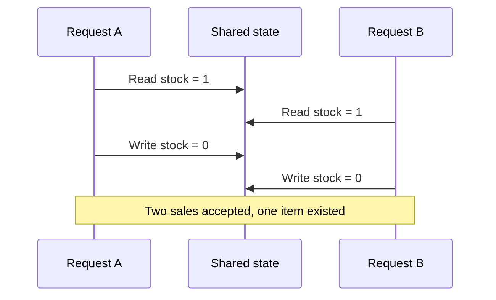

Each request followed valid local logic. Together, they violated the inventory invariant.

### Shared state examples

- Database rows.
- Inventory counters.
- Account balances.
- User sessions.
- In-memory maps.
- Files.
- Cache entries.
- Message-processing state.
- External provider operations.

Concurrency becomes dangerous when at least two execution paths can read, modify, or rely on the same state at overlapping times.

## 2. Core Race-Condition Patterns

### 2.1 Lost update

Two requests read the same value, calculate independently, then overwrite each other:

```text
Initial balance: 100

Request A reads 100, adds 50, plans 150
Request B reads 100, subtracts 20, plans 80
Request A writes 150
Request B writes 80

Expected balance: 130
Actual balance: 80
```

### 2.2 Check-then-act

The application checks a condition, but another request changes the state before the action:

```text
if stock > 0:
    create order
    decrement stock
```

Two requests can both observe `stock > 0`. The check and mutation must be atomic or protected by a lock.

### 2.3 Time-of-check to time-of-use

Authorization, file access, resource existence, or ownership can change between validation and use:

```text
check user owns file
another request revokes ownership
read file
```

Validate as close as possible to the protected operation. Prefer one atomic database statement or a transaction that checks and uses the same state.

### 2.4 Duplicate operation

A client retries after a timeout. The first request succeeded, but its response was lost. The retry creates a second order or charges a card twice.

Use idempotency keys and unique constraints:

```sql
CREATE TABLE payments (
    id BIGINT PRIMARY KEY,
    idempotency_key TEXT NOT NULL UNIQUE,
    status TEXT NOT NULL,
    amount NUMERIC(12, 2) NOT NULL
);
```

### 2.5 Dirty read and stale read

One worker reads data while another is changing it. Without correct isolation or version checks, the reader may make a decision from data that is incomplete or no longer current.

### 2.6 ABA problem

A thread reads value `A`. Another worker changes it to `B`, then back to `A`. The first thread sees `A` again and incorrectly assumes nothing changed.

Use a version or generation number, not only value equality:

```sql
UPDATE documents
SET body = $1,
    version = version + 1
WHERE id = $2
  AND version = $3;
```

### 2.7 Double processing

At-least-once message delivery can send one event multiple times. A consumer that increments a balance or sends an email without deduplication may apply the effect twice.

Record processed event IDs in the same transaction as the business change:

```sql
BEGIN;

INSERT INTO processed_events (event_id)
VALUES ('evt-123');

-- If unique constraint rejects duplicate, skip business work.
UPDATE accounts
SET balance = balance + 100
WHERE id = 42;

COMMIT;
```

## 3. Where Concurrency Control Lives

Different mechanisms protect different scopes:

| Mechanism | Scope | Best fit | Main cost |
| --- | --- | --- | --- |
| Atomic CPU operation | One memory value | Counters, flags | Limited composition |
| In-process mutex | One process | Local memory state | Fails across instances |
| Optimistic version check | One record or aggregate | Low contention | Retries on conflict |
| Database atomic update | One SQL invariant | Counters, stock, quotas | Database load |
| Database row lock | Transaction and selected rows | High contention updates | Blocking and deadlocks |
| Serializable transaction | Database transaction | Strong cross-row invariants | Abort/retry or lower throughput |
| Unique constraint | One uniqueness rule | Idempotency, uniqueness | Correct schema required |
| Distributed lock | Multiple processes | Rare cross-resource coordination | Lease failure and operational complexity |
| Queue partitioning | One ordered key | Per-user or per-entity ordering | Delayed processing |
| Idempotent consumer | Message effect | At-least-once delivery | Deduplication storage |

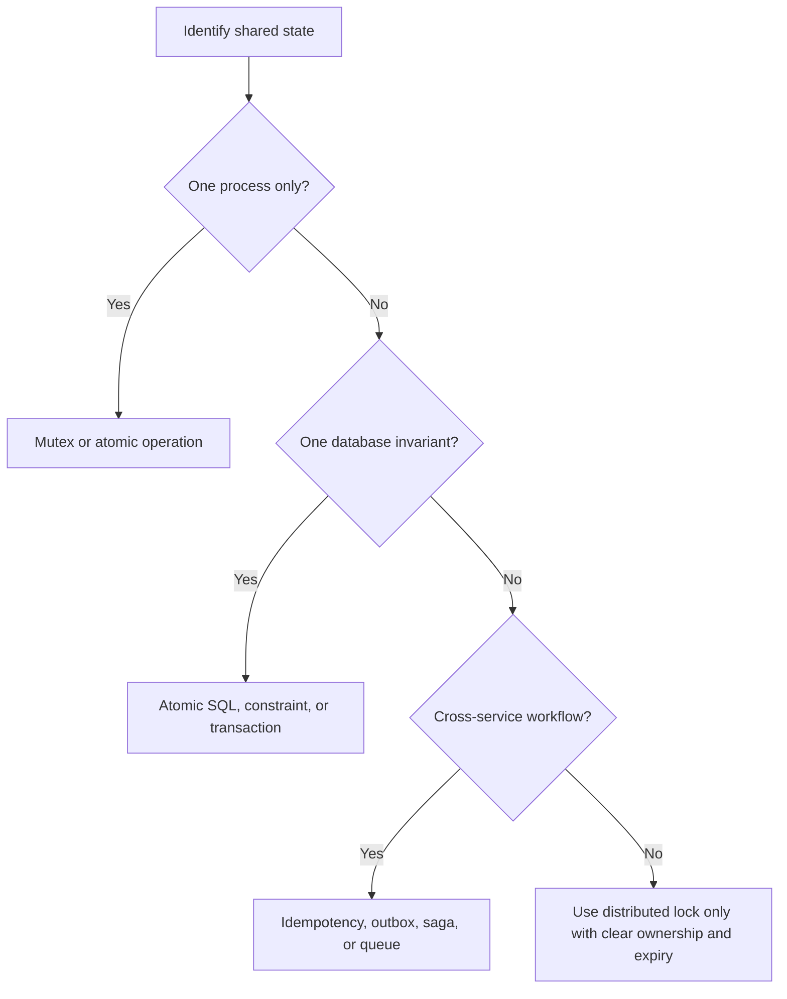

## 4. Solution 1: Atomic Operations

An atomic operation completes as one indivisible state change from the perspective of other workers.

### Atomic database update

Unsafe:

```sql
SELECT stock FROM products WHERE id = 42;
-- Application checks stock > 0.
UPDATE products SET stock = stock - 1 WHERE id = 42;
```

Safe for one-row stock decrement:

```sql
UPDATE products
SET stock = stock - 1
WHERE id = 42
  AND stock > 0;
```

The application checks affected rows:

- `1`: reservation succeeded.
- `0`: product missing or stock unavailable.

### Pros

- Simple.
- Fast for one-row invariants.
- No long lock held by application code.
- Database remains source of truth.

### Cons

- Harder to express multi-row rules.
- Can hide business logic inside affected-row checks.
- Hot rows can still create contention.
- Requires correct indexes and constraints.

### Use when

- One statement can express condition and mutation.
- Invariant concerns one row or one key.
- Lost update prevention matters.

Do not use a distributed lock for a counter that one atomic SQL statement can update safely.

## 5. Solution 2: Optimistic Concurrency Control

Optimistic concurrency assumes conflicts are uncommon. Readers do not lock. Writers include the version they read.

```sql
-- Read
SELECT id, body, version
FROM documents
WHERE id = 7;

-- Conditional write
UPDATE documents
SET body = $1,
    version = version + 1
WHERE id = 7
  AND version = $2;
```

If affected rows equal zero, another writer won first. Reload, merge or reject, then retry within a bounded limit.

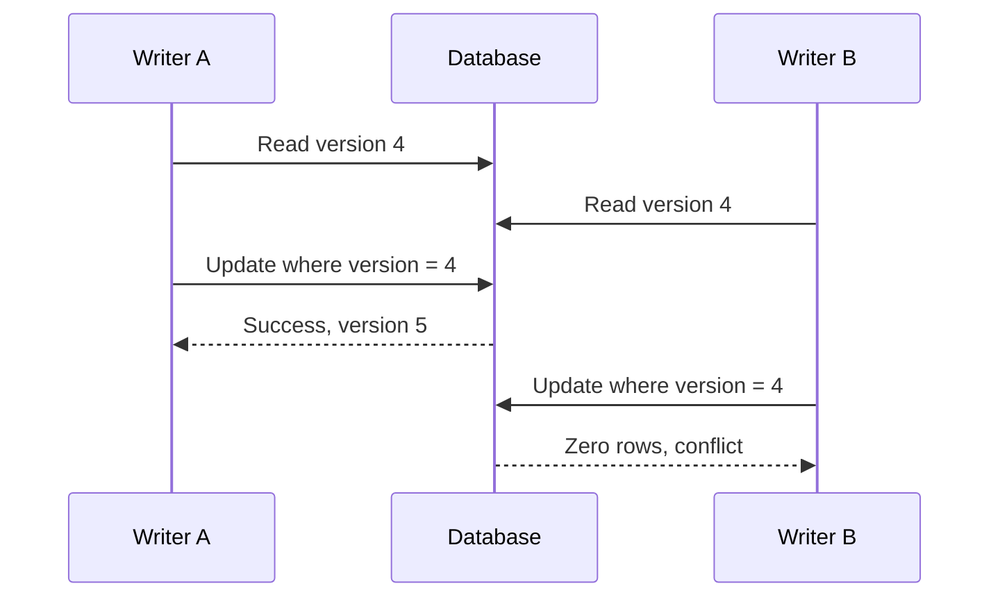

### Pros

- No lock held while user thinks or edits.
- Good read concurrency.
- Clear conflict detection.
- Works well for documents, profiles, and low-contention aggregates.

### Cons

- Conflicts require retry or user-visible merge.
- Retry storms can overload a hot record.
- Every write path must use the version condition.
- Long workflows may need conflict-resolution UX.

### Use when

- Conflicts are rare.
- Losing or rejecting stale writes is acceptable.
- Work spans time too long to hold a lock.

Avoid optimistic locking for a flash sale inventory row with thousands of simultaneous writers unless queueing or partitioning reduces contention.

## 6. Solution 3: Pessimistic Database Locks

Pessimistic locking assumes conflicts are likely. The transaction locks rows before reading and changing them:

```sql
BEGIN;

SELECT stock
FROM products
WHERE id = 42
FOR UPDATE;

-- Validate stock in application or SQL.
UPDATE products
SET stock = stock - 1
WHERE id = 42
  AND stock > 0;

COMMIT;
```

### Pros

- Strong protection for contested rows.
- Simple mental model.
- Good when every accepted operation must serialize.

### Cons

- Waiting transactions hold connections.
- Lock ordering can create deadlocks.
- Long transactions reduce throughput.
- Timeouts and victim retries are required.

### Use when

- Contention is high.
- Work must make a decision from a current row state.
- Transaction can finish quickly.

Never call an external service while holding a database lock. Save state, commit, then perform external work.

## 7. Solution 4: Unique Constraints and Idempotency

A uniqueness constraint turns duplicate prevention into a database guarantee:

```sql
CREATE UNIQUE INDEX orders_customer_request_idx
ON orders (customer_id, client_request_id);
```

Request flow:

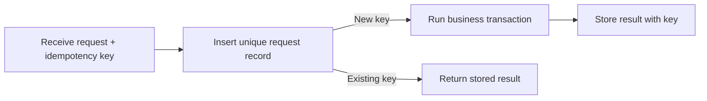

### Pros

- Strong duplicate protection.
- Safe across application instances.
- Simple retry behavior.

### Cons

- Requires storing request status and response.
- Need expiry or cleanup policy.
- A client must reuse the same key on retry.

### Use when

- Client retries are expected.
- Operation creates side effects.
- Network timeout can hide a successful response.

Idempotency does not make arbitrary side effects transactional. Pair it with provider-supported idempotency keys for payments and external APIs.

### 7.1 What idempotency means

An operation is **idempotent** when repeating the same logical request produces the same intended result as running it once.

```text
PUT /users/42
body: {"name":"Ada"}

First request:  user becomes Ada
Retry request:  user remains Ada
```

Idempotency does not mean every repeated response is byte-for-byte identical, and it does not mean every HTTP method is automatically safe. It means retries do not create an additional business effect.

Distinguish three properties:

| Property | Meaning | Example |
| --- | --- | --- |
| **Safe** | Does not change server state | `GET /orders/7` |
| **Idempotent** | Repeating operation has same intended effect | `PUT /users/42` |
| **Unique** | Only one record can claim a key | Unique `idempotency_key` |

`POST` is commonly non-idempotent by default, but an API can make a `POST` operation retry-safe with an idempotency key.

### 7.2 Why duplication happens

Duplication usually comes from an uncertain result, not from a client intentionally sending the same request:

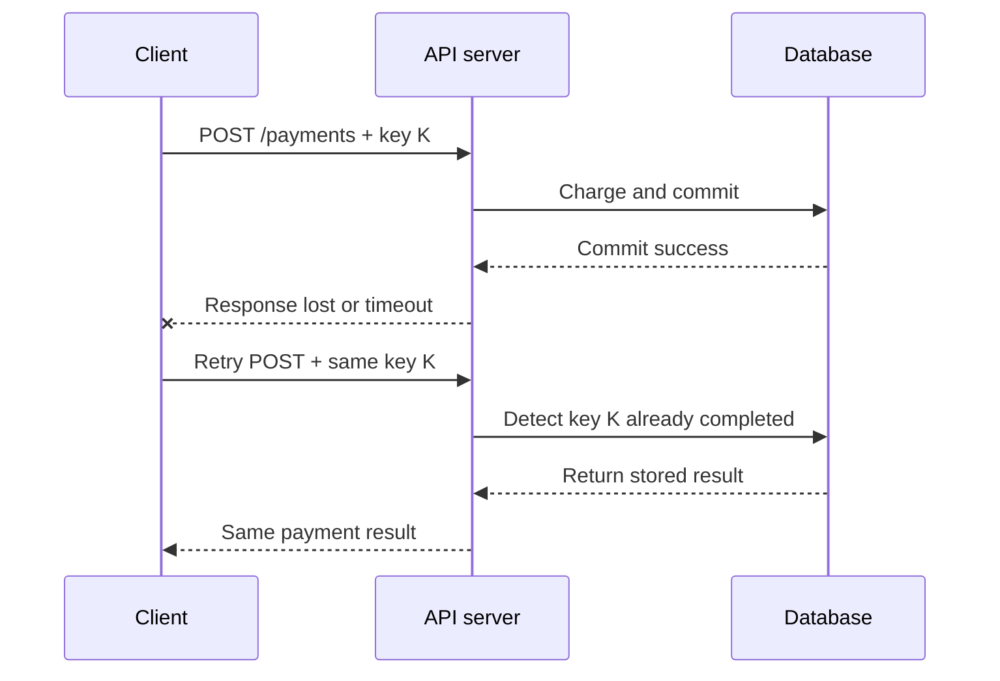

Without idempotency:

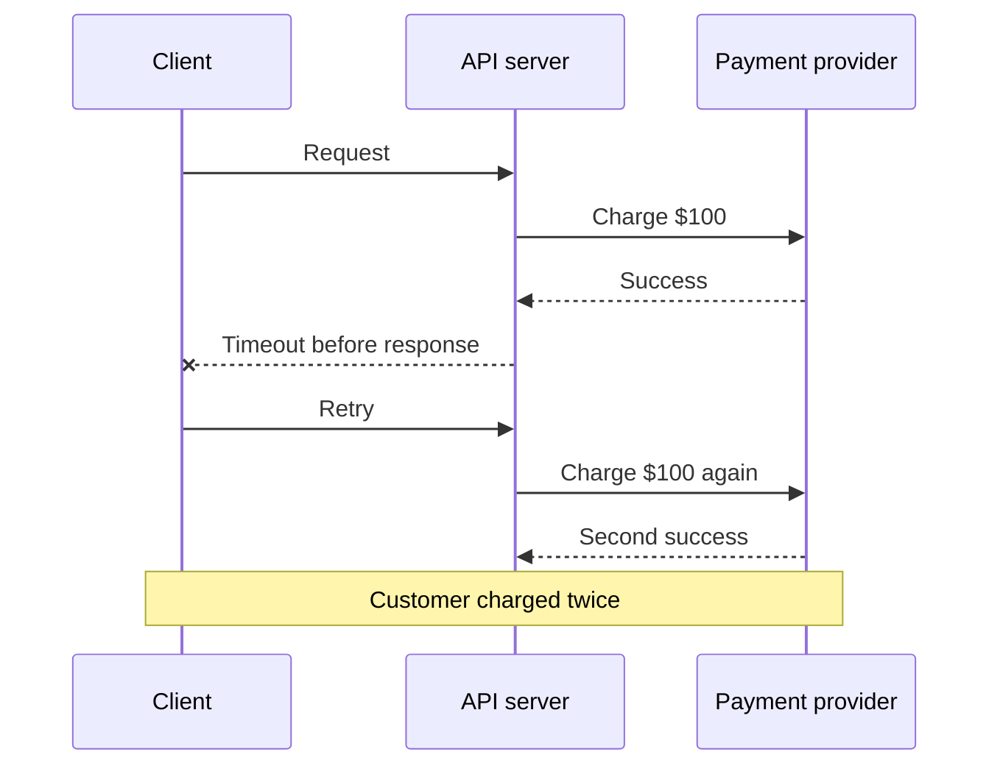

Common duplication sources:

- Client retry after timeout.
- Load balancer retry.
- Worker crash after performing work but before acknowledgement.
- Message broker redelivery.
- Consumer timeout while commit succeeded.
- Two API requests submitted by double-click.
- Multiple workers claiming one job.
- Failover replaying an uncertain transaction.
- Webhook provider sending duplicate delivery.

### 7.3 Idempotency-key lifecycle

Treat an idempotency key as a durable state machine:

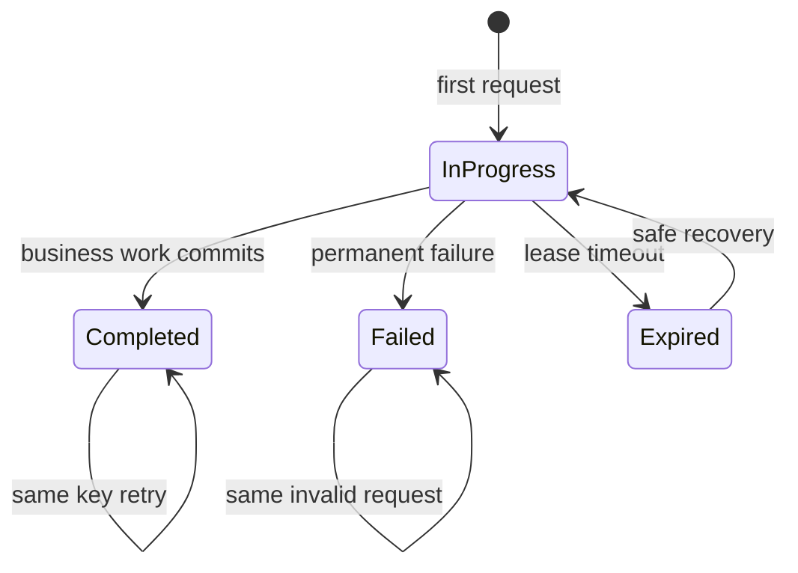

Recommended record:

```sql
CREATE TABLE idempotency_keys (
    scope TEXT NOT NULL,
    key TEXT NOT NULL,
    request_hash TEXT NOT NULL,
    status TEXT NOT NULL CHECK (status IN ('in_progress', 'completed', 'failed')),
    response_code INTEGER,
    response_body JSONB,
    resource_type TEXT,
    resource_id TEXT,
    created_at TIMESTAMPTZ NOT NULL DEFAULT now(),
    completed_at TIMESTAMPTZ,
    PRIMARY KEY (scope, key)
);
```

`scope` prevents accidental collision between unrelated endpoints or tenants. `request_hash` detects reuse of one key with different payload:

```text
same key + same request hash       return stored result
same key + different request hash  reject as invalid reuse
new key                            claim and execute
```

Do not silently process a different request under an existing key. Return a conflict such as `409 Conflict`.

### 7.4 Safe request flow

Use one database transaction to claim the key and persist the business result:

```text
1. Validate authentication and request shape.
2. Derive scope and idempotency key.
3. Hash canonical request payload.
4. Insert key as in_progress with a unique constraint.
5. If key exists:
   - completed: return stored response
   - in_progress: return conflict or retry-after response
   - failed: return stored permanent failure
6. Perform local business mutation.
7. Store response and mark key completed in same transaction.
8. Return stored response.
```

Example PostgreSQL-style claim:

```sql
INSERT INTO idempotency_keys (scope, key, request_hash, status)
VALUES ('payments:customer-7', 'req-123', 'sha256:abc...', 'in_progress')
ON CONFLICT (scope, key) DO NOTHING
RETURNING scope, key;
```

If no row returns, read the existing record and handle its state. The unique constraint is the race-safe arbiter; an application-level “check first, insert later” is not enough.

### 7.5 Concurrent same-key requests

Two identical requests can arrive at the same moment:

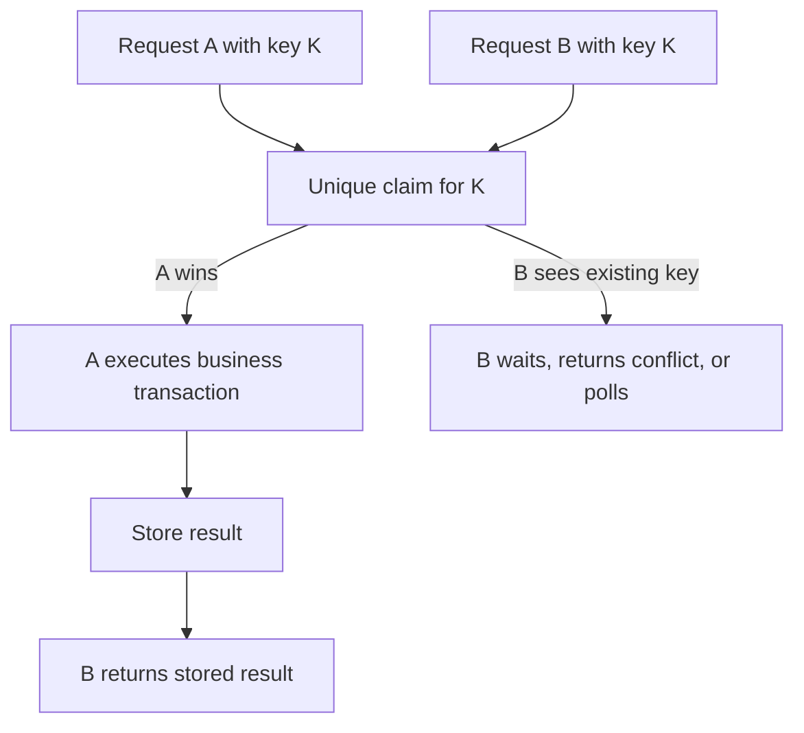

Choose behavior for a request that sees `in_progress`:

| Strategy | Use when | Cost |
| --- | --- | --- |
| Return `409 Conflict` or `425 Too Early` | Client can retry later | Client logic required |
| Return `202 Accepted` | Work is asynchronous | Client needs status endpoint |
| Poll briefly | Work normally completes quickly | Holds request resources |
| Wait on database row | Very short local transaction | Can increase connection pressure |
| Return existing resource | Resource already has durable identity | Requires clear response contract |

Do not let many retries spin in a tight loop. Use `Retry-After`, bounded polling, and exponential backoff.

### 7.6 Store key, resource reference, or full response?

Three common storage choices:

| Stored data | Advantages | Limitations |
| --- | --- | --- |
| Full response body | Exact replay; simplest client behavior | Storage growth; sensitive-data retention |
| Resource type and ID | Small; response can be rebuilt | Later representation may differ |
| Request hash plus result metadata | Flexible; useful for auditing | More reconstruction logic |

Store full response when exact retry semantics matter, such as payment authorization. Store a resource reference when response can safely be reconstructed and privacy rules prohibit retaining payloads.

Encrypt or redact sensitive response data. Apply retention and deletion rules. An idempotency record can contain payment, address, or personal data.

### 7.7 Key expiry and crash recovery

Keys need a retention policy, but expiry too early reopens duplication risk:

```text
client retry window < key retention window
```

For long-running work, use a lease:

- `in_progress` includes `lease_until`.
- Owner renews lease while work runs.
- Recovery worker can reclaim expired work.
- Business effect remains protected by unique resource keys or provider idempotency.

Never mark an uncertain operation safe only because its `in_progress` row expired. The process may have completed the external side effect before crashing.

For payment or shipment APIs, query provider status by provider idempotency key before retrying. If status cannot be confirmed, route to reconciliation instead of issuing an unprotected second request.

### 7.8 Idempotency with message consumers

At-least-once delivery requires consumers to expect duplicates:

```sql
BEGIN;

INSERT INTO consumed_messages (consumer_name, message_id)
VALUES ('billing-service', 'msg-987');

-- Unique conflict means message already processed.
UPDATE invoices
SET paid = TRUE
WHERE id = 55;

COMMIT;
```

The message ledger and business mutation must commit together. If the ledger commits first and business work fails, the message can be lost. If business work commits first and the ledger fails, redelivery must be safe.


For very high-throughput consumers, a compact deduplication table, partitioned ledger, or inbox pattern may be needed. Keep retention long enough to cover maximum redelivery delay.

### 7.9 Idempotency versus exactly-once

“Exactly once” often describes one narrow boundary, not an entire distributed workflow:

- Database transaction can commit one local mutation once.
- Broker may deliver a message more than once.
- Network can lose the response after commit.
- External provider may receive a request while the caller times out.

Design for **at-least-once delivery plus idempotent effects**. This is usually more practical than trying to prove exactly-once execution across services.

### 7.10 Pros, cons, and correct use

#### Pros

- Safe retries after uncertain responses.
- Protects payments, orders, reservations, and message consumers from duplicates.
- Works across multiple API instances.
- Makes failure recovery explicit.
- Converts ambiguous network behavior into deterministic business behavior.

#### Cons

- Extra storage, indexes, and cleanup.
- Key misuse can hide legitimate new operations.
- Concurrent requests need a clear `in_progress` policy.
- Retaining full responses creates privacy and storage concerns.
- Does not automatically make external side effects atomic.
- Requires canonical request hashing and stable API semantics.

#### Use idempotency when

- Operation creates money, inventory, orders, reservations, or notifications.
- Client or infrastructure may retry.
- A timeout can occur after side effect but before response.
- Message delivery is at least once.
- A webhook or job can be delivered repeatedly.

#### Do not add an idempotency table blindly when

- Operation is a pure read.
- Operation is naturally safe and has no side effect.
- The database already has a direct unique constraint that fully expresses the requirement.
- Key retention and replay semantics are undefined.

Use the smallest reliable design. A unique constraint may be enough for one resource; full response replay is needed only when clients depend on exact result recovery.

### 7.11 Failure examples and fixes

| Failure | Why it duplicates | Fix |
| --- | --- | --- |
| Double-click checkout | Two independent request keys | Disable duplicate UI action; server deduplicates by cart/order key |
| Payment timeout | Provider succeeded, API response lost | Provider idempotency key plus status reconciliation |
| Worker crash after email | Ack not persisted | Outbox/inbox, provider message ID, email deduplication where supported |
| Queue redelivery | Consumer committed but ack failed | Processed-message unique key in same transaction |
| Job lease expiry | Old worker resumes after new owner starts | Fencing token or idempotent effect |
| Same key, different payload | Client reuses key incorrectly | Store request hash; reject mismatch |
| Key expires too soon | Late retry treated as new operation | Retain key through maximum retry window |

### 7.12 Idempotency testing

Test:

1. Same request sent concurrently 2, 10, and 100 times.
2. Response lost after local commit.
3. Process crash before key commit.
4. Process crash after business commit but before response.
5. External provider timeout after request acceptance.
6. Message redelivery after consumer commit.
7. Same key with changed body.
8. `in_progress` lease expiry and worker recovery.
9. Key cleanup while a delayed retry arrives.
10. Cross-tenant reuse of the same visible key.

Assert:

- One business resource exists.
- One payment or reservation effect occurs.
- All valid retries receive consistent outcome.
- Invalid key reuse is rejected.
- Permanent failures remain stable.
- Transient failures can recover without duplicate side effects.

## 7.13 Backend and SQL: One Correctness Contract

Backend and database solve different parts of the same race:

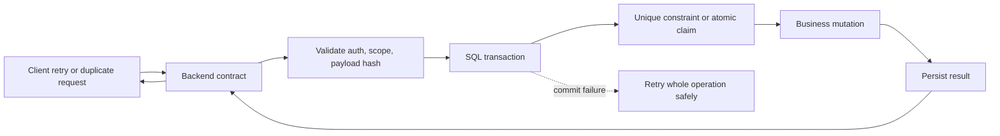

### Backend responsibilities

- Define idempotency-key format, scope, and retention behavior.
- Canonicalize input and reject same-key payload changes.
- Return stable statuses for `completed`, `in_progress`, and permanent failure.
- Pass provider idempotency keys to payment, shipping, and messaging APIs.
- Retry only transient errors with bounded backoff.
- Avoid holding database transactions during external calls.
- Make response semantics match synchronization choice: synchronous result, `202 Accepted`, polling, or webhook.
- Propagate request, transaction, message, and idempotency correlation IDs.
- Handle database deadlock, lock timeout, version conflict, and serialization errors.

### SQL responsibilities

- Enforce uniqueness with `UNIQUE` constraints or indexes.
- Combine deduplication record and business mutation in one transaction.
- Express one-row invariants as atomic conditional statements.
- Use row locks or serializable isolation for multi-row invariants.
- Enforce foreign keys, checks, and state transitions.
- Persist the result needed for safe replay.
- Provide durable ordering or claim state for workers.
- Keep commit as source of truth; never trust cache-only success.

### Backend limitations

Backend-only protection cannot guarantee correctness when:

- Multiple instances race.
- A process crashes after an external side effect.
- A database commit succeeds but the response is lost.
- Another writer bypasses the service.
- In-memory mutex protects only one process.
- Redis state diverges from the database.

### SQL limitations

SQL-only protection cannot decide:

- How clients retry.
- Whether a response should be replayed or returned as pending.
- How to compensate an external side effect.
- How long an idempotency key should remain valid for client behavior.
- Whether a provider supports idempotency.
- How to expose conflict, timeout, or reconciliation state through an API.

### Combination rules

| Requirement | Backend layer | SQL layer |
| --- | --- | --- |
| One resource per request | Require stable request key | Unique key constraint |
| Prevent lost update | Return conflict or retry | Version predicate or row lock |
| Prevent overselling | Return success or unavailable result | Atomic conditional update |
| Duplicate payment retry | Reuse provider key and reconcile status | Store local request and result atomically |
| Duplicate message | Ack only after successful handling | Unique message ledger plus business mutation |
| Cross-row invariant | Retry serialization failure | Transaction, locks, or `SERIALIZABLE` |
| Async workflow | Expose pending state and status endpoint | Outbox, state machine, durable claims |
| Deadlock | Retry complete operation | Detect victim and roll back transaction |

Do not let both layers invent separate truth. If backend says an operation is completed while SQL says `in_progress`, define recovery behavior. If SQL rejects a duplicate but backend returns a generic success without the original result, clients cannot safely recover.

### Boundary rule

```text
Backend decides what retry means.
SQL decides which state transition can commit.
External provider decides whether its side effect can be deduplicated.
Reconciliation handles uncertainty between boundaries.
```

## 8. Solution 5: Queues and Per-Key Ordering

Queue work when operations for one entity must execute in order but requests do not need immediate synchronous completion.

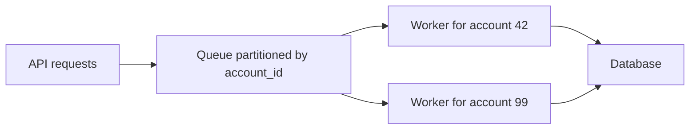

Partitioning by entity key lets unrelated entities process concurrently while preserving order for one entity.

### Pros

- Smooths bursts.
- Reduces hot-row contention.
- Natural retry and dead-letter handling.
- Preserves per-key ordering.

### Cons

- Adds processing delay.
- More infrastructure.
- Consumers still need idempotency.
- Global ordering is expensive and often unnecessary.

### Use when

- Eventual consistency is acceptable.
- Work can be asynchronous.
- A clear partition key exists.

Do not queue a request that needs an immediate authoritative response unless API semantics clearly expose pending state.

## 9. Solution 6: Distributed Locks

A distributed lock coordinates workers across processes or hosts:

```text
acquire lock(resource, owner-token, expiry)
perform short protected work
release only if token still belongs to owner
```

Use a unique owner token. Never delete a lock by key alone:

```lua
if redis.call("get", KEYS[1]) == ARGV[1] then
    return redis.call("del", KEYS[1])
end
return 0
```

### Pros

- Coordinates independent workers.
- Useful for scheduled jobs and singleton maintenance.
- Can protect resources outside one database.

### Cons

- Expiry can occur while owner is paused.
- Network partitions create uncertain ownership.
- Clock and lease assumptions can break safety.
- Adds external dependency and failure modes.

### Use when

- Work is short and ownership can expire safely.
- Duplicate execution is harmful but not catastrophic.
- Fencing tokens or idempotency protect the real side effect.

Do not use a Redis lock as the only protection for money movement or inventory correctness. Prefer database constraints, transactions, atomic updates, or fencing at the storage layer.

## 10. Choosing Without Overengineering

Start with the smallest correct mechanism:

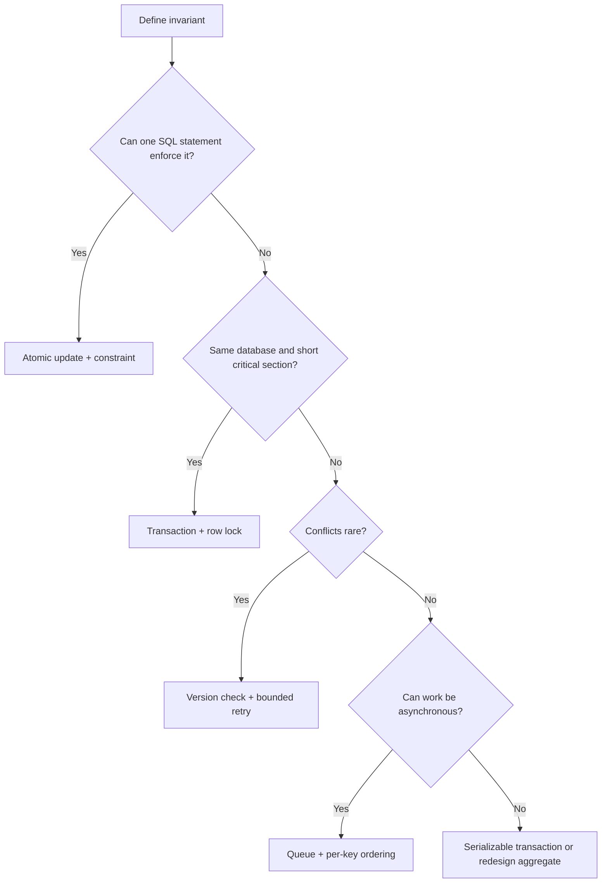

### Requirements-fit checklist

Before selecting a mechanism, answer:

1. What must never happen?
2. Which state participates in that invariant?
3. How many writers can touch it concurrently?
4. Must the response be immediate?
5. Is temporary inconsistency acceptable?
6. What happens after timeout or process crash?
7. Can the operation be retried safely?
8. Which component owns the source of truth?
9. What is the maximum acceptable latency?
10. How will contention and failures be measured?

### Avoid overkill

- Use a database unique constraint instead of a distributed lock for uniqueness.
- Use atomic SQL instead of read-lock-write for one-row counters.
- Use a queue only when eventual consistency fits requirements.
- Use optimistic locking instead of long-held locks for user editing.
- Use a local mutex only for local memory; never assume it coordinates instances.
- Use serializable isolation for a real invariant, not as a default replacement for understanding the schema.
- Add distributed coordination only after identifying a cross-process requirement.

### Do not break requirements

Concurrency fixes can change product behavior. Preserve:

- API response semantics.
- Ordering guarantees promised to clients.
- Retry behavior.
- Authorization checks.
- Auditability.
- Availability targets.
- Data retention and recovery requirements.

For example, changing synchronous inventory reservation to a queue may reduce race conditions but require `202 Accepted`, a pending status, polling, or webhook delivery. That is a product contract change, not only a technical refactor.

## 11. Testing Race Conditions

Single-threaded tests rarely expose timing bugs. Add controlled concurrency tests:

```text
create one shared resource
start N workers at a barrier
release all workers together
wait for completion
assert invariant
repeat many times
```

Test:

- Two writers updating one row.
- Duplicate requests with same idempotency key.
- Conflicting versions.
- Worker crash after side effect and before acknowledgement.
- Lock timeout and deadlock retry.
- Queue redelivery.
- Process pause during distributed lease.
- Database failover during commit.

Use production-like isolation levels, indexes, connection-pool limits, and transaction boundaries. Random sleeps can help trigger schedules, but deterministic barriers make failures easier to explain.

## 12. Observability and Debugging

Log one correlation ID across request, transaction, worker, and message:

- Request ID.
- Entity ID.
- Idempotency key hash or safe identifier.
- Transaction start and duration.
- Lock wait duration.
- Retry count and reason.
- Rows affected.
- Version conflict count.
- Queue partition and message ID.

Track:

- Conflict rate.
- Deadlocks and lock timeouts.
- Connection-pool wait time.
- Duplicate-message rate.
- Queue age and lag.
- Retry success rate.
- Hot-key distribution.
- Database CPU and I/O.

Never log secrets or full payment payloads. Redact values before logs leave the process.

## 13. Practical Backend Patterns

### Inventory reservation

```sql
UPDATE inventory
SET available = available - 1,
    reserved = reserved + 1
WHERE product_id = 42
  AND available > 0;
```

Use affected-row count. Add a unique reservation key if one client request must not reserve twice.

### Seat booking

```sql
BEGIN;

UPDATE seats
SET status = 'reserved',
    reservation_id = 'res-123'
WHERE show_id = 10
  AND seat_number = 'A1'
  AND status = 'available';

COMMIT;
```

A unique constraint on `(show_id, seat_number)` plus conditional update protects the seat.

### Document editing

Use optimistic version checks. Return `409 Conflict` when the submitted version is stale. Offer merge or reload instead of silently overwriting another user's work.

### Scheduled singleton job

Use a lease or database advisory lock for short coordination. Make job effects idempotent because lease expiry or worker restart can cause duplicate execution.

### Rate limiting

Use an atomic Redis script or database operation that checks and increments in one step. Separate local fast-path optimizations require careful token leasing and failure semantics.

## 14. Advantages and Limitations Summary

| Approach | Advantages | Limitations |
| --- | --- | --- |
| Atomic update | Small, fast, correct for one invariant | Limited to expressible single operations |
| Optimistic version | High read concurrency, no long locks | Conflict retries and merge complexity |
| Pessimistic lock | Strong serialization for hot data | Blocking, deadlocks, pool pressure |
| Constraint | Enforced at source of truth | Only expresses supported schema rules |
| Idempotency key | Safe client retries | Storage and lifecycle management |
| Queue | Burst control and per-key order | Eventual consistency and lag |
| Distributed lock | Cross-process coordination | Lease, partition, and ownership risks |
| Serializable isolation | Strong cross-row correctness | Lower throughput and retry failures |

## 15. Interview Questions and Answers

### Q1. What is a race condition?

**Answer:** A race condition occurs when correctness depends on timing or execution order between concurrent operations. The result can change even though each operation is locally valid.

### Q2. Why is check-then-act unsafe?

**Answer:** Another operation can change shared state after the check and before the action. Combine condition and mutation in one atomic statement, or protect both with a transaction and lock.

### Q3. How does optimistic locking detect a conflict?

**Answer:** The writer includes the version it read in the `UPDATE` predicate. If another writer already incremented the version, affected rows equal zero and the application handles the conflict.

### Q4. When is pessimistic locking better than optimistic locking?

**Answer:** Pessimistic locking fits high-contention, short transactions where accepted operations must serialize. Optimistic locking fits low-contention work where retry or merge is cheaper than blocking.

### Q5. How do you make a retry safe?

**Answer:** Make the complete operation idempotent, use unique business keys or idempotency keys, keep external provider idempotency where available, and retry only transient failures with bounded backoff.

### Q6. Can an in-memory mutex protect a distributed service?

**Answer:** No. It protects only threads sharing one process memory. Requests routed to another instance can enter the critical section simultaneously. Use database coordination, queue partitioning, or a carefully designed distributed mechanism.

### Q7. Why is a distributed lock not enough for money movement?

**Answer:** Lease expiry, process pauses, network partitions, or stale ownership can let two workers believe they own the lock. Put correctness in database constraints and transactions, and use fencing or idempotency for cross-service effects.

### Q8. How do queues reduce race conditions?

**Answer:** A queue can serialize operations for one partition key while allowing unrelated keys to process concurrently. It trades immediate completion for ordered asynchronous processing.

### Q9. What is the ABA problem?

**Answer:** A value changes from A to B and back to A while a reader is paused. Value comparison alone misses the change. A monotonically increasing version detects it.

### Q10. How do you test a race condition?

**Answer:** Run concurrent workers against one shared resource using a barrier, representative database settings, repeated iterations, and invariant assertions. Add crash, timeout, duplicate-delivery, and retry scenarios.

### Q11. How do you choose between an atomic update and a transaction with `FOR UPDATE`?

**Answer:** Use an atomic update when one statement expresses the invariant. Use `FOR UPDATE` when several reads and writes must make one decision from current rows. Prefer the smaller critical section.

### Q12. What metrics reveal concurrency problems?

**Answer:** Lock waits, deadlocks, version conflicts, retry rate, duplicate messages, queue lag, hot-key concentration, connection-pool wait, transaction duration, and p95/p99 latency.

### Q13. How can a concurrency fix break an API contract?

**Answer:** Replacing synchronous work with a queue changes response timing and consistency. Clients may need `202 Accepted`, pending states, polling, or webhooks. Technical correctness must still preserve documented product behavior.

### Q14. How do you prevent duplicate event processing?

**Answer:** Store event IDs under a unique constraint and apply deduplication plus business mutation in one transaction. Consumers must tolerate redelivery.

### Q15. Why not use `SERIALIZABLE` for every transaction?

**Answer:** Serializable isolation can abort more transactions or increase blocking under contention. It is valuable for specific cross-row invariants, but simpler atomic updates, constraints, or locks often provide correctness with better throughput.

### Q16. What does idempotency mean for an API?

**Answer:** Repeating the same logical request produces the same intended business effect as processing it once. A retry may return the stored original result, but it must not create another payment, order, reservation, or notification.

### Q17. Why can a client retry create duplicate data?

**Answer:** The server may commit the side effect while the response is lost. The client cannot distinguish “not processed” from “processed but response lost,” so it retries. Without a stable idempotency key or unique business key, the server performs the side effect again.

### Q18. How do you implement an idempotent `POST`?

**Answer:** Require an idempotency key, scope it to the tenant and operation, hash the canonical request, claim the key with a unique constraint, execute the business mutation, store the result, and replay that result for later requests with the same key. Reject the same key with a different request hash.

### Q19. What should happen when two requests use the same idempotency key concurrently?

**Answer:** One request atomically claims the key. The other must wait, return a retryable conflict, return `202 Accepted`, or return the completed result after polling. It must never execute the business operation independently.

### Q20. Why is “check whether key exists, then insert” unsafe?

**Answer:** Two requests can both observe no record before either inserts. The check and insert are not atomic. Use a database unique constraint with an atomic insert or equivalent compare-and-set operation.

### Q21. Should an idempotency record store the full response?

**Answer:** Store the full response when exact replay matters and privacy policy permits it. Store resource type and ID when the response can be reconstructed safely. Consider storage size, sensitive data retention, and representation changes.

### Q22. How long should an idempotency key live?

**Answer:** At least through the maximum client, proxy, queue, and provider retry window. Expiring it earlier can turn a late retry into a duplicate operation. Long-running workflows need a lease and reconciliation policy, not blind expiry.

### Q23. Does idempotency guarantee exactly-once execution?

**Answer:** No. It guarantees one intended business effect when all effect boundaries participate correctly. Network requests, broker delivery, and external providers can still execute or deliver more than once. Design at-least-once systems with idempotent effects and reconciliation.

### Q24. How do you make message consumption idempotent?

**Answer:** Store a unique message ID or event ID and apply that ledger write with the business mutation in one local transaction. A redelivered message hits the unique key and skips the already-applied effect.

### Q25. Why is an idempotency key not enough for payment safety?

**Answer:** The payment provider must also receive a stable provider-side idempotency key. If only the API stores its own key, a crash between the provider call and local persistence can still cause an unsafe retry. Query provider status before retrying uncertain calls.

### Q26. What is the difference between idempotency and uniqueness?

**Answer:** Uniqueness prevents multiple records from claiming one key. Idempotency defines how repeated requests behave and what result they receive. Usually use uniqueness as the storage guarantee and explicit replay logic as the API behavior.

### Q27. What happens if the request body changes but the idempotency key stays the same?

**Answer:** Reject it as invalid key reuse, commonly with `409 Conflict`. Processing the changed body under the old key makes retries ambiguous and can violate client expectations.

### Q28. How do you test idempotency?

**Answer:** Send the same key concurrently, drop responses after commit, crash workers before acknowledgement, redeliver messages, expire leases, retry after provider timeouts, and reuse keys with changed bodies. Assert one business effect and stable retry results.

### Q29. Which layer should own idempotency: backend or database?

**Answer:** Both, with different roles. Backend owns the API contract, key scope, payload hash, replay response, and retry behavior. Database owns the unique claim, durable status, and atomic coupling between deduplication and business mutation. Backend-only memory is not enough; SQL-only storage cannot define client behavior.

### Q30. Why is a unique database constraint still needed when backend checks the key?

**Answer:** Two backend instances can check simultaneously and both see no key. A database unique constraint makes the claim atomic and leaves one durable winner. Backend then handles the existing record state.

### Q31. Where should message deduplication happen?

**Answer:** At the consumer's database boundary. Insert the event ID into a unique inbox or processed-message table in the same transaction as the business mutation. A cache can accelerate duplicate checks, but it cannot replace the durable constraint.

### Q32. Can a database transaction make an external payment exactly once?

**Answer:** No. The database cannot roll back a payment provider call. Use a provider idempotency key, persist local workflow state, query provider status after uncertain failures, and reconcile unresolved operations.

### Q33. What belongs in backend code versus SQL for inventory?

**Answer:** Backend validates identity, request shape, pricing, and response semantics. SQL performs the atomic `available > 0` decrement, enforces product and reservation uniqueness, and commits the inventory state. Backend checks affected rows and maps zero rows to an unavailable result.

### Q34. Why should an API not hold a SQL transaction while calling another service?

**Answer:** Network latency, timeout, or remote retry can hold locks and exhaust the connection pool. Persist a pending state and outbox event, commit locally, then perform external work with idempotency and reconciliation.

### Q35. How do you avoid overengineering duplication prevention?

**Answer:** Start with the narrowest invariant. Use a unique constraint for simple uniqueness, atomic SQL for one-row counters, optimistic versioning for rare conflicts, and a full idempotency record only when retries can repeat a meaningful side effect. Add queues, distributed locks, or sagas only when requirements demand them.
