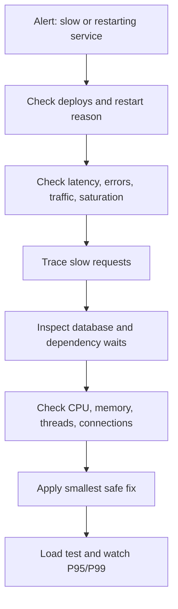
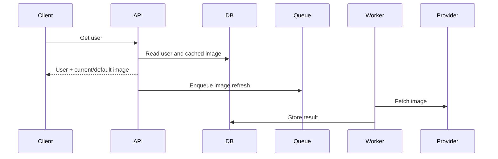
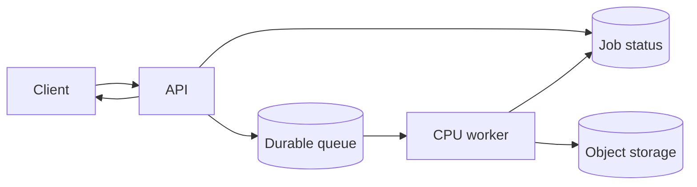
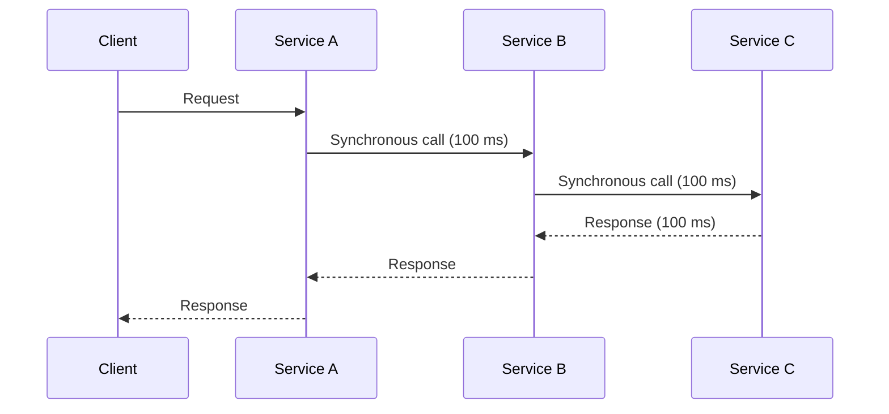

# Backend Production Diagnostics: Slow Systems and Repeated Restarts

When production becomes slow or restarts repeatedly, do not guess. Start with
request latency, error rate, saturation, resource usage, dependency health, and
restart reason. A restart may be symptom, not root cause: out-of-memory,
unhandled exception, health-check failure, process deadlock, or platform
eviction can all look similar from outside.



## 1. N+1 Queries

N+1 means one query loads parent rows, then one query runs for each parent.
With 1,000 users, code performs 1 query plus 1,000 order queries. Latency,
database CPU, connection usage, and network traffic rise together.

```js
const users = await userRepo.findAll(); // 1 query
const orders = [];

for (const user of users) {
    orders.push(await orderRepo.findByUserId(user.id)); // N queries
}
```

Prefer a join, eager loading, or a batched query:

```sql
SELECT u.id, u.name, o.id AS order_id, o.total_amount
FROM users AS u
LEFT JOIN orders AS o ON o.user_id = u.id
WHERE u.id = ANY($1)
ORDER BY u.id, o.created_at DESC;
```

Do not blindly eager-load huge relationships. Fetch only fields and rows
needed by endpoint. Detect N+1 with query-count tests, ORM instrumentation,
slow-query logs, and traces showing repeated SQL spans.

## 2. Missing Database Indexes

Missing or unsuitable indexes force scans, expensive joins, sorting, or
locking. Check slow-query logs and execution plans. A 100 ms threshold is a
useful starting point, not a universal law; endpoint budget and query frequency
matter too.

Inspect columns used in:

- `WHERE` predicates.
- `JOIN` conditions.
- `ORDER BY`.
- Frequently used range filters.
- Unique business lookups.

```sql
CREATE INDEX CONCURRENTLY idx_orders_customer_created
ON orders (customer_id, created_at DESC);

EXPLAIN (ANALYZE, BUFFERS)
SELECT id, status, total_amount
FROM orders
WHERE customer_id = 42
ORDER BY created_at DESC
LIMIT 20;
```

Index trade-offs: extra storage, slower writes, vacuum work, and planner
complexity. Index actual access patterns, not every column.

## 3. Connection Pool Exhaustion

Each request needing a database connection competes for finite pool capacity.
When all connections are busy, later requests wait, then time out. Increasing
pool size without checking database capacity can make contention and failure
worse.

Monitor:

- Pool size and active connections.
- Idle connections.
- Waiters and wait time.
- Acquisition timeout count.
- Database `max_connections`.
- Query and transaction duration.

```text
request -> acquire connection -> query -> release connection
                 |
                 +-- pool full: request waits or times out
```

Tune pool size from database CPU, memory, workload, connection cost, and number
of service instances. Total possible connections usually equals pool size
multiplied by instance count. Release connections in `finally` blocks and
investigate leaked or long-held connections.

## 4. Long-Running Transactions

Database connections and locks are scarce. Do not hold them while calling
external APIs, reading files, waiting for user input, or doing long CPU work.
Long transactions increase lock waits, vacuum pressure, deadlocks, and pool
exhaustion.

Bad:

```java
@Transactional
public void process(Order order) {
    orderRepository.save(order);
    externalPaymentService.charge(order); // May take 3 seconds.
}
```

Better:

```java
public void process(Order order) {
    orderRepository.markPaymentPending(order.id()); // Short transaction.
    externalPaymentService.charge(order);           // No database lock held.
    orderRepository.recordPaymentResult(order.id()); // Short transaction.
}
```

Use idempotency keys, explicit pending states, transactional outbox, and
reconciliation. Never assume splitting transactions automatically makes a
workflow atomic across systems.

## 5. `SELECT *`

`SELECT *` reads and transfers columns the endpoint may not use. Costs include
larger I/O, network payloads, serialization work, memory use, and sometimes
loss of index-only scan opportunities.

```sql
-- Too broad for an order-list endpoint.
SELECT *
FROM orders
WHERE customer_id = 42;

-- Projection matches endpoint need.
SELECT id, status, total_amount, created_at
FROM orders
WHERE customer_id = 42
ORDER BY created_at DESC
LIMIT 20;
```

Explicit projections also prevent accidental API changes when schema gains a
large or sensitive column. Select required fields, paginate results, and use
covering indexes where measurements justify them.

## 6. Synchronous External API Calls

Blocking external calls occupy request threads, connection slots, and memory
while network latency is outside your control. Dependency slowness becomes
application slowness.

```java
@GetMapping("/user/{id}")
public User getUser(@PathVariable Long id) {
    User user = userRepository.findById(id);
    user.setProfileImage(externalService.getProfileImage(id)); // Blocks.
    return user;
}
```

For non-critical enrichment, return a local default and fetch in a background
job:



Use asynchronous work only when business semantics allow delay. For required
calls, use bounded timeouts, retries with backoff, circuit breakers, and
idempotency.

## 7. Missing Connection Timeouts

An outbound call without a timeout can wait indefinitely when a dependency
hangs. Threads, memory, sockets, and connection-pool entries accumulate until
the service becomes unhealthy.

Configure separate limits:

- Connection timeout.
- TLS handshake timeout.
- Read or response timeout.
- Total request deadline.
- Queue wait timeout.

Propagate a deadline across service calls. A retry must fit inside the original
request budget. Timeout errors need explicit metrics and logs with dependency,
operation, and duration.

## 8. Unbounded Result Sets

A query without pagination can load hundreds of thousands of rows into
application memory and trigger `OutOfMemoryError`, garbage-collection pressure,
or a process restart.

```sql
SELECT id, status, created_at
FROM orders
WHERE customer_id = 42
ORDER BY id
LIMIT 100;
```

For stable traversal over large data, prefer keyset pagination:

```sql
SELECT id, status, created_at
FROM orders
WHERE customer_id = 42
  AND id < :last_seen_id
ORDER BY id DESC
LIMIT 100;
```

Set maximum page size, enforce server-side limits, stream only when necessary,
and use batch jobs for exports. Do not rely on client-provided limits alone.

## 9. CPU-Intensive Work in Request Threads

Image processing, PDF generation, compression, encryption, and complex
calculations consume CPU while users wait. Under load, request threads queue,
latency grows, health checks fail, and autoscaling may amplify contention.

Move suitable work to a bounded worker pool or durable queue:



Return `202 Accepted` with a job ID when operation is asynchronous. Limit
concurrency so workers do not consume every CPU core or exhaust memory.

## 10. Cache Stampede

When one popular cache entry expires, many requests miss simultaneously and
recompute the same value. The database receives a burst precisely when cache
protection disappears.

Mitigations:

- Request coalescing: one request refreshes; others wait for its result.
- Cache warming before expiry.
- Soft TTL: value remains serveable while one worker refreshes it.
- Hard TTL: absolute expiry after which stale value cannot be served.
- TTL jitter: randomize expiry to avoid synchronized expiration.
- Rate-limited refresh and circuit breaker.

```text
soft TTL reached -> serve stale value -> one refresh worker
hard TTL reached -> require fresh value or return controlled failure
```

Soft TTL protects latency by permitting bounded staleness. Hard TTL limits
maximum staleness. Define both from business requirements.

## 11. Default Heap and RAM Settings

Runtime defaults may be wrong for container limits and workload. Too little
heap causes frequent collection or out-of-memory failures. Too much heap leaves
insufficient memory for native allocations, threads, buffers, and the operating
system.

Check:

- Container memory limit versus runtime-visible memory.
- Heap used, committed, and maximum.
- Native memory and direct buffers.
- Allocation rate and live-set size.
- Garbage-collection pause time.
- Restart reason and exit code.

Set memory deliberately, leave headroom for non-heap usage, and test under
production-like traffic. An out-of-memory restart is not fixed by increasing
heap if an unbounded result set or leak remains.

## 12. Wrong Garbage Collector

Garbage collector choice depends on language runtime, heap size, allocation
pattern, latency target, and deployment limits. A collector suitable for
throughput may produce unacceptable pauses for latency-sensitive APIs.

Measure:

- Pause duration and frequency.
- Allocation rate.
- Live-set size.
- CPU spent in GC.
- Promotion or old-generation pressure.
- P95 and P99 latency during collection.

Tune only after identifying allocation and heap behavior. Reduce unnecessary
object creation, bound caches, and fix leaks before changing collector
settings. Validate collector changes with representative load, not a single
local benchmark.

## 13. Too Many Threads

Two hundred threads on a four-core machine can spend more time context
switching than doing useful work. Threads also consume stack memory and may
overwhelm downstream pools.

For CPU-bound work, start near available cores, often `cores + 1`, then
measure. I/O-bound work can use more threads, but concurrency must remain
bounded by dependency capacity.

```text
CPU work: 4 cores -> begin near 5 workers
I/O work: more workers possible, but bound by DB/API limits
```

Monitor runnable threads, context switches, queue depth, CPU saturation, and
thread-pool rejection. Separate pools for request handling, CPU jobs, and
blocking external calls when their behavior differs.

## 14. Logging Everything

Debug logging in production can turn logging into the bottleneck. Every request
may produce dozens of lines, causing disk I/O, CPU formatting cost, network
traffic, storage cost, and noisy incident signals.

Use appropriate levels:

- `ERROR`: failed operation requiring attention.
- `WARN`: degraded or unusual behavior.
- `INFO`: important lifecycle and business milestones.
- `DEBUG` and `TRACE`: disabled by default; enable temporarily with controls.

Use structured logs, sampling, correlation IDs, redaction, and asynchronous
log shipping. Never log secrets, payment data, or unrestricted request bodies.

## 15. No Connection Pooling for External Services

Creating a new HTTP connection per request repeats TCP setup, TLS negotiation,
socket allocation, and possibly DNS resolution. Latency and CPU rise, while
ephemeral ports and file descriptors become pressure points.

Use an HTTP client with:

- Connection pooling and keep-alive.
- Maximum idle and total connections.
- Per-host limits.
- Connection and response timeouts.
- Keep-alive expiry.
- Retry policy that avoids duplicate non-idempotent requests.

```text
request -> pooled HTTP connection -> external service
request -> same pooled connection when reusable
```

Measure before claiming a fixed improvement such as "50%." Benefit depends on
TLS cost, request rate, network path, server behavior, and pool configuration.

## 16. Monitoring Only Average Response Time

Average latency can look healthy while a meaningful minority of requests suffer.
If 99 requests take 100 ms and one takes 10 seconds, average is about 199 ms,
but one user waits 10 seconds.

- **P50:** median; half requests are faster, half slower.
- **P95:** 95% complete within value; slowest 5% are above it.
- **P99:** 99% complete within value; slowest 1% are above it.
- **Maximum:** worst observed request; useful but sensitive to outliers.

Monitor latency by endpoint, status, region, tenant, dependency, and payload
size. Pair latency with traffic, error rate, saturation, and trace samples.

## 17. No Query Performance Monitoring

API metrics cannot identify which SQL statement consumes database time. One
endpoint may trigger many queries, and one shared query may affect many
endpoints.

Enable and monitor:

- Slow-query logging with a threshold.
- Query execution duration and frequency.
- Rows examined versus returned.
- Buffer or disk reads.
- Lock waits and deadlocks.
- Query plans for regressions.
- Database CPU, I/O, memory, and replication lag.

Attach safe query fingerprints and trace IDs. Redact values. A query running
for 8 seconds once differs from a 100 ms query running 100,000 times; monitor
both duration and total database time.

## 18. Missing Timeout Alerts

A request timeout handler may produce a normal-looking completed response in
some metrics. If timeout is not recorded explicitly, monitoring hides failure
as success.

Track separately:

- Client cancellation.
- Server deadline exceeded.
- Dependency timeout.
- Connection acquisition timeout.
- Queue wait timeout.
- Circuit-breaker rejection.

Alert on timeout rate, timeout duration, affected dependency, and endpoint.
Timeouts are failures or degraded outcomes, even when code returns a controlled
fallback.

## 19. No Connection-Pool Metrics

A pool at 95% utilization is an early saturation signal. At 100%, requests
wait, latency spikes, and timeouts cascade. Without pool metrics, the incident
looks like a random database or API failure.

Expose:

- Total, active, idle, and pending connections.
- Pool utilization.
- Acquire wait duration.
- Acquire timeout count.
- Connection creation and close errors.
- Per-database or per-host usage.

Alert before exhaustion, commonly around 80%, but tune threshold from normal
traffic and burst behavior. Correlate pool usage with query duration and
database capacity; a larger pool is not automatically faster.

## 20. Synchronous Service-to-Service Calls

Service A calling B, then B calling C synchronously creates a latency chain:



Total latency includes every network hop, queue, retry, and timeout. Failure
propagates through the chain. Deep synchronous chains create a distributed
monolith with more operational failure modes than a single service.

Use asynchronous messaging for work that does not need immediate completion.
For request-time calls, reduce chain depth, set deadlines, propagate context,
use bounded retries, and define fallback behavior. Sometimes the best fix is
to merge services or choose a modular monolith instead of adding more
microservices.

## Production Triage Checklist

When a service is slow or restarting:

1. Check deploys, configuration changes, restart count, exit code, signal, and
   platform events.
2. Check request rate, error rate, P50, P95, P99, timeout rate, and saturation.
3. Check CPU, memory, heap, garbage collection, threads, file descriptors, and
   network.
4. Check database pool usage, slow queries, locks, deadlocks, and replication.
5. Check external dependency latency, errors, timeouts, retries, and circuit
   breakers.
6. Check queue depth, worker saturation, cache hit rate, and cache stampedes.
7. Trace representative slow requests end to end.
8. Apply one bounded change, then compare metrics against baseline.
9. Preserve evidence before restarting or changing multiple variables.

Ref: [medium](https://medium.com/codetodeploy/every-slow-backend-has-these-20-issues-ive-seen-them-all-0c17ba1f0e5c)
