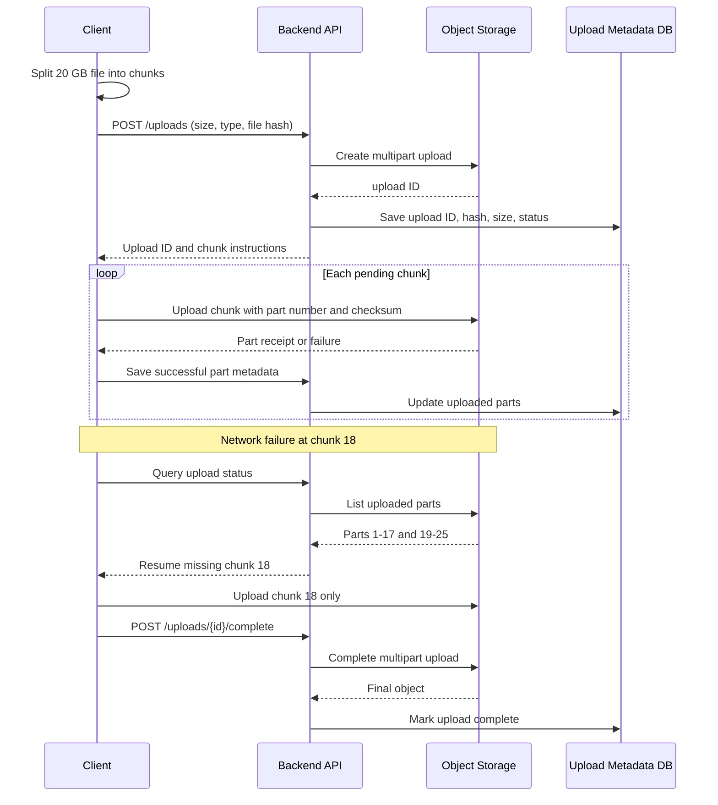

# Ways to Handle File Uploads

Study guide covering various strategies for receiving, buffering, and routing files in high-scale systems.

### The API Bottleneck Problem
In legacy systems, files are uploaded from the client browser, through the API Gateway, to the backend application, which then streams them to S3.
* **Why this is an anti-pattern at scale:** Streaming heavy files (e.g., 500MB videos or batches of 20MB PDFs) consumes massive backend CPU cycles, exhausts RAM buffers, hogs network bandwidth, and keeps HTTP connection threads open for seconds to minutes, starving other lightweight API requests.

### The Direct-to-S3 Presigned URL Pattern
Instead of routing heavy files through your API, allow the client to upload files **directly to the cloud storage bucket (S3)** using a temporary, cryptographically signed write URL generated by the backend.

```
  Client Browser                      Backend API                     Cloud Storage (S3)
        │                                  │                                   │
        ├─── 1. POST /media/upload ───────>│                                   │
        │    (Filename, content_type, size)│                                   │
        │                                  │ (Validates request, computes      │
        │                                  │  S3 AWS v4 HMAC signature)        │
        │◄── 2. Return Presigned PUT URL ──┤                                   │
        │                                  │                                   │
        ├─── 3. Direct HTTP PUT ──────────────────────────────────────────────>│
        │    (Binary stream of file payload)                                   │ (Enforces size limits &
        │                                                                      │  saves file in private bucket)
        │◄── 4. 200 OK / AWS S3 ETag ──────────────────────────────────────────┤
        │                                  │                                   │
        ├─── 5. POST /media/confirm ──────>│                                   │
        │    (Informs backend of success)  │                                   │
        │                                  │ (Saves metadata to database)      │
        │◄── 6. 201 Created ───────────────┤                                   │
```

### Cryptographic Signature Calculation (AWS Signature Version 4)
The backend generates the presigned URL without hitting S3. It calculates a cryptographic signature locally using its AWS secret keys:
1. Construct a **Canonical Request** detailing the HTTP verb (`PUT`), the S3 path, query parameters (e.g., headers, credential metadata), and headers.
2. Generate a **String to Sign** combining the algorithm (`AWS4-HMAC-SHA256`), request date, and regional credential scope.
3. Derives a **Signing Key** sequentially using HMAC-SHA256:
   $$\text{Key} = \text{HMAC}(\text{HMAC}(\text{HMAC}(\text{HMAC}(\text{"AWS4" + Secret}, \text{Date}), \text{Region}), \text{Service}), \text{"aws4_request"})$$
4. Compute the final signature:
   $$\text{Signature} = \text{HMAC-SHA256}(\text{Signing Key}, \text{String to Sign})$$
5. Append the signature as a query parameter to S3's endpoint URL.

### Security Configurations:
* **Time-to-Live (TTL) Restrictions:** Set S3 presigned write URLs to expire in **5 to 15 minutes**.
* **Content-Type & Size Enforcement:** Ensure the signature mandates the exact `Content-Type` header (e.g., `image/png`). When S3 receives the client's `PUT` request, it rejects the write if the header does not match the signature.
* **CORS Policies:** Configure S3's Cross-Origin Resource Sharing rules to strictly restrict direct `PUT` uploads to your verified client domains.

---

## Multipart Uploads & Large Files

When handling very large files (e.g., 500MB to 50GB), standard HTTP uploads fail due to connection timeouts or memory exhaustion.

### A. Multipart Chunked Uploads
* **The Mechanism:** Split the heavy file into multiple smaller chunks (typically 5MB to 10MB each) on the client side.
* **The Execution Flow:**
  1. The client requests a Multipart Session from S3 via the backend API.
  2. S3 returns a `UploadID` and a list of presigned URLs—**one presigned URL per chunk index**.
  3. The client uploads all chunks to S3 **in parallel**.
  4. If a single chunk upload fails (due to a network dropout), the client only retries that specific chunk, rather than restarting the entire 500MB upload.
  5. Once all chunks are uploaded, the client sends a "Complete Multipart Upload" request to the backend, which commands S3 to merge all chunks atomically into a single object in the bucket.

### B. Memory-Efficient Backend Streaming (Node.js/Go)
If files *must* be routed through your backend (e.g., for complex real-time parsing or legacy hosting limits), **never buffer the entire file into memory (RAM)**.
* **Anti-Pattern:** Reading the entire multipart body into memory (`ioutil.ReadAll` or Node's `fs.readFileSync`), which instantly exhausts application memory under concurrent requests.
* **Production Pattern (Stream Pipelines):** Use chunked stream pipelines to pipe the incoming network socket buffer directly to the target storage destination, keeping memory usage constant at a tiny 32KB buffer:
  ```go
  // Pipes incoming network payload directly to S3 without RAM buffering
  _, err := io.Copy(s3UploadStream, fileUploadRequestReader)
  ```

## Resumable Uploads for Large Files

### How can a user upload a 20 GB video without restarting after a network failure?

Use a resumable multipart upload. The client splits the file into independent chunks, uploads each chunk separately, and stores upload progress. A network failure then affects only the current or failed chunk, not the complete file.



### Upload flow

1. **Create an upload session.** The client sends file size, content type, chunk size, and a content hash. The backend authenticates the user, validates limits, creates a storage multipart session, and returns an opaque upload ID or UUID.
2. **Split the file on the client.** Read the file as ranges instead of loading the 20 GB file into memory. Use a chunk size suited to the storage provider and network, commonly 5–100 MB.
3. **Upload chunks independently.** Send each chunk with an upload ID, part number, byte range, and checksum. Upload several chunks in parallel, but cap concurrency to avoid exhausting browser, network, or storage limits.
4. **Record successful parts.** Store part number, size, checksum, storage ETag, and upload timestamp. Make part writes idempotent so retrying the same part does not create duplicate logical data.
5. **Retry only failed parts.** If chunk 18 fails, retry chunk 18. Do not resend chunks already confirmed by storage.
6. **Resume after reconnect.** The client sends the upload ID and file identity to the backend. The backend verifies ownership and returns the confirmed parts. The client compares them with its local file and uploads only missing or invalid parts.
7. **Complete atomically.** After every expected part is present and validated, the backend asks object storage to assemble the final object in part-number order. Mark the database record complete only after storage confirms success.

### Important design details

- **File identity:** Use a stable content hash to detect whether a resumed file is the same local file. MD5 can identify accidental changes, but use SHA-256 or provider checksums when integrity or security matters. Never use a client-provided hash as proof of authorization.
- **Upload ownership:** Treat upload IDs as capabilities. Require authentication, check user or tenant ownership on every status, part, and completion request, and do not expose another user's upload state.
- **Integrity:** Validate each chunk checksum before accepting it. Validate final size and final checksum before publishing the object.
- **Ordering:** Chunks may upload in parallel, but completion must provide the correct part-number order.
- **Progress:** Calculate progress from confirmed bytes, not request start events. Persist progress server-side so another browser tab or device can resume safely when supported.
- **Expiration and cleanup:** Set an inactivity timeout. Abort incomplete multipart uploads after a defined period, such as 24 hours, and run lifecycle cleanup for abandoned sessions and metadata.
- **Concurrency and limits:** Enforce maximum file size, chunk count, active uploads, per-user rate, and per-IP rate. Limit parallel chunks to protect the client and storage service.
- **Publish state:** Keep incomplete objects private and hidden from consumers. Publish only after completion, malware scanning, metadata validation, and authorization checks finish.
- **Crash recovery:** Treat object storage as the source of truth for uploaded parts. After backend restart, rebuild status by listing parts instead of trusting only an in-memory progress counter.

### Minimal upload state

```text
Upload {
  id
  owner_id
  storage_upload_id
  file_hash
  file_size
  chunk_size
  expected_chunk_count
  uploaded_parts: [{ number, size, checksum, etag }]
  status: initiated | uploading | completing | completed | aborted | expired
  expires_at
}
```

## 3. Popular Interview Questions & High-Impact Answers

### Q1: Why is uploading files directly to S3 via presigned URLs better than routing them through your API gateway, and how do you implement it securely?

**Answer:** Routing heavy file uploads through your API gateway is a scaling bottleneck: it consumes web server memory buffers, network bandwidth, and connection pools for long periods. Direct-to-S3 uploading offloads file traffic, buffering, and long-lived connections to cloud storage.

To implement it securely, the backend validates authorization, file size, and content type, then generates a short-lived S3 presigned URL with strict HMAC-SHA256 signature constraints. S3 enforces the signed request parameters during upload.

### Q2: Why not upload the 20 GB file as one HTTP request?

**Answer:** One request has a large failure domain. A timeout, connection reset, proxy limit, browser suspension, or server restart forces the client to restart the entire transfer. Multipart upload bounds the retry cost to one chunk and lets storage track progress independently.

### Q3: Should chunks upload sequentially or in parallel?

**Answer:** Use bounded parallelism. Sequential upload is simple and uses less memory, but wastes available bandwidth. Parallel upload improves throughput, while unlimited concurrency causes memory pressure, throttling, congestion, and more failed requests. Start with a small limit, such as 3–8 chunks, and tune it using measurements.

### Q4: Is MD5 enough to verify a resumed upload?

**Answer:** MD5 is useful for detecting whether the local file changed, but it is not collision-resistant and should not be the only integrity or security control. Use SHA-256 or storage-provider checksums for stronger verification, and validate authorization separately from file identity.

### Q5: What happens when the backend crashes during upload?

**Answer:** Keep upload metadata durable, but do not rely on metadata alone. On resume, authenticate the owner, query object storage for confirmed parts, reconcile the result with the database, and continue missing parts. A background job should abort sessions that remain inactive past their expiry.

### Q6: How do you prevent abandoned uploads from consuming storage?

**Answer:** Give every session an expiry time, refresh it only while authorized activity continues, abort expired multipart sessions, delete related metadata, and configure object-storage lifecycle rules as a second cleanup layer.
