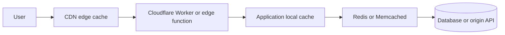
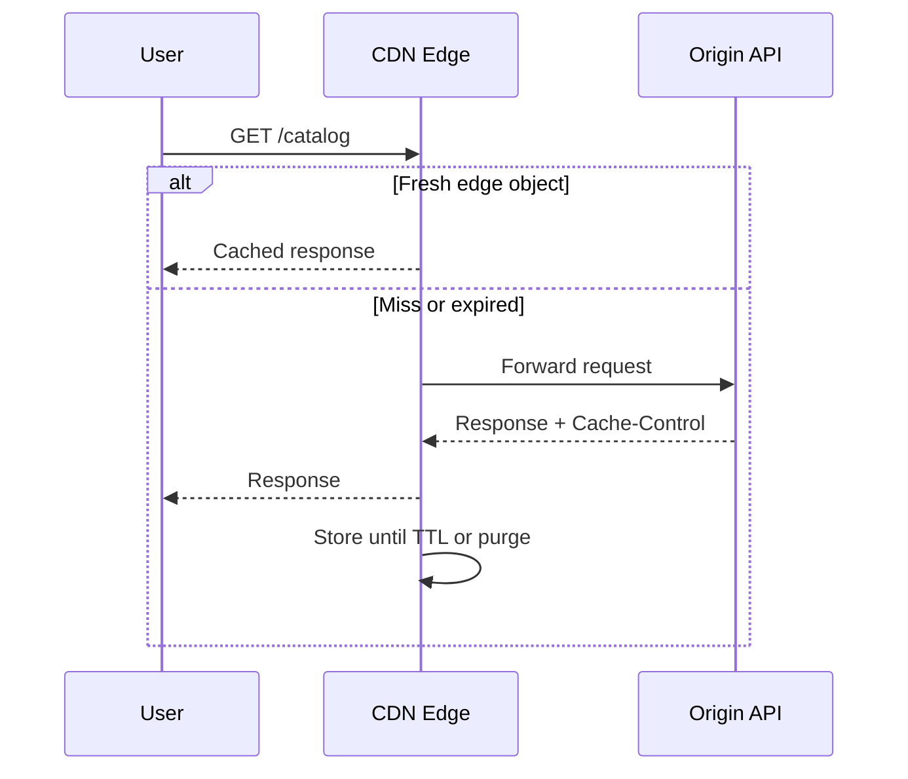
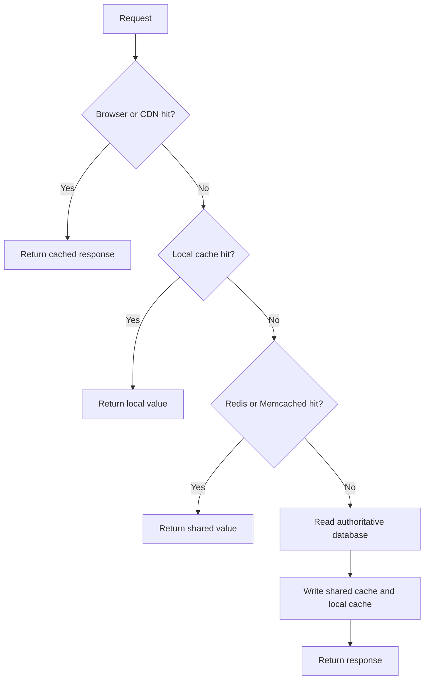
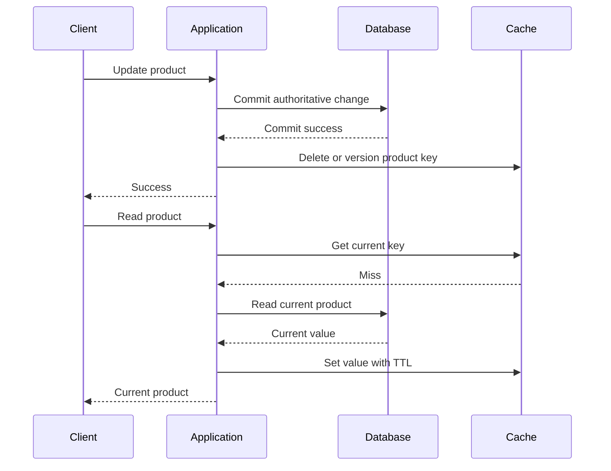

# Fundamentals

## Subcategories

- [Distributed Cache](./distributed-cache/index.md)
- [Local Cache](./local-cache/index.md)

## Cache Layers: CDN, Edge, Application, and Distributed Cache

A cache stores reusable data closer to its reader so requests avoid origin work. Each layer trades freshness, cost, control, and latency differently. Production systems usually combine layers.



### 1. CDN and HTTP edge cache

CDN caches store HTTP responses at geographically distributed edge points. Examples: Cloudflare CDN, CloudFront, Fastly, and Akamai.

**Good for:** public images, video, JavaScript, CSS, fonts, downloads, and safely cacheable public API responses.

**Pros:**

- Closest cache layer to users.
- Absorbs traffic spikes and bandwidth.
- Reduces origin CPU, database load, and connection count.
- Provides TLS, compression, and DDoS protection in many products.

**Cons:**

- Purge and invalidation can be difficult.
- Bad cache headers or keys can expose private data.
- Cookies, query strings, and authorization headers need careful handling.
- Provider bandwidth, request, and purge charges can grow quickly.



Use `Cache-Control`, `ETag`, `Last-Modified`, `Vary`, explicit purge, or versioned URLs. Never cache private responses without proven cache-key and authorization isolation.

### 2. Cloudflare Worker or edge-function cache

Edge functions execute logic near users. A Cloudflare Worker can normalize cache keys, route requests, apply bounded decisions, read or write edge cache, and fetch origin data.

**Good for:** custom keys, geo or language routing, lightweight personalization, stale-while-revalidate, cache shielding, and edge authentication decisions.

**Pros:** programmable edge behavior, lower origin load, lower global latency, combined routing and caching.

**Cons:** runtime limits, provider coupling, distributed debugging, provider-specific invalidation, and serious data-leak risk from incorrect keys.

Keep complex transactions and authoritative writes in backend services.

### 3. Application local cache

Local cache stores data in one application instance's memory.

**Good for:** configuration, feature flags, schemas, public metadata, hot immutable objects, and short-TTL read-mostly values.

**Pros:** fastest server-side cache, no network cost, simple lookup.

**Cons:** per-instance copies can disagree, restart removes data, memory competes with application heap, and cross-instance invalidation needs pub/sub, versioning, or short TTL.

Use bounded size, TTL, LRU or LFU eviction, and maximum value size. Local cache optimizes source of truth; it should not become source of truth for important business state.

### 4. Distributed cache: Redis or Memcached

Distributed caches are shared by all application instances.

**Redis good for:** shared object and query-result cache, sessions, rate limits, counters, sorted sets, and atomic short-lived workflows.

**Memcached good for:** simple disposable key-value blobs where persistence and rich data structures are unnecessary.

**Pros:**

- Shared state across instances.
- Larger capacity than one application heap.
- Central TTL, eviction, metrics, and invalidation.
- Redis provides atomic operations and rich structures.

**Cons:**

- Network latency and connection-pool cost.
- Cache outage or overload can affect every application instance.
- Memory, replicas, shards, requests, and egress cost money.
- Serialization and large values consume CPU and bandwidth.
- Stale data, stampedes, hot keys, and invalidation bugs remain possible.

Use cache-aside by default:

```text
read key from cache
if hit:
    return cached value
read authoritative value from database
write value to cache with bounded TTL
return value
```

For writes:

```text
commit database change
invalidate or version cache key
publish invalidation when other instances need fast convergence
```

Do not make Redis the only source of truth for money, permissions, orders, or durable workflow state without explicit durability and recovery design.

### 5. Database buffer pool and query cache

Databases automatically cache table pages, indexes, execution metadata, and sometimes prepared plans.

**Pros:** database remains source of truth, no separate invalidation protocol, natural transaction visibility.

**Cons:** query parsing, planning, joins, authorization, and serialization still cost work; a working set larger than memory causes I/O; database cache cannot stop query-volume explosions.

Optimize SQL and indexes before adding another cache.

### 6. Browser and client cache

Browsers, mobile clients, SDKs, and local storage can cache responses or assets.

**Good for:** versioned static assets, safe preferences, and offline data where stale state is acceptable.

**Risks:** server cannot immediately invalidate every client, sensitive data can remain on devices, and cached client data must never bypass server authorization.

Use immutable asset names such as `app.8f31.js` with long lifetimes. Use short TTL or revalidation for mutable resources.

### 7. Layer comparison

| Layer | Latency | Shared | Best data | Main risk |
| --- | --- | --- | --- | --- |
| Browser/client | Lowest after first read | One client | Static assets, safe preferences | Stale or sensitive local data |
| CDN | Very low | Global edge | Public HTTP responses and assets | Purge, key, privacy mistakes |
| Edge Worker | Low | Provider edge | Custom routing and bounded logic | Runtime limits, vendor coupling |
| Local application | Lowest server-side | No | Hot small values, config | Inconsistency, memory use |
| Redis | Low network latency | Yes | Shared ephemeral state | Cost, hot keys, outage |
| Memcached | Low network latency | Yes | Disposable blobs | Few data structures |
| Database buffer pool | Internal DB latency | Per DB node | Table and index pages | Does not remove query work |
| Origin database | Highest | Authoritative | Durable business state | CPU, locks, I/O, connections |

### 8. Which cache should you use?

Use CDN for public HTTP responses and static assets where global network distance dominates latency.

Use edge-function cache when custom key logic, routing, lightweight transformation, or edge decisions are required.

Use local cache when data is small, hot, read-mostly, and brief per-instance staleness is safe.

Use Redis when many instances need shared values, atomic counters, sessions, rate limits, or rich structures.

Use Memcached when values are disposable strings or blobs and simple shared caching is enough.

Use database caching and query optimization when consistency is strict or invalidation is harder than query cost.



### 9. Cache correctness patterns

#### Cache-aside

Application reads cache first and loads origin on miss. Simple, but concurrent misses can stampede. Add request coalescing, jittered TTL, stale-while-revalidate, or per-key coordination.

#### Read-through

Cache library loads missing values automatically. Less repeated code, but cache behavior becomes coupled to data source and can hide expensive misses.

#### Write-through

Application writes cache and origin together. Reads are fresh after success, but write latency and failure coordination increase.

#### Write-behind

Application writes cache first and persists asynchronously. Fast, but crash, ordering, and data-loss risks make it unsuitable for authoritative money or inventory without durable logs and reconciliation.

#### Refresh-ahead

Cache refreshes popular keys before expiry. Good for predictable hot keys, but can waste origin work for values no longer requested.

### 10. TTL, invalidation, and stampede control

- Set TTL from business freshness requirements.
- Add random TTL jitter so many keys do not expire together.
- Version keys or explicitly invalidate after writes.
- Serve stale data while one request refreshes when allowed.
- Coalesce concurrent misses for one key.
- Add short-lived negative caching for repeated not-found results.
- Limit value size and compress only when CPU cost is acceptable.
- Track hit rate, miss rate, stale age, eviction rate, hot keys, latency, origin load, and cache errors.
- Fail open to origin only when origin can tolerate extra load.

Invalidate after database commit:



Invalidating before commit can expose old data after failed writes; updating cache before commit can expose data that never became durable.

## 11. Popular Interview Questions & High-Impact Answers

### Q1: Why use multiple cache layers instead of Redis alone?

**Answer:** Each layer removes different cost. Browser and CDN avoid origin requests, local cache avoids Redis network latency, Redis shares values across instances, and the database remains authoritative. Multiple layers reduce latency and origin load, but require explicit freshness and invalidation rules.

### Q2: When should you use a CDN instead of Redis?

**Answer:** Use a CDN for public HTTP responses and static assets where global distance dominates latency. Use Redis for application-internal shared state, private objects, counters, sessions, or data needing application-level atomic operations. A CDN must never serve one user's private response to another through a bad cache key.

### Q3: What is difference between Cloudflare Worker cache and normal CDN cache?

**Answer:** Normal CDN cache stores responses using provider HTTP rules. A Worker adds programmable logic for key normalization, routing, bounded authorization decisions, response transformation, and stale-while-revalidate. Worker execution adds limits and provider coupling, so complex business transactions stay in backend.

### Q4: When is local cache better than Redis?

**Answer:** Local cache is better for very hot, small, read-mostly values where brief per-instance staleness is safe. It removes network and Redis cost. Redis is better when all instances need shared values or consistency must converge quickly.

### Q5: What happens when cache and database disagree?

**Answer:** Treat database as source of truth. After writes, commit database first, then invalidate or version cache. For critical workflows, never trust cached authorization, balance, inventory, or payment state without authoritative validation.

### Q6: How do you prevent cache stampede?

**Answer:** Coalesce concurrent misses per key, use jittered TTLs, refresh hot keys before expiry, serve stale data while one request refreshes, and rate-limit origin load. Distributed locks can coordinate instances, but lock expiry and failure behavior must be safe.

### Q7: Why can high cache hit rate still hide slow system?

**Answer:** Misses can be expensive, one hot key can overload origin, values can be oversized, serialization can be slow, or cache requests can wait on a saturated connection pool. Measure p95/p99 latency, miss cost, origin CPU, value size, hot-key distribution, and cache errors.

### Q8: Should cache update happen before or after database write?

**Answer:** For cache-aside writes, commit database first, then invalidate or update cache. Writing cache first can expose data that later rolls back. Write-behind needs durable queue or log, ordering, retries, reconciliation, and explicit data-loss behavior.

### Q9: Is Redis a database?

**Answer:** Redis can persist data and provide database-like structures, but authoritative use requires deliberate durability, replication, recovery, consistency, and backup design. For ordinary cache use, treat Redis data as disposable and keep durable business truth in database.

### Q10: How do you choose cache TTL?

**Answer:** Start from maximum acceptable staleness and invalidation capability. Use short TTL for volatile or permission-sensitive data, longer TTL for stable metadata, and immutable versioned URLs for assets. Add jitter, measure stale age and origin load, then tune.
