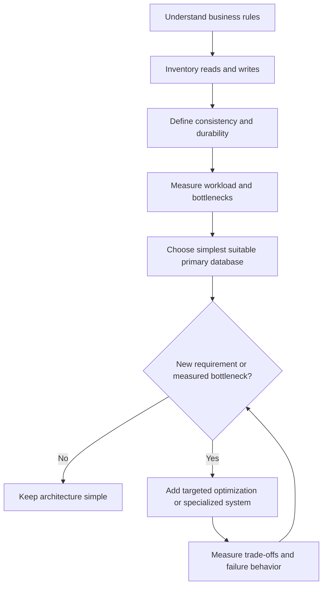
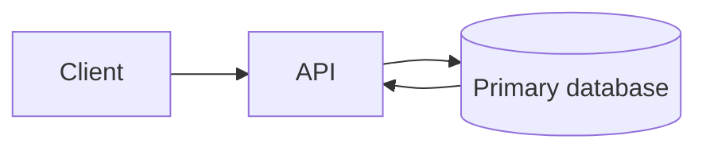
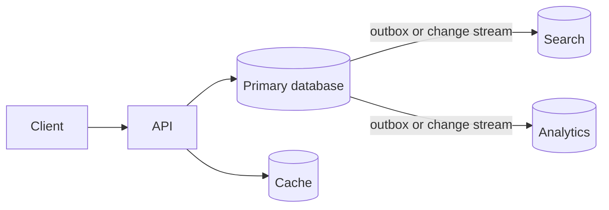

# Choosing a Database and Data Architecture

Choosing a database starts with understanding the business, not comparing feature
lists. First understand what the application must do with data, which business
rules must always remain true, what workload the system has, and what the team
can operate reliably.

Choosing a database and designing a data architecture are related but different
decisions. An application may start with one primary database and later add a
cache, search engine, analytics platform, or replica when a demonstrated
requirement justifies the added complexity.



## 1. Start with Access Patterns, Not Data Labels

Do not begin with:

> Which database should store this data?

Begin with:

> What does the application need to do with this data?

Write down important reads and writes before selecting a database:

- Which fields identify a lookup?
- Which fields must be filtered, sorted, or searched?
- Are records read individually or in large ranges?
- Are relationships joined across several entities?
- Are writes inserts, updates, counters, batches, or append-only events?
- Does one request need atomic changes across multiple records?
- What are the expected read and write rates?
- What is the largest acceptable result size and latency?

### E-commerce example

An e-commerce system may contain customers, orders, order items, products,
payments, and inventory. Typical operations include:

```sql
-- Order history for one customer.
SELECT id, status, total_amount, created_at
FROM orders
WHERE customer_id = 42
ORDER BY created_at DESC
LIMIT 20;

-- Products inside one order.
SELECT oi.quantity, p.sku, p.name
FROM order_items AS oi
JOIN products AS p ON p.id = oi.product_id
WHERE oi.order_id = 1001;

-- Inventory that can be reserved.
UPDATE inventory
SET available_quantity = available_quantity - 1
WHERE product_id = 7
  AND available_quantity >= 1;
```

These queries involve relationships, filtering, ordering, and atomic
conditions. A relational database such as PostgreSQL fits naturally because
joins, constraints, indexes, and transactions are central to the workload.

### Session-service example

A session service may mostly execute:

```text
get session by user_id
replace session by session_id
expire session after a TTL
```

This is a key-value access pattern. A key-value store may fit better than a
relational schema if the service does not need joins, complex filtering, or
multi-record transactions.

Both systems store data. Their access patterns differ. Choose based on how the
application accesses data, not only on whether the data looks like a document,
row, or key-value pair.

## 2. Define Consistency Per Business Rule

Do not label an entire application simply "strongly consistent" or
"eventually consistent." Different operations can have different correctness
requirements.

Ask:

> Which business rule must always remain true?

For e-commerce:

| Data or operation | Incorrect or stale result | Typical requirement |
| --- | --- | --- |
| Inventory reservation | Two customers buy the last item | Transactional update and strong invariant |
| Payment capture | Customer charged incorrectly | Idempotency, durable records, reconciliation |
| Checkout state | Order and payment disagree | Atomic local state transition and explicit workflow |
| Product search | New product appears seconds later | Eventual consistency often acceptable |
| Recommendations | Older suggestions shown | Eventual consistency acceptable |
| Analytics dashboard | Recent events arrive later | Batch or streaming eventual consistency |
| Session expiration | Session remains briefly after logout | Depends on security and product requirements |

For critical operations, define the invariant explicitly:

```text
available_quantity >= 0
one payment attempt has one provider idempotency key
one order cannot be captured twice
order total equals the recorded line-item total
```

Then select transactions, constraints, conditional updates, idempotency keys,
and reconciliation workflows that protect those invariants.

Less critical projections can update asynchronously:

```text
primary database
    -> outbox or change stream
    -> search index
    -> recommendation data
    -> analytics platform
```

Asynchronous systems need duplicate handling, retries, lag monitoring, and a
way to rebuild derived data.

## 3. Find the Bottleneck Before Replacing the Database

When one feature is slow, a different database may help, but it should not be
the first assumption. Investigate the evidence:

- Inspect the slow query plan.
- Check whether required indexes exist and are selective.
- Find full scans over large tables.
- Detect inefficient joins, nested queries, and N+1 application calls.
- Check whether the API returns more rows or columns than needed.
- Measure serialization, network, and response-body size.
- Check cache hit rate and invalidation behavior.
- Check connection-pool size, queueing, and transaction duration.
- Measure lock waits, deadlocks, replication lag, and storage latency.

Common fixes include a better index, a narrower query, pagination, batching,
connection-pool tuning, caching, a read replica, or a schema change. A new
database does not remove the original workload mistake; it introduces another
system with its own failure modes and operational cost.

Use measurements from realistic parallel traffic. Average latency hides slow
requests:

- **P50:** 50% of requests are at or below this latency; the median.
- **P95:** 95% of requests are at or below this latency; 5% are slower.
- **P99:** 99% of requests are at or below this latency; 1% are slower.

P95 and P99 expose queueing, lock contention, cache misses, noisy neighbors,
and tail behavior that an average can hide.

## 4. Define Which Kind of Scale Is Failing

"The application must scale" is not a complete requirement. Identify the
dimension that is under pressure:

| Problem | Possible first responses |
| --- | --- |
| Read throughput | Better indexes, query changes, caching, read replicas |
| Write throughput | Batch writes, shorter transactions, partitioning, workload separation |
| Large dataset | Partitioning, archival, tiered storage, data lifecycle policies |
| Traffic spikes | Admission control, queues, autoscaling, caching, capacity planning |
| Large analytical queries | Read-optimized replica, warehouse, lakehouse, precomputed aggregates |
| Multi-region access | Regional reads, replication, partition ownership, conflict policy |
| High availability | Replication, failover, tested recovery, multi-zone deployment |
| Hot key or hot row | Key redesign, sharding, write aggregation, contention reduction |

Ask:

> How does this database scale for this workload, and what complexity can the
> team operate?

Every scale strategy trades something: consistency, latency, cost, query
flexibility, operational effort, or failure recovery.

## 5. Choose Architecture Only When a Requirement Demands It

The primary database is usually the source of truth. Other systems should have
a clear purpose:

| System | Solves | Costs or risks |
| --- | --- | --- |
| Cache | Lower repeated-read latency and primary load | Stale data, invalidation, eviction, cache stampede |
| Search engine | Full-text search, relevance, faceting | Index lag, rebuilds, mapping changes, extra operations |
| Read replica | More read capacity and isolation | Replication lag, read-after-write problems, failover complexity |
| Analytics platform | Large scans, aggregations, historical analysis | Data pipelines, freshness lag, separate access control |
| Queue or stream | Smoothing spikes and asynchronous work | Retries, duplicates, ordering limits, consumer lag |
| Object storage | Cheap durable blobs and archives | Different access model, metadata coordination |

Do not introduce every component on day one. Start with the simplest design
that satisfies current requirements:



Evolve only when evidence shows a problem:



For the e-commerce example, orders, payments, and inventory may remain on the
primary database. Search and recommendations can tolerate delay, so they can be
derived asynchronously. Analytics should not compete with checkout queries for
the same resources.

For each additional system, answer:

1. What measured problem does it solve?
2. What data is authoritative?
3. How much staleness is acceptable?
4. How are retries and duplicates handled?
5. How is derived data rebuilt?
6. What happens when the system is unavailable?
7. Who monitors and operates it?

## 6. Balance Speed, Durability, and Recovery

Low latency does not imply durable or correct storage. For every storage
system, ask:

> What happens if all data in this system disappears?

A cache may be disposable when it can be repopulated from durable storage.
Customer orders, payment records, and inventory history cannot be treated as
rebuildable cache entries.

Evaluate:

- Durability guarantees and acknowledged-write behavior.
- Backup frequency and retention.
- Point-in-time recovery.
- Replication mode and replication lag.
- Recovery Point Objective (RPO): maximum acceptable data loss.
- Recovery Time Objective (RTO): maximum acceptable recovery duration.
- Restore time for the actual dataset size.
- Behavior during partial failure and network partition.
- Whether derived data can be rebuilt from an authoritative source.

Fast in-memory storage is useful for speed. Durable storage protects business
records. They solve different problems.

## 7. Include Operations in the Database Decision

Database selection is also an operations decision. Someone must handle:

- Backups and restore tests.
- Monitoring, alerting, and capacity planning.
- Failover and replica health.
- Upgrades, patches, and schema changes.
- Access control, encryption, and audit requirements.
- Incident response and data repair.
- Cost changes as traffic and storage grow.

Managed database services can reduce infrastructure work, but they do not
remove responsibility. The team still needs to understand schema design,
queries, permissions, limits, pricing, backups, and failure behavior.

The cheapest database infrastructure may be more expensive overall if it
requires substantial manual operation. Include engineering time, incident
risk, and recovery effort in the cost.

Do not stop at "backups exist." Verify that restoration works. Do not stop at
"automatic failover exists." Test failover and application reconnect behavior.
Do not test only healthy systems; test the behavior that matters during
failure.

## 8. Database Choice Is a Trade-off

No database is best for every workload:

| Choice | Strengths | Trade-offs |
| --- | --- | --- |
| Relational database | Transactions, constraints, joins, mature SQL, flexible queries | Vertical limits, coordination cost, careful scaling required |
| Document database | Aggregate-oriented records, flexible schema, horizontal scale options | Cross-document transactions and joins may be harder; duplicated data needs consistency strategy |
| Key-value database | Predictable key lookups, high throughput, simple operations | Query flexibility and relationship traversal are limited |
| Wide-column database | Large distributed write workloads and predictable access paths | Data modeling is query-driven; ad hoc queries are costly |
| Search engine | Text search, ranking, filtering, faceting | Not usually the source of truth; refresh lag and operational complexity |
| Analytical warehouse | Large scans, aggregations, historical analysis | Not designed for low-latency transactional mutation |
| In-memory store | Very low latency, TTLs, counters, ephemeral state | Memory cost, eviction, and durability limitations |

Choose the system that fits the workload, business rules, recovery needs, and
team capability. Do not choose the system with the longest feature list.

## 9. Practical Decision Checklist

Before choosing a database, document:

### Workload

- Important read queries and write operations.
- Lookup keys, filters, sort orders, joins, and aggregation needs.
- Expected average and peak read/write rates.
- Record size, dataset size, growth rate, and retention period.
- Transaction boundaries and contention points.

### Correctness

- Business invariants that must always hold.
- Operations allowed to be eventually consistent.
- Idempotency and duplicate-delivery behavior.
- Ordering requirements.
- Source of truth for each field.

### Scale and availability

- Read, write, storage, spike, regional, and availability requirements.
- RPO and RTO.
- Expected replication lag tolerance.
- Partitioning, sharding, or multi-region requirements.

### Operations

- Backup and restore process.
- Failover and upgrade process.
- Monitoring and alerting.
- Security and compliance requirements.
- Team expertise and managed-service options.
- Total cost at current and projected workload.

### Decision

Choose the simplest primary database that satisfies the documented requirements.
Record rejected alternatives and their trade-offs. Add cache, search,
replicas, queues, or analytics systems only when a concrete requirement or
measured bottleneck justifies them.

## Subcategories

- [SQL vs. NoSQL Relational Trade-offs](./sql-vs-nosql/index.md)
- [Advanced DB Patterns (Saga, CDC, Outbox)](./advanced-pattern/index.md)
- [Vector Databases & Semantic Search](./vector/index.md)
- [NoSQL Databases](./no-sql/index.md)
  - [MongoDB Architecture](./no-sql/mongodb/index.md)
  - [OpenSearch & Search Relevance](./no-sql/opensearch-elasticsearch/index.md)
- [SQL Databases](./sql/index.md)
  - [SQL Indexing Internals](./sql/indexing/index.md)
  - [SQL Fundamentals & ACID](./sql/fundamentals/index.md)
  - [SQL Query Optimization](./sql/query-optimization/index.md)
  - [Database Storage Engines](./sql/storage-engine/index.md)
  - [SQL Scaling Replacements](./sql/scaling/index.md)
  - [SQL Sharding & Replication](./sql/sharding-replication/index.md)
  - [SQL Concurrency & Locks](./sql/concurrency/index.md)
  - [Database Data Modeling](./sql/data-modeling/index.md)
