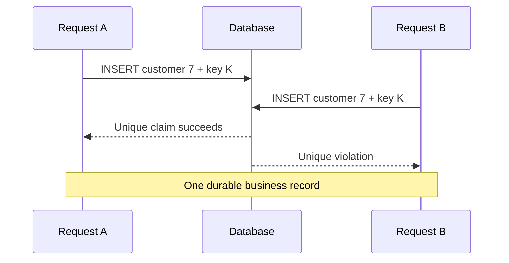
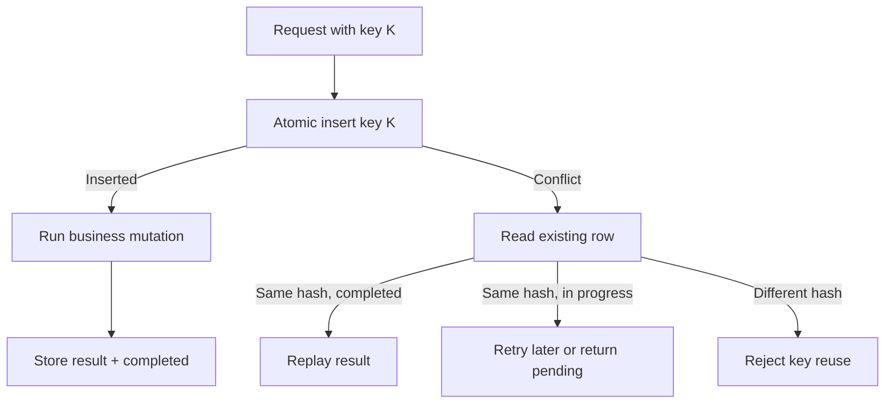
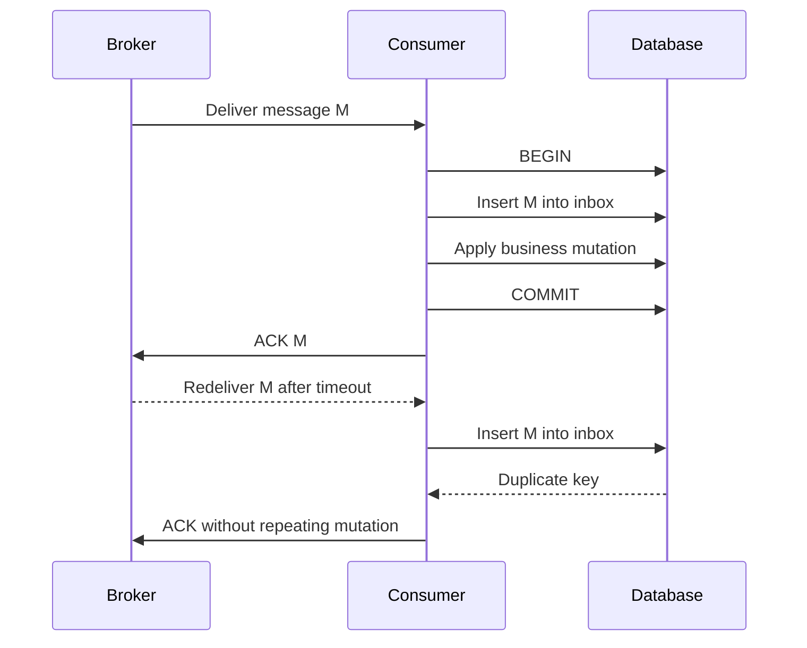
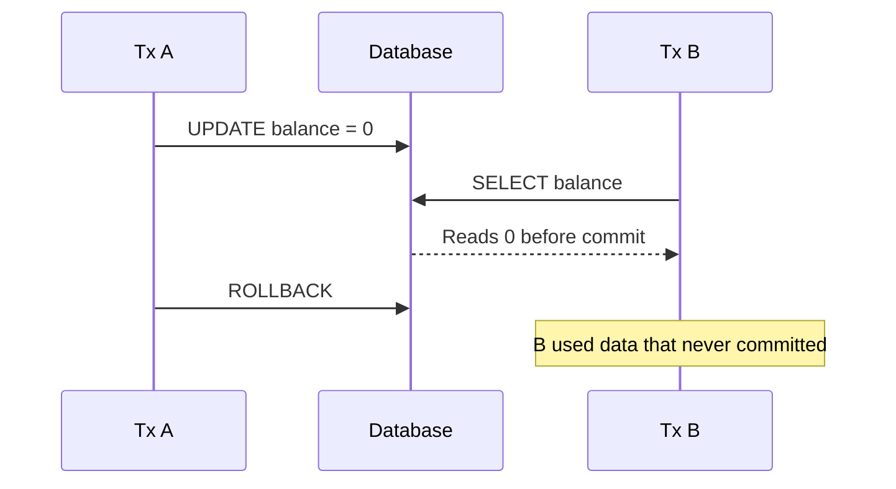
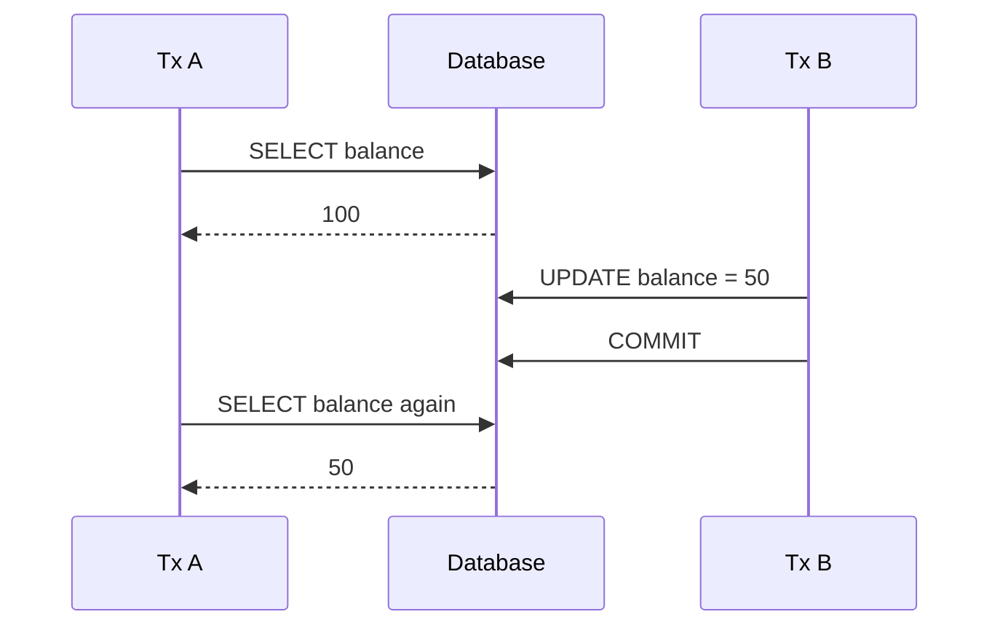
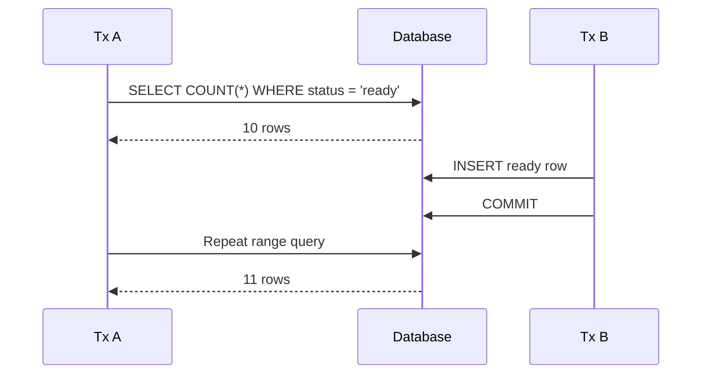
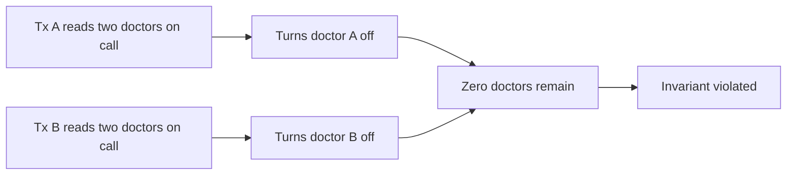
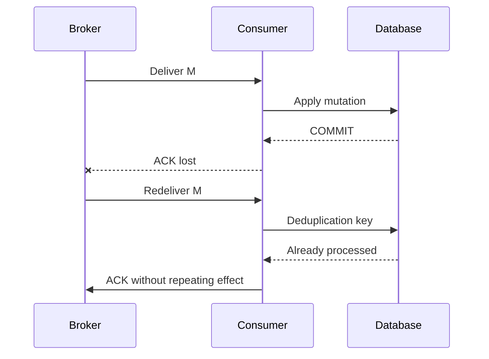
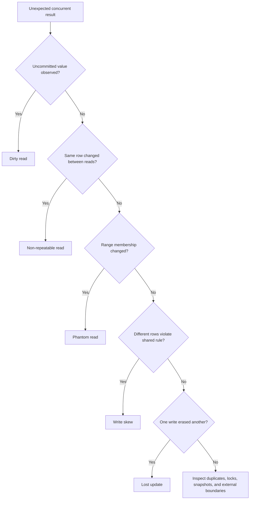
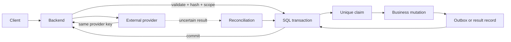

# SQL Concurrency, Locking & MVCC

Comprehensive study guide covering database locks, lock compatibility, transaction isolation levels, anomalies, Multi-Version Concurrency Control (MVCC) in PostgreSQL vs. InnoDB, and distributed locking.

Application-level retries, idempotency keys, queues, and external side effects are covered in the companion guide:

- [Backend Concurrency, Race Conditions, and Idempotency](../../../backend/concurrency-race-conditions/index.md)

This file focuses on durable database guarantees. Backend code still defines request behavior, retry policy, and reconciliation for work outside SQL.

---

## 1. Locking Primitives & Compatibility Matrix

To maintain data integrity under concurrent access, database engines utilize locks at different granularities (Row, Page, Table) and modes (Shared, Exclusive, Intent).

### Lock Modes
* **Shared (S) Lock**: Acquired for read operations (`SELECT`). Multiple transactions can hold S locks on the same resource simultaneously.
* **Exclusive (X) Lock**: Acquired for write operations (`INSERT`/`UPDATE`/`DELETE`). Only one transaction can hold an X lock, blocking all other reads and writes.
* **Intent Locks (IS / IX)**: Acquired at the table level before obtaining row-level S or X locks. They signal that a transaction holds or intends to acquire locks within that table, preventing table-wide lock modifications.

### Lock Compatibility Matrix

```
  Requested Mode │ Shared (S)      │ Exclusive (X) │ Intent Shared (IS) │ Intent Exclusive (IX)
  ───────────────┼─────────────────┼───────────────┼────────────────────┼──────────────────────
  Shared (S)     │    Compatible   │   BLOCKED     │     Compatible     │   BLOCKED
  Exclusive (X)  │    BLOCKED      │   BLOCKED     │     BLOCKED        │   BLOCKED
  Intent S (IS)  │    Compatible   │   BLOCKED     │     Compatible     │   Compatible
  Intent X (IX)  │    BLOCKED      │   BLOCKED     │     Compatible     │   Compatible
```

### Optimistic vs. Pessimistic Locking
* **Pessimistic Locking (`SELECT ... FOR UPDATE`)**: Explicitly locks target rows at the database level. Blocks concurrent writes until the transaction completes.
  - *Best Fit*: High-contention workloads where transaction collisions are highly frequent.
* **Optimistic Locking (Application-Level Version Check)**: Does not lock database rows. Instead, updates assert that the record's version has not changed:
  ```sql
  UPDATE orders SET status = 'shipped', version = 3 WHERE id = 101 AND version = 2;
  ```
  - *Best Fit*: Low-contention workloads; avoids locking overhead.

---

## 2. Transaction Isolation Levels & Anomalies

The SQL-92 standard defines four transaction isolation levels, which trade off performance (concurrency) for strict consistency.

### Concurrency Anomalies
1. **Dirty Read**: Transaction A reads data modified by Transaction B before B commits. If B rolls back, A's read is invalid.
2. **Non-Repeatable Read (Fuzzy Read)**: Transaction A reads a row. Transaction B updates that same row and commits. Transaction A re-reads the row and gets different values.
3. **Phantom Read**: Transaction A executes a range query (e.g., count orders $> \$100$). Transaction B inserts a **new** row within that range and commits. Transaction A re-runs the range query and sees "phantom" rows.
4. **Write Skew**: A serialization anomaly where two concurrent transactions read overlapping data sets, make decisions based on those reads, and make non-conflicting writes that violate a global business invariant (e.g., checking if total account balance $> 0$ before withdrawing).

### Isolation Level vs. Anomalies Matrix

```
  Isolation Level  │ Dirty Reads │ Non-Repeatable Reads │ Phantom Reads │ Write Skew
  ─────────────────┼─────────────┼──────────────────────┼───────────────┼─────────────
  Read Uncommitted │   Allowed   │       Allowed        │    Allowed    │   Allowed
  Read Committed   │  Prevented  │       Allowed        │    Allowed    │   Allowed
  Repeatable Read  │  Prevented  │      Prevented       │  Prevented*   │   Allowed
  Serializable     │  Prevented  │      Prevented       │   Prevented   │  Prevented
```
*\*Note: PostgreSQL/InnoDB Repeatable Read prevents Phantom Reads natively using MVCC visibility checks or Next-Key locking, which is stricter than the SQL-92 standard.*

---

## 3. Multi-Version Concurrency Control (MVCC)

Modern databases avoid using locks for simple read operations (following the principle: *"Readers do not block Writers, and Writers do not block Readers"*). They achieve this using **Multi-Version Concurrency Control (MVCC)**, maintaining multiple historical versions of individual rows concurrently.

```
                  PostgreSQL MVCC (Append-Only)
      ┌──────────────────────────────────────────────────┐
      │ Row (xmin=100, xmax=105) ──► Old Version (Dead)  │
      ├──────────────────────────────────────────────────┤
      │ Row (xmin=105, xmax=0)   ──► New Version (Live)  │  <-- Writes append new rows
      └──────────────────────────────────────────────────┘

                  MySQL InnoDB MVCC (Undo Log)
      ┌─────────────────────┐       Undo Logs (Rollback Segment)
      │ Row (Roll_Ptr) ─────┼─────► [Old Version xid=100]
      └─────────────────────┘
         ▲ (Live Row in Table)
```

### A. PostgreSQL MVCC (Append-Only Storage)
* **Mechanism**: Every `UPDATE` is physically written as a brand-new row insertion (`INSERT`) on disk. Old rows are kept in place and marked with system columns:
  - `xmin`: Transaction ID (XID) of the creator.
  - `xmax`: Transaction ID of the updater/deleter (0 if active/live).
* **Visibility**: A transaction reading at Read Committed isolation only sees row versions where `xmin` is committed and `xmax` is either uncommitted or belongs to an active transaction.
* **Garbage Collection (VACUUM)**: Because updates append new records, PostgreSQL accumulates dead rows over time (**Bloat**). A background daemon (**Auto-Vacuum**) must continuously scan tables to prune dead row versions and mark free space pointers as reusable.

### B. MySQL InnoDB MVCC (Rollback Segment / Undo Logs)
* **Mechanism**: InnoDB updates rows **in-place** in the actual tables. It stores historical row versions sequentially inside a separate append-only file called the **Undo Log** (or Rollback Segment).
* **Visibility**: Every row contains a `roll_ptr` pointer to its previous version in the Undo Log. When a transaction needs to read a historical snapshot, the engine traverses the undo chain backward to dynamically reconstruct the row version that matches the transaction's read view.
* **Garbage Collection**: Once no active transactions need a specific Undo Log version, background **Purge Threads** clean up the obsolete Undo records, avoiding database table bloat.

---

## 4. Deadlocks & Distributed Locking

### Deadlock Detection & Resolution
A deadlock occurs when two or more transactions form a circular blocking lock dependency (e.g., TxA locks Row 1 and waits for Row 2; TxB locks Row 2 and waits for Row 1).
* **Detection**: Engines run a background lock-monitor thread that analyzes the lock dependency graph (**Wait-For Graph**).
* **Resolution**: Upon finding a cycle, the engine selects the transaction that has written the least amount of WAL bytes as the "victim," forcibly terminates and rolls it back, releasing its locks so other transactions can proceed.

For prevention, debugging queries, retry rules, and production failure modes, see [Advanced SQL Transaction Deadlocks](../transaction/index.md#8-deadlocks-circular-waits-and-retryable-failures).

### Distributed Locking Patterns
When coordinating locks across separate, decoupled physical nodes, standard database locks cannot help. 
* **Redis Redlock**: Implements locking by acquiring locks with a TTL from a majority (e.g., 3 out of 5) of independent Redis nodes.
* **Database Leases / Fencing Tokens**: Acquires a lock with an auto-incrementing integer token (fencing token). During writes to shared storage, the storage engine rejects any write carrying a fencing token lower than the latest committed token, preventing late-arriving clients (due to GC pauses or network delays) from corrupting state.

---

## 5. Database-Level Duplication Control

Concurrency can duplicate rows, state transitions, financial effects, and messages. Database protection must make duplicate handling atomic and durable.

### 5.1 Unique constraints: first line of defense

Use a unique constraint when duplicate identity can be represented by columns:

```sql
CREATE TABLE orders (
    id BIGINT PRIMARY KEY,
    customer_id BIGINT NOT NULL,
    client_request_id TEXT NOT NULL,
    status TEXT NOT NULL,
    UNIQUE (customer_id, client_request_id)
);
```

Two concurrent inserts race safely:



Backend must catch the unique violation and return the existing resource or a conflict. Do not turn every unique violation into a generic `500`.

### 5.2 Atomic conditional updates

For counters, inventory, quotas, and state transitions, put condition and mutation in one statement:

```sql
UPDATE inventory
SET available = available - 1,
    reserved = reserved + 1
WHERE product_id = 42
  AND available > 0;
```

Interpret affected rows:

- `1`: mutation committed for this statement.
- `0`: row missing or invariant failed.

Unsafe pattern:

```text
SELECT available
check available > 0 in application
-- another transaction changes row
UPDATE inventory SET available = available - 1
```

The check and update have a race unless protected by a transaction lock or replaced with one atomic update.

### 5.3 Idempotency ledger

For retryable side effects, store request identity and result:

```sql
CREATE TABLE idempotency_keys (
    scope TEXT NOT NULL,
    key TEXT NOT NULL,
    request_hash TEXT NOT NULL,
    status TEXT NOT NULL CHECK (status IN ('in_progress', 'completed', 'failed')),
    response_code INTEGER,
    response_body JSONB,
    resource_type TEXT,
    resource_id TEXT,
    created_at TIMESTAMPTZ NOT NULL DEFAULT now(),
    completed_at TIMESTAMPTZ,
    PRIMARY KEY (scope, key)
);
```

Atomic claim:

```sql
INSERT INTO idempotency_keys (scope, key, request_hash, status)
VALUES ('payments:customer-7', 'req-123', 'sha256:abc...', 'in_progress')
ON CONFLICT (scope, key) DO NOTHING
RETURNING scope, key;
```

If no row returns, read existing record:



`request_hash` prevents one key from being reused for a different operation. Scope by tenant and operation to prevent unrelated key collisions.

### 5.4 Couple ledger and business mutation

For local database work, claim, mutation, and result must share one transaction:

```sql
BEGIN;

INSERT INTO idempotency_keys (scope, key, request_hash, status)
VALUES ('orders:customer-7', 'req-123', 'sha256:abc...', 'in_progress')
ON CONFLICT (scope, key) DO NOTHING;

-- Backend checks whether this transaction owns the new key.
INSERT INTO orders (id, customer_id, client_request_id, status)
VALUES (1001, 7, 'req-123', 'created');

UPDATE idempotency_keys
SET status = 'completed',
    resource_type = 'order',
    resource_id = '1001',
    response_code = 201,
    response_body = '{"order_id":1001}',
    completed_at = now()
WHERE scope = 'orders:customer-7'
  AND key = 'req-123';

COMMIT;
```

If business mutation commits but idempotency state does not, retry can duplicate operation. If idempotency state commits but business mutation does not, valid operation can be incorrectly suppressed.

### 5.5 Message inbox and duplicate delivery

At-least-once delivery requires durable inbox:

```sql
CREATE TABLE consumed_messages (
    consumer_name TEXT NOT NULL,
    message_id TEXT NOT NULL,
    received_at TIMESTAMPTZ NOT NULL DEFAULT now(),
    PRIMARY KEY (consumer_name, message_id)
);
```

Consume atomically:

```sql
BEGIN;

INSERT INTO consumed_messages (consumer_name, message_id)
VALUES ('billing-service', 'msg-987');

UPDATE invoices
SET paid = TRUE,
    paid_at = now()
WHERE id = 55;

COMMIT;
```

If message insertion conflicts, skip business mutation and acknowledge redelivery. Acknowledge only after successful commit.



### 5.6 State-transition duplication

Prevent repeated transitions with a predicate:

```sql
UPDATE shipments
SET status = 'shipped',
    shipped_at = now()
WHERE id = 9
  AND status = 'ready';
```

Only one concurrent worker can move `ready` to `shipped`. A second worker affects zero rows and must treat state as already transitioned or invalid.

### 5.7 Database guarantees versus application behavior

| Problem | SQL must guarantee | Backend must decide |
| --- | --- | --- |
| Duplicate create | Unique identity constraint | Replay resource or return conflict |
| Lost update | Version predicate or row lock | Map conflict to response and retry policy |
| Overselling | Atomic conditional update | Explain unavailable result |
| Duplicate message | Unique inbox key and atomic mutation | ACK timing and retry handling |
| Duplicate payment | Local ledger consistency | Provider key and status reconciliation |
| Deadlock | Detect and roll back victim | Retry complete operation |
| Stale idempotency key | Durable status and hash | Retention, expiry, and key-reuse response |
| Async workflow | Durable state and outbox | Pending API contract and polling/webhook |

SQL cannot undo an email, payment, HTTP call, or message already delivered outside its transaction.

### 5.8 Limitations of database-only duplication control

Database constraints do not solve:

- Duplicate external API calls.
- Lost client responses.
- Provider-side unknown outcomes.
- Cross-database atomicity.
- Queue acknowledgement timing.
- Business decision about replay versus conflict.
- Retention and privacy policy for stored responses.
- Duplicate work performed before a transaction starts.

Use outbox, provider idempotency, inbox, reconciliation, and backend workflow state around SQL boundaries.

## 6. Common Concurrency Anomalies: Symptoms, Diagnosis, and Prevention

Isolation level changes which anomalies can occur. An anomaly is not always a database error; it may be a valid-looking result that violates application expectations.

### 6.1 Dirty read

Transaction B reads data written by Transaction A before A commits:



**How to identify:**

- Read result contains a value later rolled back.
- Reports or decisions disagree with committed audit history.
- Transaction uses `READ UNCOMMITTED` or engine-specific dirty-read behavior.

**How to avoid:**

- Use `READ COMMITTED` or stronger.
- Do not use dirty reads for authorization, money, inventory, or billing.
- Verify ORM or connection-pool isolation settings; session settings can persist on reused connections.

### 6.2 Non-repeatable read

One transaction reads the same row twice and sees different committed values:



**How to identify:**

- Same transaction and same predicate return changed row values.
- First and second reads use different snapshots under `READ COMMITTED`.
- Application logs show one transaction ID with inconsistent reads.

**How to avoid:**

- Use `REPEATABLE READ` when one stable snapshot is required.
- Use `SELECT ... FOR UPDATE` when reading then changing the row.
- Use a version column when stale writes must be rejected.
- Keep transaction scope aligned with the full decision, not one query.

### 6.3 Phantom read

A range query sees new or removed matching rows during one logical operation:



**How to identify:**

- Repeated range query changes row count or set membership.
- Capacity or uniqueness rule fails even though each transaction saw valid rows.
- Query plan uses a broad range and isolation is `READ COMMITTED`.

**How to avoid:**

- Use `SERIALIZABLE` for cross-row invariants.
- Use database constraints when invariant can be modeled directly.
- Use range or predicate locks where supported.
- Prefer an atomic reservation statement over count-then-insert.
- Ensure range predicates have useful indexes; missing indexes can enlarge lock scope.

### 6.4 Lost update

Two writers read one version, then one overwrites the other's work:

```text
Tx A reads version 4
Tx B reads version 4
Tx A writes version 5
Tx B writes using stale version 4
```

**How to identify:**

- Update affects one row but a previous committed change disappears.
- Audit history shows writes based on the same old value.
- No version predicate or row lock exists.

**How to avoid:**

```sql
UPDATE documents
SET body = $1,
   version = version + 1
WHERE id = $2
 AND version = $3;
```

- Check affected-row count.
- Use `SELECT ... FOR UPDATE` for short, high-contention workflows.
- Use atomic arithmetic for counters instead of read-modify-write.

### 6.5 Write skew

Two transactions read the same business rule, then update different rows:



**How to identify:**

- Each transaction updates a different row, so row-level conflict logs look normal.
- Final state violates a rule involving a set or count.
- Reproduction requires concurrent transactions and often disappears in sequential tests.

**How to avoid:**

- Use `SERIALIZABLE` and retry serialization failures.
- Lock a shared sentinel row or all rows participating in the decision.
- Encode invariant as a constraint where possible.
- Redesign aggregate so conflicting decisions update one row.

### 6.6 Deadlock

Transactions wait in a cycle:


**How to identify:**

- Database returns deadlock error and rolls back a victim.
- Lock-wait graph contains a cycle.
- Request latency, rollback, and retry rates rise together.

**How to avoid:**

- Acquire rows in one deterministic order.
- Keep transactions short.
- Avoid external calls while holding locks.
- Add indexes for locking predicates.
- Bound batch size.
- Retry complete transaction with jitter.

Advanced handling belongs in [transaction deadlock guide](../transaction/index.md#8-deadlocks-circular-waits-and-retryable-failures).

### 6.7 Lock wait and lock timeout

A transaction can wait for a lock without a cycle:

```text
Tx A holds Row 1 for 30 seconds
Tx B waits for Row 1
Tx B reaches lock timeout
```

**How to identify:**

- Wait event indicates lock contention, but no circular dependency exists.
- Long-running transaction owns the blocking lock.
- Timeout rate increases during reports, batch jobs, or traffic spikes.

**How to avoid:**

- Find and shorten blocking transaction.
- Set transaction and lock timeouts appropriate to endpoint SLA.
- Separate analytical work from hot OLTP tables.
- Do not blindly increase timeout; this can exhaust connection pools.

### 6.8 Serialization failure

Under `SERIALIZABLE`, the database may reject a transaction that cannot be placed into a safe serial order:

```text
Tx A reads shared state
Tx B reads shared state
Both write dependent state
Database detects unsafe dependency
One transaction rolls back with serialization failure
```

**How to identify:**

- SQLSTATE commonly `40001`, depending on engine and driver.
- Rollbacks occur only at stronger isolation.
- Failure disappears when concurrency is removed.

**How to avoid:**

- Retry complete transaction with bounded exponential backoff and jitter.
- Reduce transaction duration and read set.
- Add indexes and narrow predicates.
- Use serializable isolation only for invariants that need it.

### 6.9 Duplicate key and unique-constraint violation

Two requests claim one business identity. The database lets one claim succeed and rejects the other:

```text
Tx A inserts (customer_id = 7, request_id = K)
Tx B inserts (customer_id = 7, request_id = K)
One commits
One gets unique violation
```

**How to identify:**

- Duplicate-key error spikes during retries or traffic bursts.
- Same request key appears across multiple request IDs.
- Business table has no response-replay path for the existing row.

**How to avoid:**

- Keep unique constraint.
- On conflict, load existing resource and replay result when request hash matches.
- Reject same key with different payload.
- Do not treat expected duplicate as an unhandled server error.

### 6.10 Duplicate message delivery

Broker acknowledgement and database commit are separate boundaries:



**How to identify:**

- Same message ID changes business state more than once.
- Broker redelivery count rises.
- Consumer commits successfully but acknowledges late or not at all.

**How to avoid:**

- Store message ID in unique inbox table in same transaction as business mutation.
- Acknowledge only after commit.
- Make handler effect idempotent.
- Retain deduplication records through maximum redelivery window.

### 6.11 Long-running transaction and stale snapshot

A transaction that remains open can hold locks, retain old MVCC versions, and read a snapshot far behind current data.

**How to identify:**

- Old `xact_start` or transaction age.
- PostgreSQL vacuum lag or table bloat.
- MySQL undo history growth or purge lag.
- Increasing lock waits and replication lag.

**How to avoid:**

- Commit promptly.
- Never wait for user input inside transaction.
- Break large work into bounded batches.
- Kill or alert on abandoned transactions.
- Keep cursors and snapshots short-lived.

### 6.12 Anomaly diagnosis map



### 6.13 General diagnosis workflow

1. Capture transaction ID, connection ID, request ID, isolation level, and SQLSTATE.
2. Record transaction start, query start, commit, rollback, and lock-wait duration.
3. Compare application logs with committed database audit records.
4. Inspect active transactions, locks, blocking sessions, and query plans.
5. Reproduce with two or more controlled sessions and a barrier.
6. Identify invariant that failed, not only error text.
7. Choose atomic statement, constraint, version check, lock, isolation level, or idempotency ledger.
8. Add bounded retry only for transient errors.
9. Load-test concurrency and verify invariant plus latency.

Never diagnose from error text alone. A unique violation, timeout, or serialization failure is often a symptom of a missing invariant design or incorrect transaction boundary.

## 7. Combining Backend and SQL Correctly



### Backend-level rules

1. Never trust process-local memory for cross-instance uniqueness.
2. Never call external systems inside a transaction holding business locks.
3. Reuse same idempotency key across retries.
4. Reject same key with changed payload.
5. Retry complete transaction, not one failed statement.
6. Map duplicate, conflict, pending, and unavailable states explicitly.
7. Propagate safe correlation IDs through API, worker, SQL, and provider logs.
8. Treat provider timeout as unknown, not automatic failure.

### SQL-level rules

1. Put invariant condition and mutation in one statement when possible.
2. Use unique constraints as final duplicate guard.
3. Couple inbox or idempotency ledger with business mutation.
4. Use consistent lock order across code paths.
5. Keep transactions short and bounded.
6. Use version checks for stale writes.
7. Use `SERIALIZABLE` only for real cross-row invariants.
8. Keep indexes aligned with locking predicates.
9. Check affected-row count.
10. Record durable state needed for retry and reconciliation.

### Combined anti-patterns

```text
backend check key exists
database insert later
```

Race: two requests both pass the check.

```text
database commit
call provider without idempotency key
```

Failure: provider effect cannot be safely retried.

```text
insert processed_message
commit
apply business mutation later
```

Failure: message marked handled while business change failed.

```text
hold row lock
call slow external API
```

Failure: lock wait, deadlock, connection-pool exhaustion.

### End-to-end order

```text
1. Backend validates request and authentication.
2. Backend derives scope, key, and canonical request hash.
3. SQL atomically claims idempotency or business identity.
4. SQL performs local invariant-protected mutation.
5. SQL stores result or outbox event in same commit.
6. Backend returns committed result or pending state.
7. Worker calls external provider with stable idempotency key.
8. Worker records success, failure, or reconciliation-needed state.
9. Duplicate retries replay state; they do not repeat effects.
```

---

## 8. Highly Technical Interview Q&As

### Q1: What is a Database Deadlock, and how do database engines detect and resolve it?
- **Answer**: A Deadlock occurs when two or more transactions hold locks that the other transactions need to proceed, creating a circular blocking dependency (e.g., TxA locks Row 1, TxB locks Row 2. TxA requests Row 2, TxB requests Row 1. Both block forever).
- **Detection & Resolution**: Database engines run a background lock-monitor thread that analyzes the active lock dependency graph. Upon detecting a circular cycle (deadlock), the engine forcibly **kills and rolls back** one of the transactions (usually the one that has written the least amount of WAL bytes), releasing its locks so the other transaction can complete.

### Q2: Compare MVCC implementation in PostgreSQL vs. MySQL (InnoDB). What are the storage, performance, and garbage-collection trade-offs?
- **Answer**:
  - **PostgreSQL (Append-Only/Out-of-Place Updates)**:
    - *Storage*: Every update is a new physical row insertion on disk. Causes high **Table Bloat** and write amplification on indexes since all indexes must point to the new physical row location (partially mitigated by HOT - Heap-Only Tuples).
    - *Garbage Collection*: Relies on the **Auto-Vacuum** daemon to sweep tables and free space occupied by dead rows. High CPU/IO overhead during heavy write workloads.
    - *Reads/Writes*: Writes are slow due to page allocations. Reads are fast but can degrade if tables are bloated.
  - **MySQL InnoDB (In-Place Updates + Undo Logs)**:
    - *Storage*: Row updates are performed in-place. Index pointers remain stable because the row's physical address does not change. Historical versions are stored sequentially in **Undo Logs**.
    - *Garbage Collection*: Relies on **Purge Threads** to discard Undo Log blocks. Cleanups are fast and sequential.
    - *Reads/Writes*: Faster write throughput. Reads must traverse the undo chain to reconstruct historical states, introducing minor CPU overhead for long-running transactions reading deep history.

### Q3: How do databases implement the Serializable isolation level without relying on heavy table-wide locking?
- **Answer**: Modern engines avoid heavy table locking under Serializable isolation using two main strategies:
  1. **Strict Two-Phase Locking (SS2PL)**: Used by older engines. Transactions acquire Shared locks on reads and Exclusive locks on writes, holding all locks until the transaction commits. To prevent phantom reads, it uses **Range Locks** (locking the index keys and the gaps between keys) rather than locking the entire table.
  2. **Serializable Snapshot Isolation (SSI)**: Used by PostgreSQL. SSI is **optimistic**. Transactions run concurrently on standard MVCC snapshots without locks. However, the database tracks **SIREAD locks** (virtual, non-blocking lock flags on read keys and index gaps). If the engine detects a dependency cycle of read-write conflicts (e.g., TxA wrote to a key TxB read, and TxB wrote to a key TxA read) before commit, it aborts one of the transactions with a `40001` serialization failure.

### Q4: What is "write skew" and how does the Serializable isolation level prevent it?
- **Answer**: **Write Skew** is a serialization anomaly that occurs under the Repeatable Read isolation level.
  - *Scenario*: Imagine a medical on-call system with a rule: "At least one doctor must remain on call." Doctor A and Doctor B are both on call.
  - Concurrent Transactions:
    - TxA reads the database: "How many doctors are on call?" (Result: 2).
    - TxB reads the database: "How many doctors are on call?" (Result: 2).
    - TxA decides: "I can check out." Updates status of Doctor A to "off-call" and commits.
    - TxB decides: "I can check out." Updates status of Doctor B to "off-call" and commits.
  - *Result*: Both transactions commit because they did not write to the same rows. However, 0 doctors are now on call, violating the global system invariant.
  - *Serializable Prevention*: 
    - Under SSI (PostgreSQL), the engine registers virtual SIREAD locks on the doctors' status range read by both transactions. When TxA commits, the engine detects that TxB's concurrent write conflicts with TxA's active read range. The engine aborts TxB's transaction on commit, preventing the write skew.

### Q5: Why is the Redis Redlock algorithm controversial, and what are its security weaknesses?
- **Answer**: Redis Redlock (proposed by Salvatore Sanfilippo) is controversial because it relies on wall-clock time assumptions to enforce mutual exclusion across separate physical nodes. Martin Kleppmann published a famous critique detailing its core security weaknesses:
  1. **Clock Drift Vulnerability**: Redlock assumes all Redis servers increment time at identical rates. If one Redis node's system clock leaps forward (e.g., due to an NTP sync update), its lease lock will expire prematurely. A second client can then acquire the lock while the first client still believes it owns it, violating mutual exclusion.
  2. **Process Pauses (GC/Virtualization)**: If Client A acquires the Redlock, but then undergoes a long stop-the-world garbage collection pause (or hypervisor VM pause) that exceeds the lock's TTL, the Redis nodes will release the lock. Client B can then safely acquire the lock. When Client A wakes up, it continues its write to shared storage, corrupting the state.
  3. **The Solution**: Distributed consensus systems (like ZooKeeper or Etcd) or databases (like PostgreSQL) should utilize **Fencing Tokens** (monotonically increasing epoch counters). Every lock acquisition returns a fencing token. The storage engine enforces that any incoming write carrying a token lower than the latest committed token is rejected, guaranteeing safety regardless of clock drift or client process pauses.
