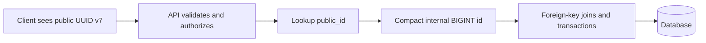

# SQL Fundamentals: ACID & Isolation Levels

Detailed guide covering ACID properties, isolation levels, MVCC, and transaction concurrency.

A database transaction is a logical unit of processing that contains one or more database operations (reads and writes). The primary goal is to ensure database integrity under concurrent access and system failures.

---

## 2. ACID Isolation Levels

The **I** in ACID (Isolation) guarantees how concurrent transactions see changes made by one another. The SQL standard defines four isolation levels, which trade off consistency against concurrency performance.

```
Read Uncommitted      Read Committed      Repeatable Read       Serializable
┌────────────────┐   ┌────────────────┐   ┌────────────────┐   ┌────────────────┐
│ Lowest safety. │   │ Blocks reading │   │ Reads same raw │   │ Strict locks.  │
│ Reads uncom-   │   │ uncommitted    │   │ multiple times │   │ Sequential execution│
│ mitted data.   │   │ writes.        │   │ safely.        │   │ representation.│
└────────────────┘   └────────────────┘   └────────────────┘   └────────────────┘
```

### Concurrency Anomalies (The Bugs we Defend Against)
1. **Dirty Read:** Transaction A reads data modified by Transaction B before Transaction B commits. If B rolls back, A operates on invalid, phantom data.
2. **Non-Repeatable Read:** Transaction A reads a row. Transaction B updates that row and commits. Transaction A re-reads the row and sees different values.
3. **Phantom Read:** Transaction A executes a range query (e.g., count active users). Transaction B inserts a new row matching that range and commits. Transaction A re-runs the range query and sees new "phantom" rows.

---

## 3. Isolation Levels vs. Anomalies Table

| Isolation Level | Dirty Read | Non-Repeatable Read | Phantom Read | Mechanism / Overhead |
| :--- | :---: | :---: | :---: | :--- |
| **Read Uncommitted** | Allowed | Allowed | Allowed | No locks. Extremely fast but unsafe. |
| **Read Committed** | **Prevented** | Allowed | Allowed | Reads only committed data. (PostgreSQL/SQL Server default). |
| **Repeatable Read** | **Prevented** | **Prevented** | Allowed / Prevented | Reads a snapshot frozen at transaction start. (MySQL default; PostgreSQL prevents Phantoms here too). |
| **Serializable** | **Prevented** | **Prevented** | **Prevented** | Full serialization. Strict locking or optimistic verification. Slowest. |

---

## 4. Isolation Enforcement: Locking & MVCC

Modern databases use two primary concurrency architectures:

### 1. Two-Phase Locking (2PL - Pessimistic)
* **Mechanism:** Transactions acquire shared (read) or exclusive (write) locks on resources and hold them until execution ends.
* **Trade-off:** High latency. Readers block writers, and writers block readers, leading to frequent deadlocks.

### 2. Multi-Version Concurrency Control (MVCC - Optimistic)
* **Mechanism:** Standard in PostgreSQL, MySQL (InnoDB), and Oracle. Writers do not lock out readers. Instead, when data is modified, the database creates a new, timestamped version of the row on disk.
* **Why it is fast:** Readers read a historical, immutable snapshot of the data, completely avoiding locks on writers. "Readers never block writers, and writers never block readers."

---

## 5. Multi-Version Concurrency Control (MVCC) Under the Hood

### A. Row Version Metadata (PostgreSQL xmin/xmax vs. MySQL Undo Logs)

Relational engines implement MVCC differently, each with major architectural trade-offs:

#### 1. PostgreSQL (Append-Only Tuples)
* Every physical table row (tuple) contains hidden metadata columns:
  * `xmin`: The transaction ID (TxID) that inserted/created this version of the row.
  * `xmax`: The transaction ID that deleted or updated (which is a delete + insert) this version.
* **Update Process**: PostgreSQL does not overwrite the row. It writes a completely new tuple to disk. It sets the `xmax` of the old tuple to the current TxID and sets the `xmin` of the new tuple to the current TxID.
* **The Drawback (Vacuuming)**: Since updated/deleted tuples are left on disk (known as **Dead Tuples**), PostgreSQL requires a background process called **VACUUM** (or Autovacuum) to scan tables, clean up unneeded old tuple versions, and reclaim disk space. High update volume can trigger "Vacuum bloat" and degrade performance.

#### 2. MySQL InnoDB (In-Place Updates with Undo Logs)
* InnoDB updates rows **in-place** to avoid physical table bloat.
* **Update Process**: It writes the new row directly inside the table page, but writes the old version of the row to a separate sequential buffer called the **Undo Log** (or Rollback Segment).
* Each row header stores a `roll_ptr` pointer pointing to its previous version in the Undo Log.
* **The Benefit**: Table files do not suffer from tuple bloat; dead versions are stored sequentially and purged automatically when no active transactions need them.

### B. Read Views and Visibility Rules
When an MVCC transaction begins, the database generates a **Read View (Active Transaction List Snapshot)**.
* Any changes made by transactions that committed *before* our Read View was created are **visible**.
* Any changes made by transactions that are still active or started *after* our Read View was created are **invisible**.
* During execution, the engine traverses the version chain (using `xmin/xmax` or the Undo Log `roll_ptr`) until it finds the first version that is visible to our Read View.

---

## 6. SQL Row-Level Locking (Pessimistic Locking)

When optimistic MVCC is insufficient to prevent race conditions, databases use explicit lock mechanisms:

### A. Lock Types and Modes
1. **Shared Locks (S - Read Lock)**:
   * Multiple transactions can hold S-locks on the same row simultaneously.
   * Prevents other transactions from writing to the row.
   * *SQL Syntax*: `SELECT ... FOR SHARE` (PostgreSQL) or `SELECT ... LOCK IN SHARE MODE` (MySQL).
2. **Exclusive Locks (X - Write Lock)**:
   * Only one transaction can hold an X-lock on a row.
   * Prevents other transactions from reading or writing.
   * *SQL Syntax*: `SELECT ... FOR UPDATE`.
3. **Intent Locks (IS / IX - Table Level)**:
   * Before acquiring a row-level S or X lock, a transaction must acquire an **Intent Shared (IS)** or **Intent Exclusive (IX)** lock on the *table*.
   * This allows the database to check if a table-level lock can be granted without scanning millions of individual rows to see if any are locked.

### B. Row Lock Contention & Escalation
* **Contention**: Under high write volume, many threads waiting for the same row-level exclusive lock (e.g., updating a hot merchant account balance) will queue up. This depletes the application connection pool, spiking latency.
* **Lock Escalation**: In some databases (like SQL Server), if a query acquires too many individual row locks (usually > 5,000), the engine automatically escalates them into a single table-level lock to save memory—completely blocking all concurrent writes. (PostgreSQL and MySQL InnoDB do *not* escalate locks; they can hold millions of row locks without memory overhead).

---

## 7. Advanced Database Race Conditions (Anomalies)

Even under Repeatable Read isolation, databases are vulnerable to two sophisticated race conditions:

### A. Lost Update Anomaly

```
Tx 1 (Balance: 100)                      Tx 2 (Balance: 100)
 │                                        │
 ├─── Read Balance (100)                  │
 │                                        ├─── Read Balance (100)
 ├─── Add 50 locally (150)                │
 ├─── Commit Write (150)                  │
 │                                        ├─── Add 20 locally (120)
 │                                        └─── Commit Write (120)  <─── Overwrites Tx 1!
```

* **The Problem**: Two transactions concurrently read the same record, perform separate calculations, and write back updates. The second transaction's write silently overwrites the first transaction's work, losing the balance update.
* **The Solution**:
  1. **Pessimistic Locking**: Use `SELECT balance FROM accounts WHERE id = 1 FOR UPDATE` to block Tx 2 until Tx 1 commits.
  2. **Optimistic Concurrency Control (OCC)**: Add a `version` column.
     `UPDATE accounts SET balance = 150, version = version + 1 WHERE id = 1 AND version = current_version;`
     If another transaction updated the row first, the version check fails, and we retry.

### B. Write Skew Anomaly (The Silent Serializable Killer)
Write Skew is a highly technical anomaly that occurs under **Repeatable Read** but is prevented under **Serializable**.

* **The Invariant**: A medical clinic requires at least one doctor to be active on call.
* **The Starting State**: Both Doctor A and Doctor B are currently active (On Call count = 2).

```
Tx 1 (Doctor A)                          Tx 2 (Doctor B)
 │                                        │
 ├─── SELECT COUNT(*) On Call (Gets 2)     │
 │    (Count >= 2, safe to check off)     ├─── SELECT COUNT(*) On Call (Gets 2)
 │                                        │    (Count >= 2, safe to check off)
 ├─── UPDATE Doc A SET status = 'Offline'  │
 ├─── Commit                              ├─── UPDATE Doc B SET status = 'Offline'
 │                                        └─── Commit
```

* **The Disaster**: Both transactions commit successfully because they updated *different, non-overlapping rows* (Tx 1 updated Doc A, Tx 2 updated Doc B). However, the invariant is violated: **zero** doctors are now on call.
* **The Solution**:
  1. **Pessimistic Locking**: Force row-level locking on the shared condition during query: `SELECT * FROM doctors WHERE status = 'On Call' FOR UPDATE`.
  2. **Serializable Isolation**: Force the engine to monitor read sets and abort one of the transactions on validation failure.

---

## 8. Comprehensive Locking Patterns: Pessimistic, Optimistic, and Distributed Locks

In highly concurrent architectures, maintaining data integrity requires explicit coordination. We classify synchronization patterns into three major paradigms.

### A. Core Mechanisms

1. **Pessimistic Locking**:
   - **Philosophy**: "Assume conflicts are highly likely; prevent them by locking immediately."
   - **Mechanism**: Blocks other threads/transactions by acquiring a physical database lock (S or X) on the target row at query time. Other transactions requesting the same row are forced to queue up.
   - **Typical Use Case**: Low-latency, highly contested records where updates *must* succeed (e.g., ticket booking seats, ledger accounts).

2. **Optimistic Concurrency Control (OCC)**:
   - **Philosophy**: "Assume conflicts are rare; check for them at write time."
   - **Mechanism**: Reads data without holding any locks. When saving, verifies if another transaction changed the data by checking a version column or timestamp. If changed, the write fails and the application retries.
   - **Typical Use Case**: Read-heavy systems with low write contention, or long-lived user workflows where holding database locks is unacceptable (e.g., wiki edits, shopping cart item modifications).

3. **Distributed Locking**:
   - **Philosophy**: "Coordinate locks across multiple physical servers/clusters using a central coordinator."
   - **Mechanism**: Acquires a cluster-wide mutual exclusion lock on an external state coordinator (like Redis, ZooKeeper, or etcd). Required because physical application servers do not share memory and cannot coordinate via local memory locks.
   - **Typical Use Case**: Coordinating cross-service business processes or protecting non-database shared resources (e.g., preventing duplicate third-party API billing calls, synchronizing file exports).

---

### B. Structural Comparison

| Dimension | Pessimistic Locking | Optimistic Locking (OCC) | Distributed Locking |
| :--- | :--- | :--- | :--- |
| **Lock Scope** | Single Database Instance | Single Database Instance | Distributed Multi-Server Clusters |
| **Lock Location** | Database Engine (Row-level S/X) | Application Layer (SQL condition) | Central Coordinator (Redis, etcd) |
| **Concurrency Level**| Low (forces threads to queue up) | **High** (non-blocking reads/writes) | Medium-High (depends on lock granularity) |
| **Deadlock Potential**| **High** (circular lock dependencies) | Zero | Low (fails on TTL/expiry) |
| **Overhead** | Medium (DB connection & thread blocks) | **Lowest** (no physical locks or state) | High (network hops to coordinator) |
| **Failure Mode** | Database lock timeout (e.g., 50s) | Conflict error; application must retry | Lock expiry (TTL expiration, GC pause) |
| **Resource Costs** | CPU/Memory in DB; connection hogging | None in DB | Network bandwidth; Redis/etcd RAM |

---

### C. Implementation Patterns

#### 1. Pessimistic Locking (SQL / Go)
Locks the row for exclusive write (`FOR UPDATE`) within a transaction:

```go
func DeductBalancePessimistic(db *sql.DB, accountID int64, amount float64) error {
    tx, err := db.Begin()
    if err != nil {
        return err
    }
    defer tx.Rollback() // Safe fallback

    // 1. Acquire exclusive lock on the row
    var balance float64
    query := "SELECT balance FROM accounts WHERE id = $1 FOR UPDATE"
    if err := tx.QueryRow(query, accountID).Scan(&balance); err != nil {
        return err
    }

    if balance < amount {
        return fmt.Errorf("insufficient funds")
    }

    // 2. Perform write while lock is held
    updateQuery := "UPDATE accounts SET balance = balance - $1 WHERE id = $2"
    if _, err := tx.Exec(updateQuery, amount, accountID); err != nil {
        return err
    }

    // 3. Commit releases the lock
    return tx.Commit()
}
```

#### 2. Optimistic Locking with Retry Loop (SQL / Go)
Uses a `version` column to detect concurrent edits, wrapping the update in a standard retry loop:

```go
func DeductBalanceOptimistic(db *sql.DB, accountID int64, amount float64, maxRetries int) error {
    for i := 0; i < maxRetries; i++ {
        // 1. Read balance and current version without locks
        var balance float64
        var version int
        query := "SELECT balance, version FROM accounts WHERE id = $1"
        if err := db.QueryRow(query, accountID).Scan(&balance, &version); err != nil {
            return err
        }

        if balance < amount {
            return fmt.Errorf("insufficient funds")
        }

        // 2. Attempt conditional update
        updateQuery := "UPDATE accounts SET balance = balance - $1, version = version + 1 WHERE id = $2 AND version = $3"
        result, err := db.Exec(updateQuery, amount, accountID, version)
        if err != nil {
            return err
        }

        rowsAffected, err := result.RowsAffected()
        if err != nil {
            return err
        }

        // 3. If version matched, update succeeded!
        if rowsAffected > 0 {
            return nil
        }

        // Otherwise, another transaction updated first. Backoff and retry.
        time.Sleep(time.Duration(10*(i+1)) * time.Millisecond)
    }
    return fmt.Errorf("transaction aborted: max retries reached")
}
```

#### 3. Distributed Locking (Go / Redis SETNX)
Acquires a lease using an atomic `SET NX` command, releasing it with an atomic Lua script to guarantee mutual exclusion:

```go
type RedisDistributedLock struct {
    client *redis.Client
    key    string
    value  string
    ttl    time.Duration
}

func NewLock(client *redis.Client, key string, ttl time.Duration) *RedisDistributedLock {
    return &RedisDistributedLock{
        client: client,
        key:    "lock:" + key,
        value:  uuid.New().String(), // Unique token to identify ownership
        ttl:    ttl,
    }
}

func (l *RedisDistributedLock) Acquire(ctx context.Context) (bool, error) {
    // SET key value NX PX ttl
    ok, err := l.client.SetNX(ctx, l.key, l.value, l.ttl).Result()
    return ok, err
}

func (l *RedisDistributedLock) Release(ctx context.Context) error {
    // Lua script: Only delete if the key value matches our unique ownership token
    luaRelease := `
        if redis.call("get", KEYS[1]) == ARGV[1] then
            return redis.call("del", KEYS[1])
        else
            return 0
        end`
    
    _, err := l.client.Eval(ctx, luaRelease, []string{l.key}, l.value).Result()
    return err
}
```

---

### D. Production Struggles & Hard Failures

#### 1. Pessimistic Lock Struggles:
- **Connection Pool Starvation**: Under heavy load, if multiple threads are blocked waiting for the same row lock, those threads hold their database connections open. This quickly exhausts the application's connection pool, making the entire microservice unresponsive to unrelated queries.
- **Solution**: Keep lock-holding transactions extremely short. Never call third-party APIs, perform slow password hashes (like bcrypt), or do heavy file I/O inside a pessimistic transaction.

#### 2. Optimistic Lock Struggles:
- **Retry Storms (Thundering Herd)**: Under high write contention on a single row (e.g., a hot flash sale item), hundreds of concurrent transactions will fail the version check simultaneously. Re-executing all of them in a retry loop spikes database CPU usage to 100%, leading to cascading system failure.
- **Solution**: Use randomized exponential backoffs in your retry loops to spread out the concurrency spikes, or switch to Pessimistic row-level locking or async queue-based processing under extreme contention.

#### 3. Distributed Lock Struggles:
- **Split-Brain via GC Pauses / Clock Drift**: As critique-proven by Martin Kleppmann, distributed locks on Redis (Redlock) rely on physical time expirations. If an application node acquires a Redis lock and immediately enters a Stop-the-World garbage collection pause, the lock may expire on Redis while the node is paused. Another server can then acquire the lock. When the paused node wakes up, it proceeds to mutate the data, assuming it still owns the lock—corrupting state.
- **Solution**: Always enforce **Fencing Tokens** at the storage layer. The database must record and check a monotonically increasing counter (e.g., `lock_sequence`). If a write comes in with an older sequence number than the latest recorded, it must be rejected.

---

## 9. UUID v4/v7 Versus Auto-Increment IDs

Primary-key choice affects storage, index locality, insert throughput, API design, debugging, replication, and foreign-key size. UUID and auto-increment IDs can both be correct; choose based on workload and boundary, not popularity.

#### A. What each identifier provides

| Identifier | Generation | Ordering | Typical purpose |
| --- | --- | --- | --- |
| Auto-increment `BIGINT` | Database sequence or identity column | Increasing in one database sequence | Compact internal primary key |
| UUID v4 | Random 128-bit value | No useful insertion order | Distributed ID generation, public opaque ID |
| UUID v7 | Time-ordered 128-bit value with randomness | Roughly increasing by creation time | Distributed ID generation with better index locality |

UUID v7 is not a strict global sequence. IDs created in the same timestamp window can appear in different orders, and clock rollback or multiple generators can affect ordering. Use a database timestamp for authoritative business time.

#### B. Storage and index cost

An auto-increment `BIGINT` uses 8 bytes. A UUID uses 16 bytes before database-specific index and alignment overhead. Every foreign key, secondary index that includes the key, join comparison, buffer page, and replication record can therefore become larger with UUIDs.

```sql
CREATE TABLE users (
    id BIGINT GENERATED ALWAYS AS IDENTITY PRIMARY KEY,
    public_id UUID NOT NULL UNIQUE,
    email TEXT NOT NULL UNIQUE
);

CREATE TABLE orders (
    id BIGINT GENERATED ALWAYS AS IDENTITY PRIMARY KEY,
    public_id UUID NOT NULL UNIQUE,
    user_id BIGINT NOT NULL REFERENCES users(id),
    status TEXT NOT NULL,
    created_at TIMESTAMPTZ NOT NULL DEFAULT now()
);
```

This dual-ID design keeps compact internal joins while exposing an opaque UUID at API boundaries. It costs one additional column and unique index, but avoids making every internal foreign key 16 bytes.

#### C. UUID v4 versus UUID v7

#### UUID v4

Pros:

- Can be generated by clients or services without coordination.
- Hard to guess, useful for public resource identifiers.
- No dependence on one database sequence.

Cons:

- Random index insertion causes page splits and poor B-tree locality at scale.
- Larger primary and foreign-key indexes than `BIGINT`.
- Random IDs make chronological debugging and locality harder.
- Client-generated IDs can be abused for high-cardinality input unless validated.

#### UUID v7

Pros:

- Distributed generation without a central sequence.
- Time-ordered prefix improves B-tree locality compared with UUID v4.
- Easier approximate chronological ordering and index scans.
- Still opaque and difficult to enumerate compared with sequential IDs.

Cons:

- Still 16 bytes in primary and foreign-key indexes.
- Ordering is approximate, not a substitute for `created_at`.
- Requires database and application-library support.
- Timestamp bits reveal approximate creation time.
- Poor generator or clock handling can create collisions or ordering anomalies, though a correct implementation makes collisions extremely unlikely.

#### D. Auto-increment IDs

Pros:

- Smallest common integer key and compact indexes.
- Excellent B-tree locality and insert performance.
- Fast joins, foreign-key checks, sorting, and range scans.
- Native database support, simple debugging, and predictable query plans.

Cons:

- IDs are guessable and reveal approximate row count or creation order.
- One database sequence must coordinate writes unless allocation is partitioned.
- Merging records from multiple databases requires ID remapping or separate ranges.
- Exposing IDs publicly enables enumeration and information leakage.
- Sequence gaps are normal after rollback or deleted rows; do not treat IDs as business counts.

#### E. When to use which

Use auto-increment `BIGINT` as the primary key when:

- One database owns writes.
- Tables are large and join/index efficiency matters.
- IDs stay internal.
- Insert throughput and storage cost matter more than distributed generation.

Use UUID v4 when:

- Clients or multiple services must create IDs before contacting one database.
- IDs cross trust boundaries and must be difficult to enumerate.
- Insert volume is moderate or index locality is not a bottleneck.
- Existing systems already standardize on UUID v4.

Use UUID v7 when:

- Distributed or offline ID generation matters.
- Public IDs should be opaque.
- Table size and write rate make UUID v4 index randomness expensive.
- Approximate time ordering benefits pagination or operational debugging.

Use both when internal database efficiency and public ID safety both matter:



Do not use a public UUID as authorization. Authorization still requires tenant, owner, and permission checks. An opaque identifier reduces enumeration risk; it does not replace access control.

#### F. Foreign-key design rules

1. Match foreign-key type exactly with the referenced key. Do not reference `users.public_id UUID` from a `UUID` column while other tables use `users.id BIGINT` without a clear reason.
2. Index foreign-key columns used in joins, deletes, parent lookups, or cascading actions.
3. Use the internal `BIGINT` key for high-volume joins when public UUIDs are only an API concern.
4. Use UUID foreign keys when services or databases exchange the identifier directly and avoiding an extra translation lookup is important.
5. Keep public and internal identifiers separate in naming: `id` for internal primary key, `public_id` for external identity.
6. Never use an auto-increment ID as business meaning, invoice number, security token, or exact count.

#### G. Example: three valid designs

Internal-only application:

```sql
CREATE TABLE products (
    id BIGINT GENERATED ALWAYS AS IDENTITY PRIMARY KEY,
    name TEXT NOT NULL
);

CREATE TABLE product_reviews (
    id BIGINT GENERATED ALWAYS AS IDENTITY PRIMARY KEY,
    product_id BIGINT NOT NULL REFERENCES products(id),
    body TEXT NOT NULL
);
```

Distributed service with public resources:

```sql
CREATE TABLE videos (
    id UUID PRIMARY KEY DEFAULT uuid_generate_v7(),
    owner_id UUID NOT NULL,
    created_at TIMESTAMPTZ NOT NULL DEFAULT now()
);
```

If the database does not provide `uuid_generate_v7()`, generate UUID v7 in application code using a reviewed library and validate it before insert.

Dual-ID design:

```sql
CREATE TABLE accounts (
    id BIGINT GENERATED ALWAYS AS IDENTITY PRIMARY KEY,
    public_id UUID NOT NULL UNIQUE,
    owner_public_id UUID NOT NULL,
    balance NUMERIC(19, 4) NOT NULL DEFAULT 0
);

CREATE TABLE ledger_entries (
    id BIGINT GENERATED ALWAYS AS IDENTITY PRIMARY KEY,
    account_id BIGINT NOT NULL REFERENCES accounts(id),
    amount NUMERIC(19, 4) NOT NULL,
    created_at TIMESTAMPTZ NOT NULL DEFAULT now()
);
```

Clients use `accounts.public_id`; high-volume ledger joins use `ledger_entries.account_id`. This separates API identity from storage efficiency.

## 10. Popular Interview Questions & High-Impact Answers

### Q1: Should every database primary key be UUID?

**Answer:** No. Use the smallest key that satisfies the boundary. Auto-increment `BIGINT` is usually better for internal high-volume joins and indexes. UUID v4 or v7 is useful for distributed generation and opaque public identifiers. A dual-ID design often provides both benefits.

### Q2: Why can UUID v4 make inserts slower than auto-increment IDs?

**Answer:** UUID v4 values are random, so new rows insert across many B-tree pages instead of appending near the right edge. This causes more page splits, cache misses, and index fragmentation. `BIGINT` and UUID v7 are more insertion-friendly because values are increasing or roughly increasing.

### Q3: Is UUID v7 always better than UUID v4?

**Answer:** No. UUID v7 improves locality and approximate time ordering, but still costs 16 bytes, reveals creation time, and needs reliable library support. UUID v4 remains simple and widely supported. Choose v7 when index locality or ordered distributed IDs matter.

### Q4: Why not expose auto-increment IDs in URLs?

**Answer:** Sequential IDs are easy to enumerate and reveal approximate creation order or volume. They are not automatically a vulnerability when authorization is correct, but public UUIDs reduce accidental information leakage and make enumeration harder. Always enforce ownership and authorization server-side.

### Q5: Should foreign keys use UUID when the parent has a UUID public ID?

**Answer:** Not automatically. If the database uses `BIGINT id` internally and UUID only at the API boundary, use `BIGINT` foreign keys for compact joins. Use UUID foreign keys when independent services or databases must exchange parent identity directly and the extra storage cost is acceptable.

### Q6: Can UUID ordering replace `created_at`?

**Answer:** No. UUID v7 provides approximate generation ordering, not authoritative event time. Store `created_at` or domain-specific timestamps for auditing, business rules, retention, and time-based reporting.

### Q7: What happens when records from two databases are merged?

**Answer:** Auto-increment IDs can collide unless databases use disjoint ranges, prefixes, remapping, or a new global key. UUID v4 and v7 can be generated independently with extremely low collision probability, making merges simpler. Foreign keys must still be validated and migrated consistently.

### Q8: What is the main cost of using UUID for every foreign key?

**Answer:** Each foreign-key index and join carries a 16-byte value instead of an 8-byte `BIGINT`, increasing table size, memory pressure, cache misses, replication volume, and comparison cost. The impact is workload-dependent, but large, join-heavy systems should measure it rather than assume it is free.

### Q9: What is the difference between Non-Repeatable Read and Phantom Read?
* **Answer:** A **Non-Repeatable Read** applies to a **single row**: a concurrent transaction updates or deletes that exact row, causing subsequent reads to see changed attributes. A **Phantom Read** applies to a **range query**: a concurrent transaction inserts new rows matching the filter range, causing subsequent range queries to return extra, newly created records.

### Q10: How does Multi-Version Concurrency Control (MVCC) solve the reader-writer blocking problem?
* **Answer:** Under traditional locking, a write transaction blocks all read transactions on the target row to prevent dirty reads. **MVCC** solves this by keeping multiple versions of a row concurrently. When a write occurs, a new version is created while the old version is preserved. Concurrent readers are directed to read the old, consistent version matching their transaction start timestamp, enabling concurrent reads and writes without lock-based blocking.

### Q11: What is a Database Deadlock, and how does the engine resolve it?
* **Answer:** A deadlock occurs when two or more transactions hold locks on resources the other transaction needs to proceed, creating a circular dependency block (e.g., Tx 1 locks Row A and waits for Row B; Tx 2 locks Row B and waits for Row A). Relational engines resolve this by running active **Deadlock Detection** background threads that trace lock-dependency cycles. When a cycle is detected, the engine forcibly aborts one of the transactions (the "deadlock victim"), rolling back its changes and releasing its locks so the surviving transaction can proceed.

### Q12: Explain the difference between PostgreSQL and MySQL InnoDB in how they implement MVCC. What are the operational implications of each?
* **Answer:** PostgreSQL implements MVCC using **Append-Only Tuples**: updating a row creates a completely new physical row on disk and marks the old one as dead. This requires active **VACUUMing** to reclaim space, leading to table bloat and high disk write overhead if not tuned. MySQL InnoDB uses **In-Place Updates with Undo Logs**: the table row is overwritten directly, and the historical version is saved sequentially to a shared Undo Log file. InnoDB avoids table bloat, but long-running transactions can cause the Undo Log space to expand dramatically as the database must preserve history chains.

### Q13: What is "Write Skew", and why does the standard "Repeatable Read" isolation level fail to prevent it?
* **Answer:** Write Skew is an anomaly where two concurrent transactions read the same data, verify a shared business invariant, update *different, non-overlapping rows*, and commit. Because they mutate different records, row-level locks do not conflict, and under Repeatable Read, both transactions can commit successfully—violating the business invariant. Repeatable Read fails to prevent Write Skew because it only guarantees that *existing* rows read by a single transaction will not change; it does not coordinate locks or serialize across independent rows based on shared query constraints.

### Q14: [Struggle Question] Under high-throughput systems, how do you prevent "Hotspot Lock Contention" on a single database row (e.g., a globally shared balance or stock ledger)?
* **Answer:** 
  1. **Row Sharding / Distributed Counters**: Instead of one row storing `balance = 1000000`, split the ledger into $N$ separate rows (shards), e.g., `balance_shard_1`, `balance_shard_2`, etc. Transactions randomly update one of the shards, reducing lock contention by a factor of $N$. The true balance is computed using a fast `SUM(balance)` range scan.
  2. **Async Batching (Write-Behind)**: Queue updates in an in-memory buffer (like Redis or Kafka). Periodically merge/aggregate the increments (e.g., 10,000 increments of +1) and run a single consolidated database update: `UPDATE counter SET value = value + 10000`.
  3. **Queue-Based Serializing**: Route all writes to the hot row through a single-threaded queue worker, converting concurrent parallel lock struggles into an orderly, non-blocking sequential processing stream.
