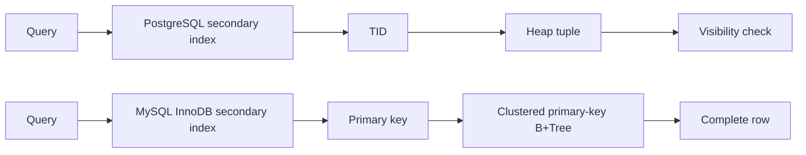
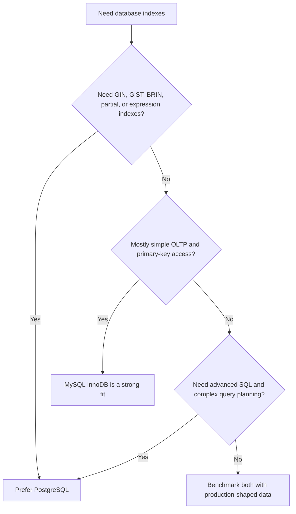

# SQL Indexing Internals

Detailed guide covering B-Trees, Hash indexes, clustered and secondary indexes, composite indexing, PostgreSQL and MySQL index types, and query-plan trade-offs.

A database index is a separate, optimized data structure maintained by the database engine to speed up data retrieval operations. Without an index, the database must perform a **Full Table Scan (Sequential Scan)**, reading every single page on the disk to find matching rows—resulting in `O(N)` time complexity.

---

## 2. Common Index Data Structures

Modern relational databases (like PostgreSQL and MySQL) use two main types of index data structures:

### 1. B-Tree (and B+ Tree) Indexes (Default)
* **Mechanism:** A self-balancing search tree designed to store sorted data. B+ Trees store actual row pointers or row data only in the leaf nodes, while internal nodes store strictly index search keys.
* **Why B+ Tree is preferred for Databases:**
  * Leaf nodes are linked together in a doubly linked list, enabling extremely fast **range queries** (e.g., `WHERE age BETWEEN 18 AND 30`) and sequential scanning.
  * Shallow height: Large fan-out (hundreds of child nodes per node) keeps the tree depth small (usually 3-4 levels), minimizing slow disk I/O operations.
* **Complexity:** `O(log N)` for reads, writes, and range scans.

### 2. Hash Indexes
* **Mechanism:** Uses a hash table to map keys directly to row addresses.
* **Limitations:**
  * Does **not** support range queries (e.g., `WHERE salary > 5000` is impossible to look up via Hash).
  * Does not support sorting (`ORDER BY`).
  * Only works for exact equality lookups (`WHERE id = 123`).
* **Complexity:** `O(1)` average lookup time.

---

## 3. Advanced Indexing Strategies

### 1. Composite (Multi-Column) Indexes
An index built on multiple columns (e.g., `INDEX (last_name, first_name)`).
* **The Leftmost Prefix Rule:** A composite index can only be used if the query filters match columns starting from the left of the index definition.
  * `WHERE last_name = 'Smith' AND first_name = 'John'` ──► **Uses Index**
  * `WHERE last_name = 'Smith'` ──► **Uses Index**
  * `WHERE first_name = 'John'` ──► **FAILS leftmost rule (Full Table Scan)**

### 2. Clustered vs. Non-Clustered Indexes
* **Clustered Index:** Defines the physical storage order of rows on disk. A table can have **only one** clustered index (typically the Primary Key).
* **Non-Clustered Index:** A separate structure containing the indexed keys and pointers back to the physical rows (the clustered index key).

---

## 4. Index Scan vs. Index Seek

When checking an execution plan (via `EXPLAIN`), look for these operations:

* **Index Seek:**
  * *Definition:* The database engine traverses the index tree structure directly to locate specific matching keys.
  * *Efficiency:* Highly efficient. Only reads the exact branches needed. `O(log N)`.
* **Index Scan:**
  * *Definition:* The engine traverses the entire index structure sequentially from start to finish.
  * *Efficiency:* Less efficient. Used when a range is too broad, or the leftmost prefix rule is violated but scanning the smaller index is still faster than scanning the massive raw data table.

---

## 5. Deep Dive: Physical Storage & Disk IO

### A. Clustered vs. Secondary Indexes (Under the Hood)

#### 1. Clustered Index (Primary Key Storage)
The **Clustered Index** *is* the table itself. The leaf nodes of the Clustered B+Tree do not store pointers; they store the **actual, complete data rows**.
* Because the physical rows can only be sorted in one order on disk, there can be **only one** clustered index per table.
* **Access Path:** 
  `Query PK` ──► `Traverse Clustered B+Tree` ──► `Leaf Node (Contains Full Data Row)` ──► `Return Row`.

#### 2. Secondary Index (Non-Clustered Lookup)
Any index other than the clustered index is a **Secondary Index**. The leaf nodes of a secondary B+Tree store the indexed key along with a pointer to the **Clustered Index Key (the Primary Key)**, *not* the physical disk offset of the row.
* **Access Path (Without Covering Index):**
  `Query Secondary Key` ──► `Traverse Secondary B+Tree` ──► `Leaf Node (Contains Primary Key)` ──► `Traverse Clustered B+Tree with PK` ──► `Leaf Node (Contains Full Data Row)` ──► `Return Row`.
* This double-traversal overhead is called a **Key Lookup** or **Bookmark Lookup**, and it causes massive Random IO.

```
[Secondary B+Tree Seek] ──► Finds PK value '42'
                                 │
                                 ▼
   [Clustered B+Tree Seek] ──► Reads PK '42' from leaf node ──► Full Row Loaded
```

---

### B. Random IO vs. Sequential IO

* **Sequential IO**: Reading adjacent physical blocks on disk. This is extremely fast because disk heads (or SSD controllers) pre-fetch continuous sectors. A **Full Table Scan** or a sequential scan of a B+Tree leaf-node link-chain uses Sequential IO.
* **Random IO**: Jumping between non-contiguous disk addresses. A **Secondary Index Lookup** that returns many rows triggers multiple separate Key Lookups, causing the disk to jump around to fetch non-contiguous physical pages.
* **The Threshold Rule**: If a query's secondary index seek is expected to return more than **15% to 25%** of the table's total rows, the SQL query optimizer will deliberately abandon the index and fall back to a **Full Table Scan** because performing sequential scanning of the entire table on disk is faster than thousands of separate random IO Key Lookups.

---

### C. SQL B+Tree Fragmentation

As records are inserted, updated, or deleted randomly, the B+Tree indexes degrade physically over time:

1. **Leaf Node Splits**: If a B+Tree leaf node page is full (usually 8KB or 16KB) and a new key must be inserted in sorted order, the page is split into two half-empty pages.
2. **Fragmentation**: Frequent page splits cause:
   * **Internal Fragmentation**: Pages have excessive empty space (low page fill factor, e.g., 50% instead of 90%), wasting RAM and disk.
   * **External Fragmentation**: The logical order of leaf nodes (the doubly linked list) no longer matches their physical order on disk, turning fast Sequential Range scans into slow Random IO seeks.
3. **The Cure**: Regularly run `REBUILD INDEX` / `REINDEX` (PostgreSQL) or `OPTIMIZE TABLE` (MySQL InnoDB) to recreate the index sequentially on contiguous disk blocks with an optimal fill factor (e.g., 80% to allow inserts without immediate splits).

---

## 6. Advanced Indexing Structures: B+ Trees, Bloom Filters, and Skiplists

Modern data engines require high-performance, specialized indexing structures depending on the read/write workload. We analyze three critical structures.

### A. B+ Trees (Relational Database Storage Standard)

1. **How it Works**:
   - A self-balancing search tree with a massive fan-out (degree $M$).
   - **Internal Nodes**: Only store search keys and child page pointers. No physical data is stored here, allowing more keys per page (e.g., 512 keys in an 8KB page).
   - **Leaf Nodes**: Store the actual physical records (or Primary Key pointers) in sorted order. All leaf nodes are linked sequentially via a doubly linked list.
   - **Range Queries**: The database engine performs an $O(\log N)$ tree traversal to find the first matching key in a leaf node, then simply iterates sequentially along the linked list.

2. **Go Example**:
   We model a simplified B+ Tree Node representation:
   ```go
   type BPlusNode struct {
       IsLeaf   bool
       Keys     []int         // Sorted keys
       Children []*BPlusNode  // Child pointers (Internal Nodes only)
       Next     *BPlusNode    // Pointer to next leaf node (Leaf Nodes only)
       Prev     *BPlusNode    // Pointer to previous leaf node (Leaf Nodes only)
       Values   []interface{} // Data rows or pointers (Leaf Nodes only)
   }
   ```

3. **Struggles & Pitfalls**:
   - **Page Splits & Merges**: When inserting a key into a full page, the page splits, causing parent internal nodes to balance. Under heavy random writes (e.g., UUID v4), constant splits trigger excessive random I/O and fragment the physical disk storage.
   - **High Memory Footprint**: To keep traversal fast, internal nodes must reside in the database's RAM Buffer Pool.

4. **Best Practices**:
   - Always prefer sequential, time-sortable primary keys (e.g., BIGSERIAL, UUID v7, ULID) to ensure new data is always appended to the rightmost leaf node—minimizing page splits.
   - Regularly rebuild indexes (`REINDEX` / `OPTIMIZE TABLE`) to defragment B+ Tree pages on disk.

---

### B. Bloom Filters (Probabilistic Fast-Gating)

1. **How it Works**:
   - A space-efficient, probabilistic data structure used to test if an element is a **member of a set**.
   - **Guarantees**:
     - **False Positives are possible**: It may tell you an element is in the set when it is not (the filter says "Yes", but it's "Maybe").
     - **No False Negatives**: It will never say an element is not in the set if it actually is (if the filter says "No", it is "Absolutely No").
   - **Mechanism**: Initializes an array of $M$ bits to `0`. When an element is added, it is passed through $K$ independent hash functions. The bit indexes returned are set to `1`. To query, check if all $K$ bits are `1`. If any are `0`, the element is definitely not in the set.

2. **Go Example**:
   ```go
   type BloomFilter struct {
       bitArray []bool
       size     uint32
       hashes   int
   }

   func NewBloomFilter(size uint32, hashes int) *BloomFilter {
       return &BloomFilter{bitArray: make([]bool, size), size: size, hashes: hashes}
   }

   func (bf *BloomFilter) Add(key string) {
       for i := 0; i < bf.hashes; i++ {
           idx := bf.hash(key, i) % bf.size
           bf.bitArray[idx] = true
       }
   }

   func (bf *BloomFilter) MightContain(key string) bool {
       for i := 0; i < bf.hashes; i++ {
           idx := bf.hash(key, i) % bf.size
           if !bf.bitArray[idx] {
               return false // Definitely not in the set!
           }
       }
       return true // Might be in the set (probabilistic)
   }

   func (bf *BloomFilter) hash(key string, seed int) uint32 {
       h := fnv.New32a()
       h.Write([]byte(key))
       h.Write([]byte{byte(seed)})
       return h.Sum32()
   }
   ```

3. **Struggles & Pitfalls**:
   - **Deletion is Impossible**: You cannot remove a key from a standard Bloom Filter because multiple keys map to the same shared bits. Deleting a key by setting its bits to `0` would silently delete other independent keys. (A Counting Bloom Filter uses integers instead of bits but increases memory overhead).
   - **Sizing Mathematics**: Underestimating the set size or the number of hash functions causes the bit array to saturate with `1`s, skyrocketing the false positive rate to 100%.

4. **Best Practices**:
   - Use Bloom Filters as a **fast-gate** in front of slow persistent storage (e.g., Cassandra/RocksDB SSTables or Redis cache). If the Bloom Filter returns `false`, bypass disk entirely.
   - Use standard mathematical sizing formulas ($M = - \frac{N \ln P}{(\ln 2)^2}$) to balance bit array size ($M$), expected keys ($N$), and desired error rate ($P$).

---

### C. Skiplists (The Randomized Index Alternative)

1. **How it Works**:
   - A probabilistic data structure built on sorted linked lists, enabling $O(\log N)$ search, insertion, and deletion.
   - **Mechanism**: Multiple layers of linked lists.
     - **Level 0**: A standard sorted linked list containing all elements.
     - **Higher Levels**: Act as "express lanes" bypassing intermediate elements.
   - **Traversing**: Start at the top level, move forward as far as possible, drop down a level when the next key is larger than the target, and repeat.
   - **Balancing via Coin Toss**: Instead of strict rebalancing algorithms (like AVL/Red-Black trees), Skiplists use a randomized coin toss (geometric distribution, e.g., 50% probability) to decide if an inserted node is promoted to a higher level.

2. **Go Example**:
   We model a simplified Skiplist Node representation:
   ```go
   type SkipNode struct {
       Key     int
       Value   interface{}
       Forward []*SkipNode // Pointers to next nodes at different levels
   }
   ```

3. **Struggles & Pitfalls**:
   - **Memory Overhead**: Each node must store an array of pointers representing its height, consuming significantly more RAM than a simple B-Tree or Red-Black Tree.
   - **Poor CPU Cache Locality**: Nodes are allocated randomly in physical memory. Traversing a linked-list pointer chain triggers continuous CPU cache misses compared to the contiguous page layout of B+ Trees.

4. **Best Practices**:
   - Use Skiplists for **concurrent, lock-free in-memory indexes** (e.g., LevelDB/RocksDB Memtables, or Redis Sorted Sets / ZSET).
   - Because they are linked lists, implementing lock-free concurrency using atomic Compare-And-Swap (CAS) pointers is significantly easier and more performant than implementing concurrent AVL/Red-Black tree rebalancing locks.

---

## 7. PostgreSQL vs. MySQL Indexing

Both databases commonly use B-tree indexes, but their storage engines expose different strengths. Choose based on workload and operational needs, not on index type alone.

### A. Storage model: the most important difference

| Topic | PostgreSQL | MySQL with InnoDB |
| --- | --- | --- |
| Table storage | Heap table; table data is separate from indexes | Clustered table; primary-key B+Tree leaf pages contain full rows |
| Secondary index leaf | Key plus tuple identifier (TID) | Key plus primary-key value |
| Primary key | Unique index plus constraint; does not automatically define heap order | Clustered index and physical row organization |
| Physical ordering | `CLUSTER` can reorder a table once; later writes can destroy order | InnoDB maintains primary-key order as rows change |
| Secondary lookup | Index scan may fetch heap pages; visibility checks can require heap access | Secondary lookup may perform a second primary-key traversal |
| Multiple indexes | Flexible index types and predicates | Strong clustered-primary-key design; secondary indexes repeat primary key |



PostgreSQL heap access can be avoided when an **index-only scan** is possible and the visibility map confirms pages are all-visible. MySQL can avoid the second lookup when a secondary index is covering.

### B. PostgreSQL index types

#### B-tree

Default choice for equality, sorting, prefix-compatible pattern searches, and ranges:

```sql
CREATE INDEX users_email_idx ON users (email);
CREATE INDEX orders_created_at_idx ON orders (created_at DESC);
```

#### Hash

Useful for equality only. PostgreSQL hash indexes are crash-safe and WAL-logged, but B-tree is usually the better default because it also supports ordering and ranges:

```sql
CREATE INDEX sessions_token_hash_idx
ON sessions USING HASH (token);
```

Benchmark before choosing hash. Equality performance does not automatically beat a well-sized B-tree.

#### GIN

Good for multi-valued or membership data such as arrays, `jsonb`, and full-text search:

```sql
CREATE INDEX articles_tags_gin_idx
ON articles USING GIN (tags);

CREATE INDEX documents_body_gin_idx
ON documents USING GIN (to_tsvector('english', body));
```

GIN indexes can be large and write-heavy. They suit read-heavy search workloads better than frequent small updates.

#### GiST and SP-GiST

Useful for geometric data, ranges, nearest-neighbor-style operators, and extensible operator classes:

```sql
CREATE INDEX room_position_gist_idx
ON rooms USING GIST (position);

CREATE INDEX booking_period_gist_idx
ON bookings USING GIST (booking_period);
```

#### BRIN

Small summary index for very large tables where column values correlate with physical row order, such as append-only event tables:

```sql
CREATE INDEX events_created_at_brin_idx
ON events USING BRIN (created_at);
```

BRIN is cheap to maintain but less precise. It may scan many heap pages after locating matching block ranges.

#### Partial, expression, and covering indexes

PostgreSQL can index only useful rows, computed values, or included payload columns:

```sql
CREATE INDEX active_users_email_idx
ON users (email)
WHERE deleted_at IS NULL;

CREATE INDEX users_lower_email_idx
ON users (lower(email));

CREATE INDEX orders_customer_created_idx
ON orders (customer_id, created_at DESC)
INCLUDE (status, total);
```

The query expression must match the indexed expression. `lower(email) = 'ada@example.com'` can use the expression index; `email = 'ada@example.com'` cannot use it as the same access path.

### C. MySQL InnoDB index types

#### B-tree indexes

InnoDB uses B+Tree indexes for primary keys and ordinary secondary indexes:

```sql
CREATE INDEX orders_customer_created_idx
ON orders (customer_id, created_at DESC);
```

The primary key should be narrow and stable because its value is copied into every secondary index entry. Changing a primary key can therefore be expensive.

#### Full-text indexes

Use `FULLTEXT` for natural-language search, not a normal B-tree:

```sql
CREATE FULLTEXT INDEX documents_body_ft_idx
ON documents (title, body);
```

Full-text behavior depends on parser, stopwords, token length, and search mode.

#### Spatial indexes

Use `SPATIAL` indexes for supported geometry types and spatial predicates:

```sql
CREATE SPATIAL INDEX places_location_idx
ON places (location);
```

#### Functional and generated-column indexes

MySQL supports functional indexes in current versions. A generated column can make the expression explicit and portable across versions:

```sql
CREATE INDEX users_lower_email_idx
ON users ((LOWER(email)));

-- Alternative:
ALTER TABLE users
ADD normalized_email VARCHAR(255)
    GENERATED ALWAYS AS (LOWER(email)) STORED,
ADD INDEX users_normalized_email_idx (normalized_email);
```

#### Invisible indexes

An invisible index remains maintained but is ignored by the optimizer. It helps test whether removing an index would change plans:

```sql
ALTER TABLE orders ALTER INDEX orders_customer_created_idx INVISIBLE;
```

Do not leave unused invisible indexes indefinitely. They still consume write, storage, and memory resources.

### D. PostgreSQL and MySQL composite indexes

Both engines generally benefit from the same equality-then-range ordering:

```sql
CREATE INDEX orders_lookup_idx
ON orders (customer_id, status, created_at DESC);
```

Good matches:

```sql
WHERE customer_id = 7
  AND status = 'paid'
  AND created_at >= CURRENT_DATE - INTERVAL '30 days'
```

Less effective match:

```sql
WHERE status = 'paid'
  AND created_at >= CURRENT_DATE - INTERVAL '30 days'
```

The leading `customer_id` column is absent. The optimizer may still use the index for a scan or skip-scan-like strategy depending on database version and statistics, but index design should not depend on that possibility.

### E. Query-plan tools

Always inspect the plan for an important query:

```sql
-- PostgreSQL
EXPLAIN (ANALYZE, BUFFERS)
SELECT id, total
FROM orders
WHERE customer_id = 7
ORDER BY created_at DESC
LIMIT 20;
```

```sql
-- MySQL
EXPLAIN ANALYZE
SELECT id, total
FROM orders
WHERE customer_id = 7
ORDER BY created_at DESC
LIMIT 20;
```

Look for:

- Estimated rows versus actual rows.
- Sequential or full-table scans.
- Index scans that fetch too many rows.
- Heap fetches in PostgreSQL.
- Secondary-to-primary lookups in InnoDB.
- Sorts or temporary tables that a suitable index could avoid.
- Stale statistics.

An index is not automatically good because the plan mentions it. An index scan that touches most table rows can be slower than a sequential scan.

### F. When to choose PostgreSQL

Choose PostgreSQL when you need:

- Rich index types: GIN, GiST, SP-GiST, BRIN, partial, and expression indexes.
- Complex queries, custom operators, arrays, `jsonb`, range types, or full-text search.
- Strong SQL standard features and advanced transactional behavior.
- Flexible indexing for data with different access patterns.
- Large append-heavy tables where BRIN can keep index storage small.

Trade-offs:

- Heap-table access can add random I/O for non-covering indexes.
- Vacuum and visibility maintenance affect index-only scans and table health.
- Many index types require operator-class and workload knowledge.
- PostgreSQL primary keys do not automatically cluster table storage.

### G. When to choose MySQL with InnoDB

Choose MySQL with InnoDB when you need:

- Simple, predictable B-tree and clustered-primary-key behavior.
- Fast primary-key lookups and common OLTP access patterns.
- Mature replication and broad managed-service support in your environment.
- Workloads naturally modeled around narrow, sequential primary keys.
- A simpler index toolbox than PostgreSQL provides.

Trade-offs:

- Every secondary index carries the primary-key value, increasing index size.
- A wide or random primary key increases secondary-index cost and page splitting.
- Fewer general-purpose index types than PostgreSQL.
- Clustered storage makes primary-key choice especially important.

### H. Decision guide



Do not choose a database from benchmark headlines. Load realistic data, indexes, query distributions, write rates, replication settings, and failure scenarios. Measure p95 and p99 latency, write amplification, storage growth, lock waits, and operational effort.

## 8. Index Design Workflow

1. Start with real slow queries, not guesses.
2. Write the access pattern: equality filters, ranges, joins, sort, and selected columns.
3. Check existing indexes for overlap.
4. Create the smallest index that supports the query.
5. Run `EXPLAIN` before and after.
6. Test cold-cache and warm-cache behavior.
7. Measure write latency and index size.
8. Recheck after statistics refresh and production data growth.

### Common mistakes

- Indexing every column.
- Duplicating nearly identical composite indexes.
- Wrapping an indexed column in a function without an expression or generated-column index.
- Comparing a column to a value with an incompatible type.
- Leading a composite index with a low-value column when no later access pattern benefits.
- Ignoring soft-delete predicates such as `deleted_at IS NULL`.
- Keeping indexes for one old query after query shape changes.
- Rebuilding indexes on a schedule without measuring fragmentation or bloat.

### Sargability

A **sargable** predicate lets the optimizer search the index directly:

```sql
-- Sargable
WHERE created_at >= TIMESTAMP '2026-01-01 00:00:00'

-- Often not sargable
WHERE DATE(created_at) = DATE '2026-01-01'
```

Rewrite the second query as a range:

```sql
WHERE created_at >= TIMESTAMP '2026-01-01 00:00:00'
  AND created_at <  TIMESTAMP '2026-01-02 00:00:00'
```

This preserves index use and avoids applying a function to every row.

## 9. Consolidated Interview Questions & High-Impact Answers

### Q1: Why should we not index every column in a table?
* **Answer:** While indexes speed up read operations (`SELECT`), they introduce overhead to write operations (`INSERT`, `UPDATE`, `DELETE`). For every write, the database must dynamically update, rebalance, or split the index structures (e.g., B-Trees) on disk and in memory. Furthermore, indexes consume valuable RAM and disk space, and over-indexing can confuse the query optimizer into choosing inefficient execution plans.

### Q2: How does a B+ Tree compare to a standard Binary Search Tree (BST) for database storage?
* **Answer:** A standard BST has a fan-out of 2, making the tree extremely deep for millions of records. This requires many sequential node evaluations. Because database pages reside on slow persistent disks, each node traversal represents a slow disk I/O. A **B+ Tree** has a huge fan-out (often 100+ keys per node), keeping the tree extremely shallow (3-4 levels maximum) and ensuring we only need 3-4 disk seek operations to find any record.

### Q3: What is a "Covering Index" and how does it optimize queries?
* **Answer:** A covering index is a non-clustered index that contains all the columns requested by a specific query in its select and filter clauses. When this occurs, the database engine can retrieve all required data directly from the lightweight index structure in RAM, completely skipping the slow step of referencing physical table pages on disk (Index lookup without Row Lookup).

### Q4: Explain the difference between Clustered and Secondary indexes. Why do secondary indexes store the Primary Key instead of direct disk block offsets?
* **Answer:** A clustered index stores the physical data rows directly in its B+Tree leaf nodes, meaning the index *is* the table. A secondary index contains only the indexed keys and the corresponding Primary Key. Secondary indexes store the Primary Key instead of physical disk block offsets (pointers) to prevent **cascading updates**. If the database stored direct disk offsets, whenever a row is moved, updated, or when a clustered B+Tree page splits, the database would have to write and update the offset pointer inside *every single secondary index* on that table. Storing the PK isolates secondary indexes from physical row movements at the expense of an extra clustered tree lookup.

### Q5: What is Index Fragmentation, why does it occur, and how do you diagnose and fix it?
* **Answer:** Index fragmentation is the physical disorganization of index pages on disk. It occurs due to **random write splits**: when we insert, update, or delete rows with non-sequential primary keys (like UUID v4), full B+Tree leaf nodes must split to maintain logical sorted order, leaving pages half-empty and scattered across non-contiguous disk sectors. 
  * *Diagnosis*: In PostgreSQL, check the `pgstattuple` extension. In MySQL, run `SHOW INDEX FROM table_name` and check the cardinality and page details.
  * *Fix*: Rebuild the index using `REINDEX INDEX index_name` (PostgreSQL) or `ALTER TABLE table_name ENGINE=InnoDB` / `OPTIMIZE TABLE table_name` (MySQL) to defragment pages and restore physical sequential alignment.

### Q6: [Struggle Question] Why can using UUID v4 as a Primary Key severely degrade database write performance and cause massive index fragmentation in B+Tree databases? How do you solve it?
* **Answer:** 
  1. **The Write Penalty**: UUID v4 values are completely random. When inserting a row, the database cannot simply append it to the end of the clustered index disk block (sequential write). Instead, it must find a random location in the middle of the B+Tree index.
  2. **Page Splits & Random IO**: This random insertion forces pages to split constantly, triggering massive Random IO read/write cycles to disk and leaving the clustered index highly fragmented (lots of empty space inside index pages).
  3. **Buffer Pool Eviction**: Since keys are random, the database cannot keep the "hot" portion of the index in the RAM buffer pool. Every insert requires loading a different index block from disk, destroying cache locality.
  4. **Solution**: Use **ordered, time-sortable identifiers** like **UUID v7**, **ULID**, or a Snowflake ID. These contain a millisecond-precision Unix timestamp in their most significant bits, making them sequentially sortable. The database can append inserts to the rightmost leaf node of the B+Tree sequentially, preventing page splits and maintaining maximum cache hit rates.

### Q7: [Advanced Question] Why does Redis use Skiplists instead of B+ Trees for Sorted Sets (ZSET)? Why do LSM-Tree engines (like RocksDB) use Skiplists for Memtables but B+ Trees are used in relational databases?
* **Answer**: Redis is entirely in-memory, so disk page layout and disk I/O are irrelevant. B+ Trees are optimized to minimize disk page fetches, but they are highly complex to implement and maintain. Skiplists are far simpler, have equivalent $O(\log N)$ average complexity, and require no rebalancing locks. For LSM-Tree engines, the Memtable sits in memory and needs to support high concurrency. Writing concurrent lock-free Skiplists using simple CAS pointers is extremely fast and scalable, whereas concurrent B+ Trees or self-balancing BSTs require complex, heavy-weight latching protocols.

### Q8: [Advanced Question] How do Bloom Filters optimize disk lookup overhead in modern NoSQL databases? What are their design limits?
* **Answer**: NoSQL engines (Cassandra, RocksDB, Bigtable) write data sequentially to immutable files on disk called **SSTables (Sorted String Tables)**. A single key lookup might require scanning dozens of SSTables. To avoid slow disk reads, NoSQL databases keep a Bloom Filter in RAM for *each* SSTable. Before hitting disk, the database queries the Bloom Filter. If it returns `false` (no matching key), the disk is completely bypassed, reducing lookup latency from milliseconds to microseconds. Their design limit is memory: Bloom Filters must fit entirely in RAM to be useful, and they cannot support key deletions natively.

### Q9: Why does PostgreSQL not have a permanently clustered primary key like InnoDB?
* **Answer**: PostgreSQL stores table rows in a heap and stores index entries separately. A primary-key index enforces uniqueness but does not define permanent heap order. `CLUSTER` can physically reorder a table using an index, but later inserts and updates do not preserve that order automatically. This gives PostgreSQL flexible heap storage and multiple specialized index types, but range locality may require periodic maintenance or partitioning.

### Q10: Why does a wide MySQL primary key make every secondary index more expensive?
* **Answer**: InnoDB secondary index entries contain the secondary key plus the primary-key value. A wide primary key increases every secondary index's storage, page count, cache pressure, and write cost. Use a narrow, stable primary key and keep external identifiers in separate unique indexes when appropriate.

### Q11: When should you use a PostgreSQL partial index?
* **Answer**: Use one when queries repeatedly target a stable subset of rows, such as active records or unprocessed jobs. The index is smaller and cheaper to scan:
  ```sql
  CREATE INDEX jobs_ready_idx
  ON jobs (priority, created_at)
  WHERE processed_at IS NULL;
  ```
  The query predicate must imply the partial-index predicate for the optimizer to use it.

### Q12: When is a BRIN index better than a B-tree?
* **Answer**: BRIN is better for very large tables where indexed values correlate with physical row order, such as timestamps in append-only event data. It uses much less storage and has lower write overhead. B-tree is better when point lookups need precise row location or values are randomly distributed.

### Q13: What is an index-only scan?
* **Answer**: An index-only scan returns requested columns from the index without reading the table heap. PostgreSQL also needs visibility-map information to know that heap pages need no visibility check. MySQL uses a similar practical idea through covering indexes, where all required columns are present in the secondary index.

### Q14: Why can an optimizer ignore a usable index?
* **Answer**: The index may match too many rows, require expensive random lookups, have stale statistics, lack a useful leading column, or require a sort that costs more than a sequential scan. The optimizer chooses the cheapest estimated plan, not the plan with the most index usage.

### Q15: How do you find redundant indexes?
* **Answer**: List index definitions, compare column order and included columns, inspect query plans and usage statistics, then remove only after observing production workload. A composite index can make a shorter left-prefix index redundant for reads, but uniqueness, foreign keys, sort direction, partial predicates, and write behavior can make both necessary.

### Q16: What is the difference between index bloat and table bloat in PostgreSQL?
* **Answer**: Table bloat is unused space from dead or obsolete heap tuples. Index bloat is wasted or inefficient index-page space caused by updates, deletes, and page splits. Vacuum helps with tuple visibility and reuse; `REINDEX` or `REINDEX CONCURRENTLY` rebuilds an index when index structure itself needs replacement.

### Q17: Why is `LIKE '%term%'` difficult for a normal B-tree?
* **Answer**: A leading wildcard removes a known left boundary, so the engine cannot usually traverse a B-tree directly to the matching prefix. PostgreSQL may use trigram GIN or GiST indexes with `pg_trgm`; MySQL may use full-text search or an application search engine depending on search semantics.
