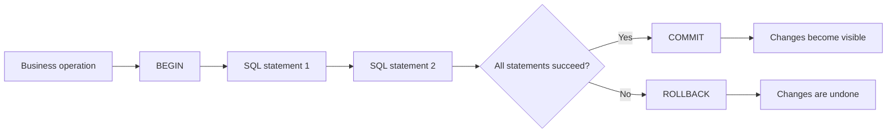
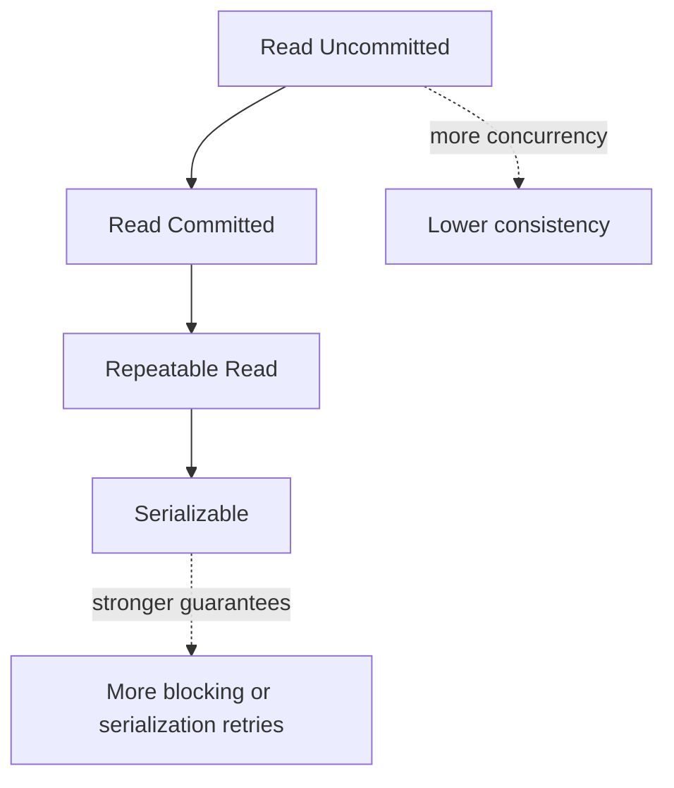
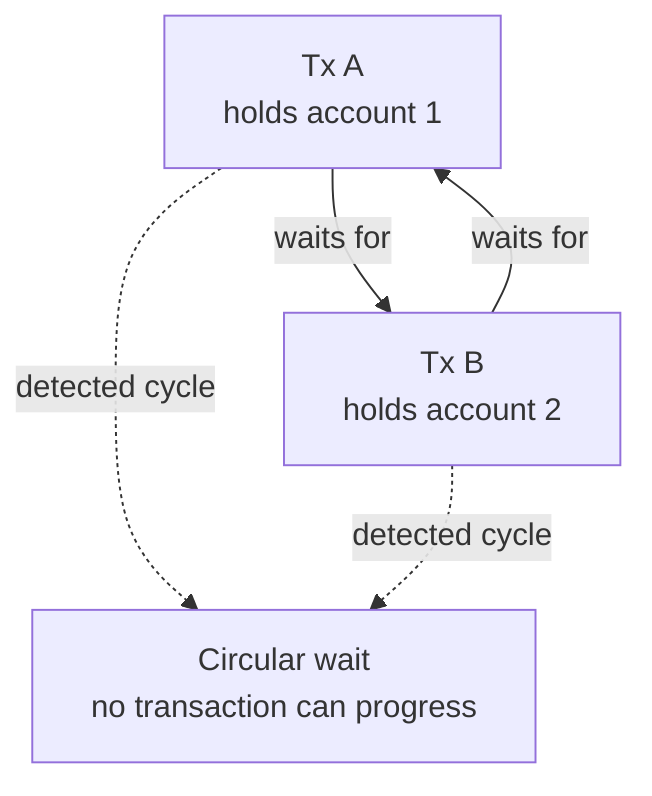
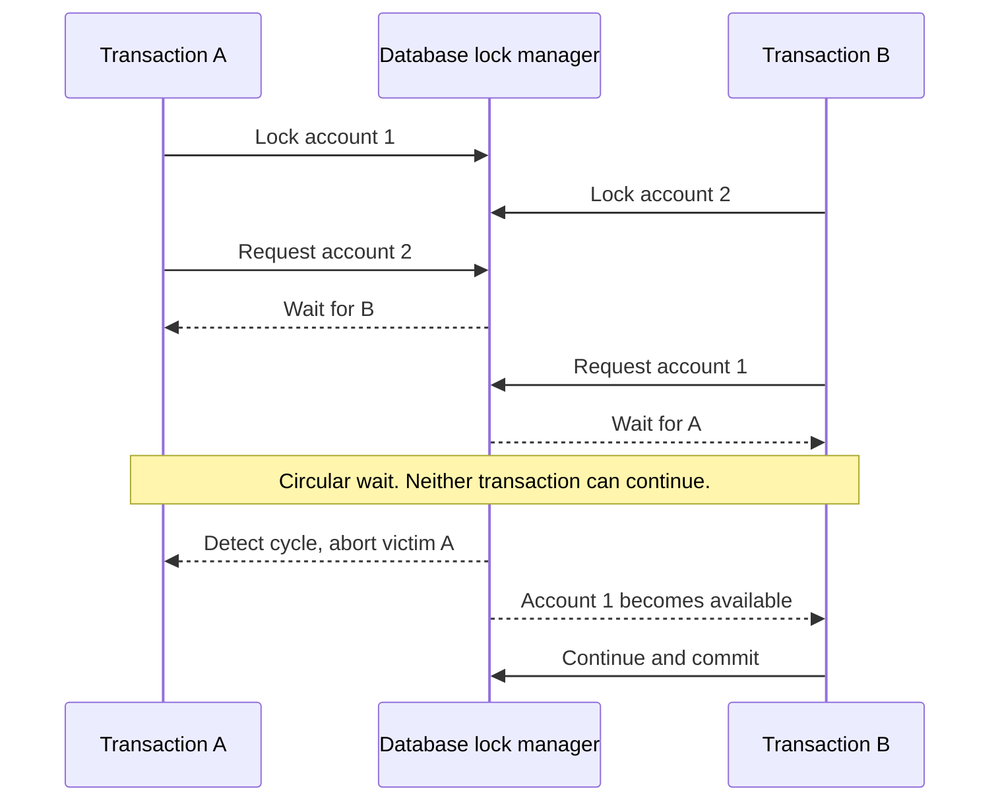
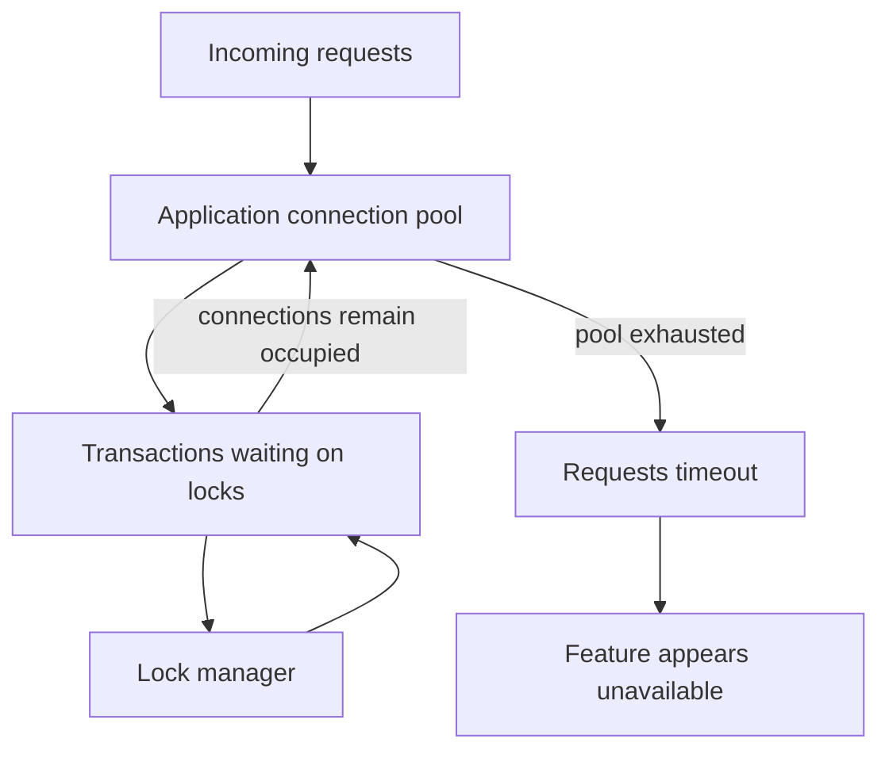
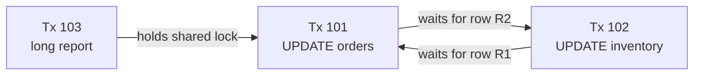
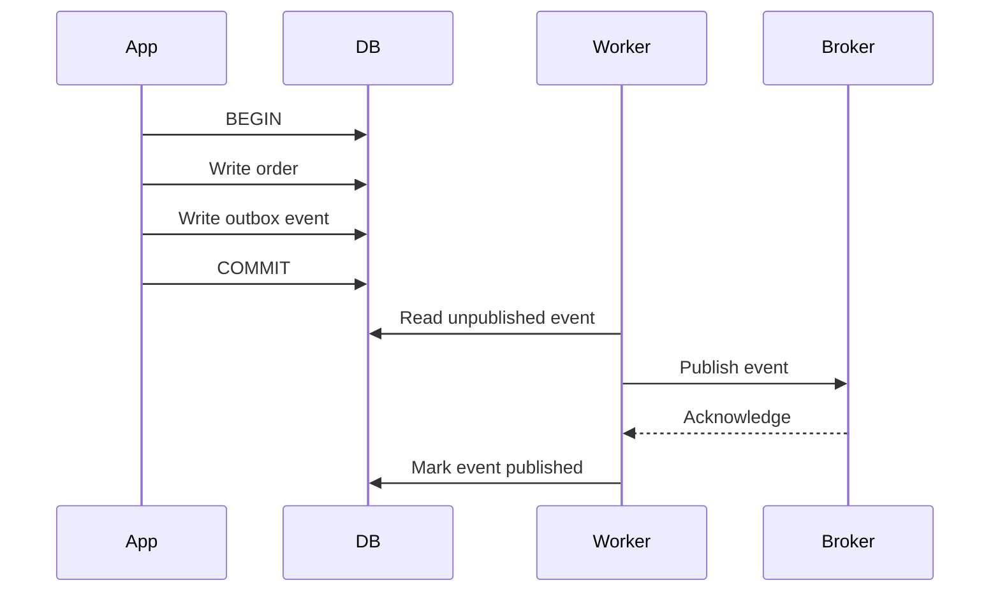
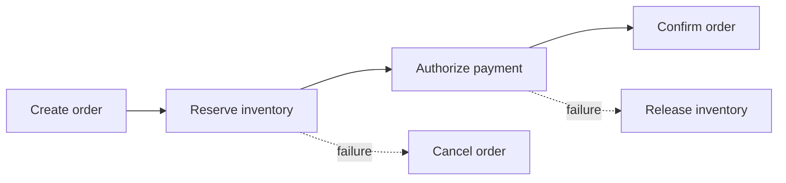

# SQL Transactions: From `BEGIN` to Reliable Workflows

A transaction groups related SQL statements into one unit of work. The database either makes the whole unit visible or makes none of it visible.

This matters whenever one business action changes more than one piece of data:

- Transfer money from one account to another.
- Create an order and reduce inventory.
- Reserve a seat and record the reservation.
- Save a row and publish an event through a transactional outbox.

Without a transaction, a failure between two statements can leave partial state.



## 1. ACID: The Four Guarantees

Transactions are usually described with **ACID**:

| Property | Meaning | Example |
| --- | --- | --- |
| **Atomicity** | All statements succeed, or none do. | Debit and credit happen together. |
| **Consistency** | Constraints and business invariants remain valid after commit. | An account balance cannot become negative. |
| **Isolation** | Concurrent transactions do not observe unsafe intermediate state. | Another session does not see a half-completed transfer. |
| **Durability** | Committed data survives process or machine failure, subject to the database's durability configuration. | A committed order remains after a restart. |

ACID does not mean every transaction runs alone. Isolation level controls how much concurrent work can overlap.

## 2. Basic Transaction Lifecycle

The usual lifecycle is:

1. Start a transaction with `BEGIN` or `START TRANSACTION`.
2. Read and write required rows.
3. End with `COMMIT`.
4. Use `ROLLBACK` when validation or a statement fails.

```sql
BEGIN;

UPDATE accounts
SET balance = balance - 100
WHERE id = 1
  AND balance >= 100;

-- Application checks that exactly one row changed.
UPDATE accounts
SET balance = balance + 100
WHERE id = 2;

COMMIT;
```

If either update fails, the application must roll back:

```sql
BEGIN;

UPDATE accounts
SET balance = balance - 100
WHERE id = 1
  AND balance >= 100;

-- If validation fails:
ROLLBACK;
```

### Autocommit

Many SQL clients use **autocommit** by default. Each statement becomes its own transaction:

```sql
UPDATE accounts SET balance = balance - 100 WHERE id = 1;
UPDATE accounts SET balance = balance + 100 WHERE id = 2;
```

If the process fails after the first statement, the debit may commit while the credit never happens. Disable autocommit or explicitly begin a transaction when statements must succeed together.

### Application transaction pattern

Application code should always make transaction ownership explicit. A common pattern is:

```text
begin
  execute all database work through transaction handle
  commit
on any error
  rollback
  return error
```

Do not start a transaction on one connection and execute statements through a pool's general `db` handle. The statements may run on different connections and therefore belong to different transactions.

## 3. Money Transfer Example

A safe transfer must protect both the balance check and the balance updates.

```sql
BEGIN;

-- Lock rows until commit or rollback.
SELECT id, balance
FROM accounts
WHERE id IN (1, 2)
ORDER BY id
FOR UPDATE;

-- Application verifies source balance >= 100.
UPDATE accounts
SET balance = balance - 100
WHERE id = 1
  AND balance >= 100;

UPDATE accounts
SET balance = balance + 100
WHERE id = 2;

COMMIT;
```

The `ORDER BY id` gives concurrent transfers a consistent lock order. Consistent ordering reduces deadlocks when two transactions touch the same accounts in reverse order.

For simple arithmetic, an atomic conditional update can be safer than reading a value into application memory:

```sql
UPDATE accounts
SET balance = balance - 100
WHERE id = 1
  AND balance >= 100;
```

The application must check the affected-row count. Zero rows means the account was missing or the balance was insufficient.

## 4. Isolation Levels

Isolation level defines what one transaction can observe while other transactions run.

| Level | Dirty read | Non-repeatable read | Phantom read | Typical trade-off |
| --- | --- | --- | --- | --- |
| **Read Uncommitted** | Possible | Possible | Possible | Highest concurrency, weakest guarantees |
| **Read Committed** | Prevented | Possible | Possible | Common default; each statement sees committed data |
| **Repeatable Read** | Prevented | Prevented | Database-dependent | Stable snapshot, more contention or retries |
| **Serializable** | Prevented | Prevented | Prevented | Strongest correctness, lowest concurrency |

Definitions:

- **Dirty read:** Reading data another transaction later rolls back.
- **Non-repeatable read:** Reading one row twice and getting different committed values.
- **Phantom read:** Repeating a range query and seeing new matching rows.
- **Write skew:** Two transactions read the same condition and update different rows, together violating an invariant.



Names and behavior differ by database. PostgreSQL and MySQL/InnoDB do not implement every level identically, so verify behavior in the target engine.

### Choosing an isolation level

- Use **Read Committed** for most ordinary request transactions.
- Use **Repeatable Read** when a workflow needs a stable snapshot across multiple reads.
- Use **Serializable** when correctness depends on a cross-row or range invariant and retries are acceptable.
- Avoid **Read Uncommitted** for financial, inventory, authorization, or billing decisions.

## 5. Locks and MVCC

Databases combine locking and **Multi-Version Concurrency Control (MVCC)**.

### Row locks

Use a row lock when a transaction must read a value and then make a decision based on it:

```sql
BEGIN;

SELECT stock
FROM products
WHERE id = 42
FOR UPDATE;

UPDATE products
SET stock = stock - 1
WHERE id = 42
  AND stock > 0;

COMMIT;
```

`FOR UPDATE` blocks competing writes to selected rows until the transaction ends. Keep this transaction short. Do not call an external API or wait for user input while holding the lock.

### MVCC snapshots

With MVCC, readers can see a committed version of a row while another transaction writes a newer version. This reduces reader-writer blocking, but old versions require cleanup and long-running transactions can delay cleanup.

MVCC does not prevent every race. Two transactions can read a shared condition and write different rows. Use a stronger isolation level, explicit locks, or a schema constraint that directly represents the invariant.

## 6. Savepoints: Partial Rollback

A savepoint allows part of a transaction to be rolled back while keeping earlier work:

```sql
BEGIN;

INSERT INTO orders (id, customer_id)
VALUES (1001, 7);

SAVEPOINT add_optional_metadata;

INSERT INTO order_metadata (order_id, key, value)
VALUES (1001, 'gift_message', 'Happy birthday');

-- If optional metadata fails:
ROLLBACK TO SAVEPOINT add_optional_metadata;

-- The order insert still exists.
COMMIT;
```

Savepoints are useful for optional work or library code that must recover locally. They do not make a transaction independent, and locks held after the savepoint may remain until the outer transaction commits or rolls back.

## 7. Constraints: Let the Database Protect Invariants

Transactions coordinate statements. Constraints reject invalid final state:

```sql
CREATE TABLE accounts (
    id BIGINT PRIMARY KEY,
    balance NUMERIC(12, 2) NOT NULL CHECK (balance >= 0)
);

CREATE TABLE transfers (
    id BIGINT PRIMARY KEY,
    idempotency_key TEXT NOT NULL UNIQUE,
    source_account_id BIGINT NOT NULL REFERENCES accounts(id),
    destination_account_id BIGINT NOT NULL REFERENCES accounts(id),
    amount NUMERIC(12, 2) NOT NULL CHECK (amount > 0)
);
```

Use both:

- **Transaction:** groups related changes.
- **Constraint:** rejects invalid data even when another code path writes it.

Application checks alone are unsafe under concurrency because another transaction can change the data after the check.

## 8. Deadlocks, Circular Waits, and Retryable Failures

A deadlock is a **circular wait** between transactions. Each transaction holds a lock that another transaction needs, so no transaction can make progress without another transaction releasing its lock.



### 8.1 How circular deadlock forms

Consider two transfers that lock accounts in opposite order:

```sql
-- Transaction A
BEGIN;
SELECT id FROM accounts WHERE id = 1 FOR UPDATE;
-- Transaction A now waits for account 2.
SELECT id FROM accounts WHERE id = 2 FOR UPDATE;
```

```sql
-- Transaction B
BEGIN;
SELECT id FROM accounts WHERE id = 2 FOR UPDATE;
-- Transaction B now waits for account 1.
SELECT id FROM accounts WHERE id = 1 FOR UPDATE;
```

Timeline:



The database usually detects the cycle and aborts one transaction. It does not always wait forever. However, the feature can still become unusable before detection or when application behavior turns lock waits into a resource outage.

### 8.2 How deadlocks make a feature unusable

A deadlock can spread beyond two transactions:



Typical failure chain:

1. A transaction locks rows and waits for another transaction.
2. The application keeps the database connection checked out while waiting.
3. More requests arrive and occupy the remaining connections.
4. The pool reaches its limit.
5. Unrelated queries cannot obtain a connection.
6. Request timeouts trigger retries, creating more load.
7. Latency spikes and the whole feature can become unavailable.

This is why deadlock prevention matters even when the database has deadlock detection. Detection limits the duration of one cycle; it does not prevent lock contention, pool starvation, retry storms, or long lock waits.

### 8.3 Deadlock versus lock wait

These conditions are related but different:

| Condition | Meaning | Typical response |
| --- | --- | --- |
| **Lock wait** | Transaction waits for another transaction, but no cycle exists | Find long-running holder; reduce transaction duration |
| **Deadlock** | Transactions form a cycle of waits | Database aborts a victim; retry whole transaction |
| **Lock timeout** | Wait exceeds configured limit | Investigate contention; retry only when operation is safe |
| **Serialization failure** | Serializable validation detects unsafe ordering | Roll back and retry complete transaction |
| **Connection-pool exhaustion** | Requests cannot obtain a database connection | Stop retry storm; fix blocked or leaked transactions |

### 8.4 How to prevent deadlocks

#### Use one lock order

Choose a deterministic order for every code path. For account transfers, lock lower IDs first:

```sql
BEGIN;

SELECT id, balance
FROM accounts
WHERE id IN (1, 2)
ORDER BY id
FOR UPDATE;

-- Apply transfer after both locks are acquired.
UPDATE accounts
SET balance = balance - 100
WHERE id = 1;

UPDATE accounts
SET balance = balance + 100
WHERE id = 2;

COMMIT;
```

Every transfer, refund, reversal, and reconciliation path must use the same ordering. One inconsistent path can reintroduce the cycle.

#### Lock all required rows early

Do not acquire one lock, perform unrelated work, then discover that another lock is needed. Identify the complete lock set first and acquire it in order.

#### Keep transactions short

Do not hold database locks while:

- Calling payment, shipping, or identity APIs.
- Waiting for user input.
- Reading large files.
- Performing slow password hashing.
- Running long reports.
- Sleeping for retry backoff.

Prepare external data before `BEGIN`, or persist a state and continue through a separate workflow.

#### Use narrow predicates and supporting indexes

A missing index can make a locking statement inspect or lock many rows:

```sql
-- Supporting index reduces search work and lock footprint.
CREATE INDEX jobs_ready_idx
ON jobs (queue_name, priority, created_at)
WHERE completed_at IS NULL;
```

Indexes do not eliminate all locking, but they reduce the time needed to locate target rows and reduce accidental contention.

#### Avoid unnecessary lock strength

Use the weakest lock that preserves the invariant. Do not use `FOR UPDATE` for a read-only operation. PostgreSQL supports weaker modes such as `FOR KEY SHARE` and `FOR SHARE`; choose deliberately and verify engine behavior.

#### Keep batch sizes bounded

One transaction updating millions of rows holds locks for a long time and increases deadlock probability. Process bounded batches when business atomicity allows it:

```text
repeat:
  begin
  claim at most 500 rows in deterministic order
  update claimed rows
  commit
until no rows remain
```

#### Avoid hidden lock acquisition

Triggers, foreign-key checks, cascading deletes, and ORM callbacks can lock tables or rows that are not obvious from application code. Include them in lock-order analysis.

#### Do not depend on sleep for coordination

Adding arbitrary delays can reduce collision probability in tests but does not establish correctness. Use deterministic lock ordering, constraints, isolation, and bounded retries.

### 8.5 Deadlock debugging workflow

Debugging needs evidence from both the database and application. A deadlock report usually names the victim, but the root cause is the set of statements and lock order that created the cycle.

#### Step 1: Capture exact database errors

Log:

- Database engine and error code.
- Transaction or request ID.
- SQL operation name, not secret values.
- Retry attempt.
- Transaction start and end time.
- Connection-pool wait time.
- Rows affected.

Never log passwords, access tokens, payment data, or full untrusted SQL parameters.

#### Step 2: Inspect PostgreSQL activity and locks

Find active transactions and wait events:

```sql
SELECT
    pid,
    application_name,
    state,
    wait_event_type,
    wait_event,
    xact_start,
    query_start,
    pg_blocking_pids(pid) AS blocking_pids,
    LEFT(query, 300) AS query
FROM pg_stat_activity
WHERE state <> 'idle'
ORDER BY xact_start NULLS LAST;
```

Inspect lock rows:

```sql
SELECT
    l.pid,
    l.locktype,
    l.mode,
    l.granted,
    l.relation::regclass AS relation,
    l.page,
    l.tuple,
    a.wait_event_type,
    a.wait_event,
    LEFT(a.query, 300) AS query
FROM pg_locks l
JOIN pg_stat_activity a USING (pid)
WHERE a.state <> 'idle'
ORDER BY l.granted, l.pid;
```

Useful PostgreSQL settings include `log_lock_waits`, `deadlock_timeout`, and `log_min_duration_statement`. Enable them with care because verbose lock logging can be expensive.

#### Step 3: Inspect MySQL/InnoDB activity and locks

Show the latest detected deadlock:

```sql
SHOW ENGINE INNODB STATUS\G
```

Inspect current transactions and waits:

```sql
SELECT
    waiting_pid,
    waiting_query,
    blocking_pid,
    blocking_query,
    wait_age
FROM sys.schema_lock_waits;
```

Depending on MySQL version and configuration, `performance_schema.data_locks` and `performance_schema.data_lock_waits` provide lower-level lock details.

#### Step 4: Build a wait-for graph

Convert evidence into a graph:



For each edge, record:

- Transaction ID.
- SQL statement.
- Locked table, index, row, or key range.
- Lock mode.
- Time lock was acquired.
- Time spent waiting.

The cycle is the immediate cause. The long-running transaction, missing index, inconsistent lock order, or unexpected trigger is usually the deeper cause.

#### Step 5: Compare code paths

Search every operation that touches the locked tables. Compare lock order, including:

- Transfer versus refund.
- Checkout versus inventory reconciliation.
- Parent update versus child insert.
- Background worker versus API request.
- Trigger or cascade behavior.

A deadlock often appears only when two individually correct code paths interact.

#### Step 6: Reproduce with controlled concurrency

Use two sessions and pause between statements:

```sql
-- Session A
BEGIN;
UPDATE accounts SET balance = balance - 1 WHERE id = 1;
-- Pause, then request id = 2.
```

```sql
-- Session B
BEGIN;
UPDATE accounts SET balance = balance - 1 WHERE id = 2;
-- Pause, then request id = 1.
```

Reproduction confirms lock order. Run it against a safe test database with representative indexes and isolation settings.

### 8.6 Handling deadlocks safely

Databases commonly abort one transaction and return a deadlock error. The application must:

1. Roll back the failed transaction.
2. Release or discard its transaction-bound connection.
3. Wait with bounded exponential backoff and jitter.
4. Rerun the complete transaction from the beginning.
5. Stop after a small retry limit.

```text
for attempt in 1..3:
  begin transaction
  perform every read and write
  commit
  if success:
    return success
  if deadlock or serialization failure:
    rollback
    sleep with jitter
    continue
  return permanent error
return temporary failure
```

Do not retry inside an already-failed transaction. Do not retry only the last SQL statement. Earlier reads and decisions may no longer be valid.

Idempotency is required when a transaction retry is connected to external work. Use a unique business key or idempotency key so a retry cannot create duplicate orders, charges, or messages.

### 8.7 Observability and alerting

Track:

- Deadlocks per minute.
- Lock-wait duration p50, p95, and p99.
- Transactions exceeding a duration threshold.
- Connection-pool wait time and utilization.
- Rollback and retry counts.
- Serialization failures.
- Longest-running transaction age.
- Database CPU, I/O, and replication lag.

Alert on rates and duration, not only on one deadlock. One deadlock may be harmless; a rising deadlock rate with pool saturation indicates an availability incident.

### 8.8 Deadlock checklist

When a deadlock appears:

1. Preserve database deadlock logs before rotation.
2. Identify every transaction in the cycle.
3. Record exact statements and lock modes.
4. Find inconsistent lock ordering.
5. Check for long transactions and missing indexes.
6. Inspect triggers, foreign keys, and cascades.
7. Add or improve deterministic ordering.
8. Reduce transaction scope and batch size.
9. Add bounded retry for transient errors.
10. Load-test concurrency and verify deadlock rate falls.

Databases detect deadlocks; they do not design safe application lock ordering. Prevention belongs in schema design, SQL, transaction boundaries, application retry policy, and production observability.

## 9. Transaction Boundaries and External Systems

A database transaction cannot automatically roll back an email, HTTP request, file upload, or message published to another system.

Avoid this sequence:

```text
BEGIN database transaction
update order
call payment provider
COMMIT
```

If the payment succeeds but the database commit fails, retrying may charge the customer twice. Use an idempotency key with the provider, and model the workflow with durable states.

### Transactional outbox

Write business data and an event record in one local transaction:

```sql
BEGIN;

INSERT INTO orders (id, customer_id, status)
VALUES (1001, 7, 'pending');

INSERT INTO outbox (event_id, event_type, aggregate_id, payload)
VALUES (
    'evt-1001',
    'order.created',
    '1001',
    '{"order_id":1001}'
);

COMMIT;
```

A worker later publishes the outbox event. If publishing fails, the worker retries. Consumers must be idempotent because delivery is commonly **at least once**.



## 10. Distributed Transactions

When one business operation spans multiple databases or services, a local SQL transaction cannot provide atomicity across all participants.

### Two-phase commit

Two-phase commit coordinates participants:

1. **Prepare:** Every participant promises it can commit.
2. **Commit:** Coordinator tells every participant to commit.

It provides strong atomicity but adds latency, coordinator failure modes, and operational complexity. Participants may hold locks while waiting.

### Saga

A saga splits work into local transactions and defines compensating actions:



Sagas improve availability and service autonomy, but compensation is not the same as rollback. A sent email cannot truly be unsent, and a refund may take time.

## 11. Advantages and Limitations

### Advantages

- Prevent partial updates.
- Preserve referential integrity and business invariants.
- Provide predictable recovery through commit and rollback.
- Coordinate concurrent reads and writes.
- Support durable event publication through the outbox pattern.

### Limitations

- Locks and snapshots consume database resources.
- Long transactions increase contention and delay cleanup.
- Deadlocks and serialization failures require retry handling.
- Large transactions create long recovery time and replication lag.
- A database transaction cannot atomically control external systems.
- Serializable isolation can reduce throughput under contention.

### Practical rules

1. Keep transactions short and narrow.
2. Access shared rows in a consistent order.
3. Put all statements in the transaction on the transaction handle.
4. Enforce invariants with constraints where possible.
5. Check affected-row counts after conditional updates.
6. Retry only known transient failures.
7. Make external operations idempotent.
8. Monitor lock waits, deadlocks, transaction duration, and rollback rate.

## 12. Interview Questions and Answers

### Q1. What is a transaction?

**Answer:** A transaction is a unit of database work that commits all its statements together or rolls them all back. It protects multi-step operations from partial failure and coordinates concurrent access.

### Q2. Explain ACID.

**Answer:** Atomicity gives all-or-nothing execution. Consistency preserves constraints and invariants. Isolation controls visibility between concurrent transactions. Durability makes committed changes survive failures according to database durability settings.

### Q3. Why is autocommit dangerous for a money transfer?

**Answer:** With autocommit, debit and credit are separate transactions. A failure between them can commit the debit while the credit never runs. Explicit `BEGIN` and `COMMIT` make both updates one atomic unit.

### Q4. When should you use `SELECT ... FOR UPDATE`?

**Answer:** Use it when a transaction must read rows, make a decision from their current values, and update those same rows safely. It is useful for inventory, account balances, and seat reservations. Keep the lock-holding transaction short.

### Q5. Does MVCC eliminate the need for locks?

**Answer:** No. MVCC reduces reader-writer blocking by exposing consistent row versions, but writes still need coordination. Explicit locks or serializable execution may be required for lost updates, write skew, and cross-row invariants.

### Q6. What is the difference between a deadlock and a lock timeout?

**Answer:** A deadlock has a cycle: transactions wait for one another. The database can detect the cycle and abort a victim. A lock timeout is a transaction waiting too long; there may be no cycle. Both may be retryable, depending on the operation.

### Q7. How should an application handle a serialization failure?

**Answer:** Roll back the complete transaction, wait briefly with bounded exponential backoff and jitter, then rerun the complete transaction. Retrying only the failed statement can produce incorrect application state.

### Q8. Why can a database transaction not include an HTTP request safely?

**Answer:** The database cannot roll back a remote side effect. If the HTTP request succeeds and the database later rolls back, repeating the request may duplicate the effect. Use idempotency keys, durable workflow state, an outbox, or a saga.

### Q9. What problem does the transactional outbox solve?

**Answer:** It prevents a database update and event publication from diverging. Business data and an outbox row commit together. A worker publishes the row later and retries failed delivery.

### Q10. Compare two-phase commit and saga.

**Answer:** Two-phase commit provides coordinated atomic commit across participants but adds blocking and operational complexity. A saga uses independent local transactions and compensating actions, improving availability while accepting eventual consistency and more complex failure handling.

### Q11. Why use database constraints when application code already validates data?

**Answer:** Application validation can race with concurrent transactions or be bypassed by another writer. Constraints execute at the database boundary and protect data regardless of which application path performs the write.

### Q12. What makes a transaction too large?

**Answer:** A transaction is too large when it holds locks or snapshots for long periods, processes excessive rows, increases log and replication volume, causes timeouts, or makes rollback and recovery expensive. Split work into smaller transactions when business atomicity allows it.
