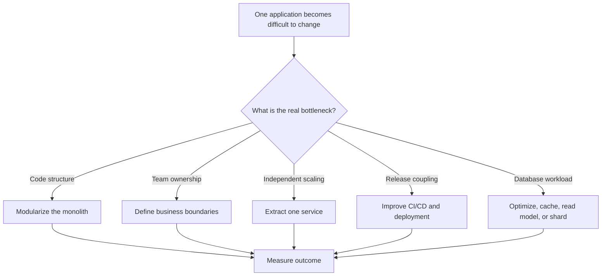
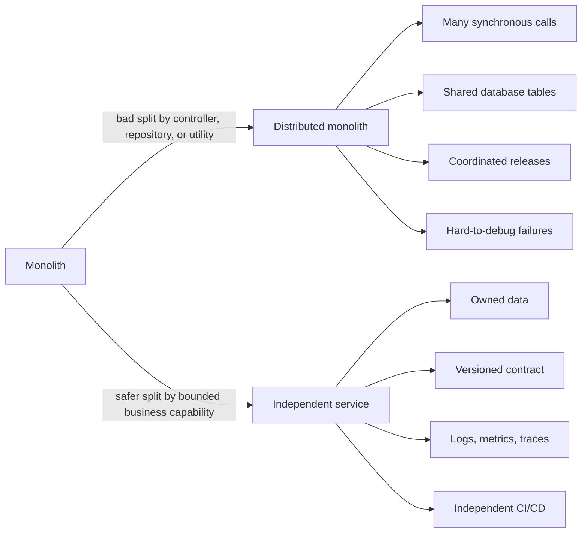

# Senior & Staff-Level CS Mock Interview Scenarios

This study guide presents high-signal, staff-level system architecture mock interview scenarios. Each scenario simulates an engineering design committee interview, detailing deep problem statements, architectural tradeoffs, step-by-step resolution logs, and exact verbal responses to impress senior panel interviewers.

---

## Scenario 1: Flash Sale Cache Stampede & Redis Cluster Overload

### 1. Problem Statement
Your company is launching an ultra-high-profile flash sale where 50,000 users will simultaneously load a single "Active Discount Vouchers" dashboard at exactly 12:00:00 UTC. 
* **The Risk:** If the cache expires at 12:00:00 or is evicted, 50,000 requests will instantly fall through to the PostgreSQL database in a single second, inducing a database connection pool blowout, locking transaction threads, and causing a catastrophic service outage (**Cache Stampede** / **Thundering Herd**).
* **The Hashing Risk:** These voucher records use keys like `voucher:active:user_123`, `voucher:active:user_456`. When distributed across a 3-node Redis Cluster, multi-key transaction pipelines fail because keys hash to different Redis hash slots.

---

### 2. High-Impact Architectural Solution

#### Component Architecture Diagram
```
                     50,000 Concurrent Requests
                                 │
                                 ▼
                     ┌───────────────────────┐
                     │   API Gateways (L7)   │
                     └───────────┬───────────┘
                                 │
                        (In-Flight Deduplication)
                                 │
                     ┌───────────▼───────────┐
                     │   Singleflight Pool   │
                     └───────────┬───────────┘
                                 │
                        (Cache Miss / Hit)
                                 │
            ┌────────────────────┴────────────────────┐
            ▼                                         ▼
  ┌───────────────────┐                     ┌───────────────────┐
  │   Redis Cluster   │                     │ PostgreSQL Master │
  │ (Using `{user}`)  │                     │ (Only 1 query!)   │
  └───────────────────┘                     └───────────────────┘
```

#### Code Defense: Go Singleflight Integration
We intercept cache misses with an in-memory **Singleflight** (Request Deduplicator) pool. If 10,000 concurrent goroutines trigger a cache miss for the exact same key, `singleflight.Group` suppresses 9,999 calls. It spawns only **one** database transaction, sharing the single returned query result with all 10,000 waiting threads.

```go
package main

import (
	"context"
	"fmt"
	"sync"
	"time"

	"golang.org/x/sync/singleflight"
)

type VoucherService struct {
	cacheGroup singleflight.Group
	redisCache map[string]string // Mock Redis
	dbConn     *sync.Mutex       // Mock Database Lock
	queryCount int
}

func (s *VoucherService) FetchVoucherData(ctx context.Context, key string) (string, error) {
	// 1. Attempt Cache Read
	if val, exists := s.redisCache[key]; exists {
		return val, nil
	}

	// 2. Cache Miss - Execute Singleflight to collapse duplicate queries
	v, err, shared := s.cacheGroup.Do(key, func() (interface{}, error) {
		// Only the first thread enters here to execute the expensive DB query
		return s.queryDatabaseDirect(key)
	})

	if err != nil {
		return "", err
	}

	fmt.Printf("Key: %s | Result Shared across threads: %v\n", key, shared)
	return v.(string), nil
}

func (s *VoucherService) queryDatabaseDirect(key string) (string, error) {
	s.dbConn.Lock()
	defer s.dbConn.Unlock()
	s.queryCount++ // Tracks exact physical DB queries made
	time.Sleep(100 * time.Millisecond) // Simulate slow query
	return "Voucher-Data-Payload", nil
}
```

#### Redis Hashing Slots Alignment via Hash Tags
To execute multi-key operations (like transaction scripts, Lua executions, or pipeline merges) across keys without slot failures, we wrap the sharding key portion in **curly brackets `{}`**:
* `user:10001:voucher:active` and `user:10001:profile` hash to different slots.
* `{user:10001}:voucher:active` and `{user:10001}:profile` force Redis to hash only the bracketed string `user:10001`, routing both keys to the **exact same Redis Cluster node**, enabling high-speed atomic transactions.

---

### 3. Interview Q&A Script

**Interviewer:** *"If the cache is empty during a peak load spike, how do you prevent your database from melting down?"*

**Your Verbal Response:**
> "I mitigate this by layering an in-memory execution barrier using the **Singleflight pattern** inside the application middleware layer, coupled with **probabilistic cache pre-expiration**. 
> 
> When a cache miss occurs under high concurrency, instead of allowing all threads to query the database, we route the key through a singleflight group. The singleflight group intercepts the requests, allows only the first thread to execute the physical database transaction, and holds the other threads in a blocked state. Once the single database query returns, the proxy populates the cache and multiplexes the single result back to all waiting requests. 
> 
> For highly active keys, I also implement **XFetch (probabilistic early expiration)**. As the cache lifetime nears expiry, background threads probabilistically trigger an early background cache refresh based on query frequency, ensuring the cache is refreshed *before* it actually expires, keeping database misses at absolute zero."

---

## Scenario 2: Sharding a Global Financial Ledger (Zero-Downtime Scaling)

### 1. Problem Statement
Your system manages a global ledger where users register millions of multi-currency transactions daily. The main database is a single massive PostgreSQL server. CPU utilization is at 98%, write locks are queuing up, and vertical scaling limits have been reached.
* **Requirements:** Shard the ledger database horizontally to support infinite write scaling.
* **Constraints:** Must preserve transactional consistency for single-account transfers, eliminate cross-shard joins, and handle resharding (adding new shards) with absolutely **zero downtime**.

---

### 2. High-Impact Architectural Solution

#### Database Schema & Routing Strategy
1. **Choose Sharding Key:** `account_id` (not `transaction_id` or `timestamp`).
   - *Why:* High cardinality ensures uniform key distribution. Most ledger queries are account-centric (e.g., fetch statement for `account_id`), allowing the router to target a single physical shard instead of performing slow scatter-gather queries across the entire network.
2. **Handle Cross-Account Transfers:** 
   - A transfer between `account_A` (Shard 1) and `account_B` (Shard 2) cannot run on a single local transaction. We utilize the **Saga Pattern** or **Transactional Outbox with CDC (Change Data Capture)** to guarantee eventual consistency without using slow distributed two-phase commit (2PC) locks.

#### Data Migration Ring for Zero-Downtime Resharding
To scale from 4 physical shards to 8 physical shards without taking the platform offline, we employ a **Consistent Hashing Ring** with a **Dual-Write, Log-Replay Migration Pipeline**:

```
                  Consistent Hashing Ring
                         [Shard 1]
                        /         \
                 [New Shard 5]   [Shard 2]
                     │               │
                     └─ Dual-Writes ─┘
```

1. **Step 1: Expand Topology:** Map the new shard nodes (`Shard 5`, `Shard 6`) onto the consistent hashing ring. Only keys mapped between the new node and its counter-clockwise neighbor are targeted for movement (exactly $1/N$ of keys).
2. **Step 2: Dual-Writing:** Update the routing proxies (e.g., Vitess or custom router) to write new entries to *both* the old shard and the new shard simultaneously for the targeted key space. Reads still point to the old shard.
3. **Step 3: Historical Backfill:** Stream historical WAL logs from the old shard to the new shard using CDC tools (like Debezium) up to the dual-write checkpoint.
4. **Step 4: Cutover:** Once replication lag drops to zero, swap the routing proxy reads to the new shard and terminate the dual-write to the old shard, completing the migration with zero downtime and zero data loss.

---

### 3. Interview Q&A Script

**Interviewer:** *"How do you handle a transfer between two users whose accounts reside on completely different physical shards without locking up the database?"*

**Your Verbal Response:**
> "I explicitly reject distributed two-phase commit (2PC) protocols because they introduce blocking coordinators, increase network round-trip overhead, and drastically lower write availability under load. Instead, I enforce eventual consistency using an **asynchronous Saga pattern mediated by a Transactional Outbox**.
> 
> When Account A on Shard 1 transfers money to Account B on Shard 2, Shard 1 executes a local ACID transaction. This transaction does two things: it debits Account A and writes an `AccountDebited` event into a local `outbox` table in the exact same database transaction.
> 
> A Change Data Capture (CDC) daemon (like Debezium) continuously tail-reads Shard 1's WAL log and publishes the event to an Apache Kafka partition keyed by `AccountB`. Shard 2's consumer group reads the message, executes a local transaction to credit Account B, and returns an acknowledgment. This isolates physical database locks to single-shard transactions, keeping the write pipeline non-blocking and highly available."

---

## Scenario 3: Hardening public Single-Sign-On Auth against Replay Attacks

### 1. Problem Statement
You are architecting the Single-Sign-On (SSO) login flow for a multi-tenant client fleet containing a public web SPA (React 19) and a native mobile application.
* **The Vulnerability:** Public clients cannot securely store a `client_secret` because client-side source code is completely visible to attackers. Standard OAuth2 Authorization Code flow is vulnerable to **Authorization Code Interception Attacks** (where malware on the device intercepts the code from the redirect URL and exchanges it for a token).
* **The Storage Risk:** If the Refresh Token is leaked from browser memory or local storage, an attacker can replay the token to generate new access tokens indefinitely, compromising user accounts.

---

### 2. High-Impact Architectural Solution

#### Secure Authentication Flow: OAuth2 PKCE Handshake
To protect public clients, we mandate **Proof Key for Code Exchange (PKCE)**. This enforces a dynamic, single-use cryptographic challenge that prevents intercepted codes from being exchanged by malicious actors:

```
[Public Client]                                      [Authorization Server]
       │                                                        │
       │─── 1. Generate Verifier & Challenge (SHA256) ─────────►│
       │─── 2. Redirect with Challenge ────────────────────────►│
       │                                                        │
       │◄── 3. Return Authorization Code (Malware Intercepts) ──│
       │                                                        │
       │─── 4. Send Code + Original Code Verifier ─────────────►│
       │                                                        │ (Server hashes Verifier & matches Challenge)
       │◄── 5. Issue Access & Cryptographic Refresh Token ──────│
```

#### Code Defense: Refresh Token Rotation (RTR) & Reuse Detection
The authorization server enforces **Refresh Token Rotation (RTR)**. Every time a client exchanges a refresh token for a new access token, the old refresh token is instantly invalidated, and a **brand new** refresh token is returned to the client in a secure, `HttpOnly`, `SameSite=Strict`, custom path-scoped cookie.

```go
package main

import (
	"crypto/sha256"
	"encoding/hex"
	"errors"
	"fmt"
	"sync"
)

type TokenFamily struct {
	ActiveTokenHash string
	IsRevoked       bool
}

type TokenRegistry struct {
	mu       sync.Mutex
	families map[string]*TokenFamily // Key: Refresh Token Family ID
}

func (r *TokenRegistry) RotateToken(familyID, incomingToken string) (string, error) {
	r.mu.Lock()
	defer r.mu.Unlock()

	family, exists := r.families[familyID]
	if !exists {
		return "", errors.New("invalid_family")
	}

	incomingHash := hashSHA256(incomingToken)

	// Detect Token Reuse (Malicious Replay Attempt)
	if family.IsRevoked || family.ActiveTokenHash != incomingHash {
		// ALARM: This token was already used! Revoke the entire family instantly.
		family.IsRevoked = true
		return "", errors.New("security_alert_token_reuse_detected_session_terminated")
	}

	// Token is valid. Rotate: generate new token, update registry
	newToken := "new-secure-token-" + hex.EncodeToString([]byte(incomingToken[0:4]))
	family.ActiveTokenHash = hashSHA256(newToken)

	return newToken, nil
}

func hashSHA256(data string) string {
	h := sha256.Sum256([]byte(data))
	return hex.EncodeToString(h[:])
}
```

---

### 3. Interview Q&A Script

**Interviewer:** *"If an attacker successfully steals a Refresh Token from local storage, how does your system detect this and protect the user?"*

**Your Verbal Response:**
> "I enforce **Refresh Token Rotation (RTR) with Cryptographic Reuse Detection** combined with secure browser-storage isolation. 
> 
> First, I isolate tokens from local storage. Access tokens stay in memory, while Refresh Tokens are stored strictly in `HttpOnly`, `SameSite=Strict`, `Secure` cookies scoped to `/api/v1/auth`, blocking all Cross-Site Scripting (XSS) retrieval vectors.
> 
> Second, if an attacker bypasses this (e.g., via physical device access) and steals a Refresh Token: when the client attempts to rotate the token, the server returns a new token and invalidates the old one. If the client or the attacker attempts to reuse that *old* token a second time, the authorization server's reuse-detection engine flags it instantly. Because a valid client and an attacker cannot both use the same token without one of them triggering a duplicate request, the reuse event triggers an immediate **cascade revocation**—all active sessions descended from that login family are instantly terminated, forcing an immediate re-authentication across all devices."

---

## Scenario 4: Microfrontends Governance & Runtime Isolation

### 1. Problem Statement
Your organization is building a massive enterprise platform managed by five independent engineering teams. The application must be split into five autonomous microfrontends integrated at runtime via Webpack/Vite Module Federation.
* **The Issue:** Team A's dependencies (using React 17) conflict with Team B's dependencies (using React 18).
* **The Styling Risk:** CSS rules and global variables bleed across microfrontends, resulting in layout breakage and race conditions on the global `window` object.
* **The Registry Risk:** Two microfrontends attempt to register the same custom element on the browser's global custom registry, throwing fatal uncaught exceptions.

---

### 2. High-Impact Architectural Solution

#### Encapsulated Microfrontend Lifecycle Architecture
```
┌────────────────────────────────────────────────────────┐
│                   Main Host Shell                      │
│  - Loads Remote Entries                                │
│  - Initializes Sandbox Proxies                         │
└───────────┬────────────────────────────────┬───────────┘
            │                                │
            ▼                                ▼
┌───────────────────────┐        ┌───────────────────────┐
│  MFE-A (Shadow DOM)   │        │  MFE-B (Shadow DOM)   │
│  - Scoped CSS Module  │        │  - Scoped CSS Module  │
│  - Sandbox Proxy A    │        │  - Sandbox Proxy B    │
└───────────────────────┘        └───────────────────────┘
```

1. **Dependency Duplication & Resolution:** Configure the Module Federation plugin to define frameworks as **shared singletons** with `strictVersion: true` and semantic version ranges. If versions are incompatible (e.g., major versions 17 vs 18), the runtime safely falls back to downloading separate chunks for each module, keeping execution decoupled.
2. **Style Bleed Prevention:** Render all remote components inside an open **Shadow DOM root** (`attachShadow({ mode: "open" })`). This constructs a strong browser-native boundary, ensuring remote styles do not bleed into the shell or sister components.
3. **Registry Isolation:** Utilize **Scoped Custom Element Registries** to prevent registration name collisions, allowing Team A and Team B to define their own isolated component registries.

---

### 3. Interview Q&A Script

**Interviewer:** *"When scaling to multiple independent teams, how do you prevent one buggy microfrontend from crashing the entire browser application?"*

**Your Verbal Response:**
> "I implement a **Fail-Closed Isolation Architecture** combining sandboxed execution contexts, declarative dependency singletons, and visual error boundaries.
> 
> To isolate styling and global scripts, each microfrontend component is wrapped in an open **Shadow DOM** and executed inside a **Proxy-based window sandbox**. The proxy captures global modifications (like modifying `window.location` or setting global variables) and scopes them strictly to a virtual state object dedicated to that microfrontend, leaving the true global window clean.
> 
> To handle runtime script crashes, the host shell wraps all dynamic remote imports within React **Error Boundaries** or Svelte error recovery blocks. If Microfrontend A throws a fatal uncaught JavaScript exception, the error boundary catches it, displays a localized, elegant 'Component Temporarily Unavailable' fallback panel, and logs the crash telemetry, while keeping the rest of the application fully functional."

---

## Scenario 5: Scaling a High-Throughput Distributed Telemetry & Tracing Aggregator

### 1. Problem Statement
Your company is designing a high-performance distributed tracing ingestion engine (similar to OpenTelemetry Collector) that receives 1,000,000 trace spans per second.
* **The Telemetry Bottleneck:** Raw trace data written directly to a database causes instant storage disk exhaustion and random IO bottlenecks.
* **The Thread Concurrency Risk:** The ingestion service must handle massive parallel requests. If thread synchronization (locks) is used naively, execution stalls on contention. You must explain the core difference between **OS processes** and **threads**, and how **race conditions** are resolved in single-threaded event loops (JS) vs. multi-threaded runtime schedulers (Go).
* **The Message Queue & Caching Pattern:** You need to ingest telemetry asynchronously. You must compare message queue patterns (**Fire-and-Forget**, **Work Queues**, and **Publish-Subscribe**) and apply advanced caching strategies (**Cache-Aside**, **Write-Through**, and **Write-Behind**) to buffer trace metrics before persistence.

---

### 2. High-Impact Architectural Solution

#### Tracing Aggregator Architecture Diagram
```
                     1,000,000 Spans/sec (HTTP/gRPC)
                                 │
                                 ▼
                     ┌───────────────────────┐
                     │   Ingestion Workers   │ (Go Goroutines, Zero shared state)
                     └───────────┬───────────┘
                                 │
                         (Fire-and-Forget)
                                 │
                     ┌───────────▼───────────┐
                     │   Kafka Spans Topic   │ (Partitioned by trace_id)
                     └───────────┬───────────┘
                                 │
                           (Work Queues)
                                 │
                     ┌───────────▼───────────┐
                     │   Telemetry Collectors│ (Processes in Cgroups v2)
                     └───────────┬───────────┘
                                 │
                         (Write-Behind Cache)
                                 │
             ┌───────────────────┴───────────────────┐
             ▼                                       ▼
   ┌───────────────────┐                   ┌───────────────────┐
   │    Redis Cache    │                   │  ClickHouse OLAP  │
   │ (Sliding-window)  │                   │ (Batch insert)    │
   └───────────────────┘                   └───────────────────┘
```

1. **Process vs. Thread Concurrency:**
   * **Process:** An isolated execution unit with its own virtual memory space, file descriptor table, and security context allocated by the OS. Processes communicate via heavy IPC (Sockets, Pipes, Shared Memory).
   * **Thread:** A lightweight unit of execution within a process that shares the parent process's memory space (heap, global variables).
   * **Race Conditions:** Occur when multiple execution branches modify shared memory concurrently without synchronization.
     * *In JS (Single-Threaded Event Loop):* Race conditions cannot occur on raw memory access because only one task runs at a time. However, logical race conditions occur across asynchronous `await` network boundaries if state transitions between asynchronous ticks.
     * *In Go (Multi-Threaded Goroutines):* True memory race conditions occur when multiple goroutines write to the same map or struct. Resolved using channels (Share memory by communicating) or primitive `sync.Mutex` locks.
2. **Message Queue Ingestion Pattern:**
   * **Fire-and-Forget:** Ingestion API writes to Kafka and immediately responds `202 Accepted` to clients without waiting for disk flush. Prevents upstream clients from blocking.
   * **Work Queues:** Telemetry collector processes act as standard workers consuming partitions from Kafka. Kafka load-balances spans across consumer threads using consumer group coordination.
3. **Write-Behind (Write-Back) Caching:**
   * Collectors buffer spans in a memory ring buffer. Once the buffer hits 10,000 spans or 500ms has elapsed, the collector flushes the entire batch to **ClickHouse** (OLAP column-oriented database) in a single transaction. This converts random disk IO into sequential, high-speed block writes.

---

### 3. Interview Q&A Script & Struggle Questions

**Interviewer:** *"How do you handle memory limits in your telemetry collectors to prevent the host OS from triggering the OOM killer under sudden traffic spikes?"*

**Your Verbal Response:**
> "I implement a **Memory-Limiter Processor** inside each collector process combined with Linux **Cgroups v2** sandboxing.
> 
> In the collector config, I set a hard memory limit threshold (e.g., 80% of the cgroup's limit). The process runs a continuous background thread monitoring Go runtime heap allocation metrics. If memory usage exceeds this threshold, the collector halts ingestion from Kafka (applying **backpressure**), drops voluntary logging, and aggressively forces garbage collection. This prevents the process from reaching 100% memory allocation, avoiding an uncatchable host `SIGKILL` (OOM exit code 137). If Kafka queues fill up, the ingestion gateway falls back to dropping spans via tail-sampling to keep core APIs alive."

**Struggle Question:** *"If ClickHouse crashes, how do you prevent losing buffered spans in your Write-Behind cache?"*
* **Answer:** You must never write solely to volatile memory in a Write-Behind architecture. The ingestion gateways stream spans to **Kafka** first (durable, persisted WAL disk partition logs). If the collectors crash or ClickHouse is offline, the consumers simply stop committing offsets back to Kafka. Once ClickHouse recovers, the collectors resume reading from the last uncommitted offset, completely eliminating data loss.

---

## Scenario 6: High-Availability Multi-Region Database Sync & Change Data Capture (CDC)

### 1. Problem Statement
Your system manages a global e-commerce database. You must scale writes across multiple regions while keeping read latency below 50ms.
* **The Index & Random IO Problem:** You need to optimize performance. You must explain how **Clustered Indexes** compare to **Secondary Indexes** in MySQL/PostgreSQL, and why deep index trees cause **Random Disk IO** and **Index Fragmentation**.
* **The Lock & MVCC Conflict:** Under high concurrent writes, users face **SQL Race Conditions** (Lost Updates, Write Skew). You must explain how **Multi-Version Concurrency Control (MVCC)** isolates transactions, how **Row-Level Blocking/Locking** works, and how **Deadlocks** occur and are resolved.
* **The Sharding Strategy:** When single-node databases hit hardware limits, you must design a **Database Sharding** strategy.

---

### 2. High-Impact Architectural Solution

#### Multi-Region Change Data Capture (CDC) Topology
```
           Region 1 (Primary Write Node)            Region 2 (Read Replica Node)
         ┌─────────────────────────────┐         ┌─────────────────────────────┐
         │      PostgreSQL Master      │         │      PostgreSQL Replica     │
         │ - Clustered Index on PK     │         │ - Secondary Index on Email  │
         │ - MVCC (Multi-Version)      │         │ - Read-Only isolation       │
         └──────────────┬──────────────┘         └──────────────▲──────────────┘
                        │                                       │
                (WAL Log Shipping)                              │ (Apply updates)
                        ▼                                       │
         ┌─────────────────────────────┐         ┌──────────────┴──────────────┐
         │     Debezium CDC Engine     │──►Kafka──►   Region 2 Sync Consumer   │
         │ (Parses WAL byte stream)    │         │                             │
         └─────────────────────────────┘         └─────────────────────────────┘
```

1. **Clustered vs. Secondary Indexing Internals:**
   * **Clustered Index:** Stores the actual physical table row data directly inside the leaf nodes of the B+Tree index structure. A table can have **only one** clustered index (usually the Primary Key).
   * **Secondary Index:** Stores only the index keys and a pointer reference back to the corresponding clustered index primary key. 
   * **Random IO Bottleneck:** When querying via a Secondary Index (e.g., `SELECT * WHERE email = 'x'`), the database performs an index seek to find the primary key, and then must perform a separate random disk seek (Key Lookup) to retrieve the rest of the columns from the clustered index leaf.
   * **Index Fragmentation:** High volumes of random `INSERT` or `UPDATE` statements split B+Tree leaf nodes, leaving empty spaces and non-contiguous disk layout. This causes slow range-scan queries because the disk head must jump around (Random IO). Resolved by periodic index defragmentation (`REINDEX` / `OPTIMIZE TABLE`).
2. **MVCC and SQL Race Conditions:**
   * **MVCC (Multi-Version Concurrency Control):** Instead of locking tables for reads, the database keeps multiple versions of a row. When a transaction starts, it receives a snapshot timestamp. It reads the latest row version that is older than its snapshot, completely avoiding read-write locking bottlenecks.
   * **SQL Row-Level Locking:** Under write-heavy paths, transactions invoke `SELECT FOR UPDATE` to acquire an exclusive write lock on a specific row, blocking concurrent transactions from editing that row.
   * **Deadlocks:** Occur when Transaction A locks Row 1 and waits for Row 2, while Transaction B has locked Row 2 and waits for Row 1. Resolved by database **Deadlock Detectors** running cycle-detection graphs; the engine automatically terminates the transaction with the least work, issuing a rollback.
3. **Database Sharding:**
   * Partition tables horizontally across independent database servers using a **Shard Key** (e.g., hash of `tenant_id` or `user_id`). This distributes read/write traffic uniformly, but queries spanning multiple shards require complex application-side joins.

---

### 3. Interview Q&A Script & Struggle Questions

**Interviewer:** *"If two concurrent transactions try to deduct $10 from the same bank account balance, how do you prevent the Lost Update race condition without locking the entire table?"*

**Your Verbal Response:**
> "I reject table-level locks and utilize **Optimistic Concurrency Control (OCC)** or **Pessimistic Row-Level Blocking** based on write collision density.
> 
> For low-to-medium contention paths, I use Optimistic Locking via a version check column:
> ```sql
> UPDATE accounts SET balance = balance - 10, version = version + 1 
> WHERE id = 456 AND version = 3;
> ```
> If a concurrent transaction edited the row first, the version has updated to 4. The query updates 0 rows, prompting the application to catch the collision, retrieve the new state, and retry the operation safely.
> 
> Under extremely high contention where retry loops degrade CPU performance, I fall back to Pessimistic Locking using `SELECT FOR UPDATE`. This blocks concurrent readers from acquiring write locks on that row, enforcing sequential execution."

**Struggle Question:** *"What is the Write Skew anomaly in MVCC, and how do you resolve it?"*
* **Answer:** Write Skew occurs under REPEATABLE READ isolation level. Suppose a doctor on-call rotation requires at least 1 active doctor. Doctor A and Doctor B both see that 2 doctors are active. Both attempt to check out simultaneously in separate transactions. Since they edit different rows, no row-level locks conflict. Both checkouts succeed, leaving 0 doctors on-call. To resolve this, you must escalate the transaction isolation level to **SERIALIZABLE**, which uses predicate locks to detect snapshot dependencies, or use explicit row locks (`SELECT FOR UPDATE`) on a shared state row to force serialization.

---

## Scenario 7: Multi-Tenant Enterprise SaaS with Distributed Locks & Token Invalidation

### 1. Problem Statement
Your team is building a multi-tenant cloud-native enterprise SaaS platform.
* **The Tenant Isolation Dilemma:** You must decide how to architect tenant data isolation. You must compare **Physical Isolation** (database-per-tenant) vs. **Logical Isolation** (shared database with tenant routing columns).
* **The Asymmetric JWT Key Verification:** Tenants authenticate using single-sign-on (SSO). You must implement **Asymmetric Key (RSA/ECDSA)** verification where identity providers sign JWTs using private keys, and your microservices validate them using public keys (JWKS).
* **The JWT Token Invalidation Strategy:** JWTs are stateless. If a tenant user is terminated, you must immediately invalidate their JWT across all services.
* **The Tenant-Scoped Distributed Lock:** Multiple workers handle tenant background tasks. You must implement a **Distributed Lock** pattern to prevent tenant race conditions across server nodes.

---

### 2. High-Impact Architectural Solution

#### Multi-Tenant Security & Lock Topology
```
                  Tenant User Authentication (SSO)
                                 │
                                 ▼
                     ┌───────────────────────┐
                     │   Identity Provider   │ (Signs JWT with Private Key)
                     └───────────┬───────────┘
                                 │
                        (Dispatches JWT)
                                 │
                     ┌───────────▼───────────┐
                     │   Gateway / Services  │ (Validates JWT using JWKS Public Key)
                     └───────────┬───────────┘
                                 │
                       (Fetch tenant_id)
                                 │
             ┌───────────────────┴───────────────────┐
             ▼                                       ▼
   ┌───────────────────┐                   ┌───────────────────┐
   │   Redis Cluster   │                   │ PostgreSQL Cluster│
   │ - Token Blacklist │                   │ - Shared Schema   │
   │ - Redlock Engine  │                   │ - Row-Level Sec   │
   │   (Tenant lock)   │                   │   (tenant_id index│
   └───────────────────┘                   └───────────────────┘
```

1. **Multi-Tenant Isolation Models:**
   * **Database-per-Tenant (Physical):** Highest security, zero cross-tenant data leakage risks, custom schema migrations per client, but extremely high operational cost and resource under-utilization.
   * **Shared Database, Shared Schema (Logical):** Lowest cost, scales to millions of tenants. Data is isolated using a `tenant_id` index column on every table. Enforced via database-native **Row-Level Security (RLS)** policies that automatically inject `WHERE tenant_id = current_tenant()` constraints into all execution paths.
2. **Asymmetric Key Validation:**
   * Identity provider signs JWTs using a private key (e.g., RS256).
   * Microservices periodically pull the provider's active public keys from a **JWKS (JSON Web Key Set)** endpoint.
   * Microservices validate the cryptographic signature locally without making a synchronous network trip to the Identity Provider, keeping authentication fast.
3. **Stateless JWT Token Invalidation Pipeline:**
   * **Active Session Check:** Maintain a Redis-backed **Token Blacklist** / **Revocation Store**.
   * On user logout or termination, the API Gateway writes the token's JTI (unique JWT ID) or signature hash to Redis with a TTL matching the token's remaining expiration time.
   * On every request, the gateway does a fast $O(1)$ read to check if the incoming token is blacklisted.
   * **Refresh Token Rotation (RTR):** Short-lived JWTs (e.g., 15m) are paired with long-lived refresh tokens. Each refresh request rotates the refresh token. If a hijacked refresh token is reused, the rotation engine detects the conflict and instantly invalidates the entire token lineage.
4. **Tenant-Scoped Distributed Locks:**
   * To prevent parallel background workers from corrupting tenant billing stats, we acquire a distributed lock using **Redis Redlock**:
     * Set a unique key `lock:tenant:123` with a random string value and a strict TTL using the `SET key value NX PX 10000` atomic command.
     * When unlocking, run a Lua script to ensure the lock is deleted *only* if the stored value matches the caller's unique random string, preventing race conditions where Worker A deletes Worker B's expired lock.

---

### 3. Interview Q&A Script & Struggle Questions

**Interviewer:** *"Why is a database-backed distributed lock insecure, and how does Redis Redlock resolve cluster node failures?"*

**Your Verbal Response:**
> "A database table-based distributed lock is prone to zombie deadlocks if a worker crashes before deleting its lock row. 
> 
> A single-instance Redis lock is vulnerable to data loss during leader-follower failovers because Redis replication is asynchronous. If Worker A acquires a lock on the master node and the master crashes before replicating the key to the follower, the follower is promoted to master. Worker B can now acquire the same lock, violating mutual exclusion.
> 
> **Redis Redlock** resolves this by checking a majority of independent Redis nodes (e.g., 5 nodes). Worker A must acquire the lock on at least 3 out of 5 nodes. The lock is only considered valid if acquired within a small fraction of the total lock lease time. This guarantees that even if a single Redis node crashes or fails to replicate, the mutual exclusion invariant is strictly preserved."

**Struggle Question:** *"If a tenant user updates their tenant_id in their local browser storage, how do you prevent them from accessing another tenant's data?"*
* **Answer:** You must **never** trust user-supplied parameters from client-side state. The `tenant_id` must be stored securely inside the payload of the cryptographically signed JWT. During gateway token verification, the JWT's signature is verified against the JWKS public key. The microservice then extracts the `tenant_id` from the secure token payload and injects it directly into the context of the database query, rendering client-side tampering impossible.

---

## Scenario 8: Choosing Between a Modular Monolith and Microservices

### 1. Problem Statement

An organization asks whether it should split its growing application into microservices. The codebase is becoming harder to change, releases are slowing down, and one team's deployment can affect unrelated features. At the same time, the team has limited experience with distributed systems, service operations, observability, and data consistency.

The central question is not “Are microservices more modern?” It is:

> Which architecture gives this team the lowest total complexity while meeting current scale, reliability, ownership, and delivery requirements?

### 2. Why Microservices Are Harder to Maintain

Microservices do not remove complexity. They move complexity from code boundaries inside one process to boundaries between processes and teams:

- Network calls can timeout, fail, duplicate, arrive out of order, or succeed while the response is lost.
- Each service needs deployment, configuration, health checks, scaling, logs, metrics, traces, alerts, and on-call ownership.
- Data ownership becomes explicit. Cross-service joins and transactions become APIs, events, sagas, or reconciliation jobs.
- A local function call becomes a remote contract with serialization, compatibility, authentication, retries, timeouts, and versioning.
- Debugging requires correlation IDs and distributed traces across gateways, services, queues, databases, and third-party providers.
- CI/CD must build, test, deploy, roll back, and secure many independently moving components.
- Small changes can require coordinated contract changes across several services.

Microservices are especially risky when business boundaries are unclear. Splitting by technical layer, database table, or individual class creates a distributed monolith: many services with tight synchronous coupling, shared release timing, and no real independent ownership.



### 3. Monolith Versus Microservices

| Concern | Modular monolith | Microservices |
| --- | --- | --- |
| Main communication | In-process calls | Network calls and messages |
| Transaction | One local database transaction is simple | Cross-service transaction needs saga, outbox, or reconciliation |
| Data access | Shared schema can be queried directly | Each service should own data; cross-service joins become APIs or projections |
| Deployment | One deployable unit | Many independently deployed units |
| Scaling | Often scales the whole application | Scale hot services independently |
| Failure mode | Process or deployment failure can affect broad scope | Partial failures, timeouts, retries, and partitions |
| Observability | Central logs and traces are simpler | Distributed tracing and correlation are required |
| Testing | End-to-end setup is usually simpler | Contract, integration, and multi-service tests are required |
| Local development | One application and database | Many services, dependencies, queues, and environments |
| Team ownership | Easy to coordinate early | Clear ownership helps at larger team scale |
| Operational cost | Lower platform and on-call overhead | Higher infrastructure and operational maturity required |
| Best default | Small-to-medium team, unclear boundaries, moderate scale | Clear boundaries, independent scaling, strong platform capability |

A well-structured modular monolith can preserve clear domain boundaries without paying distributed-system costs. “Monolith” does not mean “unstructured.” A monolith can use modules, explicit interfaces, separate schemas, dependency rules, contract tests, and ownership boundaries.

### 4. Why Teams Move to Microservices

Microservices can be justified when measurable constraints require them:

1. **Independent scaling:** One workload has very different CPU, memory, latency, or traffic needs from the rest of the application.
2. **Team autonomy:** Multiple teams need to release independently without waiting for one central deployment train.
3. **Fault isolation:** A failure or resource spike in one domain must not take down unrelated domains.
4. **Different reliability or compliance needs:** One capability needs separate security controls, deployment cadence, data residency, or availability targets.
5. **Technology fit:** A bounded capability has a strong reason to use a different runtime or storage system.
6. **Organizational scale:** Service ownership maps to stable business teams with clear on-call responsibility.
7. **Deployment bottlenecks:** A large codebase makes safe testing, release, rollback, or change isolation materially slow.

Traffic alone is not enough. A monolith can scale horizontally across multiple instances. Many identical monolith instances do not automatically create a “distributed monolith”; the problem is usually shared release coupling, shared data contention, or inability to scale one hot path independently.

### 5. The Microservice Migration Nightmare

The highest-risk migration cuts an application by technical layers instead of business capabilities:



Common migration failures:

- No clear bounded contexts or service ownership.
- Services share one database and directly update each other's tables.
- Every request makes a long chain of synchronous service calls.
- No timeout, retry, circuit-breaker, or idempotency policy.
- No distributed tracing, correlation ID, searchable logs, or useful service-level metrics.
- CI/CD cannot test contracts or safely roll back partial deployments.
- Teams do not know how to debug partial failure, lost responses, duplicate messages, or stale data.
- A single user action requires a distributed transaction, but no saga, outbox, or reconciliation design exists.
- Teams split services before defining API compatibility, authentication, ownership, and operational standards.

Before extraction, establish minimum platform capabilities:

- Standard service template and dependency management.
- CI/CD with automated tests, security scanning, deployment, rollback, and migration handling.
- Centralized logs, metrics, distributed traces, dashboards, and alerts.
- Request deadlines, retry budgets, circuit breakers, rate limits, and idempotency rules.
- API and event versioning conventions.
- Service ownership, on-call rotation, runbooks, and incident response.
- Data ownership and migration strategy.
- Local development and staging environments that reproduce important dependencies.

### 6. Migration Strategy

Prefer incremental extraction over a rewrite:

1. Map business capabilities, data ownership, traffic, failure impact, and team ownership.
2. Modularize the monolith before extracting. Remove hidden dependencies and enforce module boundaries.
3. Choose one capability with clear ownership and a measurable reason to extract.
4. Define its API, events, data owner, SLOs, failure behavior, and rollback plan.
5. Use a strangler pattern, anti-corruption layer, or adapter so old and new paths can coexist.
6. Introduce an outbox or CDC pipeline when publishing changes from the old data owner.
7. Migrate reads and writes gradually. Verify parity, latency, errors, and business outcomes.
8. Remove the old path only after observability and reconciliation show that the new path is reliable.

Do not split a service only because its folder is large. Split when its business boundary, ownership, data, scaling profile, or reliability requirement is strong enough to justify network and operational cost.

### 7. Interview Q&A Script

**Interviewer:** *“Why is a microservice architecture harder to maintain than a monolith?”*

**Your Verbal Response:**
> “Microservices do not remove complexity; they move it across process and team boundaries. A local function call becomes a network call that can timeout, fail, duplicate, or return after the caller has already retried. A local transaction becomes a distributed workflow requiring explicit data ownership, outbox events, idempotency, saga behavior, and reconciliation. Deployment, observability, security, testing, and incident response also multiply across services. I would choose microservices only when independent scaling, team autonomy, fault isolation, or compliance needs justify those costs. Otherwise, I would build a modular monolith with strong module boundaries and extract services later from proven business seams.”

### Q1: When should you choose a modular monolith instead of microservices?

**Answer:** Choose a modular monolith when the team is small or medium-sized, business boundaries are still changing, traffic does not require independent service scaling, and operational tooling is immature. It keeps calls, transactions, debugging, testing, and deployment simpler while preserving internal boundaries for future extraction.

### Q2: Does a large codebase automatically need microservices?

**Answer:** No. Size alone does not prove a service boundary. First identify whether the pain comes from poor modularity, slow tests, release process, database design, ownership, or one hot workload. A modular monolith can handle substantial traffic and complexity when modules have explicit interfaces and dependency rules.

### Q3: What is a distributed monolith?

**Answer:** A distributed monolith is a set of separately deployed services that still behave like one tightly coupled application. They share database tables, require coordinated releases, call each other synchronously in long chains, and cannot tolerate partial failure. It keeps microservice operational cost without gaining real independence.

### Q4: How do you decide which monolith capability to extract first?

**Answer:** Choose a capability with a clear business boundary, stable ownership, independent scaling or reliability pressure, limited synchronous dependencies, and measurable success criteria. Avoid starting with a shared utility, common database layer, or capability that requires a distributed transaction with most of the monolith.

### Q5: How do transactions change after moving from a monolith to microservices?

**Answer:** A local transaction can no longer atomically update multiple service databases. Each service commits its own state, then publishes durable events through an outbox or CDC. A saga coordinates the workflow, idempotent consumers handle duplicates, and reconciliation resolves timeouts or partial failures. Do not pretend network calls are part of one local database transaction.

### Q6: What skills and tooling must a team have before adopting microservices?

**Answer:** The team needs service ownership, CI/CD, contract testing, API and event versioning, centralized logs, metrics, distributed tracing, incident response, timeout and retry policies, idempotency, data migration, security, and reconciliation practices. Without these, microservices turn simple failures into long investigations and unsafe manual fixes.

### Q7: How would you migrate a monolith without a risky rewrite?

**Answer:** Modularize first, select one bounded capability, define ownership and contracts, place an anti-corruption layer around the old implementation, migrate traffic incrementally, publish changes through an outbox or CDC, compare business results, and keep rollback available. Extract one seam at a time; do not split every layer at once.

### Q8: Is horizontal scaling of a monolith the same as a distributed monolith?

**Answer:** No. Multiple stateless monolith instances behind a load balancer are normal horizontal scaling. They become problematic when shared state, database contention, release coupling, or cross-instance coordination prevents independent operation. “Distributed monolith” describes tight service coupling, not simply multiple application nodes.
