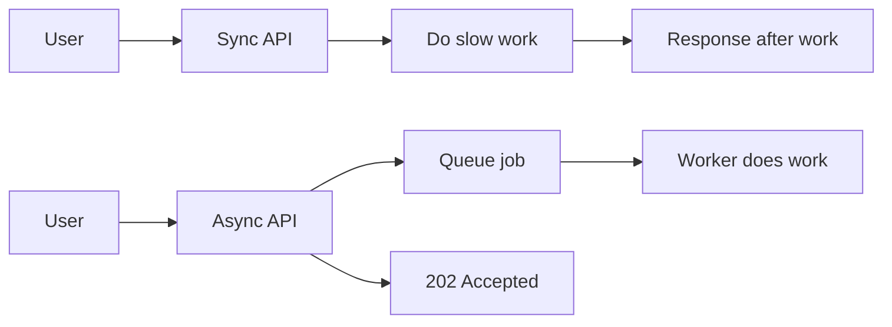
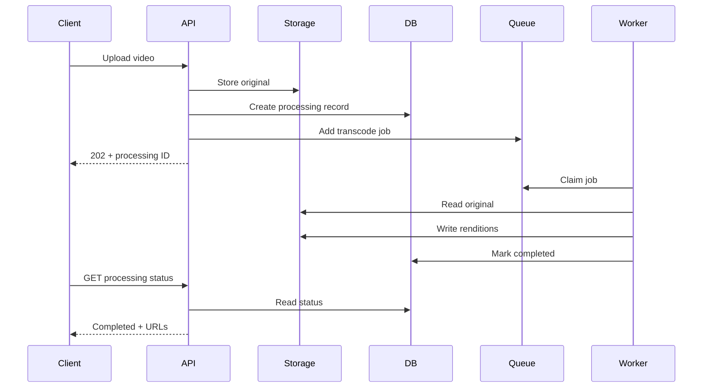
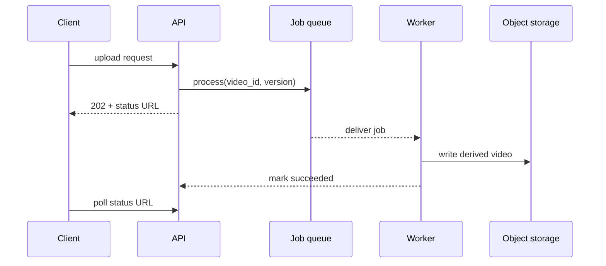

# Background Job Concepts

Background job means work executed outside the caller's synchronous request. Caller submits work, receives acknowledgment, and checks result later or receives notification.

## Synchronous Versus Asynchronous



Synchronous fits quick work where caller needs result immediately. Asynchronous fits long, retryable, bursty, or independently scalable work.

## Job Lifecycle

```text
created -> waiting -> active -> completed
                         |
                         v
                       failed -> retrying -> active
```

Possible states:

- **Waiting:** Stored but not claimed.
- **Active:** Worker owns execution lease.
- **Delayed:** Not eligible until timestamp.
- **Completed:** Finished successfully.
- **Failed:** Error recorded.
- **Stalled:** Worker lost lease or heartbeat.

## Job Data Design

Store small, stable references:

```json
{
  "jobId": "invoice-123",
  "orderId": "order-456",
  "requestedBy": "user-789"
}
```

Prefer IDs over full database records or binary files. Worker loads current data and validates state. Large payloads belong in object storage.

## Job Versus Event

| Job | Event |
|---|---|
| Instruction to do work | Record of something that happened |
| Usually one logical owner | Many consumers may read |
| Completion is important | History and replay may matter |
| `GenerateInvoice` | `InvoiceGenerated` |

Confusing these leads to wrong infrastructure. A job may emit an event after completion.

## Request and Job Identity

Use:

- Request ID for tracing API request.
- Job ID for queue execution.
- Business idempotency key for side effect.
- Correlation ID to connect related jobs.

Example:

```text
request_id = req-1
job_id = job-9
payment_idempotency_key = payment-attempt-22
```

## When to Use

Use background jobs for:

- Slow work.
- Work with transient failures.
- Work triggered by user but not needed before response.
- Work that benefits from controlled concurrency.
- Work that should absorb traffic bursts.

Avoid for tiny deterministic operations where queue overhead exceeds work.

## Pros, Cons, and Cost

**Pros:** faster APIs, controlled retries, burst absorption, independent worker scaling.<br>
**Cons:** eventual completion, duplicate execution, status complexity, extra infrastructure.<br>
**Cost:** queue storage, worker compute, Redis operations, monitoring, and on-call.

## Advanced Design

Define completion semantics before coding. "Accepted", "completed", "failed", and "cancelled" need separate states. A user-facing status endpoint should not infer completion from queue presence alone.

## Cancellation and Expiration

Cancellation is a business decision:

1. Set processing record to `cancel_requested`.
2. Worker checks state before each expensive step.
3. Worker stops safely if cancellation is allowed.
4. Worker marks `cancelled`.

Deleting a waiting job does not stop an already-running external process.

## Capacity Planning

Estimate:

```text
required workers = arrival rate * average processing time
```

Example: 10 jobs/second, each taking 2 seconds, needs about 20 concurrent slots before safety margin. Validate against CPU, memory, database, and provider limits.

## Interview Questions and Answers


#### Why return `202 Accepted`?

Because request accepted work, but processing has not finished. API should expose status or callback behavior.

#### What happens when worker crashes?

Queue must detect lost lease or stalled job and make job available again. Worker must be idempotent because work may have partially completed.

#### How prevent API and job inconsistency?

Use transactional outbox when database update and job publication must succeed together.


#### Why not put full database records in job data?

Records become stale, payloads consume Redis memory, and schema changes become harder. Store identifiers and reload current state.

#### How expose job result?

Use status endpoint, webhook, notification, polling with backoff, or WebSocket. Keep result in durable application storage, not only queue metadata.

#### What is eventual completion?

Request success means work accepted, not finished. Business UI must represent pending and failure states honestly.


#### When should an API return a job status URL?

Return one when completion is not immediate, the client needs progress or a result, or retries may span multiple requests. The status resource should expose stable states such as `queued`, `running`, `succeeded`, `failed`, and `expired` without leaking internal worker details.

#### How do you make job payloads safe to retry after a deploy?

Use a versioned payload or a stable reference to the source record, and keep workers backward-compatible during rollout. Avoid embedding assumptions about in-memory objects or code-specific serialized classes.

#### What is graceful shutdown for a worker?

Stop accepting new jobs, allow active jobs a bounded drain period, extend or release leases safely, and exit. A forced kill should be treated as a crash and verified through redelivery tests.

### Examples and Diagrams

#### Example

Order API commits order and outbox row in one transaction. Relay publishes `send-confirmation` job. Crash cannot leave committed order with no record of required work.

#### End-to-End Example: Video Processing



Do not put video bytes into Redis. Store object reference, codec profile, tenant ID, and correlation ID in job data.

#### Practical example: video processing



The status record is durable and keyed by `video_id` plus processing version, so a retry does not overwrite a newer result accidentally.
