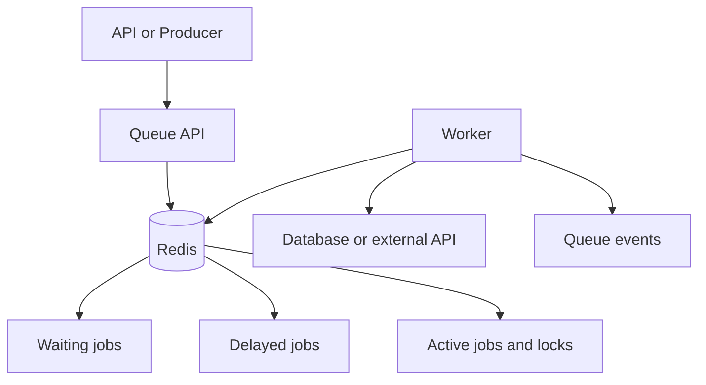
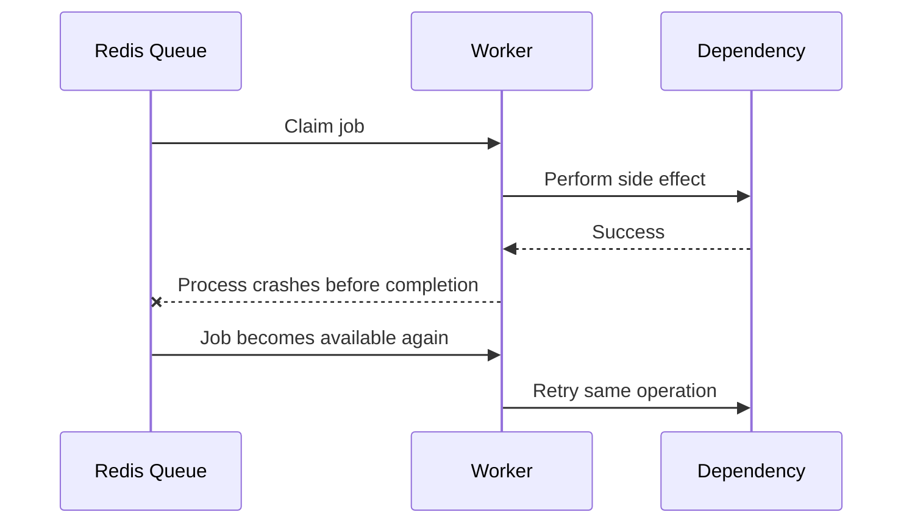
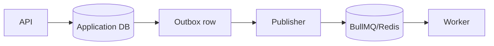

# BullMQ Deep Dive

BullMQ is a TypeScript-friendly Node.js library for distributed background jobs. It uses Redis data structures and Lua scripts to coordinate producers, workers, delayed jobs, retries, locks, and job state.

## Why BullMQ Was Born

Backend applications repeatedly need reliable work outside request handlers. A basic in-memory array loses jobs when process crashes. A database polling table works, but can create lock contention, polling load, and slow scheduling. BullMQ packages queue mechanics around Redis:

- Durable-enough job storage.
- Fast enqueue and claim operations.
- Worker coordination.
- Delayed and scheduled jobs.
- Retry and backoff.
- Concurrency and rate limits.
- Job lifecycle visibility.

BullMQ does not replace Redis, database transactions, or business idempotency.

## Basic Architecture



Producer adds a job. Worker claims job and creates a lock. Worker renews lock while processing. Completion or failure updates Redis state. If lock disappears, job may be considered stalled and become available again.

## Core Objects

### Queue

Application-facing producer object. Adds jobs and manages queue-level configuration.

### Job

Unit of work with:

- Name.
- Data.
- ID.
- Attempts.
- Delay.
- Priority.
- Progress.
- Return value.
- Failure reason.

### Worker

Consumes jobs and runs processor function. Multiple workers can share queue.

### Queue Events

Reports lifecycle changes for dashboards and integrations. Events are not a replacement for durable business events.

### Queue Scheduler and Job Schedulers

Delayed and repeatable work needs scheduling logic. Use current BullMQ scheduling APIs for new designs and verify version-specific behavior before production.

Treat failed jobs as a DLQ-like operational workflow, not as an automatic business dead-letter queue. Retain failure reason, attempts, stack or error class, job ID, schema version, and correlation ID; quarantine or replay only after the underlying cause is understood.

## Minimal Code

```ts
import { Queue, Worker } from "bullmq";

const connection = {
  host: process.env.REDIS_HOST,
  port: Number(process.env.REDIS_PORT ?? 6379),
};

const queue = new Queue("reports", { connection });

await queue.add(
  "generate-report",
  { reportId: "report-123" },
  {
    attempts: 5,
    backoff: { type: "exponential", delay: 1000 },
    removeOnComplete: 1000,
    removeOnFail: 5000,
  },
);

const worker = new Worker(
  "reports",
  async (job) => {
    const report = await loadReport(job.data.reportId);
    return generateAndStoreReport(report);
  },
  { connection, concurrency: 4 },
);
```

Use environment-specific Redis configuration, authentication, TLS, and timeouts. Never place secrets in job data or logs.

## Delivery Semantics

BullMQ processing is at-least-once in practical failure scenarios:



Design side effects with idempotency keys. Never promise exactly-once payment, email, or shipment solely because queue reports one job ID.

## Redis Design

### Persistence

Choose Redis persistence appropriate to loss tolerance. A queue holding non-critical cache refreshes can tolerate more loss than a billing job. For business-critical jobs, use managed Redis, backups, replication, failover testing, and an outbox.

### Memory

Job data, state, delayed indexes, completed jobs, failed jobs, and event streams consume memory. Keep payloads small and remove old completed jobs intentionally.

### Isolation

Do not mix critical queues with volatile cache data unless eviction, persistence, capacity, and failure behavior are explicitly safe. Dedicated Redis or logical isolation can reduce blast radius.

## Production Configuration Checklist

- Redis TLS and authentication.
- Connection retry and timeout policy.
- Durable persistence and backup.
- Worker graceful shutdown.
- Job timeout.
- Attempts and backoff.
- Completed and failed retention.
- Idempotency key.
- Alert on queue age and stalled jobs.
- Separate queues by workload.
- Schema version in job data.
- Runbook for replay and cancellation.
- DLQ or failed-job retention and redrive policy.

## Pros and Cons

### Pros

- Low application complexity.
- Good Node.js developer experience.
- Rich job controls.
- Fast enqueue and claim path.
- Horizontal worker scaling.
- Lower operational burden than event-streaming clusters for small workloads.

### Cons

- Redis becomes critical dependency.
- Memory pressure can affect every queue.
- Replay is not primary model.
- Job data retention needs active cleanup.
- Distributed duplicate execution remains possible.
- Cross-language and cross-team contracts need extra discipline.

## Cost Model

```text
total cost =
Redis capacity and replicas
  + worker compute
  + network and storage
  + observability
  + backup and recovery
  + engineering and on-call
```

BullMQ can be cheap at low volume. At high volume, Redis command rate, memory, delayed-job count, worker compute, and dependency quotas dominate. Compare with SQS pricing and operational cost before scaling Redis indefinitely.

## Use Cases

### Good Fit

- Email delivery.
- Image processing.
- Report generation.
- Webhook retry.
- Scheduled cleanup.
- Search indexing owned by one service.

### Poor Fit

- Long-term event history.
- Many independent consumer groups.
- Cross-team event contract with replay.
- Large binary payload storage.
- Work requiring strict global ordering.

## Advanced Patterns

### Transactional Outbox

Write business state and outbox row in one database transaction. Relay publishes BullMQ job. This avoids successful database commit with lost enqueue.

### Job Versioning

Include `schemaVersion` and keep workers able to process old jobs during rollout. Do not deploy producer and worker changes assuming queue empties instantly.

### Cancellation

Cancellation is business state, not merely deleting Redis job. Worker checks cancellation before expensive steps and external side effects.

### Multi-Tenant Fairness

One tenant can flood queue. Use per-tenant rate limits, queue partitioning, quotas, or fair scheduling.

## Interview Questions and Answers


#### Why use BullMQ instead of direct function call?

Direct call blocks request and shares failure lifecycle. BullMQ gives retry, delay, worker scaling, and failure visibility.

#### Why use Redis?

Redis offers fast atomic data structures and coordination primitives. Trade-off: memory, persistence, and Redis operations become critical.

#### What happens when worker crashes?

Active job lock eventually expires or job is detected stalled. Another worker may process it. Side effect must be idempotent.

#### How prevent completed-job memory growth?

Set completion retention, remove old jobs, and export needed audit information elsewhere.

#### How guarantee database update and job enqueue?

Use transactional outbox or design reconciliation that finds missing jobs. Queue call alone cannot join arbitrary database transaction.


#### How do stalled jobs arise in BullMQ?

A worker can stop renewing its lock because of a crash, event-loop blocking, process pause, or network problem. BullMQ detects the missing lock and makes the job available again. The handler must therefore tolerate duplicate execution.

#### How should Redis memory pressure be handled?

Estimate active, delayed, completed, and failed job retention separately. Keep payloads small, remove old results, set explicit limits, and alert before Redis reaches eviction or out-of-memory conditions. Do not rely on eviction for correctness-critical queues.

#### Can BullMQ guarantee exactly-once execution?

No. Locks and retries reduce coordination problems but cannot atomically bind Redis delivery to arbitrary external side effects. Design handlers to be idempotent and make the business state transition the source of truth.

### Examples and Diagrams

#### Example architecture question

**Question:** Build asynchronous invoice generation.<br>
**Answer:** API writes invoice request and outbox record, returns `202`, relay adds BullMQ job, worker loads invoice by ID, generates PDF to object storage, updates status idempotently, retries temporary errors, sends permanent failures to review, and exposes status plus metrics.

#### Practical example: transactional enqueue boundary



The application transaction writes the outbox row with the business state. A publisher retries until the BullMQ job exists, avoiding the “database committed but enqueue failed” gap.
