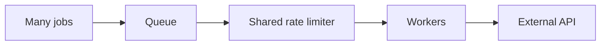
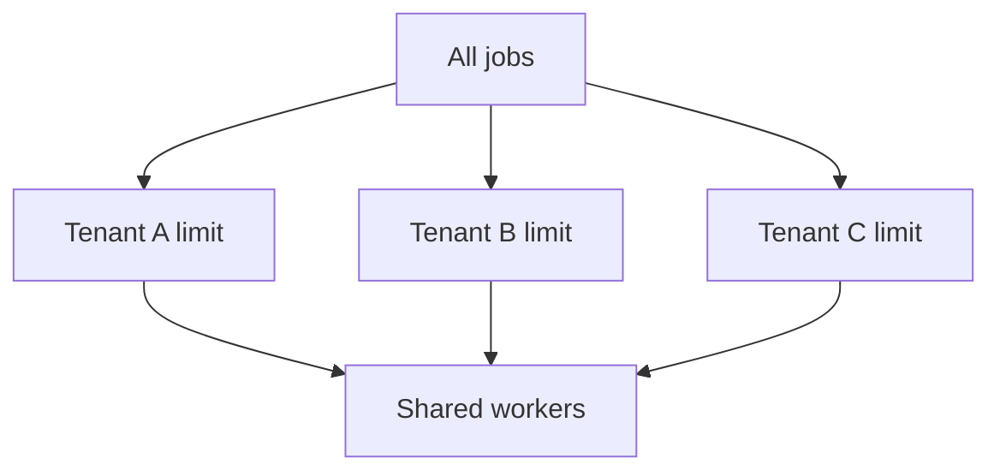

# Concurrency and Rate Limiting

Concurrency limits simultaneous jobs. Rate limits cap jobs over time. They solve different problems.

```text
concurrency = how many jobs run now
rate limit = how many jobs start per time window
```

## Concurrency Example

Image conversion uses CPU and memory:

```text
worker concurrency: 4
```

Starting 100 conversions at once may exhaust node memory. Queue keeps remaining jobs waiting.

## Rate-Limit Example

Payment provider allows 100 requests per second:

```text
rate limit: 100 jobs / second
```

Multiple worker instances need shared rate-limit coordination. Per-process limits alone can exceed provider quota.



## Choosing Values

Measure:

- Dependency quota.
- Worker CPU and memory.
- Database connection pool.
- Job duration.
- Queue age target.
- Error and throttle rates.

Increase concurrency only while downstream health remains acceptable.

## Interview Questions

### Why does high concurrency reduce throughput?

Contention, throttling, context switching, lock waits, and retries can outweigh parallelism.

### Why use shared limiter?

Distributed workers otherwise each believe they have full quota. Shared limiter enforces system-wide limit.

### Example

Ten workers each allow 20 provider calls per second. Without shared control, system may send 200 requests per second against 100-per-second quota. Shared limiter caps aggregate traffic.

## Pros, Cons, and Cost

**Pros:** protects dependencies, improves predictable throughput, avoids provider bans and resource exhaustion.  
**Cons:** lower burst capacity, limiter bottleneck, configuration drift across workers.  
**Cost:** idle worker capacity, limiter storage and commands, and possible delayed completion.

## Advanced Design

Rate limit by dependency, tenant, operation, or credential when quotas differ. Combine global limits with local concurrency. Measure queue age after every limit change.

## Little's Law Intuition

Approximate in-flight work:

```text
in-flight jobs = arrival rate * average job duration
```

At 20 jobs/second and 3-second duration, about 60 concurrent slots are needed to keep up, before headroom. If arrival rate exceeds sustainable completion rate, queue age grows.

## Tenant Fairness

One tenant can consume all concurrency. Add per-tenant limits:



Combine global dependency quota with tenant quota. A tenant limit protects fairness; global limit protects provider.

## More Interview Questions

### What should be tuned first: concurrency or rate limit?

Identify bottleneck. Use concurrency for resource saturation and rate limit for external quota. Often both are required.

### How detect a limit that is too low?

Queue age rises while dependency has spare capacity and error rate is low. Increase gradually and observe.

### How detect a limit that is too high?

Provider 429s, database saturation, timeouts, memory pressure, or retry growth increase after scaling.