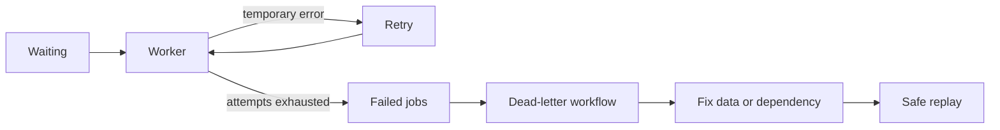
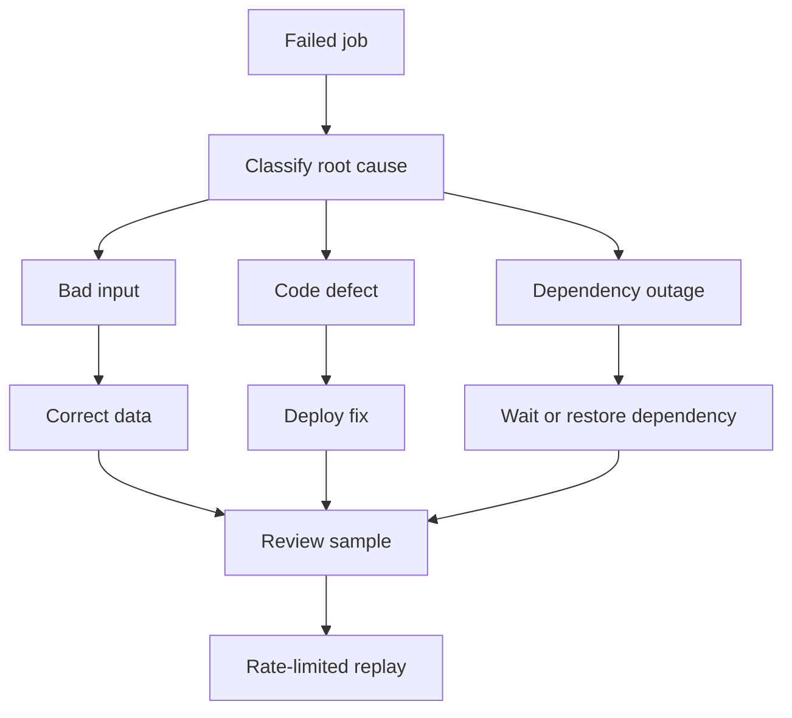
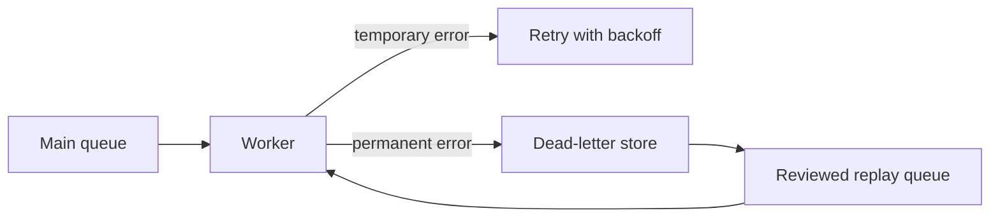

# Dead-Letter and Failed Jobs

Failed job is execution state. Dead-letter handling is an operational workflow for jobs that cannot safely continue automatically.

## Failure Flow

## Permanent Versus Temporary

Temporary:

- Timeout.
- Rate limit.
- Dependency unavailable.

Permanent:

- Invalid schema.
- Missing mandatory field.
- Unsupported document.
- Authorization permanently denied.

Do not retry permanent errors forever.

## Failed-Job Record

Keep:

- Job ID.
- Name and version.
- Business ID.
- Error class and message.
- Attempt count.
- First and last failure time.
- Correlation ID.
- Payload reference.
- Safe replay status.

Avoid storing secrets in failed payloads.

## Replay Safety

Before replay:

1. Identify root cause.
2. Confirm idempotency.
3. Check current business state.
4. Limit replay rate.
5. Observe downstream systems.

## Pros, Cons, and Cost

**Pros:** prevents infinite retry, preserves investigation context, enables controlled recovery. 
**Cons:** manual operations, sensitive-data risk, replay mistakes, storage retention. 
**Cost:** failed-job storage, operator time, dashboards, alerts, and replay validation.

## Advanced Design

Separate automatic retry from human replay. Replay by business ID and schema version, not blind payload copy. Record who replayed what, when, and with which code version.

## Dead-Letter Operations

Do not provide unrestricted "retry all" button. It can duplicate payments, overload provider, or recreate the original incident.

## Retention and Privacy

Failed payloads may contain personal data or tokens. Prefer references to secure storage, redact error messages, encrypt records, restrict operator access, and delete after retention period.

## Interview Questions and Answers

#### Is failed-job list a DLQ?

Conceptually similar, but operational meaning matters. A DLQ needs ownership, alerting, inspection, remediation, and replay process.

#### What if failed jobs contain sensitive data?

Minimize payload, encrypt storage, restrict access, redact logs, and define retention deletion.

#### Should DLQ jobs be retried automatically?

Usually no. DLQ means normal retry policy was exhausted or error is non-retryable. Human or controlled remediation should identify cause first.

#### How prioritize DLQ recovery?

Rank by business impact, age, dependency, data sensitivity, and replay safety. Payment and fulfillment need stronger review than analytics.

#### What is a poison queue?

A queue repeatedly receives messages that cannot succeed, causing retry growth and worker starvation. Bound attempts and isolate failed work.

#### What metadata belongs in a dead-letter record?

Keep the original job ID and payload reference, attempt count, timestamps, error class and message, worker version, dependency response, and a correlation ID. Redact secrets and large payloads; operators need enough context to diagnose without creating a second sensitive-data store.

#### How can an operator replay safely?

Classify the failure, fix the cause, select a bounded batch, and replay into a quarantine or normal queue with a replay ID. Confirm idempotency and monitor side effects before releasing the full backlog.

#### Is a failed-job list automatically a business DLQ?

No. It is an implementation record. A business DLQ needs ownership, retention, redaction, alerting, inspection, replay controls, and a policy for when a failure is permanently abandoned.

### Examples and Diagrams

#### Example

Invoice job fails because template version is missing. Move to failed workflow, deploy template, validate sample, replay jobs at controlled rate.

#### Practical example: poison job isolation

A review gate prevents malformed jobs from immediately cycling back into production. Keep the original failure attached to the replay audit record.
