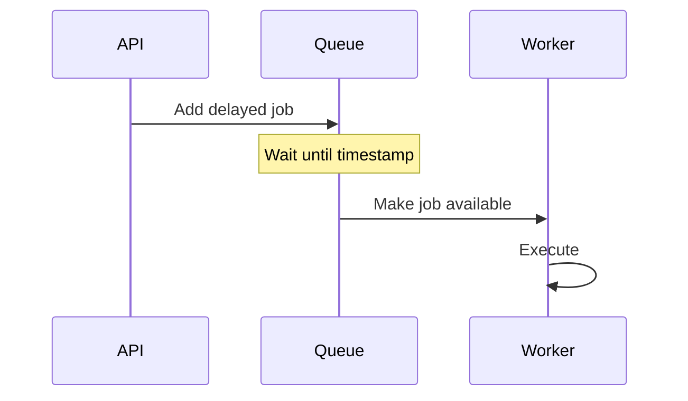
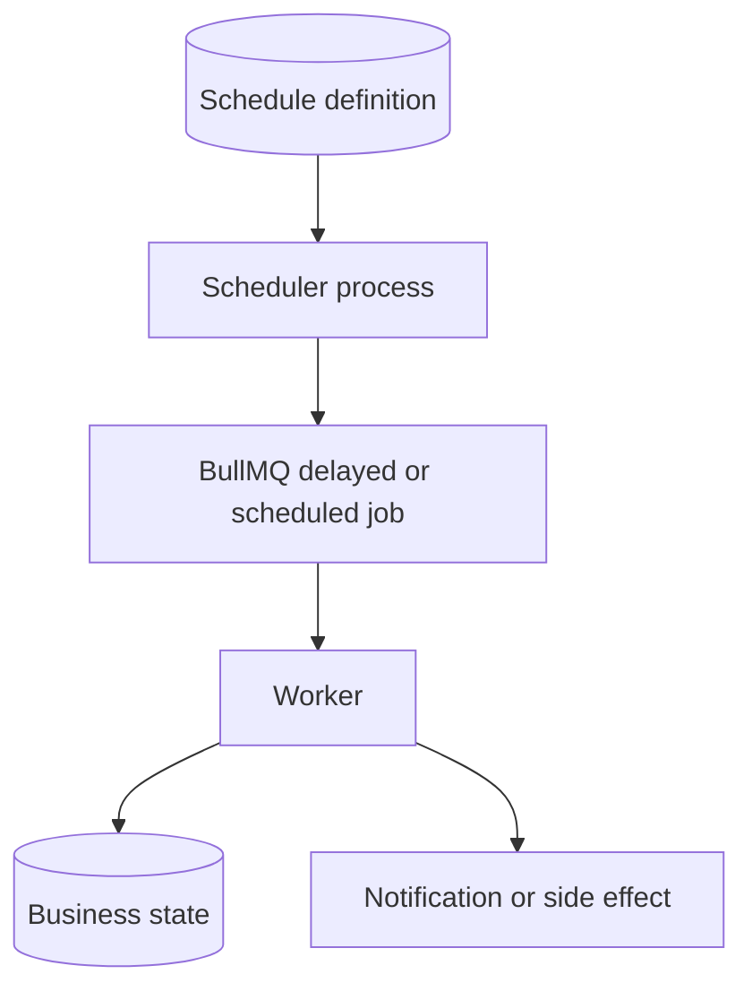

# Delayed and Scheduled Jobs

Delayed job becomes eligible after a future timestamp. Scheduled job repeats according to a schedule.

## Use Cases

- Send reminder 24 hours after signup.
- Retry payment tomorrow.
- Run nightly cleanup.
- Refresh subscription before expiration.
- Generate daily report.



## Scheduling Rules

Store business timezone explicitly. UTC timestamps avoid daylight-saving surprises. A recurring job should be safe if scheduler runs twice.

```text
schedule_id = daily-invoice-tenant-1
run_date = 2026-09-09
```

Unique identity prevents duplicate schedule creation.

## Delayed Job Caveats

- Redis clock and application clock must be monitored.
- Long retention consumes storage.
- Deleted users or orders may make job obsolete.
- Worker must re-check current business state.
- Missed schedules need catch-up policy.

## Example

Subscription cancellation reminder:

1. Save subscription expiration.
2. Add delayed `send-expiration-reminder`.
3. Worker loads subscription.
4. If already renewed, mark obsolete.
5. Otherwise send reminder idempotently.

## Interview Questions

### What if worker is down at due time?

Queue keeps delayed job until worker returns, subject to Redis durability and retention. Define whether late execution is acceptable.

### How avoid duplicate recurring jobs?

Use deterministic job ID and unique schedule identity. Worker also checks idempotency.

### When use external scheduler?

Use one when schedule orchestration, calendar semantics, or cross-service workflows exceed queue library scope.

## Pros, Cons, and Cost

**Pros:** delayed retries, reminders, recurring work, no polling loop in API.  
**Cons:** clock and timezone issues, missed-run policy, duplicate schedules, long retention.  
**Cost:** retained delayed jobs, scheduler operations, worker execution, and monitoring.

## Advanced Design

Define misfire policy: skip, run once immediately, or catch up every missed occurrence. Keep schedule definition in durable application data so recreation does not silently duplicate work.

## Scheduling Architecture



Scheduler should be lightweight. Business truth belongs in database. Worker must verify current state because a delayed job may become obsolete.

## Time and Misfire Example

Subscription expires at `2026-09-10T00:00:00Z`. System is down until `02:00Z`.

- **Skip:** no reminder; acceptable if reminder is optional.
- **Run once now:** send one late reminder.
- **Catch up:** send every missed occurrence; dangerous for notifications.

Choose policy per business action.

## More Interview Questions

### Why use UTC?

UTC avoids ambiguous daylight-saving transitions. Convert to user timezone only for presentation and business-calendar decisions.

### What if schedule creation request times out?

Use deterministic schedule ID and idempotent upsert. Client retry should not create duplicate schedules.

### Can delayed job guarantee exact execution time?

No. It guarantees eligibility after time, not real-time execution. Worker capacity, Redis availability, and outages create delay.