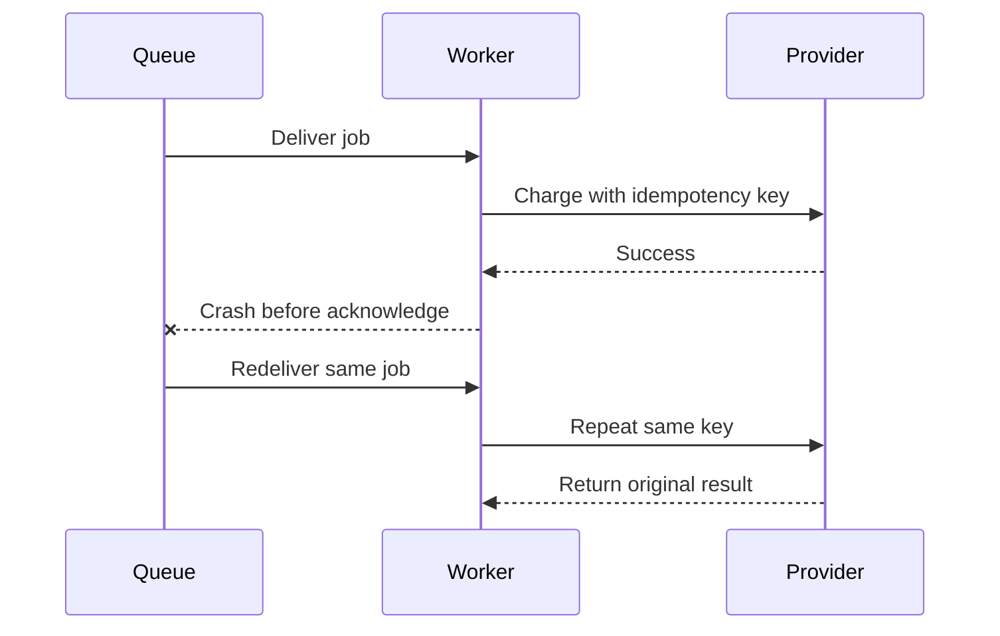
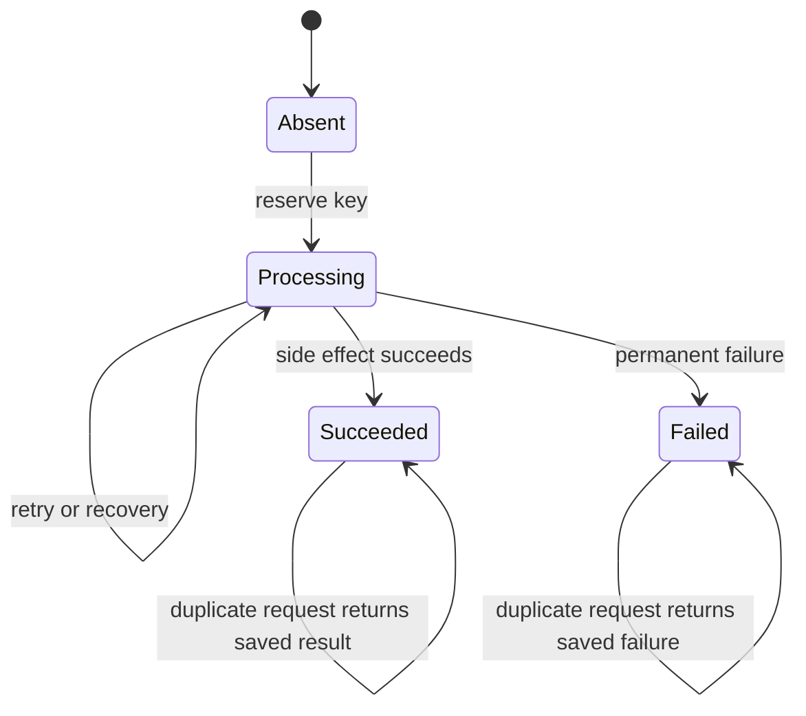

# Idempotency

Idempotency means repeating same operation produces same business result, not duplicate side effect.

## Why Jobs Need It

Worker can:

1. Complete external side effect.
2. Crash before marking job complete.
3. Receive same job again.

At-least-once execution makes duplicates normal.



## Techniques

### Unique Database Constraint

Store operation key:

```text
unique(payment_attempt_id)
```

Second execution sees existing result.

### Provider Idempotency Key

Send stable key to payment, email, or shipping provider when supported.

### Processed-Event Table

Record `(consumer, event_id)` after successful transaction. Duplicate checks existing row.

### Deterministic Output

Writing same object version or using upsert can make repeat safe.

## Idempotency Boundary

Queue job ID alone may not protect side effect. Job can be recreated with new queue ID. Business operation ID must remain stable.

## Interview Questions

### Is idempotency same as exactly once?

No. Execution may happen multiple times; business effect becomes one logical result.

### Where store idempotency key?

Durable database or provider system, not worker memory.

### Example

`capture-payment` carries `payment_attempt_id`. Worker retries after timeout. Payment service returns prior capture result instead of charging twice.

## Pros, Cons, and Cost

**Pros:** safe retries, crash recovery, easier replay, protection from duplicate charges.  
**Cons:** durable key storage, retention policy, race-condition design, provider limitations.  
**Cost:** idempotency table storage, unique indexes, provider features, and cleanup jobs.

## Advanced Design

Reserve idempotency key and outcome atomically. Concurrent requests with same key must wait for or return one result, not execute side effect twice. Retain keys at least as long as late retries can arrive.

## Atomic State Machine



Store status, request hash, result reference, and timestamps. Reject same key with different payload unless API contract explicitly allows it.

## Idempotency Versus Concurrency

Two workers can receive same business operation concurrently. Unique constraint or atomic `INSERT ... ON CONFLICT` must decide one owner. A check-then-insert sequence without transaction can race.

## More Interview Questions

### How long retain idempotency keys?

At least longer than maximum client retry, queue retry, provider retry, and reconciliation window. Delete only after late duplicate cannot arrive.

### What if first attempt remains `processing` forever?

Use lease expiration and recovery worker. Do not let permanent `processing` block operation indefinitely.

### Why hash request payload?

Same idempotency key with different payload is usually client bug or abuse. Hash detects conflict and prevents ambiguous result.