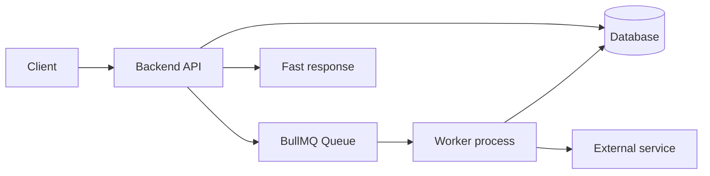
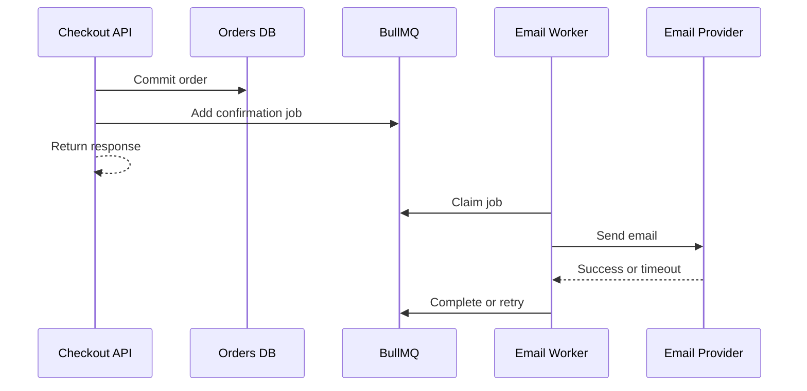

# BullMQ and Background Jobs

BullMQ is a Node.js background-job library built on Redis. It helps backend services move slow, retryable, scheduled, or bursty work outside the HTTP request path.



## Why Background Jobs Exist

HTTP request should finish within user-facing latency budget. Some work does not:

- Send email or push notification.
- Resize image or transcode video.
- Generate invoice or export report.
- Call slow third-party API.
- Rebuild search index.
- Run scheduled cleanup.

Without a job queue, API process performs work directly:

```text
Client -> API -> slow work -> response
```

User waits. Request may time out. One slow dependency consumes API capacity.

With background job:

```text
Client -> API -> enqueue job -> response
                         |
                         v
                       Worker -> slow work
```

API becomes responsive. Workers can retry, scale, pause, and process jobs independently.

## When BullMQ Fits

Use BullMQ when:

- One application or logical workflow owns job execution.
- Jobs need retries, delay, scheduling, priority, or rate limiting.
- Redis already exists and can handle queue workload.
- Workers are Node.js services.
- Historical replay is not a core requirement.
- Jobs are work instructions, not a durable event log.

Do not choose BullMQ only because Redis is available. Check Redis memory, persistence, high availability, backup, and operational ownership first.

## Core Mental Model

```text
Producer -> Queue -> Worker -> completed or failed
```

- **Producer:** Adds job with name and data.
- **Queue:** Stores job state in Redis.
- **Worker:** Claims and processes job.
- **Completed:** Job finished successfully.
- **Failed:** Job exhausted attempts or encountered failure.
- **Scheduler:** Promotes delayed or scheduled jobs.

## Minimal Example

```ts
import { Queue, Worker } from "bullmq";

const connection = { host: "localhost", port: 6379 };
const emailQueue = new Queue("email", { connection });

await emailQueue.add("send-welcome", {
  userId: "user-123",
  email: "user@example.com",
});

const worker = new Worker(
  "email",
  async (job) => {
    if (job.name === "send-welcome") {
      await sendWelcomeEmail(job.data.email);
    }
  },
  { connection },
);
```

## Architecture Choices

### One Queue, One Worker Type

Good default for small systems:

```text
API -> email queue -> email workers
API -> image queue -> image workers
```

Separate queues isolate capacity and retry policies.

### Shared Redis, Separate Queues

Useful when one Redis platform serves several workloads. Set memory limits, prefixes, ownership, and alerts. Do not let one noisy queue consume all Redis memory.

### Dedicated Redis

Use dedicated Redis when queue traffic, persistence, latency, or failure isolation differs from cache traffic. Cache eviction should not delete business-critical jobs.

## Reliability Baseline

Reliable BullMQ design needs:

- Durable Redis configuration.
- Idempotent workers.
- Bounded retries with backoff.
- Dead-letter or failed-job workflow.
- Job timeout and stalled-job handling.
- Unique job IDs where duplicates matter.
- Metrics and alerts.
- Graceful worker shutdown.
- Recovery runbook.

BullMQ provides execution mechanics. It does not make external side effects exactly once.

## Pros and Cons

### Pros

- Simple Node.js API.
- Fast adoption.
- Retries, delays, priorities, concurrency, and rate limits.
- Good fit for one application workflow.
- Redis-backed horizontal workers.
- Lower complexity than Kafka for ordinary jobs.

### Cons

- Redis memory and persistence become critical.
- Not a general event-replay platform.
- Strong cross-service routing needs another model.
- Duplicate execution remains possible.
- Large job payloads waste Redis memory.
- Queue cleanup and retention need explicit policy.
- Node.js worker runtime may not fit every workload.

## Cost

Cost includes:

- Redis memory and replicas.
- Network and storage.
- Worker compute.
- Monitoring and alerting.
- Redis backup and failover.
- On-call and recovery work.

Small workloads may fit an existing Redis instance. Production workloads often deserve managed Redis or isolated capacity. Compare cost against managed SQS, RabbitMQ, or a database-backed job table.

## Example: E-Commerce Email

Checkout writes order state, then enqueues confirmation email. Worker sends email and retries provider timeout. User does not wait for email provider.



## Interview Questions and Answers

### What problem does BullMQ solve?

It moves asynchronous work from request handlers to workers and provides job state, retry, delay, and concurrency controls.

### Is BullMQ a message broker?

It is a job queue library built on Redis. It can move messages, but its primary abstraction is executable work, not general service routing or durable event replay.

### When should BullMQ not be used?

Avoid it when many independent services need durable fanout, long event retention, replay, or Kafka-style consumer groups.

### How do you make BullMQ reliable?

Use durable Redis, idempotent workers, bounded retries, backoff, failed-job handling, monitoring, graceful shutdown, and tested recovery.

### Example design question

**Question:** User upload triggers image processing. What do you choose?  
**Answer:** Store original image, enqueue `resize-image`, return `202`, process with BullMQ worker, store output, expose status endpoint. No Kafka unless replayable image-event history is required.