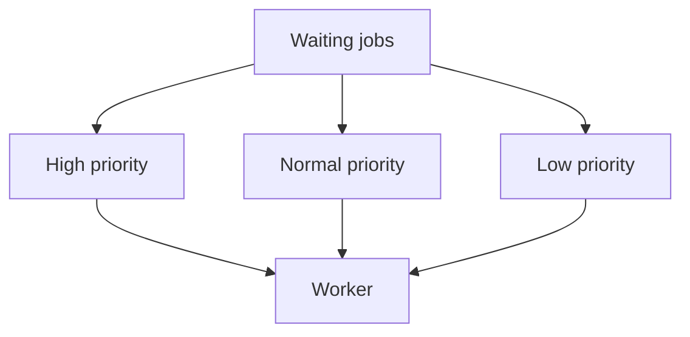
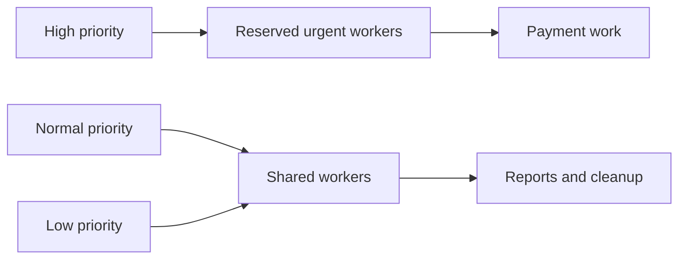
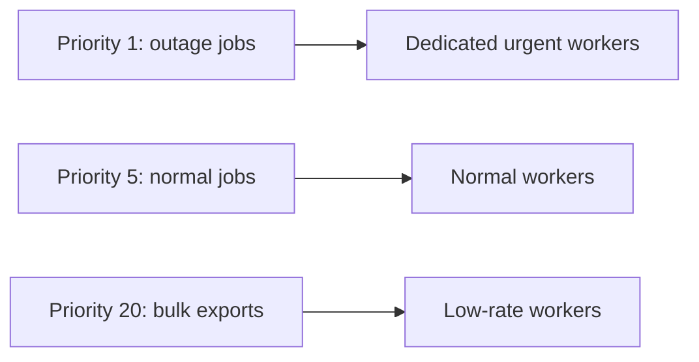

# Job Priorities

Priority lets urgent jobs run before less important jobs when workers are constrained.

Example:

```text
priority 1: payment confirmation
priority 5: welcome email
priority 10: analytics export
```



## Why Priorities Matter

Without priorities, large batch jobs can delay customer-facing work. Priorities protect business-critical latency.

## Priority Risks

High-priority jobs can starve low-priority jobs. Use aging, separate queues, quotas, or reserved worker capacity.

Example:

```text
80% workers: customer jobs
20% workers: reports and cleanup
```

Separate queues often make capacity policy clearer than one queue with many priority values.

## When to Use

Use priorities when jobs share queue and resource pool but business urgency differs. Use separate queues when workloads need different owners, concurrency, retry, or scaling.

## Pros, Cons, and Cost

**Pros:** protects urgent work, simple business ordering, better latency under contention.<br>
**Cons:** starvation, fairness complexity, misleading SLA expectations.<br>
**Cost:** reserved worker capacity and possible lower utilization for low-priority queues.

## Advanced Design

Priority is not isolation. If high-priority and low-priority jobs share Redis and downstream dependencies, high-priority work can still suffer. Use queue isolation when failure domains differ.

## Fairness Strategies



Use reserved workers for hard latency requirements. Use weighted scheduling or aging when every class must make progress.

## Priority Inversion

High-priority job may depend on a resource held by low-priority job, such as a database lock or tenant quota. Priority queue alone cannot solve dependency priority inversion. Keep critical transactions short and reserve downstream capacity.

## Interview Questions and Answers


#### Can priority guarantee SLA?

No. Priority only influences scheduling. Worker capacity, downstream latency, and retries still control completion time.

#### How prevent starvation?

Reserve capacity, cap high-priority rate, or increase priority of waiting jobs over time.


#### Is lower numeric value always higher priority?

Library configuration decides interpretation. Document convention and test it. Do not assume priority semantics from another queue system.

#### Should every job have priority?

No. Default priority is simpler. Add priority only when business latency differs and team can define fairness policy.


#### How should priority interact with retries?

A retry should normally retain the business urgency, but repeated low-value failures must not monopolize the urgent lane. Use a retry budget, separate retry queues, or aging so a hot failure does not starve fresh work.

#### When is a separate queue better than a numeric priority?

Use separate queues when workloads have different workers, resource limits, or on-call owners. Numeric priority is simpler when the same handler and capacity pool can serve every class without starvation.

#### How should priority be explained in an interview?

State the ordering scope, starvation policy, retry behavior, and whether priority is advisory or contractual. “High priority runs first” is incomplete without describing what happens under a sustained high-priority flood.

### Examples and Diagrams

#### Example

Payment receipt job has high priority; nightly analytics export has low priority. During sale traffic, receipt jobs run first, while export continues with reserved low-priority workers.

#### Practical example: customer support export



Each lane has a concurrency budget. This makes capacity and SLA behavior predictable instead of hoping a single priority queue remains fair under failure.
