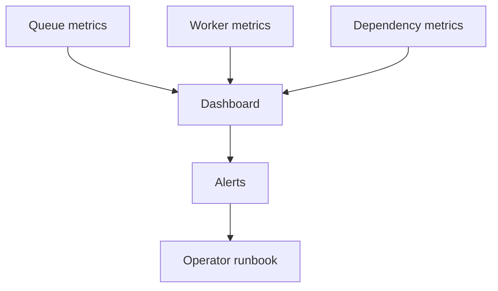
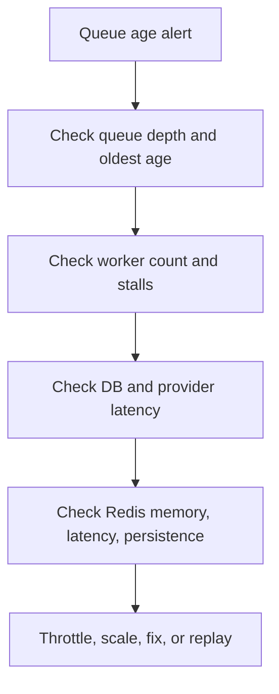

# BullMQ Observability

Queue systems fail gradually before they fail visibly. Monitoring queue age and worker health catches problems earlier than checking only failed count.

## Key Metrics

### Queue Metrics

- Waiting jobs.
- Active jobs.
- Delayed jobs.
- Completed jobs.
- Failed jobs.
- Oldest waiting age.
- Throughput.

### Worker Metrics

- Active worker count.
- Job duration.
- Success rate.
- Retry rate.
- Stalled jobs.
- Process CPU and memory.
- Graceful shutdown duration.

### Dependency Metrics

- Database latency.
- Provider response codes.
- Rate-limit responses.
- Connection pool usage.
- Redis latency and memory.



## Important Alerts

Alert on:

- Oldest job age above SLA.
- Queue depth growing continuously.
- Consumer count unexpectedly zero.
- Stalled jobs increasing.
- Failed or DLQ rate spike.
- Redis memory near limit.
- Redis replication or persistence failure.

Queue depth alone is weak. Ten thousand fast jobs may be healthier than ten old jobs blocked by one dependency.

## Tracing

Propagate:

- Trace ID.
- Request ID.
- Job ID.
- Business ID.
- Parent job ID.

Trace:

```text
HTTP request -> enqueue -> worker claim -> database -> external provider
```

## Dashboard Example

```text
email queue:
  oldest job: 8s
  waiting: 120
  active: 20
  failure rate: 0.2%
  provider 429: 0
```

If oldest age rises while active stays full, add capacity only after checking provider and database limits.

## Interview Questions

### Which metric detects user-visible delay?

Oldest waiting age or end-to-end completion latency. Queue depth does not show age.

### How detect stalled workers?

Track heartbeats, active-job duration, worker process health, and stalled-job count.

### Example incident

Email queue grows. Worker count is healthy, but provider returns 429. Correct action is lower rate, backoff, and inspect provider quota, not blindly add workers.

## Pros, Cons, and Cost

**Pros:** faster diagnosis, measurable SLOs, safer scaling, evidence-based incident response.  
**Cons:** metric cardinality, log volume, trace overhead, alert fatigue.  
**Cost:** metrics storage, log ingestion, tracing, dashboards, and on-call maintenance.

## Advanced Design

Track end-to-end latency from job creation to completion, not only worker duration. Partition metrics by queue, job type, outcome, dependency, and tenant only where cardinality remains affordable.

## SLO Example

```text
99% of email jobs complete within 60 seconds
99.9% of payment jobs complete or enter review within 30 seconds
failed-job rate below 0.5%
```

Measure from enqueue time to final outcome. Worker execution time alone misses waiting and retry delays.

## Incident Investigation



Use correlation IDs to connect API logs, worker logs, database traces, and provider requests. Avoid logging full job payloads when they contain personal or secret data.

## Cardinality Control

Do not create metrics label for unrestricted user ID, job ID, or request ID. Put those values in logs or traces. Metrics should aggregate by queue, job type, status, and bounded tenant class.

## More Interview Questions

### Why monitor oldest job age?

It reflects user-visible delay better than queue count. A small queue can still contain one job older than SLA.

### What should alert page versus ticket?

Page on imminent business SLO breach, zero workers, Redis failure, or payment backlog. Ticket slower analytics lag or routine failed jobs below threshold.

### Why keep queue events separate from business events?

Queue events describe processing mechanics. Business events describe domain facts and may need durable consumers or replay.