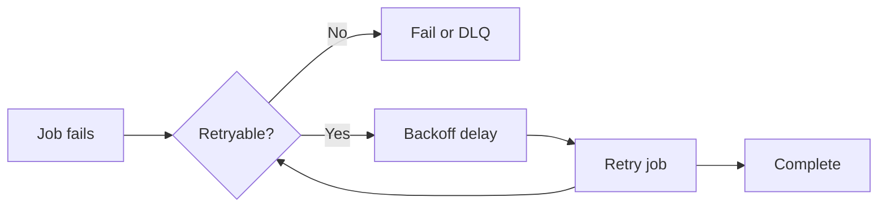
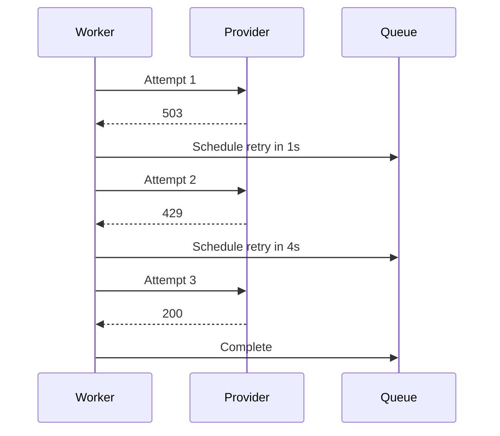
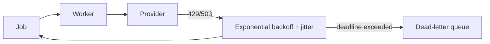

# Retries and Backoff

Retries handle temporary failure. They do not fix permanent errors.

## Failure Categories

Retry:

- Network timeout.
- HTTP 429 rate limit.
- Temporary database outage.
- Provider 5xx error.

Do not retry forever:

- Invalid payload.
- Missing required record.
- Authentication failure.
- Unsupported file format.

## Backoff



Exponential backoff:

```text
1s, 2s, 4s, 8s, 16s
```

Add jitter so thousands of jobs do not retry at same instant.

## Retry Budget

Define:

- Maximum attempts.
- Maximum elapsed time.
- Delay cap.
- Retryable error classes.
- Dead-letter action.

Example: payment provider timeout retries 5 times over 2 minutes, then moves to failed-payment review.

## Duplicate Side Effects

Retry can repeat side effect. Use provider idempotency key:

```text
payment_attempt_id = order-123-payment-1
```

Provider returns same result for repeated request.

## Pros, Cons, and Cost

**Pros:** resilience against temporary outages, smoother recovery, fewer manual retries.<br>
**Cons:** delayed completion, duplicate side effects, retry storms, hidden poison messages.<br>
**Cost:** extra provider calls, queue retention, worker time, and operator investigation.

## Advanced Design

Classify errors explicitly. Keep retry policy near dependency contract. Use a global retry budget so one failing provider cannot consume all worker capacity.

## Retry Storm Prevention

- Cap attempts and total elapsed time.
- Use circuit breaker for dependency-wide outage.
- Pause queue when provider is clearly unavailable.
- Separate retry queue from fresh work when fairness matters.
- Alert before retry backlog consumes Redis memory.

## Interview Questions and Answers


#### Why is immediate retry dangerous?

It increases load during outage and can create retry storm. Backoff and jitter spread pressure.

#### What belongs in failed-job handling?

Failure reason, attempts, timestamps, payload reference, correlation ID, operator action, and safe replay procedure.


#### Should every exception be retried?

No. Classify by error type, HTTP status, dependency contract, and business state. Retry only errors likely to succeed later.

#### What is retry amplification?

One failed request creates many retries, multiplying load during outage. Bounded exponential backoff and retry budgets limit amplification.

#### How handle timeout ambiguity?

Use idempotency key and query provider status when possible. Timeout does not prove operation failed; repeating without key can duplicate side effect.


#### How should a retry budget be chosen?

Choose it from the user or business deadline, dependency recovery characteristics, and cost of repeated side effects. A retry policy should have a maximum elapsed time, attempt cap, and terminal path; “retry until it works” is not a policy.

#### Why add jitter to exponential backoff?

Without jitter, many workers retry at the same powers-of-two boundary and create a synchronized retry storm. Randomized delay spreads load and gives a recovering dependency a chance to stabilize.

#### What is timeout ambiguity?

The client may time out even though the provider completed the request. Retrying a non-idempotent operation can duplicate the effect, so use a provider idempotency key or reconcile by a stable business reference before retrying.

### Examples and Diagrams

#### Example

Email provider returns 429. Worker throws retryable error. BullMQ delays retry. Provider returns 400 for invalid address. Worker records permanent failure and does not retry forever.

#### Retry Timeline Example



Retry delay should respect provider `Retry-After` when trustworthy. Add random jitter to avoid synchronized retries after shared outage.

#### Practical example: provider outage



Honor `Retry-After` when trustworthy, cap the delay, and reduce concurrency while the provider is unhealthy. Record the final reason so operators can distinguish exhausted retries from invalid input.
