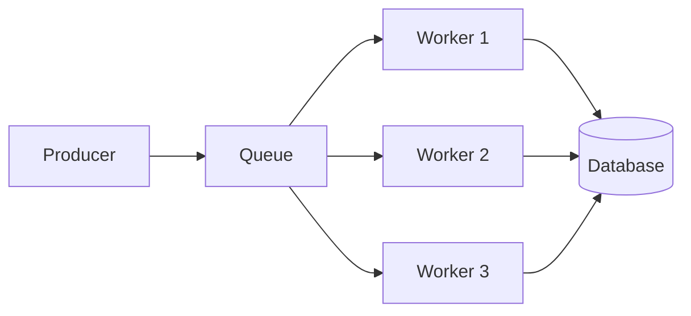
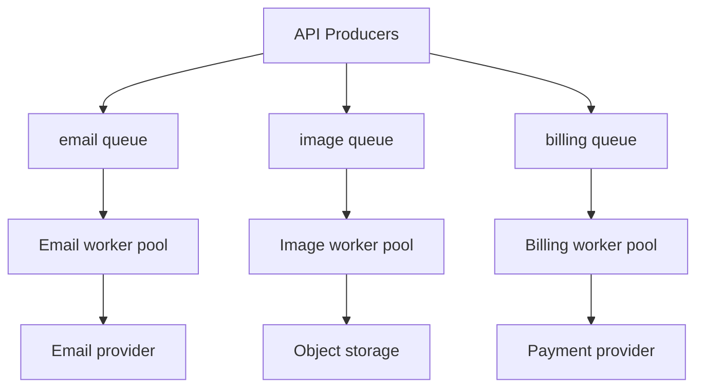
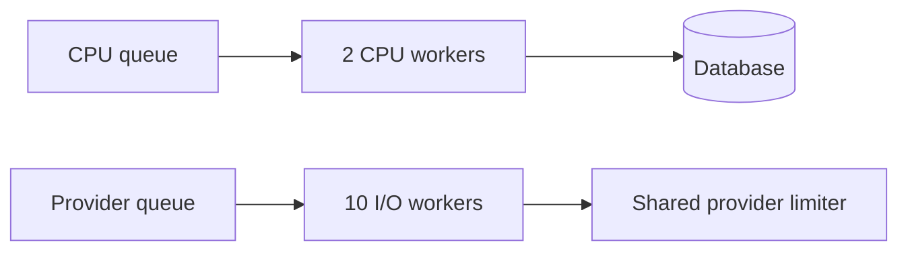

# Workers and Queues

Queue stores work. Worker executes work. Scaling workers increases throughput until CPU, database, external API, or Redis becomes bottleneck.



## Queue Design

Create separate queues when workloads differ:

- `email`: slow external provider.
- `image`: CPU-heavy processing.
- `billing`: strict reliability and low concurrency.
- `cleanup`: low priority maintenance.

One generic queue hides different capacity and retry needs.

## Worker Design

Worker should:

1. Validate job data.
2. Load current state.
3. Check idempotency.
4. Execute bounded work.
5. Persist result.
6. Emit metrics.
7. Throw error for retryable failure.

Do not catch every error and mark job successful. That creates silent loss.

## Horizontal Scaling

Add worker processes when queue age grows:

```text
queue age rising -> add workers -> downstream capacity check
```

More workers can overload database or provider. Scale bottleneck, not only queue.

## Graceful Shutdown

Worker shutdown should stop accepting new jobs, allow active job to finish within deadline, release resources, then exit. Long forced termination creates duplicate work.

## Concurrency

Concurrency controls simultaneous jobs per worker. Set based on job type:

- CPU-heavy: near available CPU cores.
- I/O-heavy: higher, bounded by dependency capacity.
- Payment: low, bounded by provider and consistency rules.

## Pros, Cons, and Cost

**Pros:** horizontal scaling, workload isolation, simple ownership, controlled downstream pressure.<br>
**Cons:** worker deployment, shutdown, autoscaling, and capacity tuning add operations.<br>
**Cost:** worker instances, Redis commands, database connections, and dependency quota.

## Advanced Design

Use separate worker pools for CPU-heavy and I/O-heavy jobs. Autoscale from oldest job age and throughput, not CPU alone. Keep reserved capacity for urgent queues.

## Claim, Lock, and Stall

Worker claims job through atomic Redis operations. While active, worker renews a lock. If process dies or event loop blocks long enough, lock renewal can fail. Queue may mark job stalled and make it available again.

Long synchronous CPU work can block lock renewal. Move CPU-heavy work to separate process or worker thread and tune lock duration carefully.

## Database Connection Pressure

Worker count multiplied by concurrency can exceed database pool:

```text
10 workers * concurrency 20 = up to 200 active jobs
```

If database allows 50 connections, jobs queue inside application or database. Set concurrency from dependency capacity, not machine CPU only.

## Interview Questions and Answers


#### Queue or one worker per queue?

Separate worker type when code, scaling, retry, or ownership differs. One worker can process multiple queues only when lifecycle and resource behavior remain clear.

#### Why not add unlimited workers?

Downstream systems become saturated, retries increase, and latency worsens. Queue protects downstream capacity only when concurrency is bounded.


#### How deploy worker safely?

Stop claiming new jobs, wait for active jobs within grace period, then terminate. Keep old and new versions compatible with queued job schema.

#### What is poison-pill behavior?

A job always fails because input is invalid or code path is broken. Bound retries and move it to failed workflow so it cannot block healthy work.

#### How choose queue boundaries?

Separate when jobs differ in ownership, SLA, dependency, retry policy, security, or resource profile.


#### How do you drain workers during a deployment?

Mark workers as closing, stop fetching new jobs, wait for active handlers up to a deadline, and let unfinished jobs become retryable if the deadline expires. Deploy one pool at a time and verify queue age stays within the SLO.

#### How should queue boundaries reflect resource limits?

Put jobs sharing a scarce dependency behind a common concurrency or rate limit. Split queues when they need different CPU, memory, timeout, priority, or retry behavior. Queue names should communicate ownership and operational policy.

#### Why can adding workers reduce throughput?

Workers compete for Redis connections, database pools, CPU, locks, and downstream quotas. Measure the bottleneck and increase one constrained resource at a time; concurrency is useful only while the critical path has capacity.

### Examples and Diagrams

#### Example

Image worker concurrency 4 may be safe on 2 CPU cores. Email worker concurrency 50 may be safe if provider allows it. Same concurrency value cannot fit both.

#### Queue Topology Example



Separate queues prevent image bursts from delaying billing jobs. Separate worker deployments allow independent CPU, memory, concurrency, and rollout settings.

#### Practical example: bounded worker pools



Separate pools prevent I/O-heavy work from consuming CPU slots, while the shared limiter protects the external provider across replicas.
