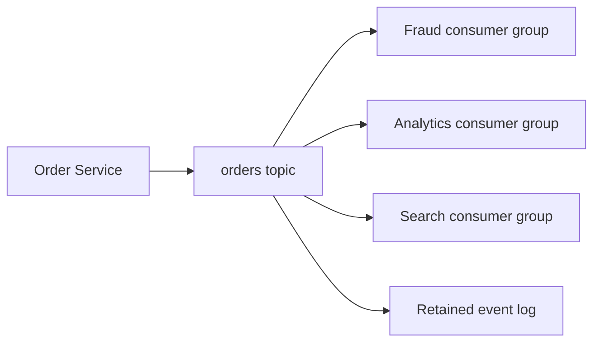
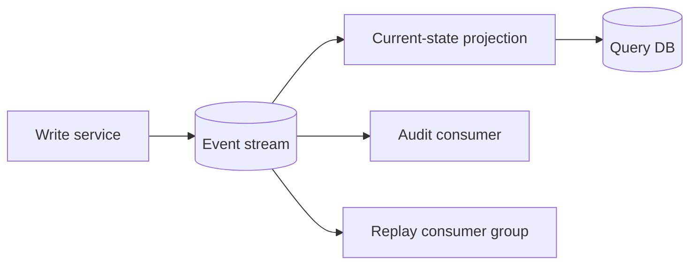

 # Event Streaming

Event streaming records facts as an ordered, durable stream. Producers append events; independent consumer groups read at their own pace and track offsets.



## Why It Exists

Synchronous calls couple services to availability and latency. A simple queue helps one worker finish one task, but many independent consumers often need the same fact:

- Fraud checks every payment.
- Analytics aggregates every order.
- Search indexes every product update.
- A new service later needs historical events.

Event streaming keeps the record after one consumer reads it. Consumers can pause, recover, replay, and evolve independently.

## Event Versus Command

An event says what happened: `OrderPlaced`.

A command asks one owner to do something: `ChargePayment`.

Events usually have many consumers and immutable history. Commands usually have one intended handler and an execution result. Naming this distinction prevents accidental use of Kafka as a generic RPC layer.

## When to Use It

Use event streaming when:

- Multiple independent consumer groups need the same data.
- Retention and replay matter.
- Throughput is high or bursty.
- Ordering within a key matters.
- Consumers process at different speeds.
- An event history supports analytics, integration, or recovery.

Prefer BullMQ, SQS, or RabbitMQ when work only needs one delivery path, short retention, simple routing, or task completion.

## Core Guarantees

- **Partition order:** Records with same partition key remain ordered.
- **At-least-once processing:** A crash can cause reprocessing.
- **Offset tracking:** Consumer progress is separate from record retention.
- **Retention:** Records expire by time or size, not because one consumer acknowledged them.
- **Replay:** A consumer can reset offsets and process old records again.

Exactly-once claims require careful producer, broker, consumer, and side-effect design. An exactly-once broker transaction does not make an external email provider exactly once.

## Architecture Checklist

Define event schema, key, partition count, retention, replication, consumer ownership, retry topic, dead-letter policy, access control, and deletion policy before production.

Keep events small. Store large files in object storage and publish a URI plus checksum. Include event ID, type, version, occurred-at time, producer, and correlation ID.

## Pros and Cons

**Pros:** replay, independent consumers, high throughput, durable history, loose temporal coupling.

**Cons:** partition-key design, schema evolution, duplicate handling, lag operations, storage cost, harder debugging, and more infrastructure than a task queue.

## Cost

Cost includes broker compute, storage, replication, network, cross-zone traffic, schema registry, connectors, monitoring, and on-call expertise. Managed Kafka reduces cluster operations but not design or usage cost.

## Kafka Deep Dive

- [Kafka fundamentals](kafka/index.md)
- [Kafka internals, replication, and KRaft](kafka/internals.md)
- [Consumer groups and rebalancing](kafka/consumer-groups.md)
- [Event replay](kafka/event-replay.md)
- [Reliability and exactly-once boundaries](kafka/reliability.md)
- [Kafka Streams](kafka/streams.md)
- [Kafka Connect](kafka/connect.md)

## Interview Questions and Answers


#### Why not use a queue for every event?

A queue normally removes or hides work after consumption. Streaming retains records so independent groups can replay and process at different rates.

#### What controls ordering?

Partitioning. Records sharing a key go to one partition and are read in append order. Global ordering limits parallelism and is rarely necessary.

#### What is consumer lag?

Difference between latest available offset and a group's committed offset. Rising lag means consumers cannot keep up or are blocked.


#### How is a stream different from a work queue during a consumer outage?

A queue normally gives one consumer the work and removes it after acknowledgement. A retained stream keeps the record and the consumer's position, so the consumer can resume or replay later. This durability costs storage and requires retention and offset governance.

#### How should a stream event be versioned?

Include an explicit event type and schema version, prefer additive changes, and keep consumers tolerant of unknown fields. Breaking changes need a migration plan, dual-read period, or a new event type; changing a field in place silently can corrupt replays.

#### What is the first capacity metric to estimate?

Estimate bytes per second, peak burst, retention days, partition or shard count, and consumer read rate. Event count alone is misleading when payload sizes vary widely.

### Examples and Diagrams

#### Example

```json
{
  "eventId": "evt-123",
  "type": "OrderPlaced",
  "version": 2,
  "occurredAt": "2026-09-09T00:00:00Z",
  "orderId": "ord-42",
  "customerId": "cus-7",
  "total": 129.90
}
```

#### Practical example: audit plus projections



The query database can be rebuilt from the stream when the projection code changes. The audit consumer remains independent and should not share offsets with the projection.
