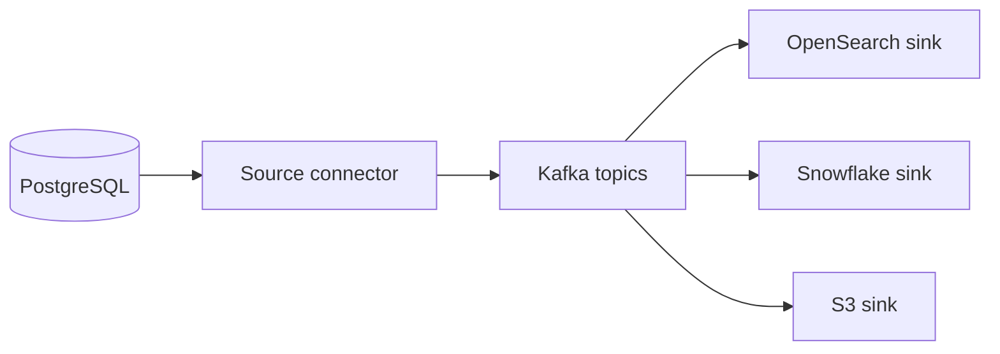
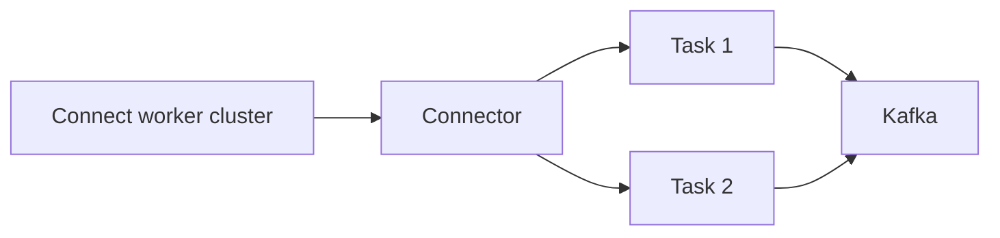
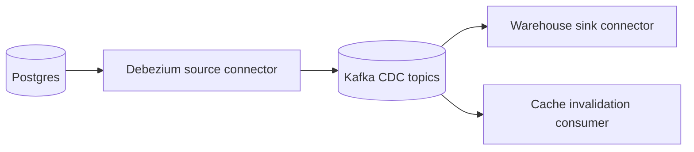

# Kafka Connect

Kafka Connect is a framework for moving data between Kafka and external systems through reusable connectors. Source connectors import data into Kafka; sink connectors export Kafka records to databases, search systems, object storage, warehouses, and other services.



## Why Kafka Connect Exists

Without Connect, every team writes and operates custom polling, offset, retry, batching, schema, and checkpoint code for each integration. Connect standardizes worker runtime, connector configuration, task parallelism, REST management, offsets, and error handling.

## Source and Sink

**Source connector:** Reads external data and produces Kafka records. Debezium CDC reads database WAL or binlog and emits row-change events.

**Sink connector:** Reads Kafka records and writes external data. A sink may batch records, retry transient errors, dead-letter bad records, and commit source offsets after successful delivery.

Example source flow:

```text
PostgreSQL WAL -> Debezium source connector -> database-changes topic
```

Example sink flow:

```text
orders topic -> OpenSearch sink connector -> search index
```

## Workers and Tasks

Connect workers run connectors. A connector can create multiple tasks for parallel work, bounded by source partitions, destination capacity, and connector support.



Distributed mode stores connector configs, offsets, and status in Kafka topics. Standalone mode suits local development or small isolated jobs but has weaker cluster management.

## Schema and Delivery

Connect does not remove duplicate or ordering concerns. A sink may retry after destination accepted a batch but before acknowledgment. Use destination upserts, stable keys, connector idempotency options, and reconciliation.

For CDC, row-change events are not automatically domain events. `users.email` changed is different from business event `UserEmailVerified`.

Converters serialize records between Kafka and Connect's internal data model; choose JSON, Avro, Protobuf, or another converter consistently with the Schema Registry contract. Single Message Transforms (SMTs) are for lightweight record shaping such as field renames, headers, or timestamps, not multi-record business workflows.

For malformed records, configure an error tolerance and a dead-letter topic (DLQ) with the original topic, partition, offset, connector name, and error context. A Connect DLQ is an operational quarantine, not proof that the external sink accepted the record; monitor DLQ growth and define replay or repair ownership.

## When to Use

Use Connect when a supported connector already solves integration and Kafka should remain the central event backbone. It fits database CDC, object storage export, search indexing, warehouse ingestion, and cluster replication.

Do not use Connect when transformation contains complex business workflow, external side effects need custom transaction boundaries, or no trustworthy connector exists. Write a service or custom connector only after checking connector behavior, maintenance, and failure semantics.

## Pros, Cons, Cost

**Pros:** less custom integration code, reusable operational model, task scaling, Kafka offset management, connector ecosystem.

**Cons:** connector quality varies, configuration can hide complexity, upgrades and plugins need operations, destination semantics differ, failures can create duplicates or DLQ growth.

Cost includes Connect worker compute, plugin maintenance, Kafka internal topics, connector task capacity, destination API calls, network, monitoring, and support.

## Interview Questions and Answers


#### Source versus sink connector?

Source imports external data into Kafka. Sink exports Kafka data to an external system.

#### Is Kafka Connect exactly once?

Not universally. Delivery semantics depend on connector, source, destination, and configuration. Design idempotent sinks and reconciliation.

#### Why use Debezium instead of polling tables?

CDC reads database change logs, reducing repeated full-table scans and preserving commit order better. It still needs schema, transaction, delete, snapshot, and operational design.

#### Connect or custom service?

Use Connect for standard movement and light configuration. Use custom service for domain decisions, complex validation, multi-system transactions, or behavior unsupported by connector.


#### How do you operate a connector safely?

Pin connector and converter versions, store configuration in version control without secrets, set an error policy, monitor task restarts and source or sink lag, and test schema evolution. Treat connector configuration as production code because it can write or delete large data sets.

#### What is the difference between connector task parallelism and Kafka partitions?

Tasks are the connector's execution units; they cannot usually exceed useful source partitions or destination capacity. Increasing tasks beyond the available parallelism adds coordination overhead without increasing throughput.

#### When is a custom service better than Connect?

Use a custom service when transformation needs complex business logic, cross-record state, request/response interaction, or a domain-specific recovery workflow. Use Connect for standardized, configuration-driven movement where connector semantics are sufficient.

### Examples and Diagrams

#### Configuration Example

```json
{
  "name": "orders-to-opensearch",
  "config": {
    "connector.class": "org.opensearch.kafka.connect.OpenSearchSinkConnector",
    "topics": "orders",
    "tasks.max": "3",
    "connection.url": "https://search.example",
    "errors.tolerance": "all",
    "errors.deadletterqueue.topic.name": "orders-connect-dlq"
  }
}
```

Connector properties differ by implementation. Treat credentials as secrets, not plain configuration committed to Git.

#### Practical example: CDC to analytics



The source emits row changes with keys and schema metadata. The sink should be restartable and idempotent, and the team should define how deletes and snapshots are represented.
