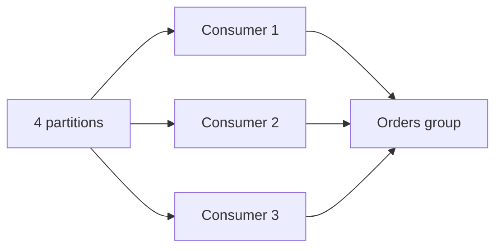
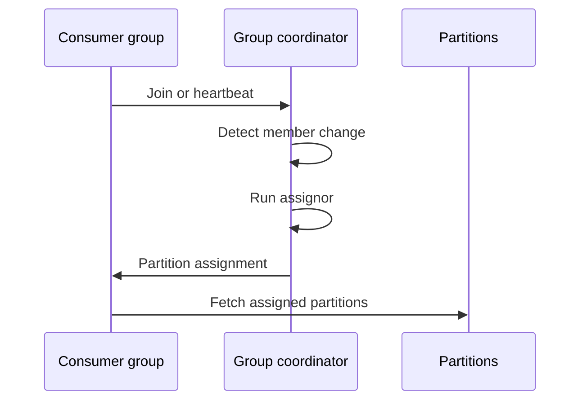
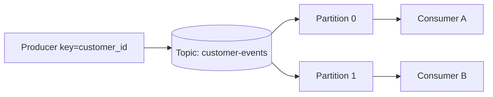

 # Kafka Consumer Groups

A consumer group is one logical application. Kafka assigns each partition to at most one active member in that group, while different groups independently read the same topic.



## Scaling Rule

Maximum parallelism in one group is approximately partition count. Eight consumers on four partitions leave four consumers idle. If processing needs more parallelism, increase partitions before adding consumers.

Partition count is difficult to reduce and affects ordering, storage, and rebalance cost. Plan for peak concurrency and future growth.

## Offset Lifecycle

Consumer fetches records, processes them, then commits offsets. Commit before side effect risks loss after crash. Commit after side effect risks duplicate processing after crash. At-least-once systems choose the second risk and make processing idempotent.

```text
fetch -> process -> commit
             |
             +-> crash: replay from last commit
```

Commit offsets in batches for throughput, but bound the uncommitted window so restart replay stays manageable.

## Rebalance Risks

Slow processing beyond poll limits can make a consumer leave the group. Large batches, blocking calls, long garbage collection, and network outages can trigger rebalances. Separate polling from work or tune limits carefully; never hide slow processing with unlimited concurrency.

## Partition Assignment Algorithms

Kafka group coordinator detects membership changes through heartbeats and assigns partitions using the configured assignor. Common strategies include:

- **Range:** Assigns contiguous partition ranges per topic. Simple, but can distribute unevenly across multiple topics.
- **Round-robin:** Spreads partitions across consumers more evenly when subscriptions align.
- **Sticky:** Tries to keep existing assignments while balancing, reducing movement.
- **Cooperative sticky:** Rebalances incrementally, allowing unaffected assignments to continue.

Kafka clients and versions determine supported assignors. Choose cooperative or sticky behavior when reducing rebalance disruption matters, then test with actual topic and subscription shape.



If one consumer crashes, heartbeats stop. After session timeout, coordinator removes it, runs assignment, and gives its partitions to surviving members. During rebalance, processing may pause or ownership may move. This is not instant failover; timeout and restart time affect recovery.

## Ordering

Kafka preserves order per partition, not across a topic. A group can process different partitions concurrently. If one key must remain ordered, route it to one partition and avoid parallel side effects for that key.

## Lag Monitoring

Track lag by group and partition, oldest record age, processing latency, rebalance count, commit failures, and dead-letter volume. Alert on sustained growth and user-facing age thresholds, not only raw record count.

## Poison Records and Retry Topics

Kafka has no native per-record retry delay in a normal partition. A failed record can block later records in same partition if consumer preserves order. Common pattern:

```text
main topic -> retry topic with attempt/delay metadata
           -> dead-letter topic after bounded attempts
```

Republish only after recording error, source offset, event ID, and attempt. A retry topic changes ordering semantics; use it only when business can tolerate delayed or reordered processing.

## Interview Questions and Answers


#### Why use separate groups?

Fraud and analytics need independent progress. One group lets each application consume every event without competing for records.

#### What if one poison record blocks a partition?

Bound retries, publish failure metadata to a retry or dead-letter topic, commit past the blocked record only under an explicit recovery policy, and preserve the original event for repair.

#### How do you deploy safely?

Gracefully stop consumers, finish bounded in-flight work, commit offsets, then terminate. Rolling deployments must tolerate temporary rebalances.

#### What happens after one consumer crashes?

Coordinator waits for missed heartbeats until session timeout, removes member, runs partition assignor, and assigns partitions to remaining members. Processing resumes from last committed offsets, so uncommitted records may replay.

#### Why not create one consumer per message?

Kafka parallelism is partition-based. Excess consumer instances add connection and rebalance overhead without increasing throughput when partition count is unchanged.


#### How do you reduce rebalance disruption during deploys?

Use cooperative assignment where supported, static membership when appropriate, graceful shutdown, bounded poll intervals, and incremental rollouts. Keep processing separate from the poll loop so long work does not trigger a missed heartbeat or max-poll violation.

#### How should a consumer handle a slow partition?

Measure lag per partition rather than only total lag. Scale consumers up to the partition count, optimize the hot key or workload, and route poison records to a retry topic if one record blocks progress. More consumers cannot parallelize one partition.

#### What should an offset commit represent?

It should represent the highest record whose required processing is durably complete. Committing when a record is merely fetched risks loss; committing before an external side effect is safe only when the side effect is transactional with the offset or independently idempotent.

### Examples and Diagrams

#### Practical example: keyed customer updates



All events for one customer stay in one partition, preserving per-customer order. A consumer group with more members than partitions leaves some members idle.
