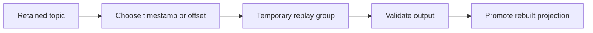
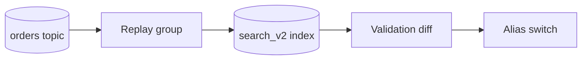

 # Kafka Event Replay

Replay means reading retained records again from an earlier offset. It enables rebuilding projections, fixing a bug, onboarding a new consumer, and recovering from bad processing.

## Replay Workflow



Never reset production consumer offsets casually. Use a new group or isolated output first.

## Safe Replay Steps

1. Define time range and partitions.
2. Freeze or version projection writes if consistency requires it.
3. Create temporary group with explicit name.
4. Read from timestamp or saved offsets.
5. Write to shadow tables or a versioned index.
6. Compare counts, checksums, and business invariants.
7. Promote rebuilt state.
8. Record replay range, code version, schema version, and operator.

## Duplicate Effects

Replay intentionally repeats events. Consumers must use event IDs, business keys, upserts, or transactional inbox tables. Never replay an event that blindly sends an email, charges a card, or emits an irreversible command.

For external side effects, replay into a compensating workflow or rebuild internal state only. Keep side-effect history so operators can distinguish original processing from replay.

## Retention and Schema

Replay works only while records and compatible schemas remain available. Store schema version with each event. Keep deserializers for supported historical versions or run a migration before replay.

## Replay Versus Backfill

Replay reprocesses retained Kafka records. Backfill reads another source, such as a database or object archive, and publishes new events. Replay preserves original offsets and event metadata; backfill may create a new event generation and must avoid confusing repair data with original history.

## Replay Capacity

Replay competes for broker disk, network, consumer compute, and downstream database capacity. Use a separate consumer group, throttle fetch or processing rate, and write to isolated output until validation passes.

```text
replay rate <= safe downstream write capacity
```

If replay is faster than database capacity, projection rebuild can damage live traffic. Schedule replay, use shadow tables, or provision temporary capacity.

## Interview Questions and Answers


#### Why use a new consumer group for replay?

It isolates replay progress and prevents accidental movement of live application offsets.

#### How do you replay only one customer's data?

Seek by time, filter by customer ID, and write through an idempotent repair path. Filtering after consuming still scans the selected range, so estimate load first.

#### What if retention expired?

Restore from archive if available, rebuild from source databases, or accept a partial reconstruction. Retention must match recovery and audit requirements.

#### Can replay resend an email?

It can if consumer treats event as a command. Separate state reconstruction from irreversible side effects. Mark replay mode, use an idempotency key, or route replay to a non-sending projection consumer.


#### How do you prevent a replay from affecting live users?

Use a separate consumer group, a replay mode with side effects disabled or redirected, and a bounded time range. Write rebuilt data to a shadow table or namespace first, compare results, then promote it. Never assume a replay is harmless because the original event is old.

#### How do you replay a single partition range efficiently?

Assign explicit starting offsets or timestamps, process in a controlled group, and cap concurrency so the replay does not starve live consumers. Record the replay job ID, source offsets, code version, and result counts for auditability.

#### What if the needed data is outside retention?

Recover from a backup, an archive, a source database, or a new CDC snapshot. If none exists, document the irrecoverable gap instead of claiming replay can reconstruct data that was discarded.

### Examples and Diagrams

#### Practical example: rebuilding search indexes



The old index remains live while `search_v2` is rebuilt. A validation step compares document counts and sampled records before switching the alias.
