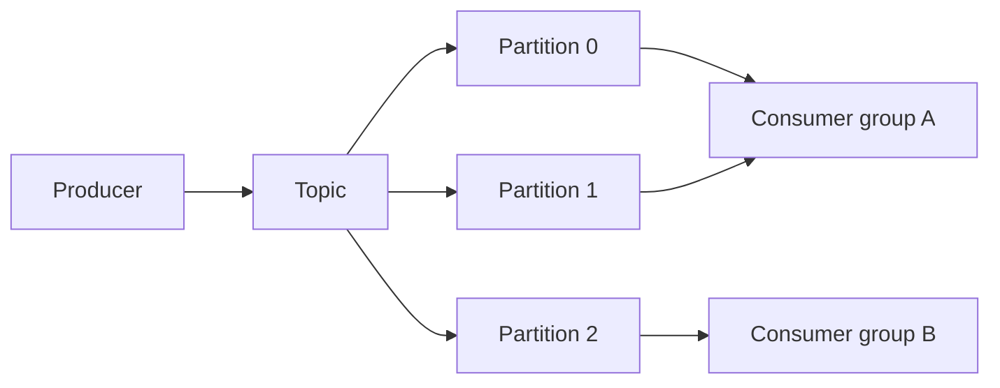
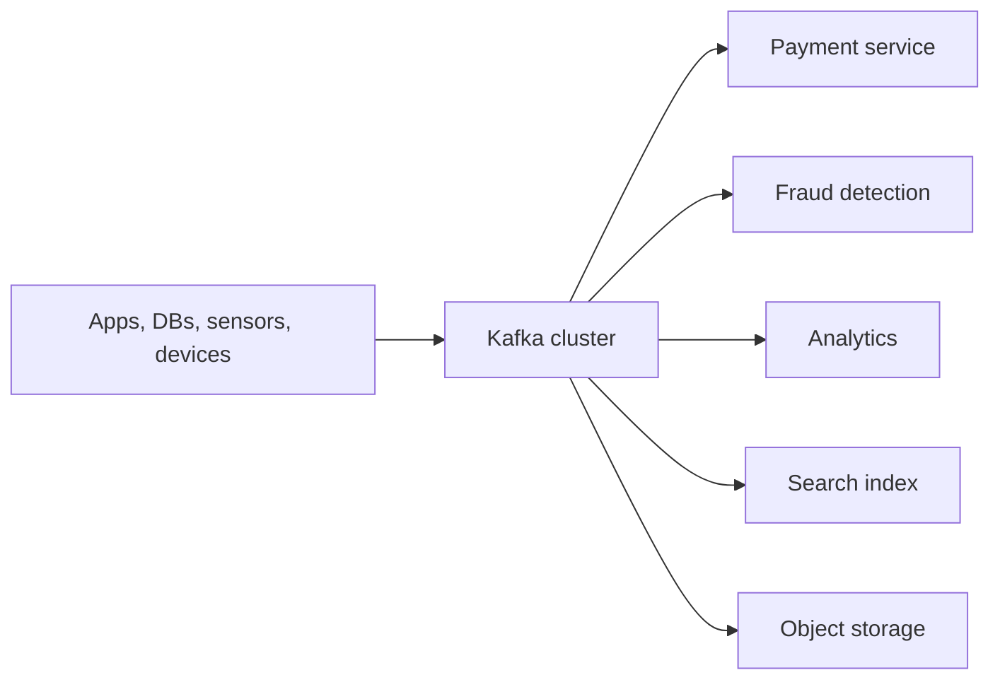
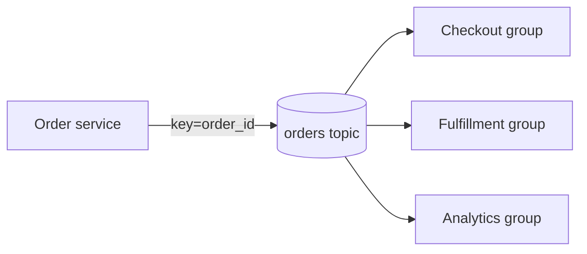

 # Kafka

Apache Kafka is a distributed append-only log. Producers write records to topic partitions. Consumers fetch records and commit offsets.

Kafka is not only "a fast queue". It is an event streaming platform: publish events, retain them durably, let many applications read independently, and process the stream continuously or later.



## Why Kafka Was Born

Traditional point-to-point messaging struggled with very high event volume, multiple consumers, and durable replay. Kafka combines sequential disk writes, partitioned parallelism, replication, and pull-based consumption.

LinkedIn originally needed a common, durable activity pipeline for large volumes of events from many services. Point-to-point delivery made every consumer integration separate and made replay difficult. Kafka separated event publication from consumer timing: producer writes once, many consumer groups read at their own pace.

## What Problem Kafka Solves



Without Kafka, producer may call every consumer directly. One slow or unavailable consumer affects producer. With Kafka, producer publishes an event and consumers process independently. Kafka does not remove failure; it moves failure handling into offsets, retries, lag, idempotency, and replayable recovery.

## Core Concepts

- **Topic:** Named logical stream.
- **Partition:** Ordered append-only shard.
- **Offset:** Position of record within partition.
- **Producer:** Appends records.
- **Consumer:** Fetches records.
- **Consumer group:** Shares partitions among instances.
- **Broker:** Stores partitions and serves clients.
- **Replication:** Copies partition data for failure tolerance.

- **Record:** Event containing key, value, timestamp, and optional headers.
- **Leader:** Replica handling reads and writes for one partition.
- **Follower:** Replica copying a partition leader.
- **Broker:** Kafka server storing partition replicas.
- **Cluster:** Brokers plus controller quorum and metadata.
- **Consumer lag:** Difference between latest available offset and committed consumer offset.
- **Retention:** Time or size policy controlling how long records remain.

Operational vocabulary matters:

- **ISR (in-sync replicas):** Replicas caught up enough to be eligible for safe leadership.
- **`min.insync.replicas`:** Minimum ISR count required for an `acks=all` write to succeed.
- **KRaft:** Kafka's controller quorum for metadata and leadership; it replaces ZooKeeper in modern deployments.
- **Rebalance:** Group membership or partition changes that move partition ownership between consumers.

One partition can be assigned to only one active consumer in a group. More consumers than partitions leave some instances idle.

## Why Kafka Handles Large Volume

Kafka scales through several independent mechanisms:

- Append-only writes reduce random disk I/O.
- Batching amortizes network and system-call cost.
- Compression reduces network and disk use.
- Partitions allow producers and consumers to work in parallel.
- Consumers pull batches and control processing rate.
- Retention removes old segments instead of requiring one infinite file.

There is no universal "millions of events per second" guarantee. Capacity depends on record size, partitions, replication, acknowledgments, compression, disks, network, consumer work, and failure headroom. Benchmark workload, not slogan.

## Topic Design

Choose topic boundaries around ownership and retention. Avoid one topic containing unrelated schemas. Topic names should communicate domain and lifecycle, such as `orders.v1` or `payments.events`.

Partition by key with enough partitions for expected parallelism. More partitions are not free: they increase metadata, open connections, rebalance work, and operational complexity.

Avoid creating a topic for every tiny entity without ownership and retention rules. A useful event contract has stable name, schema version, event ID, occurred-at time, producer, correlation ID, and business key.

Example:

```json
{
  "eventId": "evt-901",
  "type": "PaymentAuthorized",
  "version": 1,
  "occurredAt": "2026-09-09T00:00:00Z",
  "paymentId": "pay-42",
  "orderId": "ord-10"
}
```

Do not put large files in Kafka. Store file in object storage and publish URI, checksum, content type, and version.

## When Kafka Fits

Kafka fits high-throughput event history, many consumer groups, replay, stream processing, CDC, and integration pipelines. It is usually excessive for one delayed email or a small command workflow.

For a production baseline, size partitions for peak parallelism, choose a replication factor across failure domains, keep `min.insync.replicas` compatible with producer `acks=all`, and alert on under-replicated partitions and consumer lag.

Typical use cases:

- Payment and fraud event pipelines.
- GPS, fleet, and IoT telemetry.
- Clickstream and product analytics.
- CDC from PostgreSQL or MySQL.
- Search and cache projections.
- Real-time alerting.
- Data lake or warehouse ingestion.

Do not use Kafka as default RPC, a tiny cron replacement, or a queue for one short-lived background task.

## Pros, Cons, Cost

**Pros:** throughput, retention, replay, partition parallelism, ecosystem, consumer isolation.

**Cons:** cluster operations, partition planning, lag management, schema compatibility, duplicate side effects, and storage/network cost.

Cost includes brokers, disks, replicas, cross-zone traffic, monitoring, connectors, schema registry, and engineering operations. Managed Kafka trades infrastructure work for service and data-transfer fees.

Storage estimate:

```text
daily uncompressed bytes
× retention days
× replication factor
× overhead and headroom
```

Example: 200 GB/day, 7-day retention, replication factor 3 needs at least 4.2 TB before indexes, segment overhead, rebalancing headroom, and failure capacity. Compression may reduce physical storage, but plan from measured compression ratio.

## Interview Questions and Answers


#### Why pull instead of broker push?

Consumers control fetch rate, batch size, and backpressure. This supports high-throughput consumers and replay.

#### Why use a message key?

Key selects partition. Same key preserves order while allowing unrelated keys to process in parallel.

#### Can Kafka guarantee exactly-once business behavior?

Not by itself. Transactions can coordinate Kafka reads and writes; databases and external APIs still need idempotency or an integration pattern.

#### Why can many consumer groups read same event?

Kafka retains records by policy. Each group stores its own offsets, so payment, fraud, and analytics progress independently without deleting records for one another.

#### What happens when consumer count exceeds partition count?

Extra consumers remain idle because one partition has at most one active consumer within one group. Add partitions only when ordering, broker capacity, and future partition count support it.

#### Is Kafka suitable for 100 events per day?

Usually no. Kafka can handle it, but cluster, monitoring, schema, retention, and on-call cost may exceed benefit. Use database jobs, SQS, RabbitMQ, or BullMQ unless replay and independent streaming consumers justify Kafka.


#### How do partitions affect a Kafka topic's future?

Partitions provide parallelism and are the unit of ordering. Increasing partitions can improve throughput but changes the mapping of keyed records and may complicate assumptions about ordering or state stores. Choose enough for expected consumer parallelism while avoiding unbounded operational overhead.

#### Why should a producer include a stable key?

Kafka hashes the key to choose a partition, keeping records with the same key ordered within that partition. A key such as `customer_id` is useful when all customer updates must be processed sequentially; a random key maximizes spread but loses that affinity.

#### What does Kafka not solve automatically?

It does not make external database writes atomic with offset commits, does not guarantee global ordering, and does not make a non-idempotent email or payment side effect safe. Those properties require transaction boundaries, keys, and consumer design.

### Examples and Diagrams

#### Producer Example

```ts
await producer.send({
  topic: "orders",
  messages: [
    {
      key: order.id,
      value: JSON.stringify({
        eventId: crypto.randomUUID(),
        type: "OrderPlaced",
        orderId: order.id,
      }),
    },
  ],
});
```

Use stable keys for ordering. Random keys spread load but destroy per-entity order.

#### Consumer Example

```ts
await consumer.subscribe({ topic: "orders" });

await consumer.run({
  eachMessage: async ({ message }) => {
    const event = JSON.parse(message.value!.toString());
    await processOnce(event.eventId, event);
  },
});
```

`processOnce` must protect external side effects from duplicate delivery.

#### Topic, Partition, and Offset Example

Imagine `payments` topic with three partitions:

```text
payments-0: offset 0, 1, 2, 3...
payments-1: offset 0, 1, 2, 3...
payments-2: offset 0, 1, 2, 3...
```

Offset `42` is unique only inside its partition. The full position is `(topic, partition, offset)`, not offset `42` alone.

Use payment ID as key when events for one payment must stay ordered. Kafka hashes key to a partition. Different payments can process in parallel; one payment's events keep partition order.

#### Practical example: order lifecycle topic



Each group maintains its own offset and can process the same order history for a different purpose. The topic's retention should cover the longest expected recovery and replay window.
