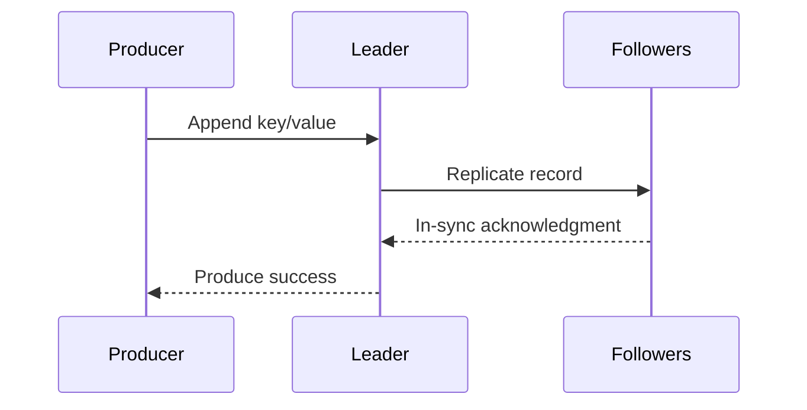
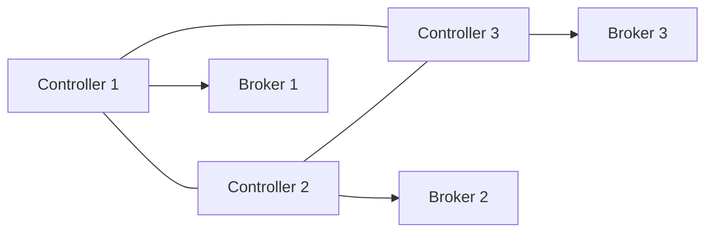
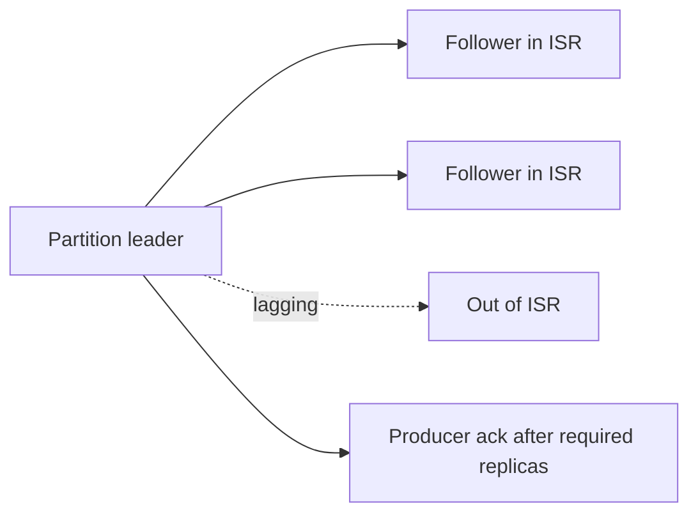

 # Kafka Internals

## Record Path

Producer selects partition, usually from record key. Broker appends record to a log segment. Followers replicate it. After the configured acknowledgment condition, producer receives success.



## Leaders and Replicas

Each partition has one leader handling client reads and writes. Followers copy leader data. If leader fails, a suitable in-sync follower can become leader. Replication factor 3 is a common production baseline, but failure-domain and cost requirements decide the value.

`acks=all` waits for in-sync replicas. It improves durability but adds latency. `acks=0` favors speed and can lose records without producer confirmation.

## Failure Detection and Controller Quorum

Kafka cluster metadata is managed by a controller quorum in modern KRaft-based deployments. KRaft replaces the older ZooKeeper dependency for Kafka metadata management. Brokers still store partition data; controllers manage metadata and leadership decisions.



The controller quorum needs a majority to make metadata decisions. Three controllers tolerate one controller failure; five tolerate two. Data replica count and controller count solve different failure domains.

## Segments and Retention

Partitions consist of segment files and offset indexes. Kafka appends sequentially, then rolls segments. A record's offset is unique within its partition and is the position a consumer group commits. Retention deletes old segments by time or total bytes. Compaction keeps the latest value for each key and suits changelog topics; compaction is not immediate deletion or full event history.

Retention choices:

- **Delete policy:** Remove old segments by time or size.
- **Compaction policy:** Keep latest record per key, useful for state restoration.
- **Compact and delete:** Keep latest values for a period, then remove old segments.

Compaction is asynchronous. A compacted topic can temporarily contain older values and tombstones. Consumers should not assume immediate physical cleanup.

## Fetch and Batching

Producers batch records and compress them. Consumers fetch batches rather than one record at a time. Tune batch size, linger, fetch limits, compression, and payload size against latency and throughput.

## Rebalance

When group membership or partition count changes, ownership moves between consumers. Rebalances pause consumption and can amplify lag. Stable instance identity, cooperative assignment, sensible session timeouts, and graceful shutdown reduce disruption.

## Replication and Storage Trade-offs

Replication factor 3 means roughly three copies of partition data, plus operational headroom. It improves availability but increases disk, network replication, recovery time, and cross-zone cost. Store replicas across failure domains, not three disks in one failure domain.

When a broker fails, Kafka must:

1. Detect failure.
2. Elect eligible leader replica.
3. Reassign leadership and client metadata.
4. Replicate under-replicated data after recovery.

Alert on under-replicated partitions. A cluster that keeps serving traffic while losing replica margin may fail badly at next broker loss.

## Capacity Intuition

Required broker storage:

```text
daily bytes × retention days × replication factor
```

Required consumer capacity:

```text
input records per second × average processing time
```

Validate with peak traffic, not average traffic. Reserve headroom for replay, rebalances, and broker failure.

## Interview Questions and Answers


#### Why sequential disk writes?

Append-only writes are efficient, and page cache plus batching can provide high throughput without keeping the entire log in memory.

#### What is an ISR?

In-sync replica set: replicas sufficiently caught up to be eligible for safe leadership under configured rules.

#### What causes under-replicated partitions?

Broker failure, disk saturation, network faults, throttling, or insufficient broker capacity. Alert before a second failure removes durability margin.

#### What is KRaft?

KRaft is Kafka's metadata quorum architecture based on the Raft consensus family. It removes ZooKeeper as a separate metadata dependency in modern Kafka deployments. It does not remove the need for replicated topic data.

#### Why not set replication factor to 10 everywhere?

More replicas increase storage, replication traffic, recovery work, and cost. Choose factor from failure tolerance, durability target, workload criticality, and region or zone layout.


#### Why do segment files matter operationally?

Kafka appends to active segments and rolls them periodically. Retention and compaction remove whole segments or rewrite compacted data, so segment size affects deletion granularity, recovery work, and disk usage. Monitor disk headroom rather than relying only on topic byte estimates.

#### What is the trade-off when increasing batch size?

Larger batches improve compression and throughput but add producer latency and can increase the amount of data retried together. Set batch, linger, and compression values against the latency SLO and record size distribution.

#### Why is a hot partition dangerous?

A single key or uneven key distribution can concentrate traffic on one leader, making total cluster capacity irrelevant. Inspect per-partition bytes and record rates, then choose a better key or explicitly accept the weaker ordering needed to spread load.

### Examples and Diagrams

#### Practical example: replication failure path



If a follower falls behind, the controller may remove it from the ISR. Alert on under-replicated partitions before a second failure reduces the durability margin.
