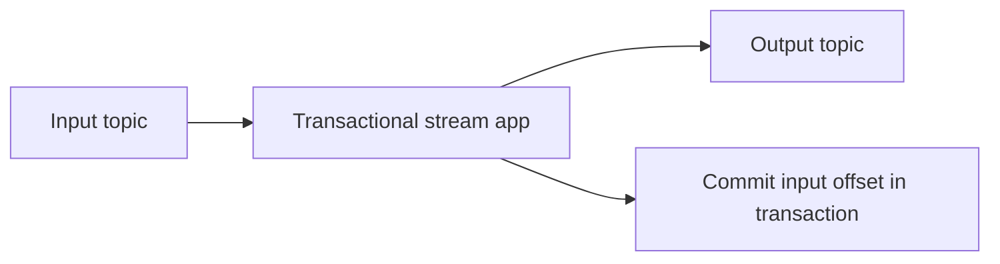
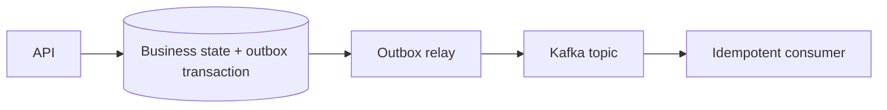
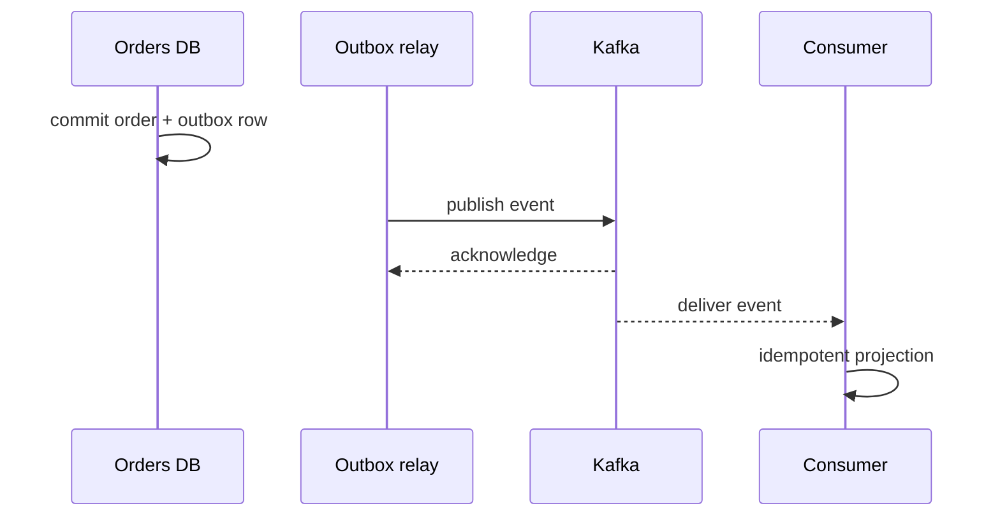

 # Kafka Reliability

Kafka reliability is a system property spanning producers, brokers, consumers, schemas, and downstream side effects.

## Producer Controls

- Use `acks=all` for important events.
- Enable idempotent producer mode.
- Set bounded retries and delivery timeout.
- Use compression and batching without exceeding latency budget.
- Handle authorization, timeout, and serialization errors explicitly.

Idempotent producer mode prevents duplicate appends caused by producer retries within Kafka's supported session model. It does not prevent duplicate business events created by two API requests.

## Broker Controls

- Replicate across failure domains.
- Keep `min.insync.replicas` aligned with the durability target and producer `acks=all`.
- Monitor under-replicated partitions and offline partitions.
- Use durable disks and tested backups where required.
- Set retention and compaction intentionally.
- Separate critical topics from noisy workloads when capacity needs differ.

An `acks=all` write is accepted only when the required ISR set can acknowledge it. If ISR shrinks below `min.insync.replicas`, Kafka may reject writes rather than silently trade durability for availability; alert on the condition and define the recovery runbook.

## Consumer Controls

Use at-least-once processing with idempotent handlers as default. Bound processing time, commit after successful side effects, and route poison records to retry or dead-letter topics.

Retry topics should encode delay or attempt metadata. Immediate retry loops can consume all partition capacity and worsen outages.

## Exactly-Once Processing

Kafka supports exactly-once semantics for specific Kafka-to-Kafka read-process-write pipelines when transactions, idempotent producers, and correct isolation settings are used:

If transaction aborts, output records and consumed offsets become invisible together. This does not make a database update, HTTP call, email, or card charge exactly once. For external systems, use idempotency keys, inbox/outbox, or a database transaction boundary.

Exactly-once costs more latency, coordination, transaction state, and operational complexity. Use at-least-once plus idempotent effects unless strict Kafka-to-Kafka guarantees matter.

## Outbox Pattern

When a database transaction must publish an event, write business state and an outbox row in one transaction. A relay publishes the row and marks it sent. Consumers still deduplicate.

## Disaster Recovery

Define recovery point and recovery time objectives. Test broker loss, consumer restart, schema incompatibility, poison records, and replay. Document which events can be reconstructed and which external effects need reconciliation.

## Schema Governance

Schema evolution must preserve old consumers and historical replay. Common rules:

- Add optional fields with defaults.
- Do not silently change field meaning.
- Version incompatible changes.
- Validate producer and consumer compatibility in CI.
- Keep schema ID or version in event metadata.

Schema Registry centralizes schemas and compatibility checks; it does not make bad domain contracts good.

## Security

Use TLS for client and broker traffic, authentication such as SASL or mTLS, authorization per topic and consumer group, encryption at rest, and secret rotation. Avoid putting credentials or unnecessary personal data in retained events because retention multiplies exposure.

## Interview Questions and Answers

#### What does idempotent producer solve?

It reduces duplicate Kafka records caused by producer retries. It does not solve duplicate API submissions or downstream side effects.

#### Why not retry forever?

Infinite retries block partitions, hide poison data, and delay healthy work. Use bounded attempts, backoff, dead-letter handling, and operator repair.

#### Is replication a backup?

No. Replicas protect availability from some failures; retention, archive, and backup policies address deletion, corruption, and regional loss.

#### What does exactly-once mean in Kafka?

For supported Kafka transactions, a read-process-write pipeline can atomically publish output and commit input offsets. It does not guarantee exactly-once effects in external databases or APIs.

#### Why use schema registry?

It stores schema versions and enforces compatibility rules before producers break consumers. Teams still need semantic versioning, ownership, and migration policy.

#### Which producer setting is most important for avoiding acknowledged loss?

Use acknowledgements that wait for the required replica durability, idempotent production, and bounded retries. The correct setting depends on the business loss budget; stronger durability increases latency and may reduce availability during replica failures.

#### How should a consumer handle an external API timeout?

Classify the timeout as ambiguous. Do not commit the offset until the side effect is known or protected by an idempotency key. Use a retry policy with a deadline, then route the record for reconciliation rather than retrying forever.

#### Is a replicated cluster a backup?

No. Replication protects against some node failures but can replicate accidental deletes, bad deployments, or corrupt data. Keep independent backups or archives and test restoration.

### Examples and Diagrams

#### Practical example: durable order publication

The outbox closes the database-to-Kafka gap. A relay crash may publish twice, so the event ID must be stable and consumers must tolerate duplicates.
