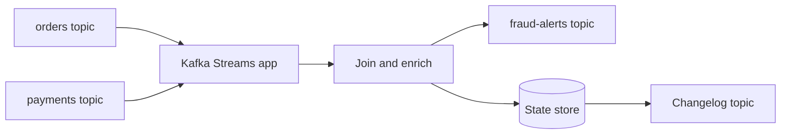
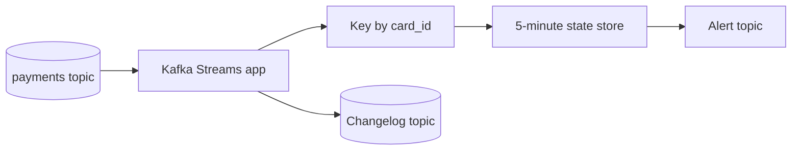

# Kafka Streams

Kafka Streams is a Java and Scala library for building applications that process Kafka topics continuously. It runs inside an application process; it is not a separate cluster that replaces Kafka brokers.

## Why Kafka Streams Exists

Plain consumers require custom code for joins, windows, state stores, repartitioning, changelogs, and recovery. Kafka Streams provides these building blocks while keeping Kafka as input, output, state-recovery, and coordination layer.



## Core Concepts

- **KStream:** Unbounded stream of records.
- **KTable:** Changelog-derived view where key represents current value.
- **Window:** Time boundary for aggregations and joins.
- **State store:** Local materialized state used by processing.
- **Changelog topic:** Kafka topic used to recover state.
- **Topology:** Processing graph built from sources, transforms, joins, and sinks.
- **Repartition:** Kafka Streams moves records to a new topic when key distribution must change.

## Stream Processing Semantics

Kafka Streams can provide at-least-once or exactly-once-v2 processing for Kafka input and Kafka output. External database writes still need idempotency or an integration pattern.

Late events need a policy. Windows may use grace periods to accept delayed records. Event time, processing time, and ingestion time are different; choose intentionally.

## Use Cases

- Real-time fraud scoring.
- Per-minute traffic counts.
- Order and payment joins.
- Sessionization.
- Customer materialized views.
- Enrichment from compacted reference topics.
- Real-time routing and filtering.

## When Not to Use

Avoid Kafka Streams for one simple stateless consumer, long-running batch analytics better handled by a warehouse, or workflows needing complex external side effects and human approval. Flink, Spark, SQL engines, or ordinary consumers may fit better.

## Pros, Cons, Cost

**Pros:** Kafka-native state, joins, windows, local processing, replayable topology, no separate processing cluster.

**Cons:** JVM operations, repartition topics, state-store disk, window semantics, lag, upgrades, and debugging distributed state.

Cost includes application compute, local disks, changelog and repartition topic storage, broker traffic, monitoring, and standby capacity.

## Interview Questions and Answers


#### Kafka Streams or consumer API?

Use consumer API for simple fetch-process-commit logic. Use Streams for joins, windows, aggregations, state stores, and topology-managed recovery.

#### What happens when instance crashes?

Another instance can restore task state from changelog topics and resume from committed offsets. Restore time depends on state size and available standby or local state.

#### Why repartition?

Joins and aggregations require records with same logical key on same partition. Kafka Streams creates repartition topics when current partitioning cannot satisfy that requirement.


#### What is a window and why does it need a grace period?

A window groups records by event time, such as five-minute order totals. A grace period allows late records to arrive before the result is finalized. Longer grace improves correctness for late data but delays final output and retains more state.

#### How should a state store be recovered?

Kafka Streams restores local state from its changelog topic, then resumes processing from committed offsets. Size the restore time into the recovery objective and monitor changelog health; a state store is not independent durable storage.

#### When should you use the plain consumer API instead?

Use the consumer API when processing is mostly imperative, state is stored in an external database, or the topology would obscure a simple workflow. Kafka Streams is valuable when joins, windows, repartitioning, and local state are central to the design.

### Examples and Diagrams

#### Example: Count Orders Per Minute

```java
KStream<String, Order> orders = builder.stream("orders");

KTable<Windowed<String>, Long> counts =
    orders
        .groupByKey()
        .windowedBy(TimeWindows.ofSizeWithNoGrace(Duration.ofMinutes(1)))
        .count();

counts.toStream().to("orders-per-minute");
```

The application consumes orders, groups by key, maintains local state, writes changelog records, and emits aggregate results. On restart, state restores from changelog instead of rebuilding blindly from scratch.

#### Practical example: fraud signal aggregation



The topology counts declines per card within a window and emits an alert when a threshold is crossed. The key controls which instance owns the state.
