# Distributed System Messaging and Processing

Distributed systems often need components to communicate without running in one process or waiting on one another synchronously. A checkout request may trigger payment, inventory reservation, email, analytics, and shipment workflows. These tasks need different communication guarantees.

Common tools solve different problems:

- **BullMQ:** Execute background jobs.
- **Message broker:** Deliver messages between independent services.
- **Event streaming platform:** Record, distribute, retain, and replay large event streams.

Main rule:

> Choose technology from requirements, infrastructure, and operational constraints. Do not choose infrastructure because it is available or popular.

---

## 1. Start With Problem, Not Tool

Do not begin with:

> "We already run Redis, so every asynchronous task should use BullMQ."

Begin with:

- What must happen?
- Who processes it?
- How many consumers exist?
- Does message routing matter?
- Must messages survive for a long time?
- Must consumers replay old events?
- What throughput and latency are required?
- What infrastructure can the team operate?
- What failure and delivery guarantees are needed?

Same business action can need different infrastructure at different stages:

- Small application: BullMQ may be enough.
- Several independent services: RabbitMQ or SNS plus SQS may fit better.
- Large event history with many consumer groups: Kafka may be necessary.

More infrastructure creates more cost, operations, monitoring, failure modes, and team knowledge requirements. Less infrastructure can create coupling and painful migration later. Good design chooses enough capability, not maximum capability.

## 2. Three Different Problems

### Background Job

Question:

> "How do I execute this work outside the request path?"

Examples:

- Resize uploaded image.
- Send one email.
- Generate invoice PDF.
- Rebuild search index for one customer.
- Retry one failed payment notification.

Usually one worker type owns job execution. Job producer cares that work eventually completes, not that many unrelated services independently consume the same historical record.

### Message Broker

Question:

> "How do I deliver this message to the right consumer or consumers?"

Examples:

- Order service tells payment service to authorize payment.
- User service publishes `user.created` to email and analytics consumers.
- Inventory service sends stock reservation commands to dedicated workers.

Routing, acknowledgments, retries, dead-letter queues, consumer isolation, and backpressure matter. Different services can evolve and scale independently.

### Event Streaming and Replay

Question:

> "How do I record and distribute a durable stream of events that many consumers can process independently, possibly later or again?"

Examples:

- Millions of order events per day.
- Analytics needs to replay last month's events.
- New fraud detector needs all historical payment events.
- Several consumer groups process same stream at different speeds.
- Events must remain available for days, months, or years.

Partitioning, ordering, retention, offsets, consumer groups, replication, and replay matter more than simple task completion.

## 3. Tool Mental Models

### BullMQ: "Execute These Jobs"

BullMQ is a Node.js job queue built on Redis. Producer adds jobs to a queue. Worker claims and executes jobs. Queue state tracks waiting, active, completed, delayed, and failed jobs.

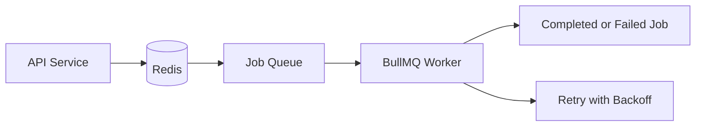

Choose BullMQ when:

- One application or small set of workers owns the job.
- Work is task-oriented, not a durable business event.
- Routing is simple.
- Redis already exists and has enough capacity.
- Delayed jobs, retries, concurrency, and rate limits are needed.
- Replay of an old event stream is not required.

Example:

```text
HTTP request -> add SendWelcomeEmail job -> return quickly
Worker -> send email -> mark job completed
```

BullMQ is not automatically a good event backbone. Redis retention, memory limits, queue cleanup, job deduplication, and worker ownership must be designed. Do not use one shared queue for unrelated teams without clear ownership.

### RabbitMQ: "Deliver This Message"

RabbitMQ is a message broker with exchanges, bindings, queues, routing keys, acknowledgments, and consumer flow control.

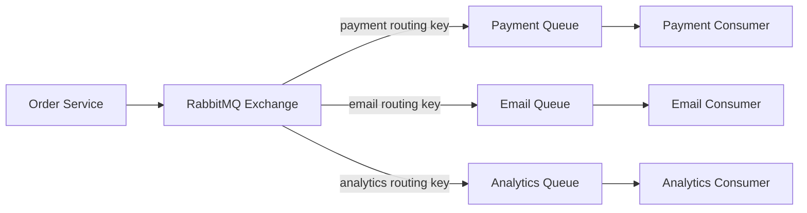

Choose RabbitMQ when:

- Services need explicit routing.
- Multiple queues need different copies of a message.
- Consumers acknowledge work.
- Queue-level retry and dead-letter behavior matters.
- Message delivery should not depend on one application process.
- Team can operate RabbitMQ or use managed RabbitMQ.

RabbitMQ usually treats messages as delivery work. Once acknowledged and removed, replay is not its primary model. Long-term event history often needs another system.

### AWS SNS and SQS: "Managed Pub/Sub Plus Queues"

SNS provides topics and fanout. SQS provides durable queues, polling, visibility timeout, retries, and dead-letter queues.

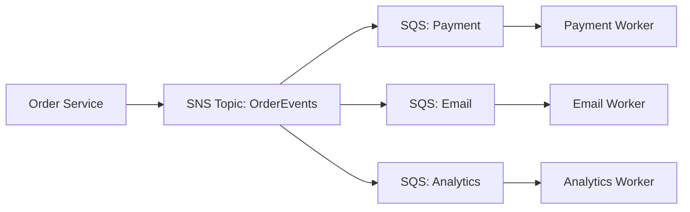

Choose SNS plus SQS when:

- System runs mainly on AWS.
- Managed infrastructure is preferred.
- One event must fan out to independent consumers.
- Each consumer needs its own durable queue and retry behavior.
- Team wants to avoid operating RabbitMQ clusters.
- AWS IAM, CloudWatch, encryption, and integration are useful.

SNS alone is not a worker queue. SQS alone is not broad fanout. Together, they model publish-subscribe plus independent consumer queues.

SQS Standard provides high throughput with at-least-once delivery and possible reordering. SQS FIFO provides stronger ordering and deduplication constraints with different throughput and design trade-offs.

### Kafka: "Record and Replay This Stream"

Kafka stores ordered records in partitions. Consumers read by offset. Consumer groups allow independent applications to process the same stream without deleting records for everyone else.

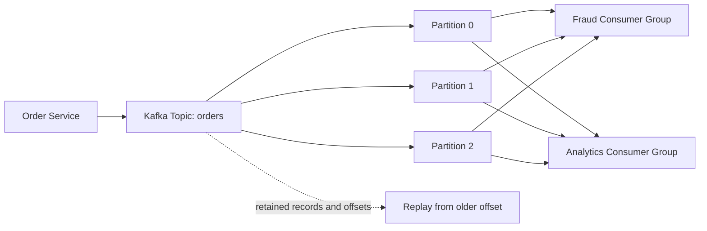

Choose Kafka when:

- Throughput is high.
- Events need retention.
- Multiple consumer groups process same data independently.
- Consumers need replay or reprocessing.
- Partitioning and per-key ordering matter.
- Stream processing or event-driven data pipelines are core requirements.

Kafka adds operational and design complexity: partition keys, consumer lag, retention, replication, rebalancing, schema evolution, storage, and capacity planning. Do not choose Kafka for one simple email job because Kafka is powerful.

## 4. Decision Tree

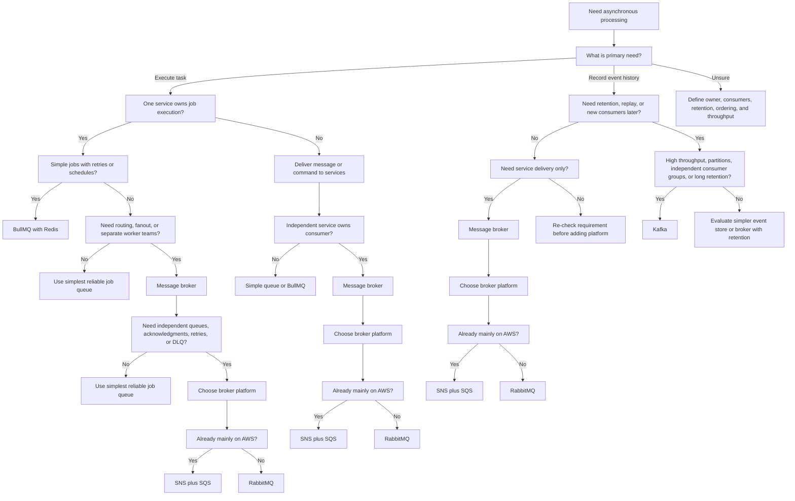

Decision order:

1. Identify primary need: execute work, deliver messages, or retain events.
2. Identify ownership: one worker owner or independent services.
3. Decide category: background job, message broker, or event streaming.
4. If message broker fits, choose broker platform: SNS plus SQS for AWS-managed infrastructure, RabbitMQ otherwise.
5. Check fanout, routing, acknowledgment, retry, dead-letter, retention, replay, ordering, and throughput needs.
6. Confirm team can operate system within budget and reliability target.

Edge cases:

* Multiple workers for one application still fit BullMQ. "One owner" means one logical workflow owner, not one worker process.
* A simple one-consumer job does not need RabbitMQ or Kafka only because it runs asynchronously.
* High throughput alone does not force Kafka. If no retention, replay, partitions, or independent groups exist, evaluate managed queues first.
* SNS plus SQS is strong for AWS fanout and independent queues, but not a general long-term replay log.
* RabbitMQ supports multiple consumers and routing, but acknowledged messages are not normally replayable.
* Kafka can carry commands, but using it for ordinary one-time jobs adds unnecessary retention and operational cost.
* Event history plus low throughput may fit a database-backed outbox or simpler event store; Kafka is not automatic.
* Strict ordering usually means choosing an ordering key and accepting reduced parallelism for that key.
* Transactional outbox may be needed regardless of broker when database state and published event must stay consistent.
* Existing Redis or AWS access is a constraint, not a reason by itself. Required capability still decides.

## 6. Comparison

| Concern                          | BullMQ                      | RabbitMQ                      | SNS plus SQS                            | Kafka                                      |
| -------------------------------- | --------------------------- | ----------------------------- | --------------------------------------- | ------------------------------------------ |
| Main abstraction                 | Job queue                   | Routed messages and queues    | Topics and managed queues               | Durable partitioned event log              |
| Typical consumer model           | Worker executes job         | Consumer acknowledges message | SQS consumer polls queue                | Consumer reads by offset                   |
| Routing                          | Simple queue or job name    | Exchanges and bindings        | SNS subscriptions and filters           | Topic and partition key                    |
| Replay                           | Not primary feature         | Not primary feature           | Limited by queue and retention model    | Core capability                            |
| Many independent consumer groups | Limited                     | Possible, queue-centric       | Strong fanout through queues            | Core capability                            |
| Best fit                         | Background work             | Service messaging             | AWS managed messaging                   | Event streaming                            |
| Main dependency                  | Redis                       | RabbitMQ cluster or service   | AWS                                     | Kafka cluster or managed Kafka             |
| Main cost                        | Redis memory and operations | Broker operations             | AWS request, storage, and transfer cost | Cluster, storage, operations, and capacity |

## 7. Avoiding Overkill

### Start Simple When

- One service owns work.
- Failure recovery only needs retry.
- No historical replay exists.
- Throughput is moderate.
- Team is small.
- Managed platform already solves availability.

BullMQ or a simple managed queue may be correct.

### Add Broker Capability When

- Multiple independent services consume messages.
- Routing rules are becoming application code.
- One consumer must not block another.
- Retry and dead-letter policy differs by consumer.
- Service ownership boundaries matter.

RabbitMQ or SNS plus SQS may be correct.

### Add Event Streaming Capability When

- Event history has business value.
- New consumers must process old events.
- Large throughput or many consumer groups exist.
- Consumers need independent offsets and processing speed.
- Partitioning and replay are explicit requirements.

Kafka may be correct.

## 8. Operational Constraints Matter

Technology choice must include operational reality:

- Who owns upgrades?
- Who responds when broker is unavailable?
- Who monitors lag, queue depth, retries, and dead letters?
- Where are backups and recovery procedures?
- What is maximum acceptable data loss?
- What is maximum acceptable duplicate processing?
- How are schemas versioned?
- How are credentials and encryption managed?
- What is monthly infrastructure budget?
- Can team debug distributed failures at 2 a.m.?

Managed AWS services reduce cluster operations but create cloud coupling and usage costs. Self-hosted RabbitMQ or Kafka can provide control but requires strong operational practice. BullMQ is simple to adopt but inherits Redis availability, persistence, and memory constraints.

## 9. Reliability Rules Shared by All Choices

### At-Least-Once Means Idempotency

Most practical asynchronous systems can deliver duplicates. Consumers should safely process same message more than once.

Example:

```text
event_id = order-123-payment-authorized
consumer checks processed_event table
if already processed: acknowledge and stop
otherwise: perform action and record event_id
```

Do not assume retry means exactly-once business effect.

### Dead-Letter Concept by System

Dead-letter handling means isolating work that cannot succeed through normal automatic processing. Mechanism differs by system:

| System | Dead-letter form | Trigger | Main purpose | Replay approach |
|---|---|---|---|---|
| BullMQ | Failed jobs or separate recovery queue | Attempts exhausted or permanent error | Isolate failed task execution | Fix cause, verify idempotency, replay selected jobs |
| RabbitMQ | Dead-letter exchange and dead-letter queue | Reject, expiry, queue limit, or retry policy | Isolate undeliverable messages | Route back after fix or publish corrected message |
| AWS SNS + SQS | SQS dead-letter queue | `maxReceiveCount` reached | Isolate messages that repeatedly fail consumption | Redrive selected messages after remediation |
| Kafka | Retry topic or dead-letter topic | Consumer cannot process event | Prevent one bad event from blocking stream progress | Reprocess from topic or publish corrected event |

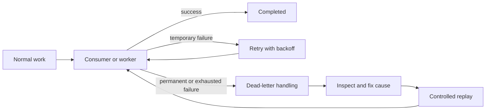

Dead-letter storage is not a trash bin. Keep ownership, alerts, retention, sensitive-data controls, root-cause records, and safe replay procedure.

BullMQ usually exposes failed-job state rather than broker-managed DLQ semantics. RabbitMQ and SQS provide stronger first-class dead-letter routing. Kafka uses application-level retry or dead-letter topics because consumers read retained records by offset.

#### BullMQ: Failed Job Workflow

```text
Queue: email
Job: send-welcome
Attempts: 5
Result: failed state
Action: inspect, fix, replay selected job
```

Use BullMQ failed jobs for task execution failures. Do not call every failed job a durable event DLQ. Failed-job retention and replay policy are application responsibilities.

Rules:

- Throw retryable errors so BullMQ records failure correctly.
- Set bounded attempts and backoff.
- Keep failed payload small and free of secrets.
- Use stable business idempotency key before replay.
- Move selected jobs to recovery queue if failed-job set is not enough.
- Keep failed-job retention separate from business audit history.

Example:

```text
GenerateInvoice fails because template missing
  -> retries exhausted
  -> failed BullMQ job
  -> deploy template
  -> replay invoice-123 once
```

Do not confuse:

- Failed job: one execution unit did not complete.
- Event history: durable record many consumers can replay.
- BullMQ queue: work queue, not automatic event log.

#### RabbitMQ: Dead-Letter Exchange and Queue

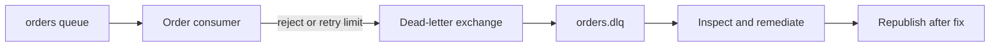

RabbitMQ dead-lettering routes rejected, expired, or overflowed messages through configured dead-letter exchange. Dead-letter queue stores messages for inspection.

Rules:

- Configure dead-letter exchange and routing key explicitly.
- Distinguish `nack/reject` behavior from successful acknowledgment.
- Prevent DLQ from routing back endlessly to main queue.
- Set TTL and retention appropriate to business need.
- Replay by republishing after root cause fix.
- Preserve original exchange, routing key, headers, and failure reason.

Example:

```text
payment.authorize -> payment queue
consumer rejects invalid schema
RabbitMQ routes message -> payment.dlq
operator fixes producer contract
operator republishes corrected message
```

Do not confuse:

- RabbitMQ DLQ: broker-routed rejected message.
- Retry queue: delayed next attempt.
- Queue backlog: normal unprocessed work, not dead-letter work.

#### AWS SNS and SQS: SQS Dead-Letter Queue

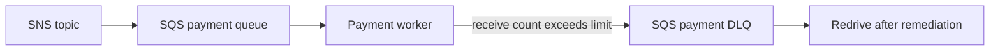

SNS publishes. SQS stores and delivers. SQS moves message to configured DLQ after `maxReceiveCount` is exceeded.

Rules:

- Configure DLQ redrive policy on source SQS queue.
- Set `maxReceiveCount` above expected transient retries but below infinite looping.
- Set source visibility timeout longer than normal processing time.
- Delete message only after durable work succeeds.
- Monitor DLQ message count and age.
- Use SQS redrive or controlled republish after fix.
- Remember SNS does not store worker failure state; subscribed SQS queue does.

Example:

```text
SNS OrderCreated
  -> SQS email queue
  -> worker receives 5 times and fails
  -> SQS moves message to email-dlq
  -> operator fixes email template
  -> redrive message
```

Do not confuse:

- SNS topic: fanout publisher, not DLQ itself.
- SQS source queue: normal delivery queue.
- SQS DLQ: repeated consumption failure.
- SQS retention: message lifetime, not successful processing.

#### Kafka: Retry Topic and Dead-Letter Topic

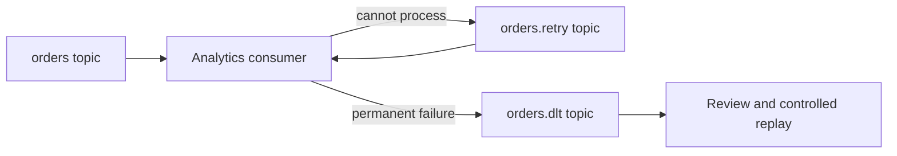

Kafka retains records by topic policy. Consumer normally advances offsets after successful processing. A dead-letter topic is an application convention for events that cannot be processed.

Rules:

- Preserve original topic, partition, offset, key, timestamp, schema version, and error metadata.
- Decide whether retry topic preserves original ordering.
- Avoid blocking one partition forever on one poison event.
- Use separate consumer group for replay.
- Do not replay business commands blindly.
- Retain DLT long enough for investigation and compliance.
- Monitor consumer lag in main, retry, and dead-letter topics.

Example:

```text
orders partition 2 contains malformed event
consumer publishes event -> orders.retry
retry attempts exhausted
consumer publishes event -> orders.dlt
analytics team fixes parser
new replay consumer reads DLT
```

Do not confuse:

- Kafka DLT: retained event record rejected by consumer.
- Offset lag: consumer is behind, not necessarily failure.
- Compacted topic: latest-key state, not dead-letter storage.
- Retry topic: another processing attempt, not final failure.

#### Cross-System Confusion Rules

| Question | BullMQ | RabbitMQ | SNS + SQS | Kafka |
|---|---|---|---|---|
| What failed? | Job execution | Message delivery or consumption | SQS message consumption | Event processing |
| Who moves failed work? | Application or BullMQ failed state | Broker dead-letter exchange | SQS redrive policy | Consumer application |
| Is replay native? | Selected job replay | Republish message | Redrive or republish | Read retained topic by offset or DLT |
| Is original item normally removed? | Job state changes | Acknowledged message removed | Deleted after success | Record retained by policy |
| Main identity | Job ID and business key | Message ID and routing metadata | Message ID and receipt history | Topic, partition, offset, event ID |
| Main risk | Duplicate task side effect | Looping dead-letter routes | Visibility timeout and duplicate delivery | Ordering loss and replaying commands |

Fast rule:

```text
BullMQ failed job = work did not finish
RabbitMQ DLQ = broker routed rejected message
SQS DLQ = message exceeded receive failures
Kafka DLT = consumer could not process retained event
```

Never use "DLQ" as vague synonym for every error store. Name mechanism precisely in design docs, dashboards, alerts, and runbooks.

### Acknowledge After Durable Work

Consumer should acknowledge or delete message only after work is safely completed. Acknowledge too early and crash can lose work. Acknowledge too late and duplicate delivery can occur.

### Design Retries Carefully

Use bounded retries, exponential backoff, jitter, and dead-letter handling. Permanent validation errors should not retry forever. Temporary dependency failures may deserve retry.

### Observe Queue Health

Monitor:

- Queue depth.
- Oldest message age.
- Consumer lag.
- Processing latency.
- Retry count.
- Dead-letter count.
- Failed job count.
- Throughput.
- Duplicate rate.
- Broker storage and memory.

Queue depth alone can look healthy while oldest message age grows because consumers are slow.

## 10. Migration Path

Avoid choosing a large platform only to prevent future migration. Design boundaries so migration stays possible:

1. Hide queue client behind application interface.
2. Define message schema and event identifiers.
3. Make consumers idempotent.
4. Separate business event from transport metadata.
5. Add metrics before traffic grows.
6. Keep producer and consumer contracts versioned.
7. Migrate one workflow at a time.

Example:

```text
BullMQ today
  -> stable JobPublisher interface
  -> independent worker contract
  -> SNS/SQS later if multiple services need fanout
  -> Kafka later if retention and replay become requirements
```

Migration is not free, but clean boundaries reduce lock-in and avoid premature platform complexity.

## 11. Final Decision Rule

```text
Need to execute simple background jobs?
  -> BullMQ and Redis

Need to route messages between independent services?
  -> RabbitMQ

Need managed pub/sub and queues on AWS?
  -> SNS plus SQS

Need high-throughput durable event stream with replay?
  -> Kafka
```

Final principle:

> Requirement plus infrastructure plus operational constraints decide technology. Do not choose infrastructure because you can use it. Choose it because system requires its capabilities.

## Interview Questions and Answers


#### Question 1: "I need to execute these jobs"

Examples:

- Process image.
- Send email.
- Create report.
- Run scheduled cleanup.

Start with BullMQ if:

- One application owns workflow.
- Jobs do not need broad fanout.
- Redis operational model is acceptable.

Do not start with Kafka unless replayable event history is a real requirement.

#### Question 2: "I need to deliver messages between components"

Ask:

- One consumer or many?
- Routing key or topic subscription?
- Need acknowledgment?
- Need dead-letter handling?
- Need each service to receive its own copy?

Use RabbitMQ for flexible broker-level routing. Use SNS plus SQS when AWS-managed pub/sub and queues fit existing platform.

#### Question 3: "I need to record and replay events"

Ask:

- How long must events remain?
- How many events per second?
- How many consumer groups?
- Can consumers process at different speeds?
- Must new consumers read old events?
- Does partition-key ordering matter?

Kafka becomes strong candidate when answers indicate high throughput, retention, replay, and independent consumer groups.


#### Beginner

1. What is a background job?
2. Why should long-running work leave the HTTP request path?
3. What problem does BullMQ solve?
4. What is the difference between a job and an event?
5. What is a message broker?
6. What is the difference between a queue and a topic?
7. What does RabbitMQ exchange do?
8. What is the difference between SNS and SQS?
9. What is event streaming?
10. Why is Kafka different from a simple queue?

#### Intermediate

11. When should BullMQ be preferred over RabbitMQ?
12. When should RabbitMQ be preferred over Kafka?
13. When should SNS and SQS be used together?
14. Why does Kafka support replay better than RabbitMQ?
15. What are consumer groups?
16. What are Kafka partitions and offsets?
17. What is a dead-letter queue?
18. What is visibility timeout in SQS?
19. Why can message processing create duplicates?
20. How does idempotency protect consumers?
21. What is backpressure?
22. Why use exponential backoff and jitter?
23. What metrics show queue health?
24. What are trade-offs of managed messaging services?
25. Why should message schemas be versioned?

#### Senior

26. Design order processing with payment, inventory, email, and analytics consumers.
27. Choose between BullMQ, RabbitMQ, SNS plus SQS, and Kafka for notification processing.
28. How would you migrate a BullMQ workflow to SNS plus SQS?
29. How would you migrate RabbitMQ messages to Kafka events?
30. How do you preserve ordering for one aggregate while scaling consumers?
31. How do you handle poison messages?
32. How do you prevent duplicate payment or email effects?
33. How do you choose partition key in Kafka?
34. How do you estimate Kafka partition count?
35. How do you design replay without sending duplicate business commands?
36. How do you handle schema evolution across independent consumers?
37. How do you monitor consumer lag and define alert thresholds?
38. How do you guarantee event publication after a database transaction?
39. When should you use transactional outbox?
40. How do you compare operational cost between self-hosted Kafka and AWS messaging?


#### BullMQ vs Message Broker

BullMQ focuses on executing jobs owned by workers. A message broker focuses on delivering messages between independent components, often with routing, fanout, acknowledgments, and dead-letter behavior.

#### Message Broker vs Event Streaming

A message broker usually focuses on delivery and work completion. Event streaming focuses on durable ordered records, retention, independent consumer offsets, and replay.

#### RabbitMQ vs SNS and SQS

RabbitMQ provides broker-controlled exchanges, bindings, and queues. SNS plus SQS provides AWS-managed topic fanout and independent durable queues. Choose based on routing needs, cloud environment, operational ownership, and cost.

#### Kafka vs RabbitMQ

Kafka is a durable partitioned event log designed for high throughput, retention, consumer groups, and replay. RabbitMQ is a flexible message broker designed for routing, queueing, acknowledgments, and delivery workflows.

#### Why Not Use Kafka Everywhere?

Kafka introduces partition, retention, replication, lag, schema, and operational complexity. A simple job queue or managed queue can solve smaller problems with lower cost and lower failure surface.

#### Why Not Use BullMQ Everywhere?

BullMQ is not designed as a general durable event history for many independent consumers. Shared Redis queues can create coupling, memory pressure, routing limits, and weak replay semantics.


#### Beginner Answers

1. **What is a background job?**<br>
   Work executed outside the user request path, usually by a worker. Example: API accepts image upload, queues thumbnail generation, and returns before processing finishes.
2. **Why should long-running work leave the HTTP request path?**<br>
   It reduces request latency and avoids timeout risk. Example: invoice generation takes 20 seconds, but checkout response can return in 300 milliseconds while a worker creates the invoice.
3. **What problem does BullMQ solve?**<br>
   It stores jobs in Redis and lets workers process, retry, delay, prioritize, and limit them. Example: `SendWelcomeEmail` waits when email provider is temporarily unavailable.
4. **What is the difference between a job and an event?**<br>
   A job asks a worker to perform work. An event records something that happened. Example: `GenerateInvoice` is a job; `OrderPaid` is an event that payment, email, and analytics services may consume.
5. **What is a message broker?**<br>
   Infrastructure that accepts messages, routes or queues them, and delivers them to consumers. Example: RabbitMQ routes `payment.authorize` to payment queue instead of calling payment service directly.
6. **What is the difference between a queue and a topic?**<br>
   Queue usually distributes each message among competing workers. Topic publishes one message to multiple subscriptions. Example: one image job goes to one worker; `user.created` fans out to email and analytics.
7. **What does RabbitMQ exchange do?**<br>
   It routes published messages to queues using exchange type, routing key, and bindings. Example: `order.*` routes order events to a matching queue.
8. **What is the difference between SNS and SQS?**<br>
   SNS is a pub/sub topic that fans out notifications. SQS is a durable queue consumed by workers. Example: SNS sends `OrderCreated` to payment, email, and analytics SQS queues.
9. **What is event streaming?**<br>
   Persistent ordered event flow that consumers read at their own offsets. Example: Kafka retains order events so a new fraud service can read them from last year's offset.
10. **Why is Kafka different from a simple queue?**<br>
    Kafka retains records after consumption and lets many consumer groups read independently. A typical work queue removes or hides a message after one consumer handles it.

#### Intermediate Answers

11. **When should BullMQ be preferred over RabbitMQ?**<br>
    Use BullMQ for simple task execution with one owning application and Redis already available. Example: one Node.js application processes report jobs; no cross-service routing is needed.
12. **When should RabbitMQ be preferred over Kafka?**<br>
    Use RabbitMQ when delivery routing, acknowledgments, queues, and retries matter more than long-term replay. Example: route commands to payment and shipping workers.
13. **When should SNS and SQS be used together?**<br>
    Use them when AWS-managed fanout and independent durable queues are needed. Example: SNS publishes `OrderCreated`; separate SQS queues isolate payment, email, and analytics failures.
14. **Why does Kafka support replay better than RabbitMQ?**<br>
    Kafka retains records by policy and consumers track offsets. RabbitMQ normally removes acknowledged messages. Example: analytics resets offset to replay a week of orders without asking producers to resend.
15. **What are consumer groups?**<br>
    A group is a set of consumers sharing partitions so each record is processed once per group. Different groups each receive the stream independently. Example: fraud and analytics groups both read `payments`.
16. **What are Kafka partitions and offsets?**<br>
    Partition is an ordered log shard. Offset identifies record position within that partition. Example: all events for `order-123` use same key and partition, preserving per-order order.
17. **What is a dead-letter queue?**<br>
    Storage for messages that exceed retry limits or cannot be processed. Example: invalid payment payload moves to DLQ for inspection instead of blocking healthy messages.
18. **What is visibility timeout in SQS?**<br>
    Period after receive when message is hidden from other consumers. Consumer deletes it after success; if it crashes before delete, message becomes visible again.
19. **Why can message processing create duplicates?**<br>
    Consumer may finish business work, then crash before acknowledgment. Broker redelivers message. Example: email provider accepts request, worker crashes before deleting SQS message.
20. **How does idempotency protect consumers?**<br>
    Consumer stores a unique event or operation ID and ignores repeats. Example: payment handler records `payment_attempt_id` with a unique constraint before applying capture.
21. **What is backpressure?**<br>
    Mechanism that slows producers or limits consumers when downstream capacity is full. Example: worker concurrency stays at 20 while payment provider rate limit is 100 requests per second.
22. **Why use exponential backoff and jitter?**<br>
    Backoff spaces retries; jitter prevents many workers retrying simultaneously. Example: failed requests retry after randomized 1, 2, 4, and 8 second delays.
23. **What metrics show queue health?**<br>
    Queue depth, oldest message age, processing latency, throughput, retry count, DLQ count, failed jobs, and consumer lag. Example: depth is stable but oldest age grows, showing workers are too slow.
24. **What are trade-offs of managed messaging services?**<br>
    They reduce cluster operations and provide integrations, but add usage cost, cloud coupling, quotas, and provider-specific behavior. Example: SNS/SQS avoids RabbitMQ upgrades but ties deployment to AWS IAM and regional limits.
25. **Why should message schemas be versioned?**<br>
    Producers and consumers deploy independently. Versioned schemas prevent a producer change from breaking old consumers. Example: add optional `phone_number` before removing `phone`.

#### Senior Answers

26. **Design order processing with payment, inventory, email, and analytics consumers.**<br>
    Persist order transaction, publish an outbox event, fan out through SNS/SQS or Kafka, use separate queues or consumer groups, make consumers idempotent, and monitor retries and DLQs. Payment and inventory need explicit state machines; email and analytics can retry independently.
27. **Choose technology for notification processing.**<br>
    BullMQ fits one application sending notifications. SNS plus SQS fits AWS fanout to email, SMS, and push workers. RabbitMQ fits non-AWS routing. Kafka fits notification history or replay analytics, not ordinary one-time delivery.
28. **How migrate BullMQ to SNS plus SQS?**<br>
    Define stable job schema, implement publisher adapter, create one SQS queue per independent consumer, run dual publish or bridge during migration, compare outcomes, then remove BullMQ after backlog drains. Preserve idempotency because delivery semantics change.
29. **How migrate RabbitMQ messages to Kafka events?**<br>
    Define event schema and partition key, create Kafka producer or bridge, preserve message IDs and timestamps, validate ordering and replay behavior, migrate consumers by group, then retire RabbitMQ routes after observing parity.
30. **How preserve ordering for one aggregate while scaling consumers?**<br>
    Partition by aggregate ID or route all aggregate messages to one ordered queue. Example: Kafka key `order_id` keeps one order's events in one partition while different orders process in parallel.
31. **How handle poison messages?**<br>
    Limit retries, capture failure reason and payload metadata, move message to DLQ, alert operators, and provide safe replay after correction. Never let one invalid message block all healthy work.
32. **How prevent duplicate payment or email effects?**<br>
    Use idempotency keys at consumer and provider boundaries, durable processed-event records, unique database constraints, and provider idempotency APIs. Never rely only on in-memory duplicate checks.
33. **How choose Kafka partition key?**<br>
    Choose field requiring ordering and balanced distribution. Use `order_id` for per-order ordering, not a low-cardinality key such as `country` that creates hot partitions. Validate distribution with production-like data.
34. **How estimate Kafka partition count?**<br>
    Estimate producer throughput, consumer throughput, retention storage, replication factor, and recovery time. Choose enough partitions for current and near-term parallelism, but avoid excessive partitions that increase metadata and rebalance cost.
35. **How design replay without duplicate business commands?**<br>
    Separate immutable events from commands. Replay into a new consumer group or projection, use idempotency and replay mode, and do not resend payment or email commands blindly. Example: rebuild analytics table from `orders` without charging customers again.
36. **How handle schema evolution?**<br>
    Use backward-compatible additions, schema registry or documented contracts, consumer contract tests, version fields when needed, and gradual rollout. Remove fields only after all consumers stop reading them.
37. **How monitor consumer lag and define alert thresholds?**<br>
    Measure lag in records and time, then compare with business SLO. Alert when lag threatens processing deadline, not at arbitrary record count. Example: payment lag alert at 30 seconds; analytics lag may tolerate one hour.
38. **How guarantee event publication after database transaction?**<br>
    Use transactional outbox: write business state and outbox record in one database transaction, then relay outbox records to broker with idempotent publishing. Consumers still need deduplication.
39. **When use transactional outbox?**<br>
    Use when database change and event publication must not diverge. Example: order marked paid and `OrderPaid` event must both survive a process crash.
40. **How compare self-hosted Kafka and AWS messaging cost?**<br>
    Include compute, storage, replication, network transfer, operations, upgrades, on-call, backup, observability, and recovery cost. Managed service may cost more per request but less engineering time; self-hosting may be cheaper only with strong operational scale.


#### How do you choose between a queue, a stream, and a job system?

Start with the required read model. A queue or job system is appropriate when one successful worker should consume each unit of work. A stream is better when several independent consumers need the same durable history or when replay is a product requirement. Ask about ordering scope, retention, fan-out, latency, and operational ownership before naming a product.

#### How would you prevent a retry from charging a customer twice?

Give the business operation a stable idempotency key, persist the request state with a unique constraint, and only acknowledge the message after the durable state transition. A timeout after the payment provider accepted the charge is an ambiguous result, so reconcile by provider key instead of blindly charging again.

#### Practical architecture: order confirmation

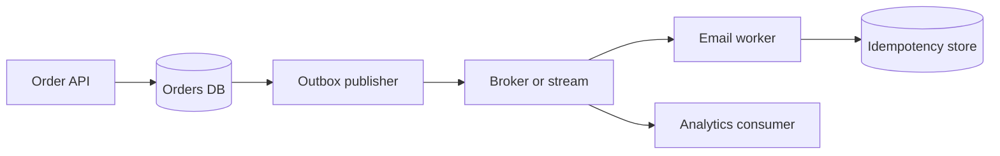

The order transaction writes the outbox row and order state together. Email delivery can retry independently, while analytics replays the event without competing with the email worker.

#### What should be in a design review checklist?

Verify the message contract, ownership of retries, maximum age, dead-letter handling, idempotency boundary, observability, capacity headroom, access control, and a recovery runbook. A design is incomplete if it describes only the happy path.

### Examples and Diagrams

#### 15. Consolidated Examples

##### End-to-End E-Commerce Example

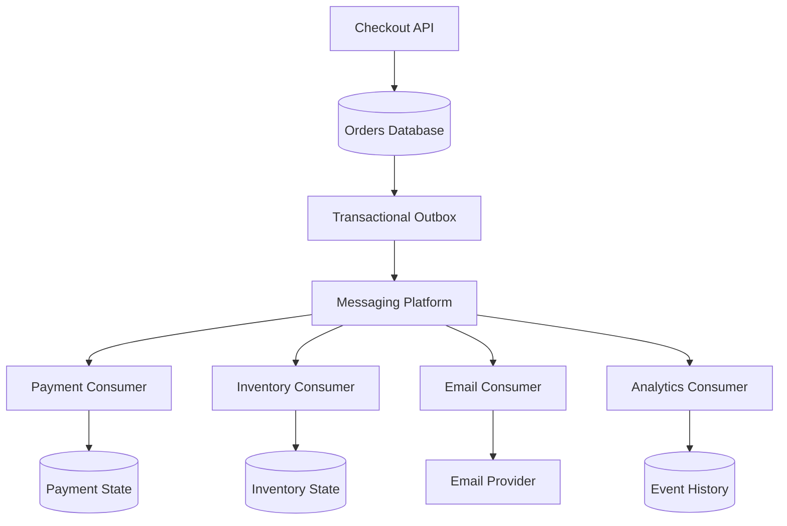

Use BullMQ if checkout only needs one internal email worker. Use SNS plus SQS or RabbitMQ when payment, inventory, and email need independent queues. Use Kafka when analytics, fraud, and future consumers need durable replayable history.

##### Cost and Complexity Example

```text
One API + one worker + moderate jobs
  -> BullMQ and existing Redis

Five services + routing + independent retries
  -> RabbitMQ or SNS plus SQS

Millions of events + long retention + replay
  -> Kafka
```

Capability should grow with requirement. Starting simple is good engineering when boundaries, schemas, and idempotency keep future migration possible.
