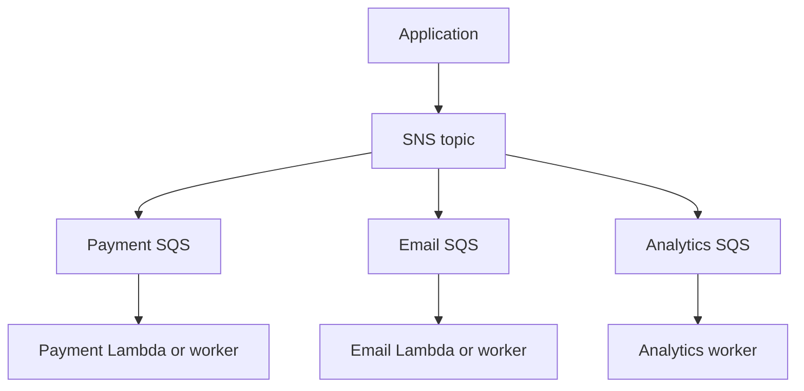
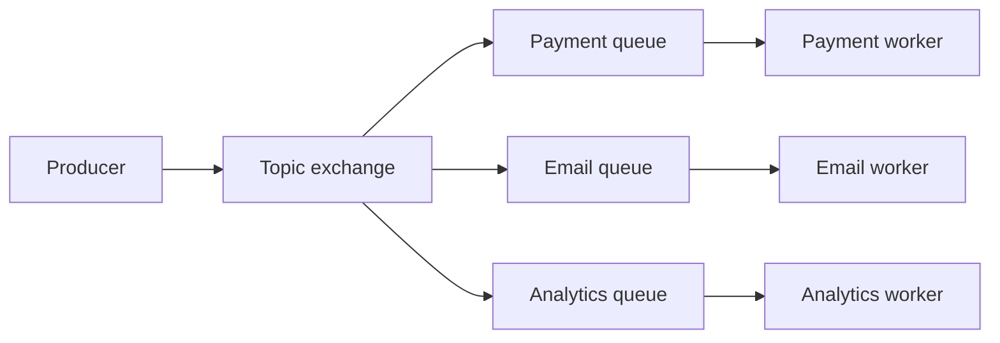
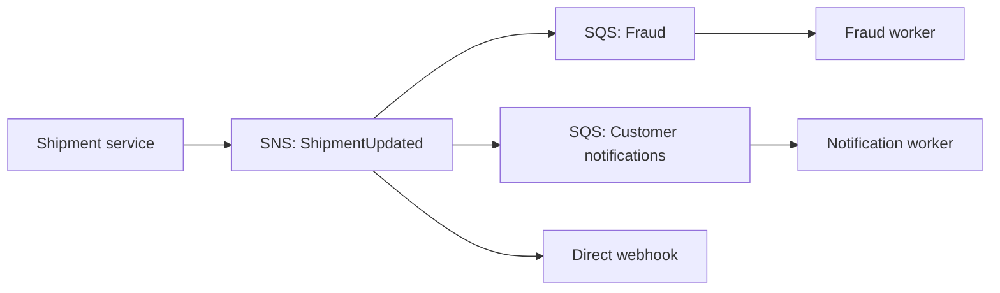

# AWS SNS Versus SQS

SNS and SQS solve complementary problems:

```text
SNS = publish and fanout
SQS = store and consume
```

## Direct Comparison

| Concern | SNS | SQS |
|---|---|---|
| Main abstraction | Topic | Queue |
| Producer behavior | Publish once | Send to one queue |
| Consumer model | Push to subscriptions | Consumer polls |
| Fanout | Native | Requires separate sends or SNS |
| Backlog isolation | Subscription endpoint | Queue |
| Visibility timeout | No | Yes |
| DLQ | Endpoint-dependent | First-class SQS DLQ |
| Best worker fit | Event publication | Durable work processing |

## SNS Plus SQS Flow



Each queue has independent backlog, visibility timeout, retry, DLQ, and scaling. This is AWS equivalent of exchange fanout to multiple RabbitMQ queues.

## When Use SNS Only

Use SNS-only delivery for notifications where endpoint retry and delivery semantics fit. Examples: infrastructure alert, mobile push, simple HTTP notification.

## When Use SQS Only

Use SQS-only for one producer and one logical consumer group. Examples: image processing, cleanup, report generation.

## When Use SNS Plus SQS

Use together when one event must reach independent consumers and each needs durable buffering.

## RabbitMQ Mapping

```text
RabbitMQ exchange      ~= SNS topic
RabbitMQ queue         ~= SQS queue
RabbitMQ binding       ~= SNS subscription/filter policy
RabbitMQ consumer ACK  ~= SQS delete after processing
RabbitMQ DLX/DLQ       ~= SQS redrive policy/DLQ
```

Not exact equivalence. RabbitMQ has exchanges, bindings, routing keys, and topic-exchange wildcard tokens `*` and `#`. SNS uses subscription filter policies with operators such as `prefix`, `anything-but`, `exists`, and `numeric`; it does not interpret RabbitMQ wildcard syntax. SNS/SQS has managed AWS operations and service-specific quotas.

Example:

```text
RabbitMQ topic binding: transaction.*
SNS filter policy: { "eventType": [{ "prefix": "transaction." }] }
```

Both express category filtering, but syntax and matching semantics differ.

## RabbitMQ Equivalent Flow



AWS mapping:

```text
SNS topic              ~= RabbitMQ exchange
SQS subscription      ~= RabbitMQ queue
SNS filter policy     ~= routing or binding rule
SQS delete            ~= consumer ACK
SQS redrive policy    ~= dead-letter exchange and queue
```

Use one SQS queue per independent consumer, just as RabbitMQ uses one queue per service when each service needs a copy.

## Cost and Business Trade-off

Managed AWS is often cheaper in engineering time for small teams already operating AWS. Per-request, delivery, data transfer, Lambda, and retention charges can become significant at high volume.

Self-hosted RabbitMQ can reduce per-message service charges and avoid cloud lock-in, but team pays for cluster sizing, upgrades, disk alarms, quorum replication, backups, incident response, and 24/7 ownership. Compare total cost of ownership, not invoice line alone.

## Cost and Operational Choice

Choose SNS/SQS when AWS integration, IAM, Lambda, managed durability, and low cluster operations matter. Choose RabbitMQ when portability, AMQP topology, self-managed routing, or non-AWS deployment matters.

Compare:

- Request and delivery volume.
- Payload size and retention.
- Network transfer.
- Lambda invocation and concurrency.
- RabbitMQ node and storage cost.
- On-call and upgrade effort.
- Recovery and replay procedures.

## Interview Questions and Answers


#### Why not use one SQS queue for all consumers?

Consumers compete. One message goes to one consumer. Use SNS plus one SQS queue per independent service for fanout.

#### Is SNS a replacement for RabbitMQ exchange?

Conceptually for many fanout cases, yes. SNS has topic publication and subscription filters. RabbitMQ offers more exchange, binding, channel, and protocol control.

#### Is SQS a replacement for every RabbitMQ queue?

Often for simple durable work queues. SQS lacks RabbitMQ's rich exchange topology and protocol semantics.

#### What does AWS managed mean?

AWS operates service infrastructure, scaling, patching, and availability model. Team still owns message schema, idempotency, permissions, quotas, cost, DLQ, and consumer correctness.

#### When RabbitMQ is better?

Use RabbitMQ when deployment must work outside AWS, AMQP clients and exchange topology matter, routing is richer than SNS filters, or team already operates RabbitMQ reliably.

#### When AWS is better?

Use SNS plus SQS when AWS-native IAM, Lambda, CloudWatch, managed durability, elastic service limits, and minimal broker operations outweigh portability and per-request cost.


#### How do SNS and SQS combine to isolate failure domains?

SNS performs fan-out; each SQS subscription becomes an independent buffer and retry boundary. A consumer outage affects only its queue. Without SQS, a slow HTTP endpoint can make notification delivery and recovery harder to control.

#### When is direct SNS delivery a poor choice?

Avoid it when the consumer needs durable backlog, long processing, replay, strict rate control, or a dead-letter workflow. Direct delivery can be useful for low-value webhooks when the endpoint and retry policy are well understood.

#### What should be compared besides feature lists?

Compare total cost at expected volume, regional failure behavior, quotas, observability, IAM complexity, operational skills, data residency, and migration effort. “Managed” reduces broker operations but does not remove application-level reliability work.

### Examples and Diagrams

#### Example

RabbitMQ deployment: producer -> topic exchange -> payment/email/analytics queues.<br>
AWS deployment: producer -> SNS topic -> payment/email/analytics SQS queues -> Lambda or workers.

#### Practical example: shipment updates



Fraud and notifications retain messages independently. The webhook is intentionally best-effort and should include a signed event ID so the receiver can deduplicate.
