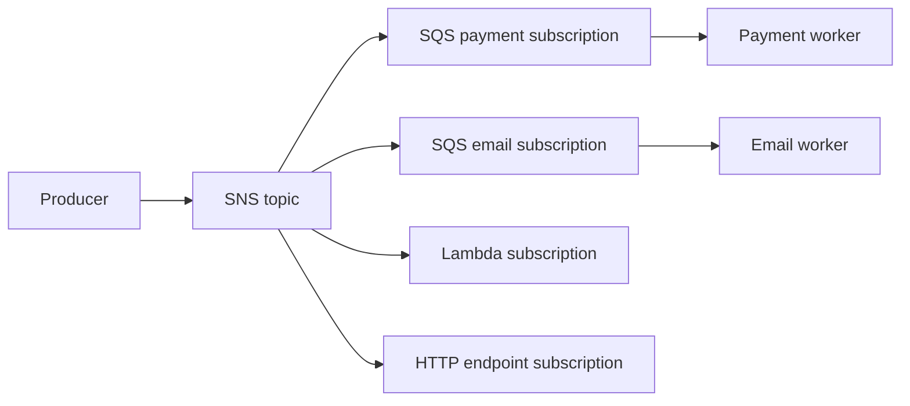
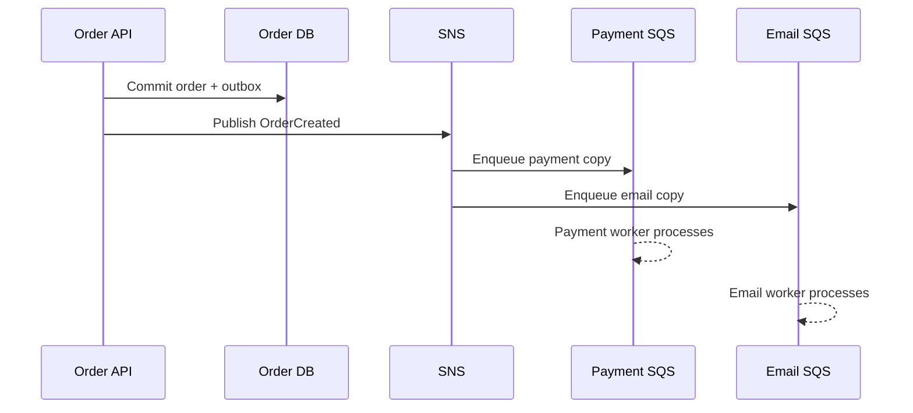
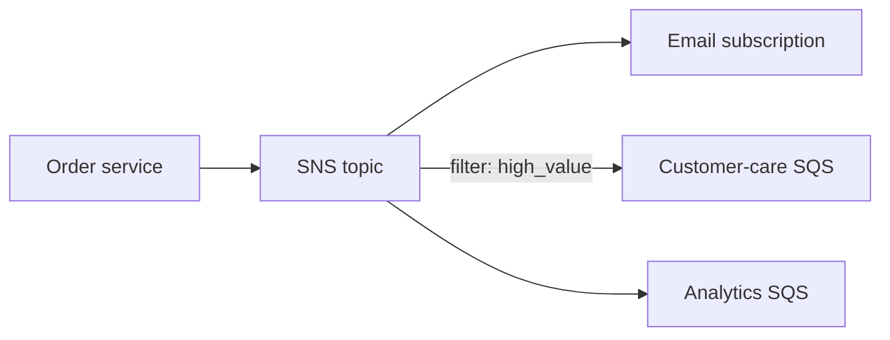

# AWS SNS

Amazon Simple Notification Service (SNS) is a managed pub/sub service. Publisher sends message to topic; SNS fans out to subscriptions such as SQS, Lambda, HTTP endpoints, email, or SMS.

## Why SNS Exists

AWS applications often need one event to reach multiple independent consumers without operating a broker cluster. SNS provides managed topic fanout, IAM integration, encryption, filtering, retries, and regional service operations.

## Architecture



SNS is publisher-facing fanout. Durable worker processing usually uses SNS to publish into SQS queues.

## Topic and Subscription

Topic owns publication. Subscription owns delivery endpoint and filter policy. Each SQS subscription gets its own queue, so consumer backlog and retry behavior remain isolated.

Message filtering can route by message attributes. SNS filter policies support exact matching plus operators such as `prefix`, `anything-but`, `exists`, `numeric`, `equals-ignore-case`, and `suffix`. SNS does not use RabbitMQ topic-exchange wildcard tokens `*` and `#`; use filter-policy operators instead. Keep filters documented and test them; incorrectly filtered events can look like delivery failures.

Example prefix filter:

```json
{
  "eventType": [
    { "prefix": "transaction." }
  ]
}
```

This matches values such as `transaction.created` and `transaction.failed`. Filter policy syntax and supported operators depend on SNS filtering rules; do not copy RabbitMQ wildcard syntax into SNS.

Filters can inspect either `MessageAttributes` or a JSON message body, depending on the subscription's filter-policy scope. Keep routing attributes small and stable:

```json
{
  "MessageAttributes": {
    "eventType": { "DataType": "String", "StringValue": "transaction.created" },
    "tenant": { "DataType": "String", "StringValue": "acme" }
  }
}
```

If no filter policy is attached, the subscription receives every publication. A non-matching filter is an intentional drop for that subscription, not a delivery retry.

### Why SQS Subscription Matters

Direct SNS to Lambda or HTTP can work for short notification flows. Critical work usually benefits from SNS plus SQS:

```text
SNS publishes once
SQS stores independently
consumer controls poll and concurrency
consumer deletes after success
```

This creates inspectable backlog and isolates a slow consumer from other subscriptions. AWS documents this as push fanout into durable queues for asynchronous processing.

## Delivery and Retry

SNS delivery behavior depends on endpoint type. SQS subscription gives durable queue semantics. Direct Lambda or HTTP delivery has different retry, timeout, and endpoint behavior. For critical workers, SNS plus SQS is usually easier to inspect and replay than direct invocation.

SNS publication success means SNS accepted the message. It does not mean every endpoint completed business work. Track per-subscription delivery failures and let each queue own retry and DLQ policy.

## Ordering and FIFO

Standard SNS favors scale and availability, not strict ordering or deduplication. FIFO topics and FIFO SQS queues support stronger ordering and deduplication constraints with throughput and design trade-offs.

Do not claim global ordering unless architecture defines message group or ordering key.

## Security

- IAM topic and subscription policies.
- KMS encryption where required.
- Private endpoints or VPC integration where applicable.
- Least privilege publish and subscribe permissions.
- Avoid secrets in message body.

## Use Cases

- `OrderCreated` fanout to payment, email, analytics.
- Infrastructure notifications.
- Cross-account or cross-service notifications.
- AWS event integration.
- Managed pub/sub without RabbitMQ operations.

## Pros, Cons, and Cost

**Pros:** managed, elastic, AWS integrations, fanout, IAM, filtering, low cluster operations.<br>
**Cons:** AWS coupling, per-request and delivery cost, endpoint-specific semantics, replay weaker than Kafka, debugging spans services.<br>
**Cost:** publish requests, deliveries, data transfer, filtering, storage in subscribed SQS queues, Lambda or endpoint execution.

## Interview Questions and Answers


#### Is SNS a queue?

No. SNS is topic-based pub/sub. It pushes publication to subscriptions. SQS stores messages for workers.

#### Why SNS plus SQS?

SNS fans out one event. Each SQS queue gives one consumer group independent buffering, retry, visibility timeout, and DLQ.

#### What if email consumer is down?

Its SQS queue accumulates messages. Payment and analytics queues continue independently.

#### When use SNS alone?

For notification endpoints where endpoint retry semantics and durability are sufficient. Use SQS for critical worker processing and inspectable backlog.

#### What does SNS not provide?

SNS is not a general event-replay log and not a worker acknowledgment protocol. Pair it with SQS for durable work or Kafka for long-retained replayable streams.


#### What happens when an SNS subscription is filtered out?

SNS evaluates the subscription filter before delivery. A message that does not match that subscription is intentionally not delivered there, so filters are part of the contract and should be tested like application code. Keep an audit path if missing a notification is costly.

#### How should SNS message attributes be designed?

Use small, stable attributes for routing such as `event_type`, `tenant`, or `schema_version`. Put business payload in the message body, and avoid using unbounded user data as an attribute because it complicates filtering, metrics, and governance.

#### Does SNS provide a durable replay log?

No. SNS is a delivery and fan-out service, not a general event history. If replay, audit, or late subscribers matter, deliver to durable SQS queues or publish to a retained stream as part of the design.

### Examples and Diagrams

#### Practical Example: Order Created



Payment and email queues can scale, retry, and dead-letter independently.

#### Example

Order service publishes one `OrderCreated` to SNS. Payment, email, and analytics each subscribe with separate SQS queues. Payment failure does not delay email queue.

#### Practical example: order notifications



The email subscription can be direct for low-value, best-effort notifications. SQS subscriptions are preferable for customer-care and analytics because they need buffering, retries, and independent consumer speed.
