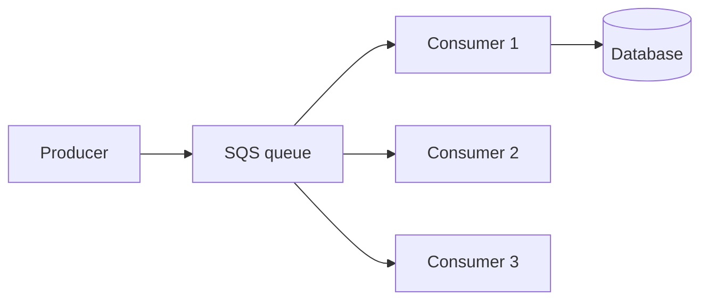
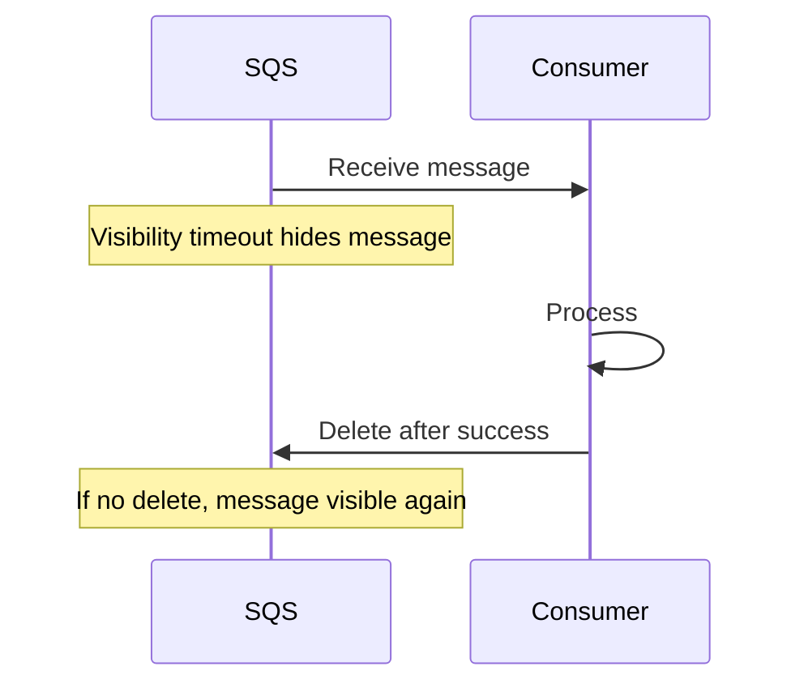
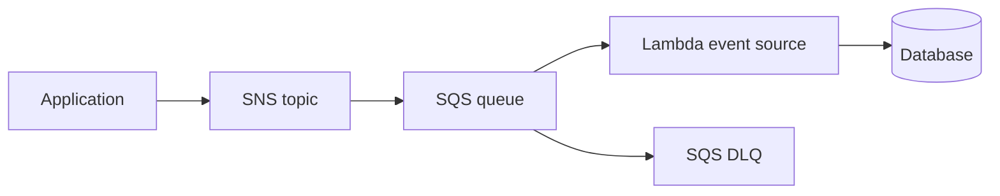
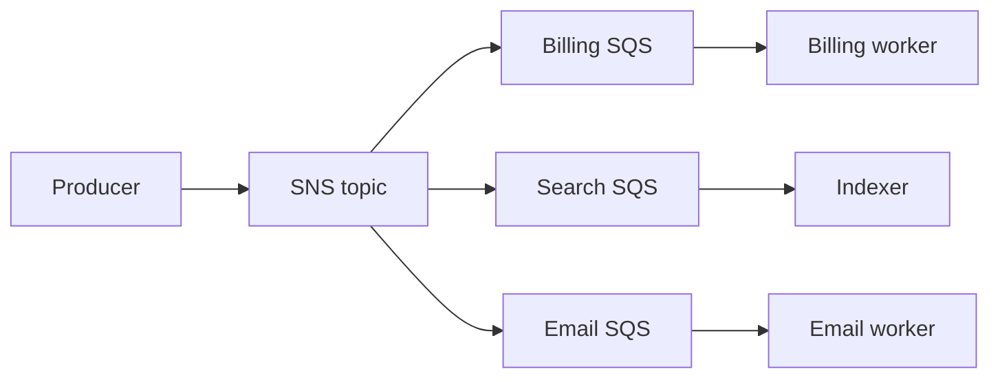

# AWS SQS

Amazon Simple Queue Service (SQS) is a managed durable queue. Consumers call `ReceiveMessage`, process messages, then call `DeleteMessage`. SQS removes cluster operation from common work-queue designs.

## Why SQS Exists

AWS applications need buffering and decoupling without running RabbitMQ nodes. SQS provides scalable queues, visibility timeout, retention, dead-letter queues, encryption, IAM, and CloudWatch integration.

## Architecture

Consumers compete for messages in one queue. If multiple services need copies, use SNS fanout into separate SQS queues.

## Standard and FIFO

### Standard

Very high scale, at-least-once delivery, and best-effort ordering. Use when duplicates are safe and strict order is not required.

### FIFO

Message groups preserve ordering within each group and support deduplication features. Use when order matters per entity, such as one account or order. FIFO does not create unlimited global ordering.

## Receive, Visibility, Delete

Set visibility timeout longer than normal processing, or extend it for long jobs. Delete only after durable work succeeds.

Visibility timeout is a lease, not a lock forever. A crashed or slow consumer can lose lease and another consumer may receive same message. Make handler idempotent even when timeout is configured correctly.

For long-running work, call `ChangeMessageVisibility` before the lease expires. A successful `ReceiveMessage` is not an acknowledgement: only deletion after durable processing prevents normal redelivery.

## Dead-Letter Queue

Configure redrive policy with `maxReceiveCount`. Repeated failures move message to DLQ. Monitor DLQ age and count. Set DLQ retention long enough for source backlog plus investigation window.

Do not attach DLQ blindly to ordered FIFO workflow if removing one message breaks required sequence.

DLQ runbook:

1. Inspect message ID, receive count, error, and age.
2. Classify transient, invalid, dependency, or code failure.
3. Fix dependency or code before replay.
4. Replay through controlled redrive or a repair queue.
5. Keep replay idempotent and record operator action.

Never delete DLQ messages before understanding whether they represent lost business work.

## Backpressure and Lambda

Control Lambda concurrency, batch size, visibility timeout, and downstream database capacity. More Lambda concurrency can create database or provider outage.

For direct consumers, use long polling, bounded concurrency, and exponential backoff. Queue is buffer, not infinite storage.

For Lambda event source mappings, reserved concurrency protects downstream systems. Batch size improves throughput but increases retry scope: one failed batch can cause successful records in same batch to be received again. Partial batch response can reduce unnecessary reprocessing when supported by the integration.

## SQS Limits and Design

Quotas vary by queue mode, Region, and account. Check current AWS quotas during design. Avoid oversized message payloads; store large files in S3 and send object references.

## Pros, Cons, and Cost

**Pros:** managed durability, elastic scale, simple polling model, IAM, DLQ, Lambda integration. 
**Cons:** polling semantics, duplicate delivery, visibility timeout tuning, AWS coupling, limited broker routing. 
**Cost:** API requests, payload size, data transfer, storage duration, DLQ retention, Lambda or consumer compute.

## Interview Questions and Answers

#### Why delete instead of ACK?

SQS uses visibility timeout then explicit deletion. No delete means message can reappear for retry.

#### What if consumer crashes?

After visibility timeout, message becomes visible again. If repeated receives exceed policy, SQS moves it to DLQ.

#### How fan out to three services?

SNS topic with three SQS subscriptions, not one shared SQS queue. Shared queue gives competing consumers, not three copies.

#### How handle 3 messages/second producer and 1/second consumer?

Scale consumers, limit producer, increase safe concurrency, or accept bounded backlog. Alert on oldest message age and define overflow policy.

#### What is SQS exactly-once?

Standard SQS provides at-least-once delivery. FIFO offers deduplication features within its constraints, but downstream side effects still need idempotency. Do not equate deduplicated send with exactly-once business processing.

#### How should a consumer size the visibility timeout?

Use a timeout longer than normal processing plus a safety margin, then extend it for known long-running work. If it is too short, the same message becomes visible while still running; if too long, crash recovery is delayed. Track extensions and messages whose processing time exceeds the target.

#### What is the limit of FIFO deduplication?

FIFO deduplication suppresses repeated sends within the service's deduplication window for the same deduplication ID. It is not a permanent business idempotency record, so consumers still need a durable key when the side effect must never repeat.

#### When should a message be deleted?

Delete it only after the consumer has durably completed or recorded the work. If the result is ambiguous, leave it visible for redelivery and let the idempotency key decide whether another attempt is safe.

### Examples and Diagrams

#### Example

SNS publishes `OrderCreated`; SQS payment queue triggers Lambda with reserved concurrency. Lambda updates payment state, deletes message after commit, and failed messages move to payment DLQ after receive limit.

#### Practical example: fan-out with independent backlogs

Each queue gets its own retention, DLQ, scaling policy, and access policy. A slow email provider does not block billing.
