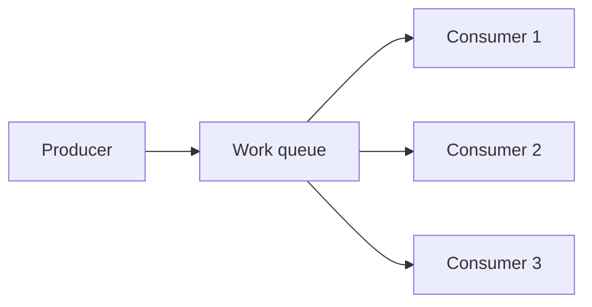
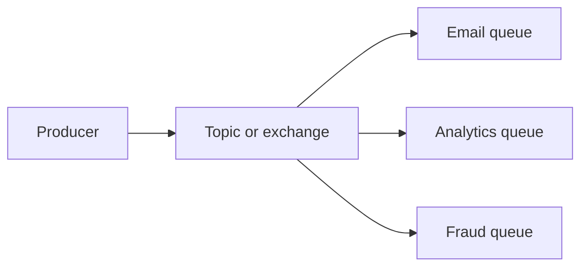
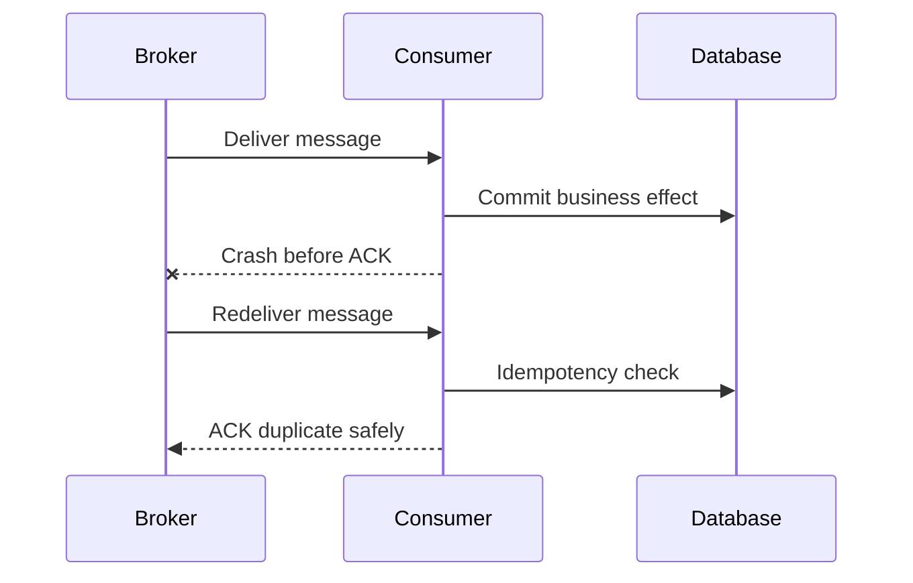
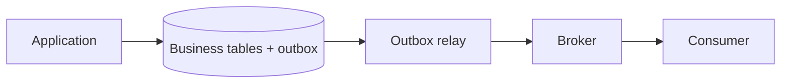
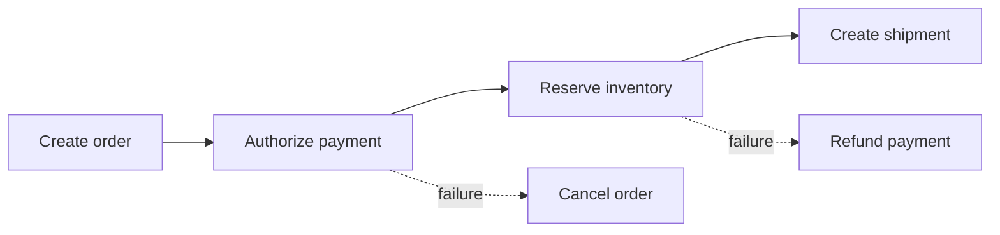
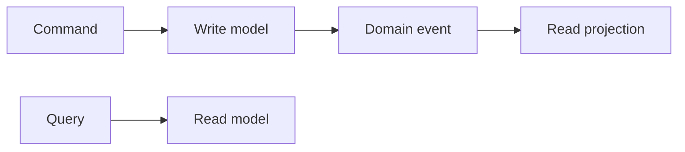
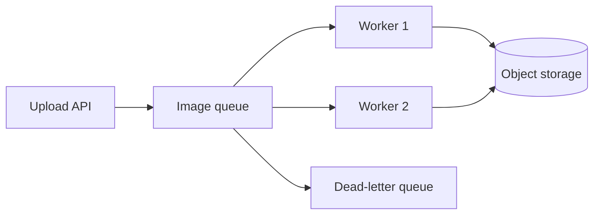

# Message Broker Concepts and Patterns

## Point-to-Point

One queue distributes each message to one competing consumer:



Use for payment commands, image jobs, or one worker-owned task. Multiple consumers increase throughput; one message should normally be processed by one consumer.

## Publish-Subscribe

One publication reaches many queues:



Each consumer owns its queue and failure. Email outage does not block analytics.

## Competing Consumers

Several workers consume same queue. Broker assigns messages among them. Use prefetch or visibility settings to avoid one worker holding too much work.

## Routing

Message can route by key, topic pattern, headers, or subscription filter. Keep routing rules understandable. Complex routing hidden in headers becomes operational debt.

### Wildcard Routing Versus Filter Policies

RabbitMQ topic exchanges use wildcard tokens:

```text
transaction.*  # exactly one word
transaction.#  # zero or more words
```

AWS SNS does not use `*` or `#` as RabbitMQ topic wildcards. SNS subscriptions use filter policies, for example:

```json
{
  "eventType": [
    { "prefix": "transaction." }
  ]
}
```

Same business intent, different matching model. Preserve platform-specific keywords when explaining or designing routing.

## Acknowledgment

ACK after durable business success. ACK before side effect risks loss. NACK or reject on failure according to retry policy. Requeueing every error forever creates poison-message loops.

### RabbitMQ Delivery Lifecycle

```text
publish -> exchange route -> queue stores
        -> consumer receives
        -> consumer commits work
        -> consumer ACKs
        -> broker removes message
```

If a consumer connection closes before ACK, RabbitMQ can requeue the unacknowledged delivery. `prefetch` limits how many unacknowledged deliveries one consumer can hold. Set it from processing time and memory, not by copying a default.

### SQS Delivery Lifecycle

```text
send -> receive -> visibility timeout hides
     -> consumer commits work
     -> DeleteMessage
```

SQS does not remove the message at receive time. If deletion does not happen before visibility timeout, message becomes visible again. Long-running workers should extend visibility timeout.

## At-Least-Once and Duplicates

Crash window creates duplicate delivery:



Use message ID plus business operation ID. Queue message ID alone may change when republished.

## Backpressure

When producer rate exceeds consumer rate:

```text
backlog(t) = backlog(0) + arrivals - completed
```

Options:

- Add consumers.
- Increase safe concurrency.
- Apply producer rate limit.
- Use RabbitMQ prefetch.
- Use SQS visibility timeout and Lambda reserved concurrency.
- Reject or defer low-priority work.
- Scale downstream dependency.
- Alert on oldest message age.

Never let queue capacity be only protection. Define overflow behavior.

### Token Bucket Intuition

A token bucket allows bursts up to bucket size while limiting long-term rate:

```text
tokens refill at 10/s
bucket capacity 20
request consumes 1 token
no token -> wait, reject, or defer
```

Use it at producer or consumer boundary when downstream API allows 10 calls/second. Queue buffers work; limiter controls work admission.

## Transactional Outbox

Database and broker are separate systems. This sequence is unsafe:

```text
commit database
publish message
```

Process can crash between steps. Outbox solves it:



Write business row and outbox row in one transaction. Relay publishes outbox messages with retry. Consumers remain idempotent.

## Saga Pattern

Distributed transaction uses local transactions and compensating actions:



Choreography uses events and local reactions. Orchestration uses coordinator commands. Choreography reduces central control but can become hard to trace. Orchestration improves visibility but creates coordinator responsibility.

## CQRS

Commands change state. Queries read projections:



Message broker can carry commands or events. CQRS does not require a broker and does not automatically mean event sourcing.

## CDC

Change Data Capture reads database changes and publishes them:

```text
Database WAL/binlog -> CDC connector -> broker -> consumers
```

CDC useful for search indexing, analytics, cache invalidation, and integration. CDC event means database row changed; domain event means business fact happened. They are not always interchangeable.

## Idempotency Pattern

At-least-once delivery means duplicate execution is normal:

```sql
CREATE TABLE processed_messages (
  message_id TEXT PRIMARY KEY,
  processed_at TIMESTAMP NOT NULL
);
```

Consumer claims message ID and applies business change in one database transaction. A duplicate hits the unique key and safely ACKs. For payment providers, also send a stable provider idempotency key; local deduplication cannot protect an external call made before a crash.

## Cost and Trade-offs

More routing, retries, queues, and patterns increase reliability options and operational surface. Start with one queue and clear contract. Add fanout, saga, outbox, or CDC when requirement justifies it.

## Interview Questions and Answers


#### Queue or topic?

Queue for competing work; topic or exchange fanout for independent consumers.

#### ACK before or after database commit?

After durable commit and required side effects. Otherwise crash can lose work.

#### Why is exactly-once difficult?

Failures can occur between external side effect and acknowledgment. Idempotency gives one business result despite repeated execution.

#### What does outbox solve?

It prevents database commit and message publication from silently diverging.

#### Choreography or orchestration?

Choreography fits loosely coupled simple flows. Orchestration fits complex workflows needing centralized visibility, timeout, and compensation.

#### What if queue receives work faster than it can process?

Measure arrival rate, service rate, backlog, and oldest age. Apply bounded concurrency, consumer scaling, producer throttling, prefetch or visibility controls, and explicit overflow policy. Infinite retry or infinite buffering is not backpressure.


#### When is a command different from an event?

A command asks a named consumer to do something and usually has one owner. An event states that something already happened and may have many consumers. Naming the message correctly prevents accidental coupling: `ReserveInventory` is a command; `InventoryReserved` is an event.

#### How do you select a visibility timeout or lease duration?

Set it above the normal processing time with room for transient latency, then extend it for legitimately long work. It must still be finite so a crashed consumer does not hold work forever. Measure the p95 or p99 processing time and alert when jobs approach the lease.

#### Why is a poison message different from a transient failure?

A transient failure may succeed after delay; a poison message fails deterministically because of invalid data or code. Retrying it forever consumes capacity and hides healthy work, so route it to a reviewable dead-letter path with the original error and contract version.

### Examples and Diagrams

#### Practical example: image processing backpressure



If storage latency rises, the queue absorbs a bounded burst. The producer should stop accepting unlimited work once queue age or capacity crosses a defined threshold.
