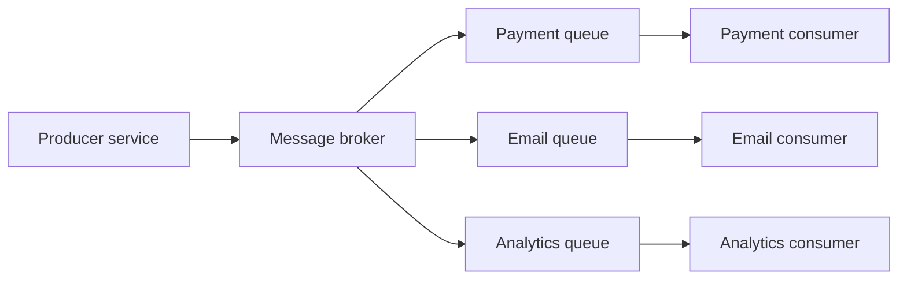
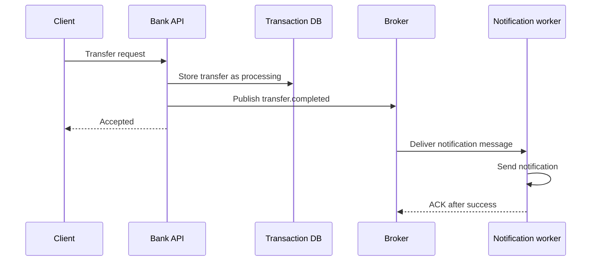
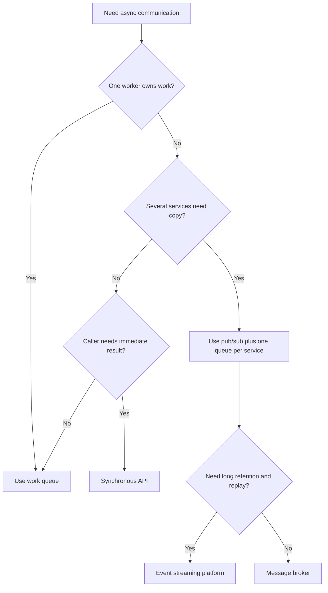
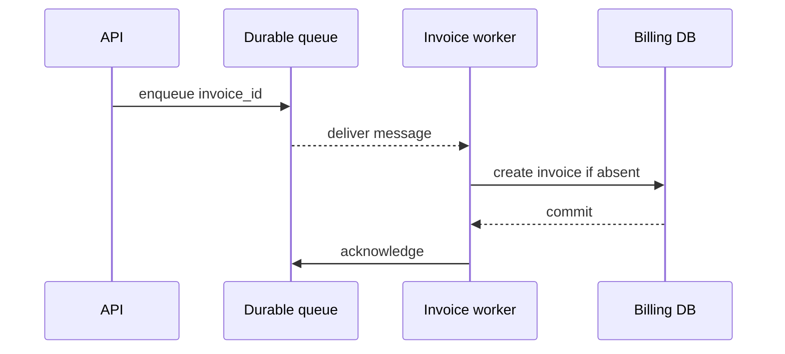

# Message Brokers: RabbitMQ, AWS SNS, and SQS

Message broker is middleware between producers and consumers. Producer sends a message without calling every consumer directly. Broker stores, routes, delivers, retries, and reports messages.



## Why Message Brokers Were Born

Direct service calls create synchronous chains:

```text
Checkout -> Payment -> Inventory -> Notification -> response
```

Every dependency adds latency and failure risk. If notification fails after payment succeeds, caller receives an ambiguous result. If payment is slow, checkout waits. If one service is down, the whole chain may fail.

Broker-based design separates acceptance from later work:



Broker does not make business transaction atomic by itself. Use a transactional outbox when database state and message publication must not diverge.

## When Use Message Broker

Use one when:

- Services should communicate asynchronously.
- One message needs independent consumers.
- Routing or fanout matters.
- Consumers need acknowledgment and retry.
- Producer and consumer scale independently.
- Temporary consumer outage should not immediately fail producer.
- Backpressure should protect downstream systems.

Do not use one for every function call. Synchronous request-response remains simpler when caller needs immediate result and work is fast.

## Core Terms

| Term | Meaning |
|---|---|
| Producer | Publishes message |
| Exchange or topic | Routes or fans out message |
| Queue | Stores messages for consumers |
| Consumer | Reads and processes message |
| Binding or subscription | Routing relationship |
| ACK | Consumer confirms successful handling |
| NACK/reject | Consumer reports unsuccessful handling |
| Visibility timeout | Temporary hide period in SQS |
| DLQ | Storage for repeatedly failed messages |
| Prefetch | Limit of unacknowledged messages sent to consumer |
| Publisher confirm | Broker confirms accepted publication |

Routing syntax depends on platform:

- RabbitMQ topic exchange uses wildcard tokens `*` and `#` in dot-separated routing keys.
- AWS SNS uses subscription filter policies and operators such as `prefix`, `anything-but`, `exists`, and `numeric`.

Do not treat SNS filter policies as RabbitMQ wildcard expressions.

## Message Broker Decision Flow



Start with delivery requirement, not product name. A payment authorization command, a `UserCreated` event, and an image resize job may all be asynchronous but need different topology.

## RabbitMQ Versus AWS SNS and SQS

RabbitMQ combines exchange routing and queues in one broker. AWS separates pub/sub and queueing:

```text
RabbitMQ:
Producer -> Exchange -> Queue -> Consumer

AWS:
Producer -> SNS Topic -> SQS Queue -> Consumer
```

Choose RabbitMQ for flexible broker-controlled routing and portability. Choose SNS plus SQS for AWS-managed fanout, queueing, IAM, CloudWatch, and Lambda integration.

## Delivery Guarantees

Most broker systems provide at-least-once delivery in failure cases. Duplicate processing is possible:

```text
consumer completes side effect
consumer crashes before ACK
broker redelivers message
```

Consumers need idempotency keys, unique constraints, or provider idempotency APIs.

Exactly-once business effect is an application design result, not a simple broker checkbox.

## Observability Baseline

Measure both transport health and business completion:

- RabbitMQ: queue depth and age, ready versus unacknowledged messages, consumer count, redeliveries, publish confirms, and DLQ rate.
- SQS: `ApproximateNumberOfMessagesVisible`, oldest message age, in-flight count, receive count, visibility extensions, and DLQ depth.
- SNS: publish failures, per-subscription delivery failures, filtered-message expectations, and downstream SQS backlog.

Propagate a correlation ID, message ID, business idempotency key, and trace context. Alerts should page on user-visible age or SLO burn, not only raw message count.

## Selection Summary

```text
Need route messages between services?
  -> Message broker category

AWS-managed pub/sub and queues?
  -> SNS plus SQS

Portable broker with exchanges and bindings?
  -> RabbitMQ

Durable event history and replay?
  -> Kafka, not ordinary RabbitMQ queue
```

## Pros, Cons, and Cost

### Pros

- Loose coupling.
- Async failure isolation.
- Retry and buffering.
- Independent scaling.
- Fanout and routing.
- Better resilience during traffic spikes.

### Cons

- Eventual consistency.
- Duplicate delivery.
- Ordering complexity.
- New infrastructure and operations.
- Harder debugging.
- Poison messages and DLQ management.

### Cost

Include broker instances or managed request cost, storage, network transfer, replicas, monitoring, backups, on-call, and replay operations. Managed AWS services reduce cluster work but add cloud coupling and per-request charges. Self-hosted RabbitMQ may reduce service charges while increasing operations.

## Interview Questions and Answers


#### Why not call every service directly?

Direct calls create latency chains and tight availability coupling. Broker lets producer accept work while consumers process independently.

#### Does broker guarantee business success?

No. Broker confirms storage or delivery mechanics. Consumer must complete business work and acknowledge after durable success.

#### What if consumer fails?

Unacknowledged RabbitMQ message is requeued or dead-lettered according to configuration. SQS message becomes visible after visibility timeout. Consumer must be idempotent.

#### RabbitMQ or Kafka?

RabbitMQ for routed work delivery and acknowledgments. Kafka for retained event streams, independent consumer groups, and replay.

#### What is main design rule?

Choose message broker when delivery decoupling is required. Choose specific platform from routing, cloud, throughput, retention, cost, and operational constraints.

#### Does a broker prevent a failed final step?

No. It prevents caller from being blocked by every step and keeps unacknowledged work available for retry. Business workflow still needs state transitions, idempotency, timeout, compensation, and observability.

#### What is the difference between ACK and publisher confirm?

Publisher confirm means broker accepted publication from producer. Consumer ACK means consumer completed delivery processing. One does not imply the other.


#### How do you preserve ordering while scaling a queue?

Define the smallest ordering key that the business needs, then route all messages for that key to one ordered lane. For example, partition by `account_id` or use a FIFO message group. Do not promise global ordering if multiple consumers process messages concurrently; document the weaker guarantee explicitly.

#### What is the difference between broker durability and business durability?

Broker durability means the broker can recover the message. Business durability means the consumer has committed the resulting state. A durable message can still be lost from the business workflow if the consumer acknowledges before its database commit.

#### How should a team test a broker design?

Exercise duplicate delivery, consumer crashes after side effects, broker or node loss, full queues, poison messages, schema incompatibility, and replay. Load tests should measure oldest-message age and recovery time, not only peak throughput.

### Examples and Diagrams

#### Bank Transfer Example

A request should not wait for every downstream action:

```text
1. API validates request.
2. Database stores transfer as PROCESSING.
3. API writes outbox row in same transaction.
4. Relay publishes TransferRequested.
5. API returns 202 Accepted with transaction ID.
6. Worker authorizes transfer and updates status.
7. Notification worker sends result.
8. Client polls status or receives webhook.
```

If notification fails, transfer state remains correct. Notification retries independently. If the transfer itself fails, consumer records failure and emits a compensating or status event; broker does not roll back the database automatically.

#### Queue Capacity Example

Assume queue capacity is 8 messages, producer rate is 3 messages/second, and one consumer completes 1 message/second. Backlog grows by 2 messages/second and fills in 4 seconds if queue starts empty.

Do not wait for queue overflow. Choose policy:

- Scale consumers while downstream capacity remains safe.
- Limit producer rate with token bucket or leaky bucket.
- Set prefetch so workers do not hoard messages.
- Reject low-priority work or return `429`.
- Shed optional work during overload.
- Alert on queue depth and oldest-message age.

Backpressure controls arrival. Rate limiting protects a dependency. They are related but not interchangeable.

#### Backpressure Example

If producer creates 3 messages/second and consumer handles 1 message/second:

```text
arrival rate: 3/s
processing rate: 1/s
backlog growth: 2/s
```

Use bounded queues, consumer scaling, prefetch, rate limiting, producer throttling, overflow policy, or load shedding. Queue cannot absorb infinite backlog.

#### Practical example: invoice generation



The worker stores `invoice_id` as a unique business key. A redelivery becomes a harmless no-op instead of a second invoice.
