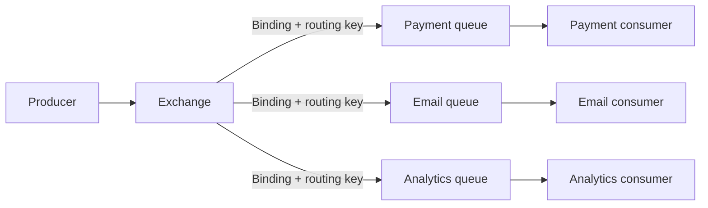
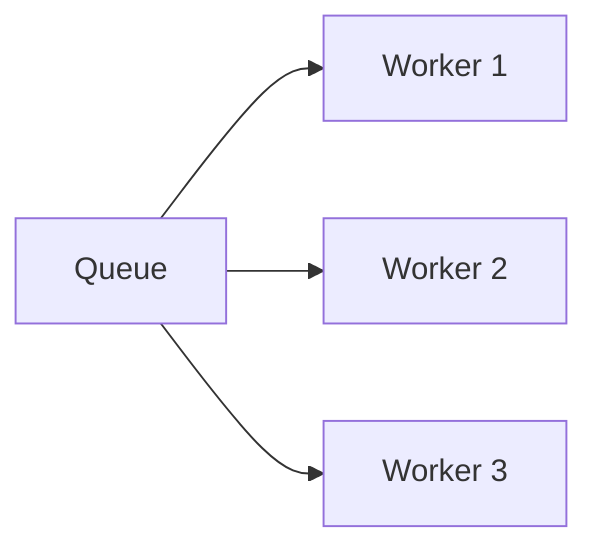
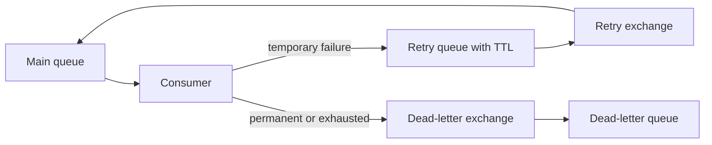
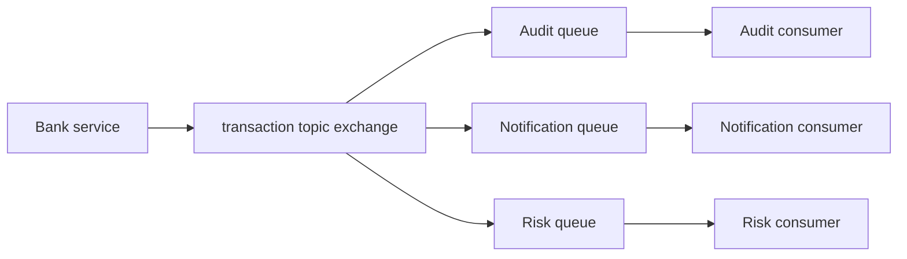
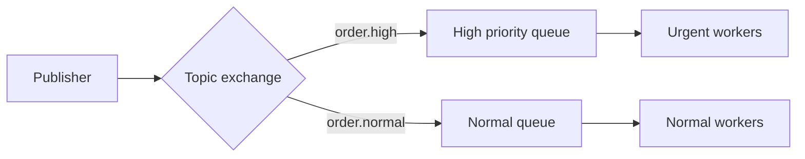

# RabbitMQ

RabbitMQ is a broker designed to route and deliver messages through exchanges, bindings, and queues. Producer publishes to exchange; consumer reads from queue.

## Why RabbitMQ Was Born

Applications needed reliable asynchronous communication, work distribution, routing, and acknowledgments without every service knowing every destination. RabbitMQ implements AMQP messaging concepts and supports portable, explicit routing.

The core problem was not only speed. Direct calls force each service to know destination, protocol, availability, and timing of every dependency. RabbitMQ introduced an intermediary that can route, buffer, acknowledge, and redistribute messages while producers and consumers evolve separately.

## Architecture



Producer does not publish directly to application queue. Exchange decides routes through bindings. The default exchange is a special direct exchange that routes by queue name.

## Exchange Types

### Direct

Exact routing-key match:

```text
routing key: payment.authorize
binding: payment.authorize
```

Use command routing or exact event category.

### Fanout

Copies message to every bound queue. Routing key ignored. Use broadcast such as cache invalidation or configuration refresh.

### Topic Exchange

Topic exchange routes messages by routing-key patterns with wildcard tokens:

```text
transaction.*       # one word after transaction
transaction.#       # zero or more words
```

`*` and `#` are RabbitMQ topic-exchange wildcards. `transaction.*` matches `transaction.created`, while `transaction.#` matches `transaction.created` and `transaction.payment.failed`. Routing keys use dot-separated words. Use hierarchical event names and document vocabulary.

### Headers

Routes from message headers instead of routing key. Useful for complex attributes, but harder to inspect and reason about. Prefer direct or topic unless headers provide clear value.

## Queue and Consumer

Queue stores messages until consumer receives and acknowledges. One queue can have multiple competing consumers:



Each message normally goes to one consumer in same queue. To deliver copies to multiple services, create one queue per service bound to exchange.

## ACK, NACK, and Requeue

- `ack`: processing succeeded; broker removes message.
- `nack/reject requeue=true`: try again, risk hot loop.
- `nack/reject requeue=false`: discard or dead-letter if configured.

ACK only after database commit and external side effect is safely idempotent.

Do not treat `nack(requeue=true)` as a general retry strategy. A permanently invalid message can cycle continuously, consume CPU, and block useful work. Use bounded attempts, delayed retry queues, and a dead-letter exchange.

## Publisher Confirms

Publisher confirms tell producer broker accepted publication. They do not prove consumer processed message. Use confirms, mandatory publishing or alternate exchange, and error handling for unroutable messages.

```text
producer publish -> confirm from broker
consumer process -> ACK from consumer
```

These are different guarantees.

For unroutable messages, publisher confirms alone are insufficient: a message can be accepted by broker but have no matching queue. Use `mandatory` publishing or an alternate exchange, then alert or persist unroutable messages.

## Durable and Persistent

- Durable exchange and queue survive broker restart.
- Persistent message requests disk persistence.
- Durability does not mean message was safely accepted unless publisher confirm succeeds.
- Replication and backup affect recovery.

## Quorum Queues

Quorum queues replicate queue data across RabbitMQ nodes using a consensus-based design. They improve failure tolerance for replicated queues, but cost storage, network, and latency. They do not remove need for publisher confirms, idempotent consumers, capacity planning, or tested recovery.

Use quorum queues for important replicated workloads. Do not assume every transient queue needs maximum replication.

Quorum queues improve node-failure tolerance, not business exactly-once behavior. A consumer can commit a transfer, crash before ACK, then receive same transfer again. Idempotency remains required.

## Retry and DLQ



Avoid immediate requeue loops. Retry queues with TTL or delayed-message strategy separate attempts. Dead-letter queue needs inspection, remediation, retention, and controlled republish.

## Backpressure

RabbitMQ tools:

- Consumer prefetch.
- Bounded worker concurrency.
- Publisher confirms.
- Connection and channel limits.
- Rate limiting at producer or consumer.
- Queue length and age alerts.
- Flow control when broker is overloaded.

If producer creates 3 messages/second and consumers process 1/second, backlog grows 2/second. Add consumers only if downstream capacity supports it.

## Use Cases

- Payment workflow commands.
- Notification delivery.
- Work distribution.
- Service-to-service async commands.
- Routing by event category.
- Background work requiring explicit exchange semantics.

## RabbitMQ Versus Kafka

RabbitMQ asks: **Which queue should receive this work, and when did consumer finish it?**

Kafka asks: **Which partition contains this event, and how far has each consumer group read?**

RabbitMQ commonly removes acknowledged work. Kafka retains records by policy and lets multiple groups replay. Use RabbitMQ for command and workflow delivery; use Kafka for durable event history, high-volume streams, and replay.

## Pros, Cons, and Cost

**Pros:** mature routing, explicit topology, acknowledgments, consumer control, protocol portability.<br>
**Cons:** cluster operations, queue topology complexity, ordering limits, duplicate delivery, replay weaker than Kafka.<br>
**Cost:** nodes, disks, replicas, network, monitoring, upgrades, backups, and on-call. Managed RabbitMQ reduces operations but adds service cost.

## Interview Questions and Answers


#### Why producer publishes to exchange?

Exchange separates producer from queue names and applies routing policy. Producer publishes event once; multiple bindings can receive copies.

#### One queue with three consumers: how many copies?

One message is delivered to one competing consumer. Use three queues if all three services need a copy.

#### What happens before ACK?

Message remains unacknowledged. If consumer connection dies, broker can redeliver. Consumer must handle duplicate side effects.

#### What does publisher confirm guarantee?

Broker accepted publication. It does not guarantee routing to a queue or consumer business success. Handle unroutable messages and consumer ACK separately.

#### When RabbitMQ instead of Kafka?

Use RabbitMQ for routing and work delivery. Use Kafka for retained event stream, many consumer groups, partitioned throughput, and replay.

#### What is the safe processing order?

```text
receive -> validate -> perform idempotent business transaction
        -> commit -> ACK
```

ACK before commit risks message loss. Commit before ACK risks duplicate delivery after crash, so handler must be idempotent.


#### What is the purpose of a prefetch limit?

Prefetch limits the number of unacknowledged deliveries held by one consumer. A small value improves fairness and bounds memory; a larger value can improve throughput for short jobs. Tune it with processing time and message size rather than setting it arbitrarily high.

#### How do quorum queues change the availability trade-off?

Quorum queues replicate a log across RabbitMQ nodes and favor data safety over the lower overhead of a classic transient queue. They still need enough healthy nodes for a majority and do not remove the need for consumer idempotency or capacity planning.

#### Why can a message be lost even with publisher confirms?

A confirm tells the publisher that RabbitMQ accepted the publish according to the exchange and queue bindings at that point. It does not prove the consumer completed the business action. Use confirms on the producer side and acknowledgements after durable consumer work.

### Examples and Diagrams

#### Queue Topology Example

One transfer event can fan out without direct service calls:



One shared queue would distribute each message to only one competing consumer. Separate queues preserve independent copies and backlog.

#### Example design

Bank transfer stores transaction and outbox row. Relay publishes `transfer.completed` to topic exchange. Payment audit, notification, and analytics queues receive independent copies. Each consumer ACKs after durable work; failed notifications retry and then dead-letter.

#### Practical example: priority routing without priority inversion



Separate queues make the SLA visible and prevent a large normal backlog from starving urgent orders. Limit the urgent lane so it cannot exhaust every database connection.
