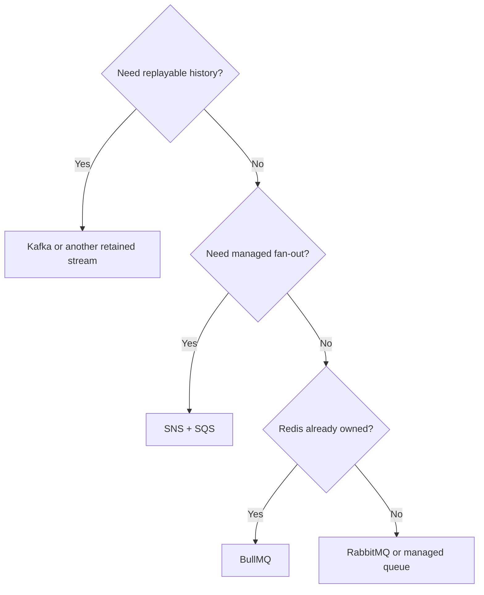

 # Messaging Platform Comparisons

Choose capability before product:

```text
Background job -> BullMQ
Service delivery and routing -> RabbitMQ or SNS + SQS
Durable stream and replay -> Kafka
```

## Decision Matrix

| Need | BullMQ | RabbitMQ | SNS + SQS | Kafka |
|---|---|---|---|---|
| One task owner | Strong | Good | Good | Weak fit |
| Explicit routing | Basic | Strong | Topic fanout | Topic/consumer design |
| Managed AWS integration | External Redis | Managed option | Strong | Managed option |
| Long retention | Limited | Usually limited | Limited to SQS retention | Strong |
| Replay | Not primary | Not primary | Redrive/archive patterns | Native offsets |
| High event throughput | Moderate | Moderate | High managed scale | Strong |
| Retry and DLQ model | Attempts/backoff/failed jobs | NACK, retry queues, DLX | Visibility timeout, redrive policy, DLQ | Retry/DLQ topics and offset policy |
| Backpressure signal | Queue age and worker saturation | Queue age, prefetch, unacked count | Oldest message age and in-flight count | Consumer lag and record age |
| Operational simplicity | High if Redis exists | Medium | High on AWS | Lowest |


1. Is message payload a task or a durable fact?
2. How many independent consumers exist?
3. Must consumers replay old data?
4. Does routing topology need exchanges or fanout?
5. Where does system run: AWS, self-managed, or mixed?
6. What ordering, throughput, retention, and recovery guarantees matter?

Do not compare only latency. Include storage, retry behavior, failure isolation, schema management, monitoring, and team expertise.

Use the same operational questions for every candidate:

- What is the retry boundary and where does a poison message go?
- How is backpressure exposed: queue age, visibility timeout, prefetch, or consumer lag?
- Which identifier makes a repeated delivery safe?
- What is the replay or redrive procedure, and who owns it?
- Which metrics and traces prove the user-visible SLO?

## Interview Questions and Answers


#### Why is Kafka not always better?

Kafka adds partition, retention, lag, schema, and cluster concerns. A simple task queue can solve same request with less cost and failure surface.

#### RabbitMQ or SNS plus SQS?

Choose RabbitMQ for rich broker-controlled routing and portability. Choose SNS plus SQS when AWS-managed fanout, IAM, and low infrastructure operations matter.

#### When should a system use both?

Use separate tools for separate guarantees: Kafka for durable domain events, BullMQ for local retryable jobs, and SQS for a managed command queue. Define ownership and avoid duplicate sources of truth.


#### Which platform characteristic is hardest to migrate later?

Usually the message contract, ordering assumptions, retention model, and consumer offset semantics—not the client library. Design those interfaces explicitly so a future broker migration changes adapters rather than business behavior.

#### How should cost be compared fairly?

Use the same workload: ingress and egress bytes, peak rate, retention, delivery attempts, number of consumers, cross-region traffic, and people-hours. A lower per-message price can lose once storage, observability, and operations are included.

#### Can one platform serve every workload?

Sometimes, but forcing one tool across jobs, commands, and replayable events often creates awkward retention, retry, and observability semantics. Prefer a small number of well-understood systems with clear boundaries.

### Examples and Diagrams

#### Migration Example

A small application may start with BullMQ for email. When payment, analytics, and fraud all need `OrderPlaced`, publish an outbox event to SNS plus SQS or Kafka. Keep email as one consumer; do not force every workflow into one queue.

#### Practical example: choose by requirement



The decision tree is a starting point, not a substitute for quotas, failure testing, and team expertise.
