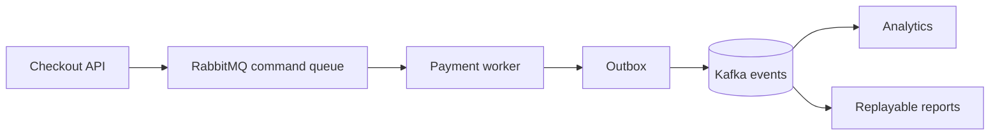

 # Kafka Versus RabbitMQ

Kafka and RabbitMQ both move messages, but their primary models differ.

| Dimension | Kafka | RabbitMQ |
|---|---|---|
| Primary model | Durable partitioned log | Brokered delivery |
| Consumer progress | Offset per group | Queue acknowledgment |
| Replay | Native while retained | Not primary |
| Ordering | Per partition | Per queue, with concurrency caveats |
| Routing | Topic and partition design | Exchanges, bindings, routing keys |
| Scaling | Add partitions and consumers | Add consumers, queues, and nodes |
| Retry/backpressure | Consumer lag, retry topics, bounded polling | ACK/NACK, prefetch, retry queues, DLX |
| Durability vocabulary | Replication factor, ISR, `acks=all`, KRaft | Durable queues, publisher confirms, quorum queues |
| Observability | Consumer lag, under-replicated partitions, replay range | Queue depth/age, unacked deliveries, redeliveries |
| Best fit | Event history and streams | Commands and routed work |

## Choose Kafka

Choose Kafka when events must remain available for multiple groups, replay matters, throughput is high, or stream processing and CDC are central. Design partition keys, retention, schemas, and lag operations upfront.

## Choose RabbitMQ

Choose RabbitMQ when producers need explicit routing, consumers acknowledge individual deliveries, queue-level retry and dead-letter behavior are central, and long-term replay is not required.

Kafka's `offset` and consumer-group model answers “how far has this application read?” RabbitMQ's acknowledgement and queue model answers “has this delivery completed?” Both still need idempotent handlers for crashes between side effects and acknowledgement or offset commit.

## Common Mistake

Using RabbitMQ as an event archive creates custom replay exports and retention workflows. Using Kafka for one short-lived command adds infrastructure without solving a real requirement.

## Interview Questions and Answers

#### Which has lower latency?

Both can provide low latency. Workload, batching, durability settings, network, and consumer processing matter more than product labels.

#### Which guarantees exactly once?

Neither automatically guarantees exactly-once business effects. Both require idempotency, transactional boundaries, and recovery design.

#### Can Kafka replace RabbitMQ?

Sometimes, but not always cheaply. Kafka can model commands with topics, yet routing, per-message acknowledgment, and short-lived work may be simpler in RabbitMQ.

#### How do their failure recovery models differ?

RabbitMQ consumers recover queued deliveries through acknowledgements and redelivery. Kafka consumers recover by resuming from offsets in a retained log. The former centers on work completion; the latter centers on position in history, so replay and consumer-group management are first-class Kafka concerns.

#### Which ordering guarantee should be documented?

RabbitMQ ordering is affected by queue topology, consumer concurrency, and requeue behavior. Kafka preserves order within a partition, not across a topic. Document the key or queue that defines ordering and test redelivery scenarios before claiming a guarantee.

#### Is lower latency enough to choose RabbitMQ?

No. Compare latency with retention, fan-out, replay, ordering scope, throughput, recovery workflow, and operator skill. A slightly faster broker is not a win if the product needs historical reconstruction that it cannot provide.

### Examples and Diagrams

#### Example

Order service sends `OrderPlaced` to:

- Kafka when fraud, analytics, search, and future consumers need the event history.
- RabbitMQ when payment and email need routed delivery with queue-specific handling.

Both designs still need idempotent consumers and an outbox if database state and publication must stay consistent.

#### Practical example: payment command plus analytics event

RabbitMQ handles the targeted command and bounded retry workflow. Kafka receives the durable business event after payment state is committed, allowing analytics and reports to evolve independently.
