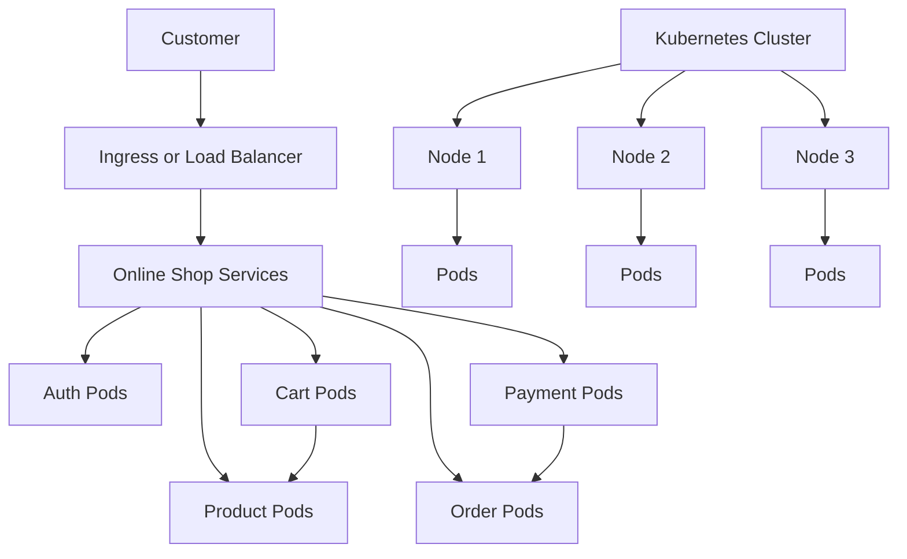
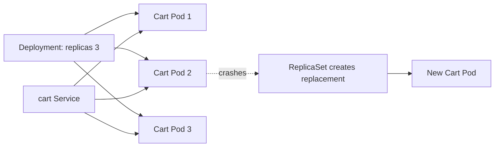
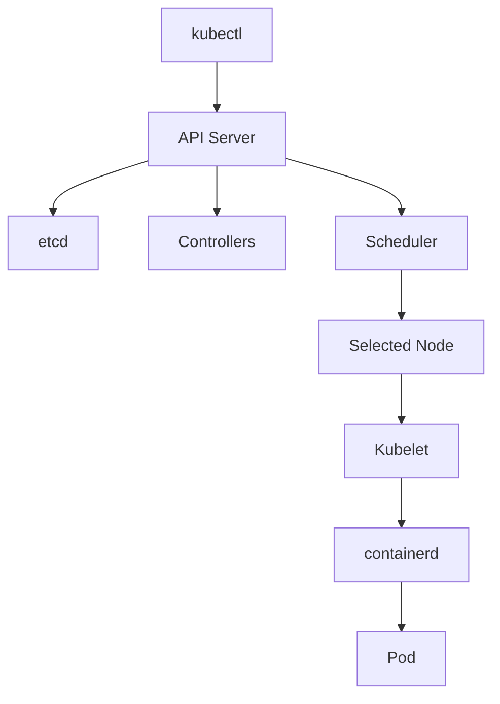
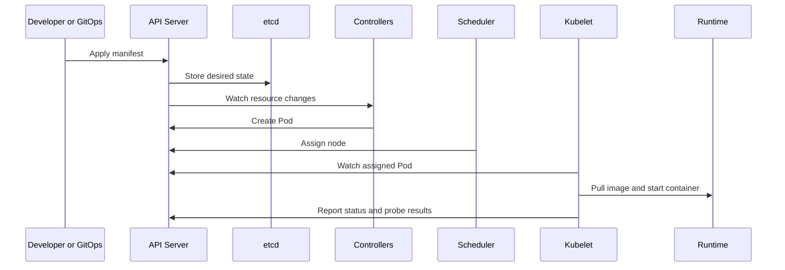
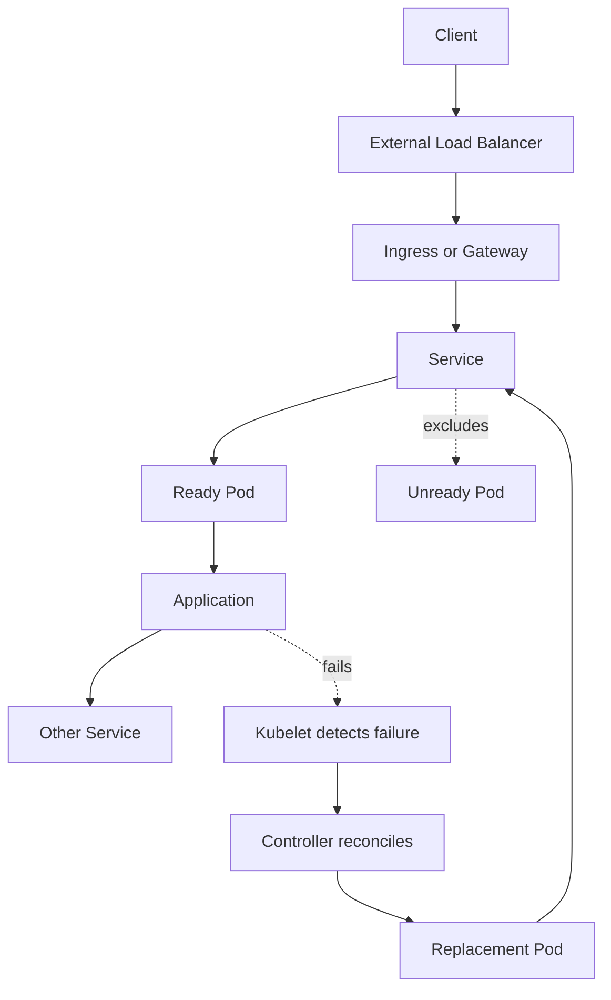

# Kubernetes Orchestration

Comprehensive interview study guide covering Kubernetes architecture, control plane, worker nodes, pods, services, deployments, and routing.

---

## 0. Kubernetes, From Beginner View

### Why Kubernetes Was Born

Imagine an online shop with separate services for authentication, carts, products, orders, delivery tracking, and payments. Each service can run in its own container, with its own Node.js version, Java runtime, Python packages, configuration, and dependencies.

Containers solve application packaging and environment consistency. Running a few containers is easy. Running hundreds across many servers is not:

* Which server should run each container?
* What happens when a payment container or server crashes?
* How do services find and communicate with each other?
* How do we add replicas during a traffic spike?
* How do we deploy a new version without downtime?
* How do we reduce capacity when traffic returns to normal?

Kubernetes solves this operational problem. It is a control system for containerized workloads. We provide a group of virtual or physical machines, and Kubernetes manages them as one **cluster**.



### Cluster, Nodes, Pods

* **Cluster:** All machines and Kubernetes components working together.
* **Node:** One machine in the cluster. It can be a VM or physical server.
* **Pod:** Smallest deployable Kubernetes unit. Usually one application container runs in each Pod.
* **Deployment:** Desired number and version of Pod replicas.
* **Service:** Stable internal address and load balancing for changing Pod IPs.

We do not normally log into nodes and start containers manually. We declare what we want:

> Keep three healthy copies of cart service running.

Kubernetes continuously compares this desired state with actual state. If one Pod fails, it creates a replacement. If one node fails, it schedules replacement Pods on healthy nodes, assuming capacity exists.

### Declarative Configuration

Kubernetes uses **declarative configuration**. We describe the result we want, not every command needed to produce it.

```yaml
apiVersion: apps/v1
kind: Deployment
metadata:
  name: cart
spec:
  replicas: 3
  selector:
    matchLabels:
      app: cart
  template:
    metadata:
      labels:
        app: cart
    spec:
      containers:
        - name: cart
          image: example/cart:1.4.0
          ports:
            - containerPort: 8080
          resources:
            requests:
              cpu: 100m
              memory: 128Mi
            limits:
              cpu: 500m
              memory: 512Mi
```

Apply it with:

```bash
kubectl apply -f cart-deployment.yaml
kubectl get pods
kubectl describe deployment cart
```

Imperative thinking says: "Start three containers, place them on these servers, restart one when it fails." Declarative thinking says: "The cluster must have three ready cart replicas." Controllers decide how to reach that state.

### Self-Healing, Scaling, Networking

Kubernetes provides several important behaviors:

* **Self-healing:** Restarts failed containers and replaces failed Pods.
* **Rescheduling:** Places workloads on healthy nodes after node failure.
* **Scaling:** Increases or decreases replicas manually or through autoscaling.
* **Networking:** Gives Pods network identities and Services stable names such as `product.default.svc.cluster.local`.
* **Deployment management:** Performs rolling updates and supports rollback.

During a sale, an autoscaler can increase search replicas when CPU, memory, or request demand rises. A Service distributes traffic across ready replicas. When demand falls, autoscaling can reduce replicas and lower infrastructure cost.

Kubernetes does not make applications automatically reliable. It needs correct health checks, resource requests, graceful shutdown, observability, secure configuration, and enough spare capacity.

### Beginner Example: Cart Service

Suppose cart service needs three copies:



Application calls `http://cart:8080`. It does not need Pod IP addresses. If `Cart Pod 2` fails, Kubernetes creates another Pod and Service sends traffic only to ready Pods.

---

## 1. Meaning of Kubernetes

**Kubernetes (K8s)** is an open-source container orchestration platform designed to automate the deployment, scaling, healing, and management of containerized applications across clusters of physical or virtual machines.

Example: `Deployment` keeps five `product` Pods running, `Service` gives them one stable name, HPA changes replica count, and a rolling update replaces version `1.3` with `1.4`.

---

## 2. Hierarchical Cluster Architecture

A Kubernetes cluster is divided into two primary logical sections:

```
                  ┌─────────────────────────────────┐
                  │          CONTROL PLANE          │
                  │   API Server   ◄──►   etcd      │
                  │   Scheduler    ◄──►   Manager   │
                  └────────┬────────────────────────┘
                           │ (Communicates via TLS)
            ┌──────────────┼──────────────┐
            ▼ (Node 1)     ▼ (Node 2)     ▼ (Node 3)
      ┌───────────┐  ┌───────────┐  ┌───────────┐
      │  Kubelet  │  │  Kubelet  │  │  Kubelet  │
      │ Kube-Proxy│  │ Kube-Proxy│  │ Kube-Proxy│
      │   Pods    │  │   Pods    │  │   Pods    │
      └───────────┘  └───────────┘  └───────────┘
```

### 1. Control Plane (The Brain)
* **API Server (`kube-apiserver`):** The central entry point. All administrative commands, CLI tools (kubectl), and worker communications talk to this via JSON over TLS.
* **etcd:** A highly consistent, distributed key-value database that stores the authoritative **state and configuration** of the entire cluster.
* **Scheduler (`kube-scheduler`):** Watches for newly created pods with no assigned node, and selects an optimal worker node for them to run on based on resource availability.
* **Controller Manager (`kube-controller-manager`):** Runs continuous background controller loops that compare the actual state of the cluster with the desired state (e.g., ensuring 3 healthy pod replicas are running).

Example: `kubectl apply -f deployment.yaml` sends a request to the API Server. The API Server stores state in etcd. Deployment and ReplicaSet controllers create Pods. Scheduler assigns nodes. Kubelets start containers.

### 2. Worker Nodes (The Muscle)
* **Kubelet:** A tiny agent running on every node. It ensures that containers defined in pod specifications are running and completely healthy.
* **Kube-Proxy (`kube-proxy`):** Implements Kubernetes network services on each node, managing IP routing tables and performing simple load balancing across pods.
* **Container Runtime:** The physical software that runs containers (e.g., `containerd` or Docker).



---

## 3. Core Objects & Network Routing

* **Pod:** The **smallest deployable unit** in Kubernetes. It represents a single running process and wraps one or more closely coupled containers (sharing a network namespace and volume storage).
* **Deployment:** A declarative resource that manages the lifecycle of Pods, supporting rolling updates, horizontal scaling, and rollbacks.
* **Service:** An abstraction that defines a logical set of Pods and a policy to access them. Types of services:
  * **ClusterIP (Default):** Exposes the service on a cluster-internal IP, making it accessible *only* within the cluster.
  * **NodePort:** Exposes the service on a static port on each worker node's IP, allowing external access.
  * **LoadBalancer:** Provisions a physical external load balancer in your cloud provider (e.g., AWS, GCP) and routes traffic directly to NodePort/ClusterIP.

### Example: Service Discovery

```yaml
apiVersion: v1
kind: Service
metadata:
  name: product
spec:
  selector:
    app: product
  ports:
    - port: 80
      targetPort: 8080
```

Cart can call `http://product` inside the same namespace. Kubernetes DNS resolves `product` to the Service IP, and the Service forwards traffic to Pods labeled `app: product`.

---

## 4. Popular Interview Questions & High-Impact Answers

### Q1: What is the difference between a Pod and a Container?
* **Answer:** A **Container** is an isolated process running on host namespaces, packaged from a single Docker image. A **Pod** is a Kubernetes-specific abstraction. It is a **sandbox wrapping one or more containers**. Containers inside a single Pod share the exact same network namespace (meaning they communicate via `localhost`), the same IP address, port spaces, and shared storage volumes. This is highly useful for "sidecar" helper containers (e.g., a logger container scraping logs from a main server container).

### Q2: How does Kubernetes handle high availability and self-healing when a worker node crashes?
* **Answer:**
  1. The **Kubelet** on worker nodes periodically reports health metrics to the **API Server**.
  2. If a node crashes, the API Server stops receiving heartbeats.
  3. The **Controller Manager** detects that the active pod replicas dropped below the desired count defined in the Deployment spec.
  4. The **Scheduler** instantly locates other healthy, active worker nodes with sufficient resource capacity and schedules replacement Pods on them, restoring the desired state without human intervention.

### Q3: How do Rolling Updates work in a Kubernetes Deployment, and how does it prevent downtime?
* **Answer:** A **Rolling Update** replaces the old version of an application with the new version progressively:
  1. The deployment creates a new ReplicaSet alongside the old one.
  2. It launches a small percentage of new pods (e.g., 25%).
  3. It waits for the new pods to pass their **Readiness Probes** (proving they are fully ready to accept user traffic).
  4. Once healthy, it directs the Service proxy to route traffic to the new pods and tears down a corresponding number of old pods. This process repeats incrementally until 100% of traffic is migrated, ensuring zero downtime.

---

## 5. Architectural Deep Dive: Kubernetes Internals

For Senior/Staff infrastructure positions, you must understand the low-level communication loops, consensus consistency, and network packet paths inside the cluster.

### Deep-Dive Example

When `cart` calls `product`, DNS finds the `product` Service, the Service chooses a ready endpoint, and the CNI delivers the packet to the selected Pod. When that Pod fails readiness, the endpoint is removed before application traffic is sent there.

### 1. The Pod Lifecycle, Container Hooks, & Health Probes

```
                       Pod Created (Pending State)
                                    │
                                    ▼
                        Run Init Containers (Seq)
                                    │
                                    ▼
                      Main Container Startup (PostStart Hook)
                                    │
                                    ├──────────────────────────┐
                                    ▼                          ▼
                          Startup Probe (Blocks others)    PreStop Hook (On delete)
                                    │                          │
                                    ▼                          ▼
                          Liveness / Readiness Probe       SIGTERM -> SIGKILL
```

#### Detailed Lifecycle Phases
* **Pending:** Pod manifest accepted by API server, but container images downloading or scheduling not completed.
* **Running:** Pod bound to a worker node, all containers initialized, and at least one container actively running or restarting.
* **Succeeded:** All containers in the Pod terminated successfully with exit code `0` (typically run-to-completion Jobs).
* **Failed:** At least one container terminated with a non-zero exit code.
* **CrashLoopBackOff:** A container keeps crashing, forcing the Kubelet to wait with exponential backoff delay ($10s, 20s, 40s...$ capped at $5m$) before restarting it.

#### Hooks & Graceful Termination
1. **`PostStart` Hook:** Executes immediately after container creation. Runs asynchronously with the container's entrypoint (no order guarantee).
2. **`PreStop` Hook:** Blocks the termination request. Triggered before the `SIGTERM` signal is dispatched. Ideal for flushing files, closing DB pools, or telling discovery endpoints to stop routing traffic to the pod.
3. **Termination Sequence:** 
   $$\text{PreStop Hook} \ \longrightarrow \ \text{SIGTERM} \ \longrightarrow \ \text{Wait terminationGracePeriodSeconds (default 30s)} \ \longrightarrow \ \text{SIGKILL}$$

#### Triple Probes Hierarchy
* **Startup Probe:** Checks if the application inside the container has fully initialized. **Blocks Liveness and Readiness probes** from running until it passes. Prevents slow-starting containers from being prematurely killed by Liveness probes.
* **Liveness Probe:** Checks if the container needs a hard reboot. If it fails, Kubelet kills the container and initiates restart policies.
* **Readiness Probe:** Checks if the container can accept HTTP/TCP traffic. If it fails, the Endpoint Controller **removes the Pod IP from the matching Service's routing table**, stopping all incoming user traffic from reaching it.

---

### 2. ETCD Consistency, Quorum, & Raft Architecture

ETCD is a strongly consistent, distributed key-value storage engine using the **Raft consensus algorithm**.

#### Quorum Formulation
ETCD requires a **strict majority quorum** of active members to commit writes and elect leaders. This prevents split-brain partition corruptions:

$$\text{Quorum} = \lfloor N/2 \rfloor + 1$$

| Cluster Size ($N$) | Max Allowed Failures ($F$) | Quorum Needed | Why Odd Sizes are Mandatory |
|:---:|:---:|:---:|---|
| **3** | **1** | **2** | If split ($2$ and $1$), the majority group ($2$) still retains quorum and accepts writes. |
| **4** | **1** | **3** | No extra fault tolerance over 3 nodes, but requires more network overhead. |
| **5** | **2** | **3** | Can survive 2 node outages. |

#### Write-Path Consensus Execution Flow
1. **Client Proposal:** A write request is sent to `kube-apiserver`, which writes it to the ETCD Leader node.
2. **AppendEntries RPC:** The Leader appends the entry to its local WAL (Write-Ahead Log) and broadcasts the entry to all Follower nodes.
3. **Follower Verification:** Followers append the entry to their WALs and send an acknowledgment (ACK) back to the Leader.
4. **Leader Commit:** Once the Leader receives ACKs from a **quorum** of nodes, it commits the entry to its state machine and replies success to the API Server.
5. **Follower Apply:** The Leader notifies Followers to commit the entry to their local state machines on the next heartbeat.

---

### 3. Container Network Interface (CNI) & IP Packet Routing

Kubernetes mandates that **every Pod gets a unique, routable IP address within the cluster**, eliminating host port conflicts.

```
┌───────────────────────────────── Worker Node ──────────────────────────────────┐
│                                                                                │
│   Pod A (Network Namespace)               Pod B (Network Namespace)            │
│   ┌───────────────────────┐               ┌───────────────────────┐            │
│   │        eth0           │               │        eth0           │            │
│   └──────────┬────────────┘               └──────────┬────────────┘            │
│              │ (veth pair)                           │ (veth pair)             │
│              ▼                                       ▼                         │
│         ┌────┴────┐                             ┌────┴────┐                    │
│         │ veth_A  │                             │ veth_B  │                    │
│         └────┬────┘                             └────┬────┘                    │
│              │                                       │                         │
│              ▼                                       ▼                         │
│   ┌──────────┴───────────────────────────────────────┴──────────┐              │
│   │                       cni0 (Bridge)                         │              │
│   └──────────────────────────┬──────────────────────────────────┘              │
│                              │                                                 │
│                              ▼                                                 │
│   ┌──────────────────────────┴──────────────────────────────────┐              │
│   │                        eth0 (Physical)                      │              │
│   └─────────────────────────────────────────────────────────────┘              │
└────────────────────────────────────────────────────────────────────────────────┘
```

#### Node-Local Packet Path (Pod A to Pod B on same node)
1. **Pod Virtual Interface:** Pod A dispatches an IP packet to its local virtual interface `eth0`.
2. **Veth Pair Conduit:** The packet travels through a **veth (Virtual Ethernet) pair** connecting the Pod network namespace to the host network namespace (e.g., `veth_A`).
3. **Host Bridge Routing:** The packet exits the host side of the veth pair and lands on the host network bridge (e.g., `cni0` or `docker0`).
4. **Direct Bridge Forwarding:** The bridge reads the destination MAC/IP, determines the destination Pod B is attached to the same bridge, and forwards the packet through Pod B's veth conduit (`veth_B`) into Pod B's namespace.

#### Inter-Node Packet Path (Pod A to Pod C on Node 2)
1. **Default Gateway Forwarding:** If Pod C resides on a different node, the local bridge `cni0` realizes the subnet does not match, forwarding the packet to the node's main physical gateway interface `eth0`.
2. **Overlay Encapsulation (VXLAN/Geneve) - *e.g., Flannel/Calico Overlay*:**
   * The local CNI daemon encapsulates the raw pod-to-pod IP packet inside an outer **UDP packet** (destination port `4789`).
   * The outer IP header sets the Source Node IP as the source and Target Node IP as the destination.
   * This allows standard physical switches to route the packet across local subnets without knowing about Pod IP spaces.
3. **Direct Routing (BGP) - *e.g., Calico Peer-to-Peer Routing*:**
   * No UDP encapsulation overhead. 
   * Nodes run a BGP (Border Gateway Protocol) client, advertising their local Pod subnets to all other nodes (acting as virtual routers).
   * Packets travel raw and unencapsulated across the host physical network, resulting in higher throughput.

---

### 4. The Controller Reconciliation Loop Mechanics

The Controller Manager operates on a continuous, level-triggered **Reconciliation Loop** designed to drive actual state towards the desired state.

```
 ┌───────────────┐
 │ Desired State │ (defined in etcd manifest)
 └───────┬───────┘
         │
         ▼
  ┌─────────────┐       No change       ┌─────────────┐
  │  Compare()  ├──────────────────────►│    Sleep    │
  └──────┬──────┘                       └─────────────┘
         │ Difference detected
         ▼
  ┌─────────────┐
  │  Reconcile()│ (creates/deletes pods, adjusts network routing)
  └─────────────┘
```

#### Low-Level Architecture (The Informer Pattern)
To prevent overloading the API server with polling queries, controllers use **Informers**:
1. **Reflector:** Initiates a `List` query to fetch initial resources and then establishes a persistent HTTP connection to `Watch` for real-time state change events (add, update, delete).
2. **DeltaFIFO Queue:** Emitted watch events are pushed to a FIFO buffer queue.
3. **Local Store (Indexer / Cache):** Events are consumed from DeltaFIFO, updating a fast, local in-memory cache of cluster resources. This ensures controllers query the local memory store instead of making heavy API server trips.
4. **WorkQueue:** Changed resources are pushed to a workqueue where multiple worker threads dequeue them and execute the custom controller reconciliation function (`Reconcile(req)`), aligning cluster state.

---

## 6. How Kubernetes Runs an Application

Typical request path:

1. Developer builds an application image and pushes it to a registry.
2. A Deployment manifest declares image, replica count, resources, probes, and update strategy.
3. `kubectl`, GitOps tooling, or an API client sends the manifest to the API Server.
4. The API Server validates the request and stores desired state in etcd.
5. Deployment and ReplicaSet controllers create Pods.
6. Scheduler assigns unscheduled Pods to suitable nodes.
7. Kubelet asks the container runtime to pull the image and start containers.
8. CNI configures Pod networking.
9. Readiness probes decide whether Pods receive Service traffic.
10. Controllers keep reconciling until actual state matches desired state.



## 7. Scaling and Availability

### Horizontal Pod Autoscaler

**Horizontal Pod Autoscaler (HPA)** changes replica count based on metrics. CPU and memory are common starting points; production systems often use request rate, queue depth, or latency through custom or external metrics.

```bash
kubectl autoscale deployment search \
  --min=3 \
  --max=20 \
  --cpu-percent=70
```

HPA needs accurate resource requests and a metrics pipeline. It cannot create capacity if every node is full. Cluster Autoscaler can add nodes in supported environments, but node provisioning takes time, so queueing and predictive scaling may be needed for sharp spikes.

Example: a flash sale increases search requests from 100 to 2,000 per second. HPA increases search replicas, Cluster Autoscaler adds nodes if needed, and Service distributes traffic across ready Pods. After traffic drops, scale-down stabilization prevents rapid replica oscillation.

### Pod Disruption Budget and Topology Spread

Use **PodDisruptionBudget (PDB)** to limit voluntary disruption during maintenance. Use topology spread constraints or pod anti-affinity to avoid placing every replica on one node or availability zone.

These controls improve availability, but they can make scheduling impossible when the cluster has too little capacity. Always pair them with realistic capacity planning.

## 8. Production Best Practices

Example production baseline for one stateless API: Deployment with immutable image digest, three replicas, resource requests, startup/readiness/liveness probes, PDB, topology spread, NetworkPolicy, Secret references, structured logs, metrics, traces, and a tested rollback command.

### Workload Configuration

* Use Deployments for stateless services; use StatefulSets for workloads needing stable identity or storage.
* Set CPU and memory `requests` and `limits`.
* Add startup, readiness, and liveness probes with meaningful thresholds.
* Use rolling updates with `maxUnavailable` and `maxSurge` suited to application capacity.
* Handle `SIGTERM`, finish in-flight work, and set an appropriate `terminationGracePeriodSeconds`.
* Keep container images small, pinned to immutable tags or digests, and free of unnecessary tools.

### Security

* Use namespaces, least-privilege RBAC, and dedicated ServiceAccounts.
* Store passwords and tokens in Secrets or an external secret manager; never hard-code them in images or Git.
* Apply Pod Security Standards and avoid privileged containers.
* Use NetworkPolicies to restrict east-west traffic.
* Scan images and dependencies; patch nodes and control-plane components.
* Use admission policies to enforce required labels, probes, resources, and trusted registries.

### Operations

* Treat manifests as code. Review them, test them, and deploy through CI/CD or GitOps.
* Monitor API Server, scheduler, controller manager, etcd, nodes, Pods, Services, latency, errors, and saturation.
* Centralize logs and traces. Kubernetes events help with diagnosis but are not a complete audit log.
* Back up etcd and test restoration.
* Define namespace quotas and limit ranges so one team cannot exhaust cluster capacity.
* Prefer managed Kubernetes when operating control-plane components is not a core competency.

## 9. Kubernetes Pros and Cons

### Advantages

* Standard deployment model across local, cloud, and hybrid environments.
* Declarative desired state and automatic reconciliation.
* Self-healing, rolling updates, rollback, and autoscaling.
* Service discovery and load balancing for distributed applications.
* Strong ecosystem for observability, policy, security, and GitOps.
* Efficient resource sharing across many teams and services.

### Costs and Trade-offs

* Significant learning curve and operational complexity.
* Control plane, networking, storage, upgrades, and security need skilled operation.
* Poor resource settings can cause throttling, eviction, or waste.
* Distributed debugging is harder than debugging one process on one server.
* Stateful workloads need careful storage, backup, failover, and upgrade design.
* Kubernetes may be excessive for a small application that fits on one VM or a platform-as-a-service product.
* Abstraction does not remove infrastructure failure; it changes how failure is managed.

### Decision Example

Kubernetes fits an e-commerce platform with many independently deployed services, frequent releases, autoscaling needs, and multiple environments. A single internal admin tool with one process may fit better on one VM or a managed application platform.

## 10. Interview and Review Questions

### Beginner Questions

1. What problem does Kubernetes solve that containers alone do not?
2. What is a cluster? What is a node?
3. What is a Pod, and why does Kubernetes schedule Pods instead of raw containers?
4. What is the difference between a Deployment and a Service?
5. Why do Pod IP addresses change?
6. How does a Service let one application call another?
7. What does `kubectl apply` do?
8. What does declarative configuration mean?
9. What happens when one of three replicas crashes?
10. What happens when a node becomes unavailable?

### Intermediate Questions

11. What is the difference between readiness, liveness, and startup probes?
12. Why should readiness fail before a Pod shuts down?
13. What is a ReplicaSet, and how does a Deployment use it?
14. How does a rolling update avoid sending traffic to an unready Pod?
15. What are `ClusterIP`, `NodePort`, and `LoadBalancer`?
16. How does Kubernetes provide service discovery?
17. What do resource requests and limits control?
18. What causes a Pod to remain `Pending`?
19. What causes `CrashLoopBackOff`?
20. How does HPA decide to add or remove replicas?
21. Why might HPA fail to scale during a traffic spike?
22. What is the role of an Ingress or Gateway?
23. When should you use ConfigMap versus Secret?
24. How do namespaces, quotas, and limit ranges help multi-team clusters?
25. Why are labels and selectors important?

### Senior Engineer Questions

26. Trace a request from an external load balancer to a Pod.
27. Trace a Pod-to-Pod request across two nodes.
28. What does the scheduler consider when placing a Pod?
29. How do taints, tolerations, affinity, and topology spread interact?
30. How does a controller reconciliation loop recover from drift?
31. Why does etcd require quorum, and how do you plan its failure domains?
32. What happens if etcd loses quorum?
33. How do CNI plugins provide Pod networking?
34. Compare overlay networking with direct routing.
35. How do NetworkPolicies enforce traffic restrictions?
36. What is the difference between voluntary and involuntary disruption?
37. How do PDBs improve availability, and how can they block maintenance?
38. How do you safely deploy a breaking database migration?
39. How do you design graceful termination for a busy HTTP service?
40. How do you investigate a sudden increase in `Pending` Pods?
41. How do you investigate high latency when CPU appears normal?
42. How do you prevent one namespace from exhausting cluster resources?
43. When should a workload use a StatefulSet, DaemonSet, Job, or CronJob?
44. How do you upgrade a cluster with minimal risk?
45. How do you back up and restore cluster state?
46. What belongs in an application manifest versus platform configuration?
47. How would you implement progressive delivery, canary release, or blue-green deployment?
48. When is Kubernetes the wrong choice?

### Answers and Examples

#### Beginner Answers

1. **What problem does Kubernetes solve that containers alone do not?** Containers package applications. Kubernetes schedules many containers across nodes, keeps replicas running, provides networking, scales workloads, and manages rollouts. Example: it replaces a failed payment Pod without human login.
2. **What is a cluster? What is a node?** A cluster is the complete Kubernetes environment. A node is one VM or physical machine providing compute capacity. Example: one control plane plus three worker nodes form a cluster.
3. **What is a Pod, and why schedule Pods instead of raw containers?** A Pod wraps one or more closely coupled containers that share networking and volumes. It gives Kubernetes one lifecycle and scheduling unit.
4. **What is the difference between a Deployment and a Service?** Deployment manages Pod replicas and versions. Service provides stable DNS, virtual IP, and traffic distribution. Deployment answers "which Pods run?" Service answers "how do clients reach them?"
5. **Why do Pod IP addresses change?** Pods are replaceable. A replacement normally receives a new IP. Clients should use a Service instead of a Pod IP.
6. **How does a Service let one application call another?** It selects Pods through labels, exposes a stable DNS name, and forwards requests to ready endpoints. Example: cart calls `http://product:8080`.
7. **What does `kubectl apply` do?** It sends a resource definition to the API Server and asks Kubernetes to make actual state match it. It does not choose a server and start a container directly.
8. **What does declarative configuration mean?** It describes desired outcome, such as `replicas: 3`, instead of command sequence. Controllers continuously reconcile actual state to that outcome.
9. **What happens when one of three replicas crashes?** Kubelet restarts the container. If the Pod is lost, its controller creates a replacement. Readiness removes unhealthy endpoints from Service traffic.
10. **What happens when a node becomes unavailable?** Kubernetes marks it unhealthy and reschedules managed Pods on healthy nodes when capacity allows. Standalone Pods without a controller are not automatically recreated.

#### Intermediate Answers

11. **What is the difference between readiness, liveness, and startup probes?** Readiness controls traffic eligibility. Liveness decides whether Kubelet should restart a stuck container. Startup protects slow-starting applications and blocks the other probes until initialization succeeds.
12. **Why should readiness fail before a Pod shuts down?** Failing readiness removes the Pod from Service endpoints before termination completes. New requests then go to healthy replicas.
13. **What is a ReplicaSet, and how does a Deployment use it?** ReplicaSet maintains a matching number of identical Pods. Deployment creates and manages ReplicaSets so it can roll between revisions and support rollback.
14. **How does a rolling update avoid sending traffic to an unready Pod?** Service endpoints include only ready Pods. Deployment waits for readiness before treating a new Pod as available.
15. **What are `ClusterIP`, `NodePort`, and `LoadBalancer`?** `ClusterIP` provides internal access. `NodePort` exposes a port on every node. `LoadBalancer` requests an external cloud load balancer.
16. **How does Kubernetes provide service discovery?** CoreDNS maps Service names to Service IPs. `product` works inside one namespace; `product.default.svc.cluster.local` is the full name.
17. **What do resource requests and limits control?** Requests guide scheduling and accounting. Limits cap usage. CPU can be throttled; memory overuse can cause an OOM kill.
18. **What causes a Pod to remain `Pending`?** No node satisfies resource, affinity, taint, topology, volume, or quota constraints. `kubectl describe pod` shows scheduler events.
19. **What causes `CrashLoopBackOff`?** The container repeatedly exits or fails startup. Check logs, previous logs, exit code, command, environment, mounts, probes, and dependencies.
20. **How does HPA decide to add or remove replicas?** It compares observed metrics with target metrics and calculates desired replicas. Metrics can be CPU, memory, request rate, queue depth, or latency.
21. **Why might HPA fail to scale during a traffic spike?** Metrics may be delayed, requests may be wrong, the metric may not represent demand, `maxReplicas` may be reached, or nodes may lack capacity.
22. **What is the role of an Ingress or Gateway?** It defines external routing. Example: `/api` goes to `api`, `/images` goes to `image-service`, and TLS terminates at the edge.
23. **When should you use ConfigMap versus Secret?** Use ConfigMap for non-sensitive configuration. Use Secret for credentials and tokens, with encryption at rest and restricted RBAC.
24. **How do namespaces, quotas, and limit ranges help multi-team clusters?** Namespaces scope names and policies. ResourceQuota caps namespace consumption. LimitRange supplies resource defaults and boundaries.
25. **Why are labels and selectors important?** Labels describe resources. Selectors connect Deployments, ReplicaSets, and Services to the correct Pods. A wrong selector can route traffic to no Pods or wrong Pods.

#### Senior Engineer Answers

26. **Trace a request from an external load balancer to a Pod.** DNS resolves the hostname to a load balancer. It forwards to an Ingress or Gateway. Routing selects a Service. The Service selects ready endpoints, then the data plane forwards to a Pod.
27. **Trace a Pod-to-Pod request across two nodes.** The source sends through its network namespace and veth pair. CNI routes or encapsulates traffic to the destination node. The destination CNI and veth pair deliver it to the target Pod. NetworkPolicy may deny it.
28. **What does the scheduler consider?** Requests, node readiness, taints, tolerations, affinity, topology spread, volumes, architecture, zones, and scheduling policies. It filters nodes, scores feasible nodes, then binds the Pod.
29. **How do taints, tolerations, affinity, and topology spread interact?** Taints repel Pods; tolerations permit them. Affinity attracts or requires placement. Anti-affinity separates replicas. Topology spread distributes replicas across nodes or zones. Strict rules can leave Pods Pending.
30. **How does a controller reconciliation loop recover from drift?** It watches events, reads cached state, compares actual and desired state, then performs idempotent actions. If a managed Pod is deleted, ReplicaSet creates a replacement.
31. **Why does etcd require quorum, and how plan failure domains?** Quorum prevents two partitions from accepting conflicting writes. Use three or five members across independent failure domains, fast storage, encryption, monitoring, backups, and tested restore.
32. **What happens if etcd loses quorum?** New writes and leader election stop. Existing Pods may continue running from cached state, but scheduling, scaling, and recovery changes cannot proceed normally.
33. **How do CNI plugins provide Pod networking?** CNI creates interfaces, assigns Pod IPs, installs routes, and may enforce policy. Implementations use bridges, overlays, eBPF, or direct routing.
34. **Compare overlay networking with direct routing.** Overlay encapsulates Pod packets over node networking, simplifying physical routing but adding overhead and MTU concerns. Direct routing reduces overhead but needs compatible network routing.
35. **How do NetworkPolicies enforce traffic restrictions?** A policy selects Pods and defines allowed peers and ports. Once a direction is isolated, traffic not explicitly allowed is denied. CNI support is required.
36. **What is the difference between voluntary and involuntary disruption?** Voluntary disruption is planned, such as drain or upgrade. Involuntary disruption is unexpected, such as power loss. PDB mainly limits voluntary eviction.
37. **How do PDBs improve availability, and how can they block maintenance?** PDB limits unavailable replicas during voluntary eviction. `minAvailable: 2` on three replicas protects capacity but can block drain if replacement Pods cannot become ready.
38. **How safely deploy a breaking database migration?** Use expand-and-contract: add compatible schema, deploy code supporting both forms, backfill and verify, switch traffic, then remove old schema later. Test rollback separately.
39. **How design graceful termination for busy HTTP service?** On `SIGTERM`, stop accepting work, fail readiness, drain connections, finish or cancel requests before deadline, close resources, and exit. Set `terminationGracePeriodSeconds` longer than drain time.
40. **How investigate sudden increase in `Pending` Pods?** Inspect `kubectl describe pod` events. Check node capacity, requests, taints, affinity, topology, PVCs, quotas, admission errors, and node health.
41. **How investigate high latency when CPU appears normal?** Check memory, disk, network, connection pools, downstream services, DNS, throttling, garbage collection, queue depth, load balancers, and traces.
42. **How prevent one namespace exhausting cluster resources?** Apply ResourceQuota, LimitRange, priority policy, admission validation, and accurate requests. Monitor usage and reserve capacity for platform components.
43. **When use StatefulSet, DaemonSet, Job, or CronJob?** StatefulSet provides stable identity and storage. DaemonSet runs one Pod per eligible node. Job runs work to completion. CronJob creates Jobs on a schedule.
44. **How upgrade a cluster with minimal risk?** Test first, review API compatibility, back up etcd, upgrade control plane, then drain and upgrade nodes in small batches. Respect PDBs and document recovery steps.
45. **How back up and restore cluster state?** Back up etcd data and encryption keys to another failure domain. Test restore. Back up persistent application data separately; etcd does not contain database contents.
46. **What belongs in application manifest versus platform configuration?** Application manifests describe image, ports, replicas, probes, resources, environment references, and rollout policy. Platform configuration describes CNI, ingress, storage, admission, RBAC foundations, and monitoring.
47. **How implement canary or blue-green deployment?** Canary sends a small traffic percentage to the new version and promotes it using error, latency, and business metrics. Blue-green runs two versions and switches Service or Gateway traffic.
48. **When is Kubernetes the wrong choice?** Use a VM, serverless platform, or managed application service when system is small, traffic is simple, state dominates, or team cannot operate Kubernetes safely. Kubernetes value must exceed operational cost.

### Interview Diagram: Request and Recovery



Key idea: Kubernetes does not heal by magic. API Server, controllers, scheduler, kubelet, runtime, networking, probes, and capacity each perform one part of recovery.
