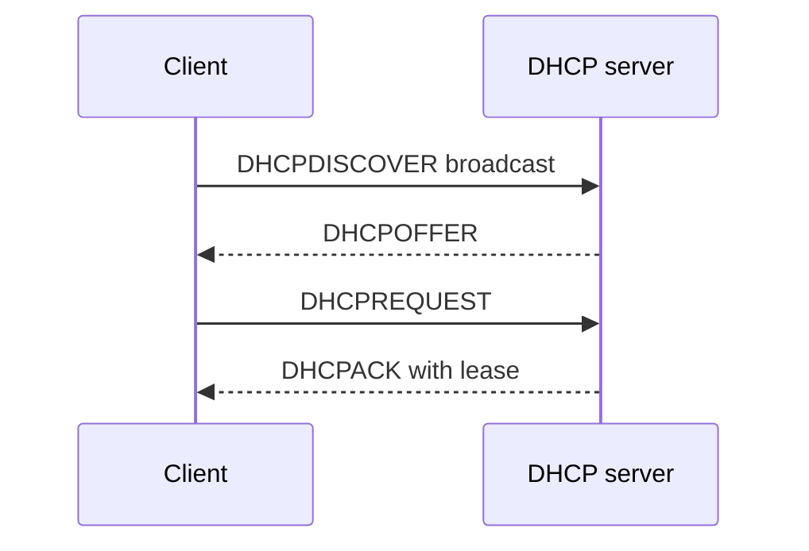

# DHCP: Dynamic Host Configuration Protocol

## Why DHCP Was Born

Every networked device needs configuration:

- IP address
- Subnet mask or prefix
- Default gateway
- DNS resolver
- Lease duration

Manually configuring every device is slow and error-prone. DHCP automates assignment and configuration.

## DORA Exchange

The common sequence is called **DORA**: Discover, Offer, Request, Acknowledge.

## Lease Model

DHCP usually grants an address for a lease period. The client renews before expiry. If the lease cannot be renewed, the client eventually stops using the address.

DHCP can assign:

- Dynamic addresses from a pool
- Reservations based on client identity
- Network options such as gateway and DNS
- PXE boot information in some environments

## Security and Reliability

DHCP is usually trusted inside a local network. Rogue DHCP servers can provide malicious gateway or DNS settings. Enterprise networks use controls such as DHCP snooping and switch security features.

DHCP uses UDP:

- Server: port `67`
- Client: port `68`

Broadcasts help a new client discover a server before it has an IP address.

## Pros

- Centralized configuration
- Reduces manual errors
- Supports address reuse
- Enables device mobility across networks

## Cons

- Depends on local network availability
- Rogue servers can redirect traffic
- Lease changes can complicate debugging
- Some devices need reservations or static configuration

## Interview Questions

### Why does DHCP use broadcast at first?

The client may not yet know its IP address or DHCP server address. A local broadcast allows available DHCP servers to hear the request.

### DHCP versus DNS?

DHCP configures a device's network settings. DNS resolves names and publishes service records. DHCP may tell a device which DNS resolver to use.

### What happens if DHCP fails?

A device may have no usable address, gateway, or DNS configuration. Some operating systems assign a link-local address, but that normally supports only limited local communication.

---
