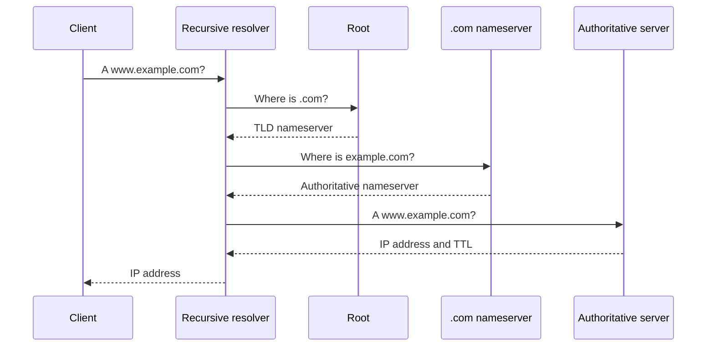

# DNS: Domain Name System

## Why DNS Was Born

Humans remember names better than numeric addresses. A distributed naming system maps names such as `example.com` to IP addresses and other records.

DNS also supports:

- Mail routing
- Service discovery
- Aliases
- Verification records
- Load distribution

## Name Hierarchy

```text
www.example.com.
│   │       │  └─ Root
│   │       └──── Top-level domain: com
│   └──────────── Second-level domain: example
└──────────────── Host name: www
```

DNS is hierarchical and distributed. No single server needs to store every name.

## Recursive Lookup



Most clients query a recursive resolver. The resolver performs referrals and caches responses according to TTL.

## Common Record Types

| Record | Purpose | Example |
|---|---|---|
| `A` | IPv4 address | `example.com -> 192.0.2.10` |
| `AAAA` | IPv6 address | `example.com -> 2001:db8::10` |
| `CNAME` | Alias | `www -> web.example.com` |
| `MX` | Mail server | `example.com -> mail.example.com` |
| `TXT` | Text and verification data | SPF, ownership proof |
| `NS` | Authoritative nameserver | Zone delegation |
| `SRV` | Service location | Host and port for a service |
| `CAA` | Allowed certificate authorities | Certificate issuance policy |

## DNS Transport

Traditional DNS commonly uses UDP port 53. TCP port 53 is used for some larger responses, zone transfers, and fallback cases. Modern DNS can also use encrypted transports:

- DNS over TLS (DoT)
- DNS over HTTPS (DoH)
- DNS over QUIC (DoQ)

Encryption protects the DNS conversation from some observers, but it does not make every aspect of network activity invisible.

## Caching and TTL

TTL tells resolvers how long a record may be cached. Long TTL reduces lookup load but slows changes. Short TTL enables faster changes but increases DNS traffic and resolver work.

## Pros

- Human-friendly names
- Distributed and scalable
- Caching reduces latency and load
- Supports multiple service and verification records

## Cons

- Cache staleness
- Misconfiguration can take time to expire
- DNS lookup adds latency
- DNS itself can be attacked or abused
- Name resolution does not prove application identity; TLS certificates do that

## Interview Questions

### What happens when DNS is down?

Existing connections may continue, and cached records may still work. New connections that need name resolution can fail. Applications using hard-coded IPs may still connect, but this bypasses normal service discovery and certificate naming patterns.

### What is DNS TTL?

TTL is the cache lifetime for a DNS record. Resolvers should not retain the record beyond its TTL without refreshing it.

### Does DNS provide security?

DNSSEC can authenticate DNS data integrity and origin, but ordinary DNS is not encrypted. TLS separately authenticates and encrypts many application connections.

---
