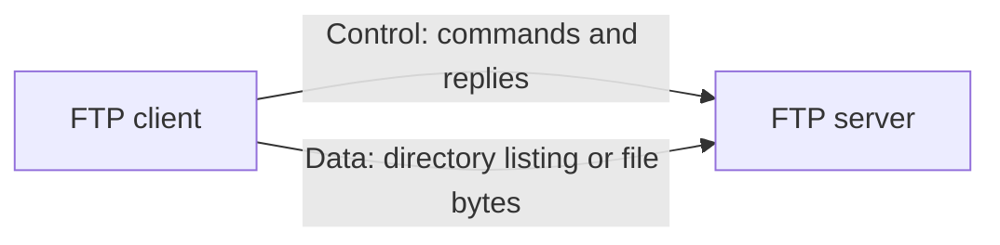
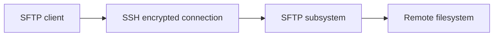

# FTP, SFTP, and FTPS

## Why File Transfer Protocols Exist

Applications need to move files between systems:

- Publish build artifacts
- Exchange reports
- Upload media
- Deliver backups
- Import data into a partner system

File transfer protocols define authentication, directory operations, upload, download, and transfer completion behavior.

## FTP: File Transfer Protocol

FTP is an application protocol traditionally using separate control and data connections.

Typical ports:

- TCP `21`: control connection
- TCP `20`: traditional active-mode data connection
- Passive mode: server advertises a separate high port for data

### Active and Passive FTP

In active mode, the server opens the data connection toward the client. NAT and firewalls often block this.

In passive mode, the client opens both control and data connections. Passive mode works better with client-side firewalls and NAT, but the server must expose a configured port range.

### FTP Security

Classic FTP sends credentials and data without encryption. It should not be used across untrusted networks unless protected by another secure channel, and even then operational complexity increases.

## FTPS: FTP over TLS

FTPS adds TLS to FTP. It preserves FTP's command and data connection model but encrypts connections.

Two modes:

- **Explicit FTPS:** client connects to FTP port `21`, then requests TLS.
- **Implicit FTPS:** TLS is required immediately, commonly associated with port `990`.

FTPS still needs control-channel and data-channel certificate handling, firewall rules, and passive port configuration.

## SFTP: SSH File Transfer Protocol

SFTP is not secure FTP. It is a different file-transfer protocol running as a subsystem over SSH, usually TCP port `22`.

SFTP normally uses one encrypted connection for authentication, commands, directory operations, and file data. It avoids FTP's separate data-channel behavior.

## Comparison

| Feature | FTP | FTPS | SFTP |
|---|---|---|---|
| Encryption | None by default | TLS | SSH |
| Base protocol | FTP | FTP plus TLS | SSH subsystem |
| Typical port | `21` plus data ports | `21` or `990` plus data ports | `22` |
| Connections | Control and data | Control and encrypted data | Usually one SSH connection |
| Firewall setup | Complex | Still complex | Usually simpler |
| Authentication | Password and legacy options | FTP credentials plus TLS | SSH password or key |
| Interoperability | Common legacy systems | Common enterprise systems | Common Unix and automation systems |

## When to Use

- Choose **SFTP** for secure automation and simpler firewall behavior.
- Choose **FTPS** when a partner system requires FTP semantics with TLS.
- Avoid plain **FTP** for credentials or sensitive files on untrusted networks.

## Large File Example

For an overnight 20 GB backup:

1. Authenticate with a key or certificate.
2. Verify destination path and available space.
3. Upload to a temporary filename.
4. Verify size, checksum, or protocol completion.
5. Rename atomically to final filename.
6. Apply retention and access controls.

Do not treat a successful TCP connection as proof that the complete file arrived.

## Pros and Cons

### FTP

Pros: broad legacy support, simple conceptual file operations.  
Cons: insecure by default, separate connections, firewall complexity.

### FTPS

Pros: TLS encryption, compatibility with FTP workflows.  
Cons: separate data channels, passive port and certificate complexity.

### SFTP

Pros: encrypted single connection, strong SSH authentication, simpler firewall model.  
Cons: not wire-compatible with FTP, SSH server configuration required, performance and feature behavior vary by implementation.

## Interview Questions

### Why does FTP use separate control and data connections?

FTP separates commands and replies from file or directory data. This design predates modern multiplexed protocols but creates firewall and NAT complexity.

### SFTP versus FTPS?

SFTP is a file-transfer subsystem over SSH. FTPS is FTP protected with TLS. They use different protocols, ports, authentication models, and operational configurations.

### How make file transfer reliable?

Use resumable transfers when supported, temporary filenames, checksums, explicit completion markers, retries with backoff, idempotent naming, and monitoring. Validate file content, not only connection status.

---
