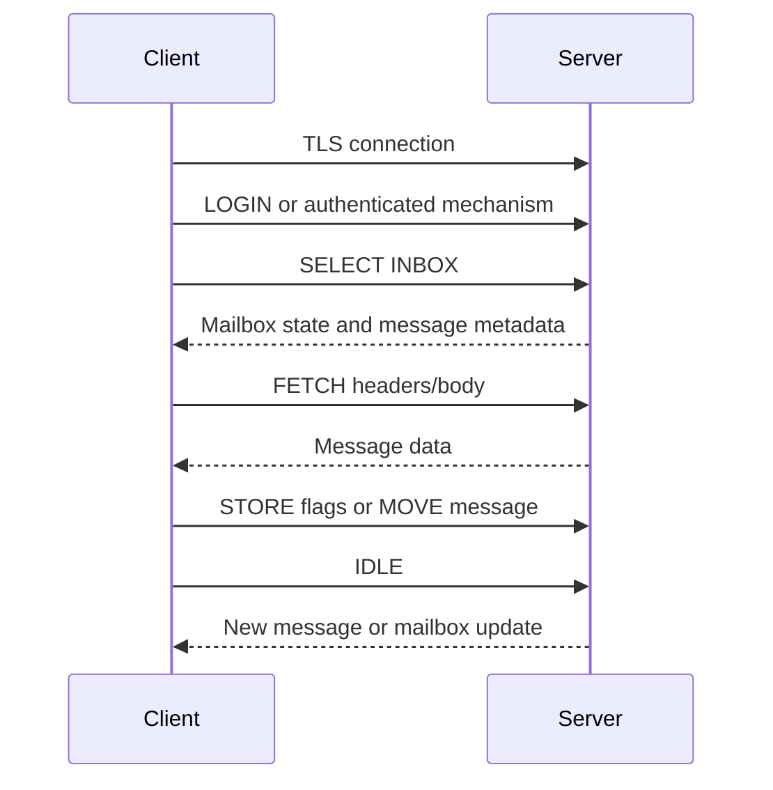

# IMAP: Mailbox Access and Synchronization

## Why IMAP Was Born

Users access email from several devices. Downloading messages to one device does not keep laptop, phone, and webmail views synchronized. IMAP keeps messages on the server and lets clients synchronize mailbox state.

## Core Model

IMAP works with server-side mailboxes. Clients can:

- List folders
- Select a mailbox
- Fetch headers or bodies
- Search messages
- Add or remove flags
- Move or copy messages
- Append drafts
- Monitor changes

Common flags include:

- `\Seen`
- `\Answered`
- `\Flagged`
- `\Deleted`
- `\Draft`

## IMAP Session

## Ports

- `143`: IMAP, optionally upgraded with STARTTLS
- `993`: IMAP over implicit TLS

## IMAP versus POP3

POP3 is simpler and commonly downloads messages, often with limited synchronization. IMAP is designed for server-side folders, flags, partial fetches, and multi-device synchronization.

## Performance Design

Clients often fetch headers first, then download bodies on demand. IMAP `IDLE` allows near-real-time mailbox updates without constant polling, when supported.

## Pros

- Multi-device synchronization
- Server-side folders and flags
- Partial fetch and search
- Supports long-lived update sessions

## Cons

- More complex than simple download protocols
- Server storage and indexing cost
- Synchronization conflicts require client logic
- Large mailboxes need careful pagination and caching

## Interview Questions

### Why keep email on server with IMAP?

Server-side storage lets multiple clients share message state, folders, read flags, and deletion status.

### IMAP `IDLE` versus polling?

`IDLE` keeps a session available for server notifications, reducing repeated polling requests and update latency. It still needs reconnect and timeout handling.

### How handle a 100,000-message mailbox?

Fetch metadata incrementally, use server-side search, cache stable identifiers, paginate, avoid downloading every body, synchronize flags carefully, and handle UID validity changes according to IMAP rules.

---
