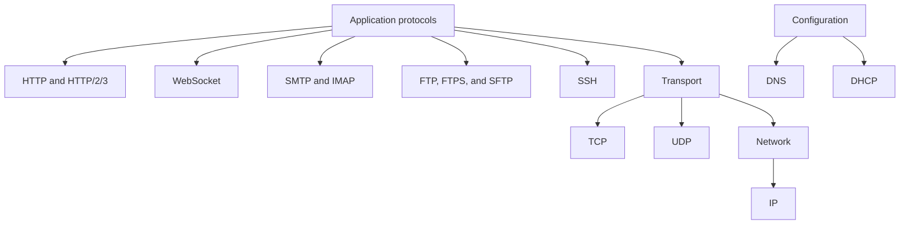
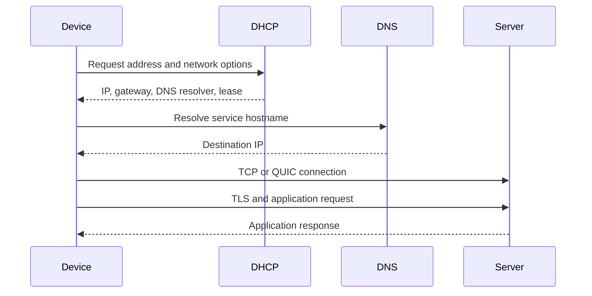

# Network Protocols

Protocol guides split by responsibility. Start with transport and addressing, then move to application protocols.

## Protocol Map

## Deep-Dive Guides

| Guide | Main question |
|---|---|
| [IP](ip/) | How packets are addressed and routed |
| [TCP and UDP](tcp-udp/) | Which transport behavior does workload need |
| [DNS](dns/) | How names map to addresses and services |
| [DHCP](dhcp/) | How devices receive local network configuration |
| [FTP, FTPS, and SFTP](ftp-sftp-ftps/) | How systems transfer files securely |
| [WebSocket](websocket/) | How browsers maintain bidirectional sessions |
| [SMTP](smtp/) | How email is submitted and relayed |
| [IMAP](imap/) | How clients synchronize mailboxes |
| [SSH](ssh/) | How remote access and secure channels work |
| [HTTP evolution](http/) | How web protocol evolved from HTTP/0.9 to HTTP/3 |
| [URL anatomy](url-anatomy/) | How URLs identify resources and actions |

## End-to-End Example

## Selection Questions

1. Need reliable ordered bytes? Choose TCP.
2. Need low-overhead datagrams or application-controlled recovery? Consider UDP.
3. Need addressing and routing? Use IP.
4. Need name-to-address mapping? Use DNS.
5. Need automatic local configuration? Use DHCP.
6. Need secure file automation? Usually SFTP.
7. Need FTP-compatible TLS integration? FTPS.
8. Need browser bidirectional messages? WebSocket.
9. Need send mail? SMTP.
10. Need synchronize mailbox? IMAP.
11. Need secure remote administration? SSH.

Protocol choice depends on reliability, ordering, latency, message boundaries, security, NAT, durability, scaling, observability, and operational cost.
