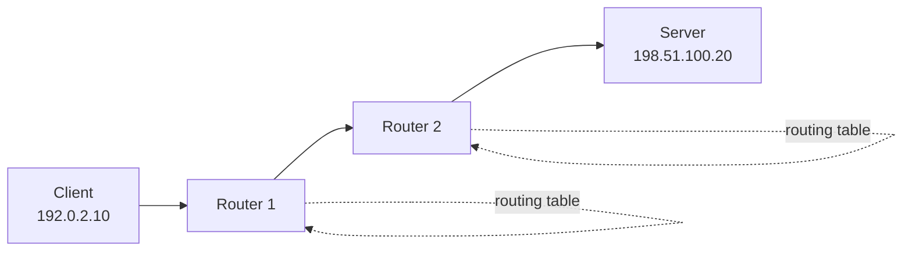

# IP: Addressing and Routing

## Why IP Was Born

Different networks used different link technologies. A protocol was needed to connect them into one **internetwork**. IP provides a common addressing and packet-forwarding model.

IP answers:

- Which host sent this packet?
- Which host should receive it?
- Which routers should forward it?

IP does not guarantee delivery, ordering, or application-level meaning. Those responsibilities belong to protocols such as TCP or the application itself.

## Core Concept

An IP packet contains source and destination addresses plus a payload:

```text
+----------------------+----------------------+
| Source IP address    | Destination IP       |
+----------------------+----------------------+
| TTL / Hop Limit      | Next-header / Proto  |
+----------------------+----------------------+
| Payload                                      |
+----------------------------------------------+
```

Routers inspect the destination address, consult routing tables, reduce TTL or Hop Limit, and forward the packet to the next hop.



## IPv4 and IPv6

### IPv4

- 32-bit address
- Example: `192.0.2.10`
- Limited address space
- Commonly combined with private addresses and Network Address Translation (NAT)

### IPv6

- 128-bit address
- Example: `2001:db8::10`
- Very large address space
- Supports globally unique addressing without requiring IPv4-style address scarcity workarounds

## Subnets and CIDR

CIDR notation describes network prefix length:

```text
192.0.2.0/24
```

`/24` means first 24 bits identify the network. Remaining bits identify hosts inside that subnet.

Example:

- Network: `192.0.2.0/24`
- Usable host range depends on subnet rules
- Default gateway may be `192.0.2.1`

## When IP Is Used

Almost every networked application uses IP indirectly. Applications normally use hostnames and ports; the operating system and network stack resolve names and send IP packets.

## Pros

- Universal internetworking model
- Supports routing across many networks
- Works over different link technologies
- IPv6 provides large address space

## Cons

- IP alone is best effort
- Packets can be lost, duplicated, delayed, or reordered
- Routing and address management are complex
- IPv4 NAT can complicate peer-to-peer communication

## Interview Questions

### Why is IP not enough for reliable communication?

IP only provides packet addressing and forwarding. It does not promise delivery, order, duplicate suppression, or congestion handling. TCP adds those services; UDP intentionally does not.

### What is the difference between an IP address and a port?

An IP address identifies a network interface or host location. A port identifies an application endpoint on that host. Together, destination IP and destination port guide traffic to the correct process.

### What does a router do?

A router forwards packets between networks. It uses the destination IP address and routing table to choose the next hop.

---
