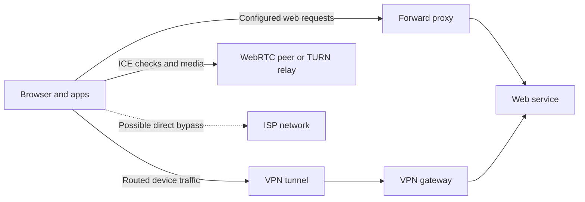

# Proxies, VPNs, WebRTC, and IP Leaks

Proxies and VPNs can change the address a destination sees, but they work at different layers and do not automatically route every kind of traffic. WebRTC adds a separate real-time networking path that can reveal network addresses if browser and tunnel behavior are not understood.

## Guides

| Guide | Main question |
|---|---|
| [Proxy](proxy.md) | What traffic does a proxy forward, and what can bypass it? |
| [VPN](vpn.md) | How does a VPN tunnel traffic, and what are DNS, IPv6, and split-tunnel leaks? |
| [WebRTC](web-rtc.md) | How do ICE candidates work, and when can WebRTC reveal an IP address? |

## Proxy vs. VPN vs. WebRTC

| Technology | What it is | Typical visibility at the destination | Important limitation |
|---|---|---|---|
| Forward proxy | An intermediary configured for selected application traffic | The proxy's egress address for requests that actually use it | Other apps, DNS lookups, or UDP/WebRTC traffic may go directly |
| VPN | An encrypted tunnel that routes some or all device traffic to a VPN gateway | The VPN gateway's egress address for tunneled traffic | Split routes, IPv6, DNS, or a failed tunnel can bypass it |
| WebRTC | Browser APIs and protocols for real-time peer connections | The web page or peer may learn ICE candidate addresses | Candidate gathering and media paths may not follow the browser's HTTP proxy |

Neither a proxy nor a VPN makes a person anonymous. The provider can observe some traffic metadata, and accounts, cookies, browser fingerprinting, or application behavior can identify a user independently of their IP address.

## What Is an IP Leak?

An IP leak occurs when a connection that is expected to use an intermediary instead exposes an address from another network path. The address might be:

- The public address assigned by the user's internet service provider
- A private local-network address, such as an RFC 1918 IPv4 address
- An IPv6 address that is not routed through the intended proxy or VPN
- A DNS resolver that reveals which network is resolving domain names

The expected public address is normally the proxy or VPN exit address, not the device's ISP-facing address. Private addresses are not globally routable, but may still reveal network details to a page or peer. Browser protections such as mDNS can hide local host addresses from web content without changing the actual packet route.

## How the Pieces Fit Together

A browser might send ordinary HTTPS requests through a proxy, while WebRTC sends UDP connectivity checks directly. A VPN usually covers more traffic, but only if its routes, DNS handling, IPv6 support, and disconnect behavior are configured correctly.

## A Practical Leak-Check Plan

1. **Record the baseline.** Without the proxy or VPN, note the public IPv4 and IPv6 addresses and DNS resolvers shown by a reputable test service.
2. **Connect the intermediary.** Repeat the checks in the exact browser and apps you use. The public addresses should match the expected proxy or VPN egress, not the baseline ISP address. Confirm whether IPv6 is tunneled or intentionally blocked.
3. **Check DNS separately.** Verify that queries use the resolver expected for the proxy/VPN setup. Resolver location is an indicator, not cryptographic proof of which resolver handled a query.
4. **Check WebRTC.** Use a browser WebRTC leak test or inspect ICE candidates in a test page. Confirm that your ISP-facing public address is not exposed where your configuration is meant to conceal it. A private address or `.local` mDNS name is different from an ISP public address.
5. **Test failure behavior.** While connected, briefly interrupt the VPN or proxy and confirm that protected traffic stops or follows the explicitly intended fallback policy. Reconnect and check again for DNS, IPv4, IPv6, and WebRTC.
6. **Repeat after changes.** Browser updates, VPN client changes, network changes, and new extensions can alter routing or candidate behavior.

Leak-test sites can observe the IP address used to visit them, and a WebRTC test may display candidate information to its own page. Use a service you trust, avoid entering credentials, and do not publish screenshots or candidate strings containing addresses.

## Common Protections

- Decide whether the goal is to protect selected apps, one browser, or all device traffic; choose a proxy or VPN accordingly.
- Route DNS through the intended tunnel or proxy, including DNS-over-HTTPS settings that might otherwise use a separate resolver.
- Prefer VPN clients with an always-on or kill-switch mode, and verify behavior rather than relying on a feature label.
- Use a VPN that explicitly supports IPv6 or deliberately blocks IPv6 while connected; test which behavior applies.
- Check WebRTC handling in the browser and VPN. For an application that must conceal a peer's address, configure it to use a trusted TURN relay where appropriate.
- Treat extensions and browser settings as additional controls, not substitutes for correct network routing and firewall policy.
- Remember that blocking leaks does not erase account identity, cookies, tracking identifiers, or information voluntarily shared with a site.

## Interview Questions and Answers

### Q1: What is the difference between a proxy and a VPN?

* **Answer:** A proxy forwards traffic selected by an application or system proxy configuration. A VPN creates a network tunnel and can route a broader set of device traffic. Both can change the public egress address, but their coverage depends on configuration.

### Q2: What is a WebRTC IP leak?

* **Answer:** It is an unintended exposure of a network address through WebRTC's ICE candidate gathering or connectivity checks, even when normal web requests use a proxy or VPN. The address may be exposed to a page, signaling service, or peer depending on browser behavior and call setup.

### Q3: How would you verify that a VPN does not leak an IP address?

* **Answer:** Record the baseline public IPv4/IPv6 and DNS behavior, connect the VPN, and check again in the target apps and browser. Use a WebRTC candidate test, then interrupt the tunnel to verify the kill-switch policy. Repeat on relevant networks and after configuration changes.

### Q4: Does a VPN make someone anonymous?

* **Answer:** No. It changes the network path and can hide the origin address from destinations, but the VPN provider becomes a network intermediary and websites can still identify users through accounts, cookies, fingerprints, and behavior.

### Q5: Does seeing a private WebRTC candidate mean the public IP leaked?

* **Answer:** Not necessarily. Private host addresses are local-network addresses and cannot be routed over the public internet; browsers may replace them with mDNS names. Check whether the ISP-facing public address is exposed and understand what the tested page or peer can actually observe.