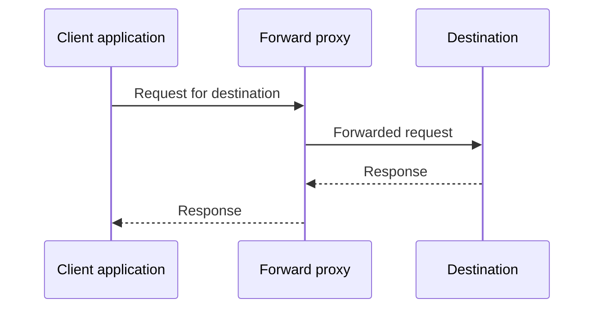

# Forward Proxies

A forward proxy accepts requests from a client and makes them toward a destination on the client's behalf. It is commonly used for outbound access control, caching, filtering, and routing selected application traffic through a different network.

## Request Flow



For ordinary HTTP, the client can send the request to the proxy, which forwards it. For HTTPS, an HTTP proxy commonly uses `CONNECT` to establish a tunnel; TLS then runs between the client and destination inside that tunnel. A proxy that terminates TLS can inspect content only when the client trusts its certificate authority, which changes the trust model.

## Common Proxy Types

| Type | Behavior | Example use |
|---|---|---|
| HTTP proxy | Understands HTTP requests and can use `CONNECT` for HTTPS tunnels | Browser egress or organization filtering |
| SOCKS proxy | Relays connections at a lower application-neutral level | Routing an app's TCP connections |
| Reverse proxy | Receives inbound requests for a service and forwards them to backend servers | Load balancing and TLS termination |

This guide focuses on forward proxies. A reverse proxy protects and fronts a service; it does not hide a user's address for outbound browsing.

## What a Proxy Does and Does Not Protect

For a request correctly sent through a forward proxy, the destination normally sees the proxy's egress address as the network peer. The proxy itself can generally see the client's connecting address and destination metadata. HTTPS content remains encrypted through a non-intercepting `CONNECT` tunnel, but the proxy can still see connection metadata.

A proxy does not automatically:

- Route every application or protocol on the device
- Tunnel DNS requests; this depends on how the client resolves names
- Tunnel IPv6 or UDP/WebRTC traffic
- Encrypt a connection end-to-end beyond what the application already uses
- Provide anonymity against cookies, sign-ins, or browser fingerprinting

An HTTP proxy setting in a browser may cover browser web requests while another app connects directly. A browser may also send DNS queries to its configured DNS-over-HTTPS provider rather than through the proxy.

Some proxies add HTTP forwarding headers such as `Forwarded` or `X-Forwarded-For` that disclose the client's original address to the destination. This is separate from the network source IP of the forwarded connection. Check the proxy's privacy behavior and inspect response-independent request metadata using a trusted test endpoint; do not assume every proxy removes these headers.

## DNS and SOCKS Name Resolution

When an application resolves a hostname locally before connecting, its DNS query can go to the local resolver even if the subsequent connection uses a proxy. Some SOCKS clients support proxy-side name resolution; with `curl`, `socks5h://` asks the proxy to resolve the hostname, while `socks5://` may resolve it locally depending on client behavior.

```sh
curl --proxy socks5h://proxy.example:1080 https://example.com/
```

This example shows the remote-resolution form only; it does not supply proxy credentials or make DNS private from the proxy operator. Use secure, trusted proxy transport and follow the client/provider's credential guidance.

## How to Avoid Proxy IP Leaks

1. Configure the proxy in every application that must use it, or use a VPN when device-wide routing is required.
2. Configure remote DNS resolution where supported, and check browser DNS-over-HTTPS settings so DNS does not take an unintended path.
3. Prevent direct fallback for protected apps. Organization firewalls can allow only proxy egress; local firewall rules must account for required connectivity and should be carefully tested.
4. Confirm whether the proxy supports the protocols needed by the application. Many proxies do not relay UDP, which matters for WebRTC and some real-time applications.
5. Verify public IPv4 and IPv6 from each relevant app, check DNS separately, inspect WebRTC candidates in the browser, and check whether HTTP forwarding headers disclose the client address.

## Example: Browser Proxy with a Direct WebRTC Path

Suppose a browser sends HTTPS through an HTTP proxy, but WebRTC gathers ICE candidates and sends UDP connectivity checks outside that proxy. The web service handling normal page requests sees the proxy's address, while a peer or page with access to candidates might learn an address from the direct path. The proxy works as configured for HTTP but does not cover that separate traffic.

For WebRTC, use a VPN that routes the relevant traffic or an application configuration that forces media through a trusted TURN relay. Validate the real route rather than assuming the browser's proxy setting applies to all traffic.

## Advantages and Trade-offs

### Advantages

- Can route only selected applications or destinations.
- Can enforce outbound policy and centralize filtering.
- Can cache eligible content, though HTTPS caching is limited without TLS interception.
- Is often simpler than a device-wide VPN for a specific client.

### Trade-offs

- Per-application configuration creates opportunities for direct bypass.
- Proxy operators can observe connection metadata.
- DNS, IPv6, UDP, and WebRTC behavior depends on the client and proxy protocol.
- TLS interception expands trust and certificate-management risks.
- A proxy alone is not a substitute for end-to-end encryption or strong application security.

## Interview Questions and Answers

### Q1: What address does a website see when a client uses a forward proxy?

* **Answer:** For connections actually forwarded by the proxy, the website normally sees the proxy's egress IP as the network source. Requests that bypass the proxy can still expose the client's public IP.

### Q2: Why can DNS leak when using a proxy?

* **Answer:** The client may resolve the hostname before connecting to the proxy. In that case, DNS goes to the client's configured resolver while the application connection goes through the proxy. Remote name resolution or an appropriately configured resolver avoids that particular mismatch.

### Q3: Does an HTTP proxy route WebRTC?

* **Answer:** Usually not by itself. WebRTC uses ICE connectivity checks and may use UDP paths that are outside a browser's ordinary HTTP proxy configuration. A VPN route or TURN relay may be needed, depending on the desired privacy and application.

### Q4: When would you choose a proxy instead of a VPN?

* **Answer:** Choose a proxy when selected applications or requests need a controllable egress path and the remaining traffic can safely use its normal route. Choose a VPN when broader device traffic must use a network tunnel.

### Q5: Does HTTPS remain encrypted through an HTTP proxy?

* **Answer:** With `CONNECT` tunneling and no TLS interception, TLS is between the client and destination, so the proxy cannot read the HTTPS payload. The proxy still sees connection metadata. TLS interception requires the client to trust the proxy's certificate authority.
